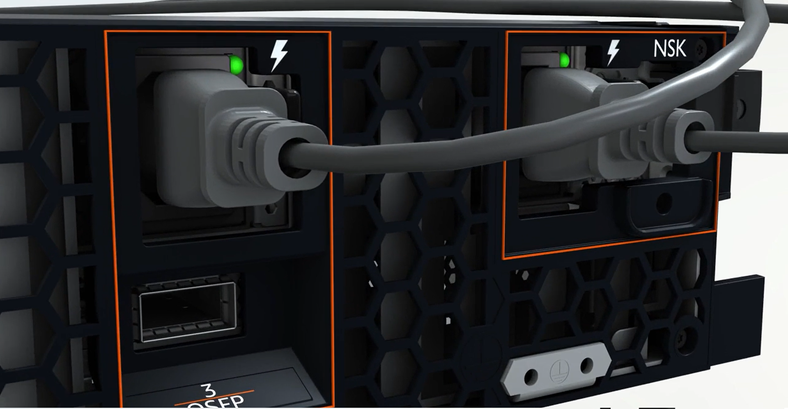
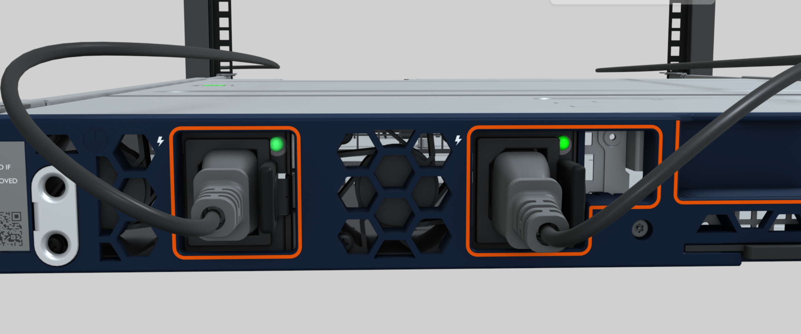

# Connect the power source and verify power to your Outposts server

Use the following procedures to connect your Outposts server to its power source and then
verify that the server has powered on.

###### To connect the server to power

1. Locate the pair of C13/C14 power cables that came with the server.
2. Connect the C14 end of both cables to your power source.
3. Connect the C13 end of both cables to the ports on the front of the server.

###### To verify that the server has power

1. Verify that you can hear the server running.

###### Tip

The noise level goes down after the server provisions itself. 2. Verify that the LED power lights above the power ports are lit.

The following image shows the LED power lights on a 2U server

The following image shows the LED power lights on a 1U server

