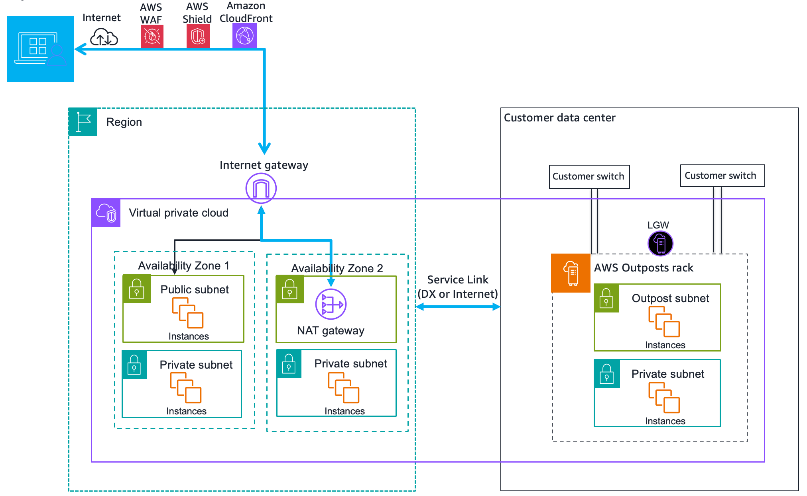
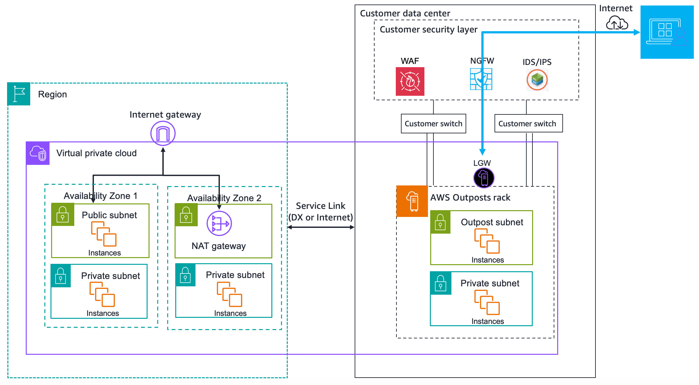

# Internet access for AWS Outposts workloads

This section explains how AWS Outposts workloads can access the internet in the following
ways:

- Through the parent AWS Region
- Through your local data center's network

## Internet access through the parent AWS

Region

In this option, the workloads in the Outposts access the internet through the service link
and then through the internet gateway (IGW) in the parent AWS Region. The outbound traffic to
the internet can be through the NAT gateway instantiated in your VPC. For additional security for
your ingress and egress traffic, you can use AWS security services such as AWS WAF, AWS Shield,
and Amazon CloudFront in the AWS Region.

For the route table setting on the Outposts subnet, see [Local gateway route tables](routing.md "routing.md").

### Considerations

- Use this option when:
  - You need flexibility in securing the internet traffic with multiple AWS services in
    the AWS Region.
  - You do not have an internet point of presence in your data center or co-location
    facility.

- In this option, the traffic must traverse through the parent AWS Region, which
  introduces latency.
- Similar to data transfer charges in AWS Regions, data transfer out from the parent
  Availability Zone to the Outpost incurs charges. To learn more about data transfer, see [Amazon EC2 On-Demand Pricing](https://aws.amazon.com/ec2/pricing/on-demand/ "https://aws.amazon.com/ec2/pricing/on-demand/").
- The utilization of the service link bandwidth will increase.

The following image shows traffic between the workload in the Outposts instance and the
internet going through the parent AWS Region.

## Internet access through your local data

center's network

In this option, the workloads residing in the Outposts access the internet through your
local data center. The workload traffic accessing the internet traverses through your local
internet point of presence and egress locally. The security layer of your local data center’s
network is responsible for securing the Outposts workload traffic.

For the route table setting on the Outposts subnet, see [Local gateway route tables](routing.md "routing.md").

### Considerations

- Use this option when:
  - Your workloads require low latency access to internet services.
  - You prefer to avoid incurring Data Transfer Out (DTO) charges.
  - You want to preserve the service link bandwidth for control plane traffic.

- Your security layer is responsible for securing Outposts workload traffic.
- If you opt for Direct VPC Routing (DVR), then you must ensure that the Outposts CIDRs do
  not conflict with the on-premises CIDRs.
- If the default route (0/0) is propagated through the local gateway (LGW), then instances
  may not be able to get to the service endpoints. Alternatively, you can choose VPC endpoints
  to reach the desired service.

The following image shows traffic between the workload in the Outposts instance and the
internet going through your local data center.

