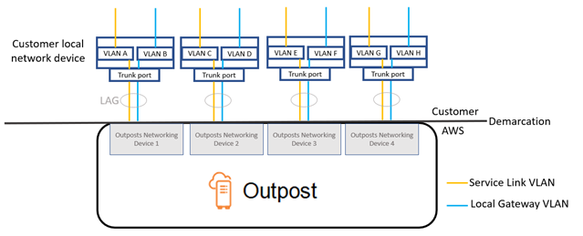

# Outposts rack network troubleshooting checklist

Use this checklist to help troubleshoot a service link that has a status of
`DOWN`.

## Connectivity with Outpost network

devices

Check the BGP peering status on the customer local network devices that are connected to
the Outpost network devices. If the BGP peering status is `DOWN`, follow these
steps:

1. Ping the remote peer IP address on the Outpost network devices from the customer
   devices. You can find the peer IP address in the BGP configuration of your device. You can
   also refer to the [Network readiness checklist](outposts-rack2ndgen-requirements.md#network-readiness-checklist "outposts-rack2ndgen-requirements.md#network-readiness-checklist") provided to you at
   the time of installation.
2. If pinging is unsuccessful, check the physical connection and ensure that connectivity
   status is `UP`.
   1. Confirm the LACP status of the customer local network devices.
   2. Check the interface status on the device. If the status is `UP`, skip
      to step 3.
   3. Check the customer local network devices and confirm that the optical module is
      working.
   4. Replace faulty fibers and ensure the lights (Tx/Rx) are within acceptable
      range.

3. If pinging is successful, check the customer local network devices and ensure that the
   following BGP configurations are correct.
   1. Confirm that the local Autonomous System Number (Customer ASN) is correctly
      configured.
   2. Confirm that the remote Autonomous System Number (Outpost ASN) is correctly
      configured.
   3. Confirm that the interface IP and remote peer IP addresses are correctly
      configured.
   4. Confirm that the advertised and received routes are correct.

4. If your BGP session is flapping between active and connect states, verify that TCP
   port 179 and other relevant ephemeral ports are not blocked on the customer local network
   devices.
5. If you need to troubleshoot further, check the following on the customer local network
   devices:
   1. BGP and TCP debug logs
   2. BGP logs
   3. Packet capture

6. If the issue persists, perform MTR / traceroute / packet captures from your Outpost
   connected router to the Outpost network device peer IP addresses. Share the test results
   with AWS Support, using your Enterprise support plan.

If BGP peering status is `UP` between the customer local network devices and
the Outpost network devices, but the service link is still `DOWN`, you can
troubleshoot further by checking the following devices on your customer local network devices.
Use one of the following checklists, depending on how your service link connectivity is
provisioned.

- Edge routers connected with AWS Direct Connect – Public virtual interface in use for
  service link connectivity. For more information, see [AWS Direct Connect public virtual interface connectivity to AWS
  Region](#check-dc-public "#check-dc-public").
- Edge routers connected with AWS Direct Connect – Private virtual interface in use for
  service link connectivity. For more information, see [AWS Direct Connect private virtual interface connectivity to AWS
  Region](#check-dc-private "#check-dc-private").
- Edge routers connected with Internet Service Providers (ISPs) – Public internet
  in use for service link connectivity. For more information, see [ISP public internet connectivity to AWS
  Region](#check-public-internet "#check-public-internet").

## AWS Direct Connect public virtual interface connectivity to AWS

Region

Use the following checklist to troubleshoot edge routers connected with AWS Direct Connect when a
public virtual interface is in use for service link connectivity.

1. Confirm that the devices connecting directly with the Outpost network devices are
   receiving the service link IP address ranges through BGP.
   1. Confirm the routes that are being received through BGP from your device.
   2. Check the route table of the service link Virtual Routing and Forwarding instance
      (VRF). It should show that it is using the IP address range.

2. To ensure Region connectivity, check the route table for the service link VRF. It
   should include the AWS Public IP address ranges or the default route.
3. If you are not receiving the AWS public IP address ranges in the service link VRF,
   check the following items.
   1. Check the AWS Direct Connect link status from the edge router or the AWS Management Console.
   2. If the physical link is `UP`, check the BGP peering status from the
      edge router.
   3. If the BGP peering status is `DOWN`, ping the peer AWS IP address and
      check the BGP configuration in the edge router. For more information, see [Troubleshooting AWS Direct Connect](../../../directconnect/latest/UserGuide/Troubleshooting.md "../../../directconnect/latest/UserGuide/Troubleshooting.md") in the _AWS Direct Connect User Guide_
      and [My virtual
      interface BGP status is down in the AWS console. What should I do?](https://repost.aws/knowledge-center/virtual-interface-bgp-down "https://repost.aws/knowledge-center/virtual-interface-bgp-down").
   4. If BGP is established and you are not seeing the default route or AWS public IP
      address ranges in the VRF, contact AWS Support, using your Enterprise support
      plan.

4. If you have an on-premises firewall, check the following items.
   1. Confirm that the required ports for service link connectivity are allowed in the
      network firewalls. Use traceroute on port 443 or any other network troubleshooting
      tool to confirm the connectivity through the firewalls and your network devices. The
      following ports are required to be configured in the firewall policies for the service
      link connectivity.
      - TCP protocol – Source port: TCP
        1025-65535, Destination port: 443.
      - UDP protocol – Source port: TCP
        1025-65535, Destination port: 443.

   2. If the firewall is stateful, ensure that the outbound rules allow the Outpost’s
      service link IP address range to the AWS public IP address ranges. For more
      information, see [AWS Outposts connectivity to AWS Regions](region-connectivity.md "region-connectivity.md").
   3. If the firewall is not stateful, make sure to allow the inbound flow also (from
      the AWS public IP address ranges to the service link IP address range).
   4. If you have configured a virtual router in the firewalls, ensure that the
      appropriate routing is configured for traffic between the Outpost and the AWS
      Region.

5. If you have configured NAT in the on-premises network to translate the Outpost’s
   service link IP address ranges to your own public IP addresses, check the following
   items.
   1. Confirm that the NAT device is not overloaded and has free ports to allocate for
      new sessions.
   2. Confirm that the NAT device is correctly configured to perform the address
      translation.

6. If the issue persists, perform MTR / traceroute / packet captures from your edge
   router to the AWS Direct Connect peer IP addresses. Share the test results with AWS Support, using
   your Enterprise support plan.

## AWS Direct Connect private virtual interface connectivity to AWS

Region

Use the following checklist to troubleshoot edge routers connected with AWS Direct Connect when a
private virtual interface is in use for service link connectivity.

1. If connectivity between the Outposts rack and the AWS Region is using the AWS Outposts
   private connectivity feature, check the following items.
   1. Ping the remote peering AWS IP address from the edge router and confirm the BGP
      peering status.
   2. Ensure that BGP peering over the AWS Direct Connect private virtual interface between your
      service link endpoint VPC and the Outpost installed on your premises is
      `UP`. For more information, see [Troubleshooting
      AWS Direct Connect](../../../directconnect/latest/UserGuide/Troubleshooting.md "../../../directconnect/latest/UserGuide/Troubleshooting.md") in the _AWS Direct Connect User Guide_, [My virtual interface BGP status is down in the AWS console. What should I
      do?](https://repost.aws/knowledge-center/virtual-interface-bgp-down "https://repost.aws/knowledge-center/virtual-interface-bgp-down"), and [How can I troubleshoot
      BGP connection issues over Direct Connect?](https://repost.aws/knowledge-center/troubleshoot-bgp-dx "https://repost.aws/knowledge-center/troubleshoot-bgp-dx").
   3. The AWS Direct Connect private virtual interface is a private connection to your edge router
      in your chosen AWS Direct Connect location, and it uses BGP to exchange routes. Your private
      virtual private cloud (VPC) CIDR range is advertised through this BGP session to your
      edge router. Similarly, the IP address range for the Outpost service link is
      advertised to the region through BGP from your edge router.
   4. Confirm that the network ACLs associated with the service link private endpoint in
      your VPC allow the relevant traffic. For more information, see [Network readiness checklist](outposts-rack2ndgen-requirements.md#network-readiness-checklist "outposts-rack2ndgen-requirements.md#network-readiness-checklist").
   5. If you have an on-premises firewall, ensure that the firewall has outbound rules
      that allow the service link IP address ranges and the Outpost service endpoints (the
      network interface IP addresses) located in the VPC or the VPC CIDR. Ensure that the
      TCP 1025-65535 and UDP 443 ports are not blocked. For more information, see [Introducing AWS Outposts private connectivity](https://aws.amazon.com/blogs/networking-and-content-delivery/introducing-aws-outposts-private-connectivity/ "https://aws.amazon.com/blogs/networking-and-content-delivery/introducing-aws-outposts-private-connectivity/").
   6. If the firewall is not stateful, ensure that the firewall has rules and policies
      to allow inbound traffic to the Outpost from the Outpost service endpoints in the
      VPC.

2. If you have more than 100 networks in your on-premises network, you can advertise a
   default route over the BGP session to AWS on your private virtual interface. If you
   don't want to advertise a default route, summarize the routes so that the number of
   advertised routes is less than 100.
3. If the issue persists, perform MTR / traceroute / packet captures from your edge
   router to the AWS Direct Connect peer IP addresses. Share the test results with AWS Support, using
   your Enterprise support plan.

## ISP public internet connectivity to AWS

Region

Use the following checklist to troubleshoot edge routers connected through an ISP when
using the public internet for service link connectivity.

- Confirm that the internet link is up.
- Confirm that the public servers are accessible from your edge devices connected
  through an ISP.

If the internet or public servers are not accessible through the ISP links, complete the
following steps.

1. Check whether BGP peering status with the ISP routers is established.
   1. Confirm that the BGP is not flapping.
   2. Confirm that the BGP is receiving and advertising the required routes from the
      ISP.

2. In case of static route configuration, check that the default route is properly
   configured on the edge device.
3. Confirm whether you can reach the internet using another ISP connection.
4. If the issue persists, perform MTR / traceroute / packet captures on your edge router.
   Share the results with your ISP's technical support team for further
   troubleshooting.

If the internet and public servers are accessible through the ISP links, complete the
following steps.

1. Confirm whether any of your publicly accessible EC2 instances or load balancers in the
   Outpost home Region are accessible from your edge device. You can use ping or telnet to
   confirm the connectivity, and then use traceroute to confirm the network path.
2. If you use VRFs to separate traffic in your network, confirm that the service link VRF
   has routes or policies that direct traffic to and from the ISP (internet) and VRF. See the
   following checkpoints.
   1. Edge routers connecting with the ISP. Check the edge router’s ISP VRF route table
      to confirm that the service link IP address range is present.
   2. Customer local network devices connecting with the Outpost. Check the
      configurations of the VRFs and ensure that the routing and policies required for
      connectivity between the service link VRF and the ISP VRF are configured properly.
      Usually, a default route is sent from the ISP VRF into the service link VRF for
      traffic to the internet.
   3. If you configured source-based routing in the routers connected to your Outpost,
      confirm that the configuration is correct.

3. Ensure that the on-premises firewalls are configured to allow outbound connectivity
   (TCP 1025-65535 and UDP 443 ports) from the Outpost service link IP address ranges to the
   public AWS IP address ranges. If the firewalls are not stateful, ensure that inbound
   connectivity to the Outpost is also configured.
4. Ensure that NAT is configured in the on-premises network to translate the Outpost’s
   service link IP address ranges to public IP addresses. In addition, confirm the following
   items.
   1. The NAT device is not overloaded and has free ports to allocate for new
      sessions.
   2. The NAT device is correctly configured to perform the address translation.

If the issue persists, perform MTR / traceroute / packet captures.

- If the results show that packets are dropping or blocked at the on-premises network,
  check with your network or technical team for additional guidance.
- If the results show that the packets are dropping or blocked at the ISP's network,
  contact the ISP’s technical support team.
- If the results do not show any issues, collect the results from all tests (such as
  MTR, telnet, traceroute, packet captures, and BGP logs) and contact AWS Support using
  your Enterprise support plan.

## Outposts is behind two firewall devices

If you have placed your Outpost behind a high-availability pair of synced
firewalls or two stand-alone firewalls, asymmetric routing of the service link
might occur. This means that inbound traffic could pass through firewall-1, while outbound
traffic goes through firewall-2. Use the following checklist to identify potential asymmetric
routing of the service link especially if it was functioning correctly before.

- Verify if there were any recent changes or ongoing maintenance in your corporate
  network’s routing setup that might have led to asymmetric routing of the service link
  through the firewalls.
  - Use firewall traffic graphs to check for changes to traffic patterns that line up
    with the start of the service link issue.
  - Check for a partial firewall failure or a split-brained firewall-pair scenario
    that might have caused your firewalls to no longer sync their connection tables between
    each other.
  - Check for links down or recent changes to routing (OSPF/ISIS/EIGRP metric changes,
    BGP route-map changes) in your corporate network that line up with the start of the
    service link issue.

- If you are using public Internet connectivity for the service link to the home region,
  a service provider maintenance could have given rise to asymmetric routing of the service
  link through the firewalls.
  - Check traffic graphs for links to your ISP(s) for changes to traffic patterns that
    line up with the start of the service link issue.

- If you are using AWS Direct Connect connectivity for the service link, it is possible that an
  AWS planned maintenance triggered asymmetric routing of the service link.
  - Check for notifications of planned maintenance on your AWS Direct Connect service(s).
  - Note that if you have redundant AWS Direct Connect services, you can proactively test the
    routing of the Outposts service link over each likely network path under maintenance
    conditions. This allows you to test if an interruption to one of your AWS Direct Connect
    services could lead to asymmetric routing of the service link. The resiliency of the
    AWS Direct Connect portion of the end-to-end network connectivity can be tested by the
    AWS Direct Connect Resiliency with Resiliency Toolkit. For more information, see [Testing AWS Direct Connect Resiliency with Resiliency Toolkit – Failover
    Testing](https://aws.amazon.com/blogs/networking-and-content-delivery/testing-aws-direct-connect-resiliency-with-resiliency-toolkit-failover-testing/ "https://aws.amazon.com/blogs/networking-and-content-delivery/testing-aws-direct-connect-resiliency-with-resiliency-toolkit-failover-testing/").

After you have gone through the preceding checklist and pinpointed asymmetric routing of the
service link as a possible root cause, there are a number of further actions you can
take:

- Restore symmetric routing by reverting any corporate network changes or waiting for a
  provider planned maintenance to complete.
- Log in to one or both firewalls and clear all flow state information for all flows
  from the command-line (if supported by the firewall vendor).
- Temporarily filter out BGP announcements through one of the firewalls or shut the
  interfaces on one firewall in order to force symmetric routing through the other
  firewall.
- Reboot each firewall in turn to eliminate potential corruption in the flow-state
  tracking of the service link traffic in the firewall’s memory.
- Engage your firewall vendor to either verify or relax the tracking of UDP flow-state
  for UDP connections sourced on port 443 and destined to port 443.
