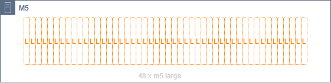
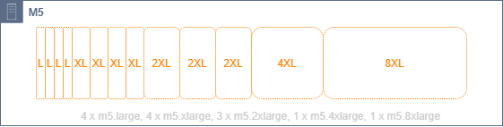
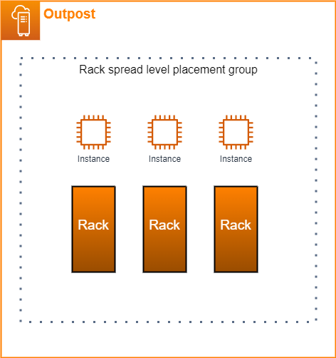
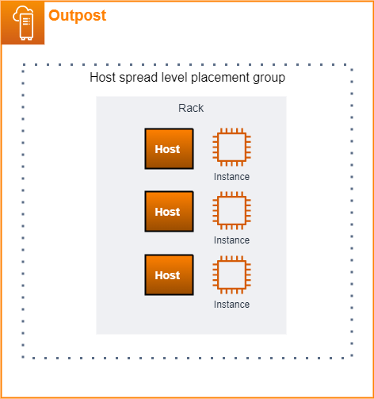
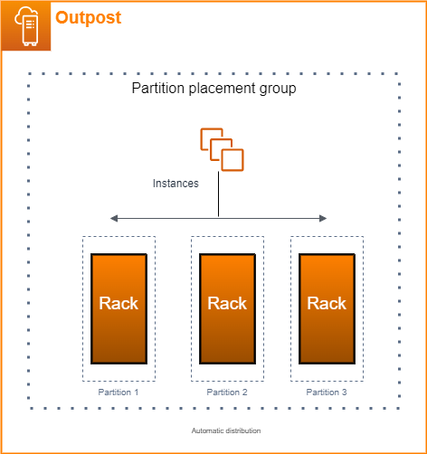
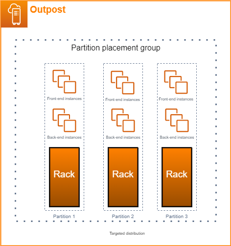

# Optimize Amazon EC2 for AWS Outposts

In contrast to the AWS Region, Amazon Elastic Compute Cloud (Amazon EC2) capacity on an Outpost is finite. You
are constrained by the total volume of compute capacity that you ordered. This topic offers
best practices and optimization strategies to help you get the most out of your Amazon EC2
capacity in AWS Outposts.

###### Contents

- [Dedicated Hosts on Outposts](#optimize-dedicated-hosts "#optimize-dedicated-hosts")
- [Set up instance recovery](#optimize-auto-recovery "#optimize-auto-recovery")
- [Placement groups on Outposts](#placement-groups-outpost "#placement-groups-outpost")

## Dedicated Hosts on Outposts

An Amazon EC2 Dedicated Host is a physical server with EC2 instance capacity fully dedicated to your
use. Your Outpost already provides you with dedicated hardware, but Dedicated Hosts allows you to
use existing software licenses with per-socket, per-core, or per-VM license restrictions
against a single host. For more information, see [Dedicated Hosts on AWS Outposts](../../../AWSEC2/latest/UserGuide/dh-outposts.md "../../../AWSEC2/latest/UserGuide/dh-outposts.md") in the
_Amazon EC2 User Guide_.

Beyond licensing, Outpost owners can use Dedicated Hosts to optimize the servers in their
Outpost deployments in two ways:

- Alter the capacity layout of a server
- Control instance placement at the hardware level

###### Alter the capacity layout of a server

Dedicated Hosts offers you the capability to alter the layout of servers in your Outpost
deployment without contacting Support. When you purchase capacity for your Outpost,
you specify an EC2 capacity layout that each server provides. Each server supports a
single family of instance types. A layout can offer a single instance type or
multiple instance types. Dedicated Hosts allows you to alter whatever you chose for that
initial layout. If you allocate a host to support a single instance type for the
entire capacity, you can only launch a single instance type from that host. The
following illustration presents an m5.24xlarge server with a homogeneous
layout:

You can allocate the same capacity for multiple instance types. When you allocate a
host to support multiple instance types, you get a heterogeneous layout that doesn't
require an explicit capacity layout. The following illustration presents an m5.24xlarge
server with a heterogeneous layout at full capacity:

For more information, see [Allocate a Dedicated Host](../../../AWSEC2/latest/UserGuide/dedicated-hosts-allocating.md "../../../AWSEC2/latest/UserGuide/dedicated-hosts-allocating.md") in the _Amazon EC2 User Guide_.

###### Control instance placement at the hardware level

You can use Dedicated Hosts to control instance placement at the hardware level. Use
auto-placement for Dedicated Hosts to manage whether instances you launch are launched onto a
specific host, or onto any available host that has matching configurations. Use host
affinity to establish a relationship between an instance and a Dedicated Host. If you have an
Outposts rack, you can use these Dedicated Hosts features to minimize the impact of correlated
hardware failures. For more information about instance recovery, see [Dedicated Host auto-placement and host affinity](../../../AWSEC2/latest/UserGuide/dedicated-hosts-understanding.md "../../../AWSEC2/latest/UserGuide/dedicated-hosts-understanding.md") in the _Amazon EC2 User Guide_.

You can share Dedicated Hosts using AWS Resource Access Manager. Sharing Dedicated Hosts allows you to
distribute hosts in an Outpost deployment across AWS accounts. For more information,
see [Share your AWS Outposts resources](sharing-outposts.md "sharing-outposts.md").

## Set up instance recovery

Instances on your Outpost that go into an unhealthy state because of hardware failure
must be migrated to a healthy host. You can set up auto-recovery to have this migration
done automatically based on instance status checks. For more information, see
[Instance resiliency](../../../AWSEC2/latest/UserGuide/ec2-instance-recover.md "../../../AWSEC2/latest/UserGuide/ec2-instance-recover.md").

## Placement groups on Outposts

AWS Outposts supports placement groups. Use placement groups to influence how Amazon EC2
should attempt to place groups of interdependent instances that you launch on the underlying hardware.
You can use different strategies (cluster, partition, or spread) to meet the needs of different workloads.
If you have a single-rack Outpost, you can use the spread strategy to place instances across hosts instead of racks.

### Spread placement groups

Use a spread placement group to distribute a single instance across distinct
hardware. Launching instances in a spread placement group reduces the risk of
simultaneous failures that might occur when instances share the same equipment.
Placement groups can spread instances across racks or hosts. You can use host level
spread placement groups only with AWS Outposts.

###### Rack spread level placement groups

Your rack spread level placement group can hold as many instances as you have
racks in your Outpost deployment. The following illustration shows a three-rack
Outpost deployment running three instances in a rack spread level placement
group.

###### Host spread level placement groups

Your host spread level placement group can hold as many instances as you have
hosts in your Outpost deployment. The following illustration shows a single-rack
Outpost deployment running three instances in a host spread level placement
group.

### Partition placement groups

Use a partition placement group to distribute multiple instances across racks with
partitions. Each partition can hold multiple instances. You can use automatic
distribution to spread instances across partitions or deploy instances to target
partitions. The following illustration shows a partition placement group with
automatic distribution.

You can also deploy instances to target partitions. The following illustration
shows a partition placement group with targeted distribution.

For more information about working with placement groups, see [Placement groups](../../../AWSEC2/latest/UserGuide/placement-groups.md "../../../AWSEC2/latest/UserGuide/placement-groups.md") and [Placement groups on AWS Outposts](../../../AWSEC2/latest/UserGuide/placement-groups-outpost.md "../../../AWSEC2/latest/UserGuide/placement-groups-outpost.md") in the _Amazon EC2 User Guide_.

For more information about AWS Outposts high availability, see [AWS Outposts High Availability Design and Architecture Considerations](../../../whitepapers/latest/aws-outposts-high-availability-design/aws-outposts-high-availability-design.md "../../../whitepapers/latest/aws-outposts-high-availability-design/aws-outposts-high-availability-design.md").
