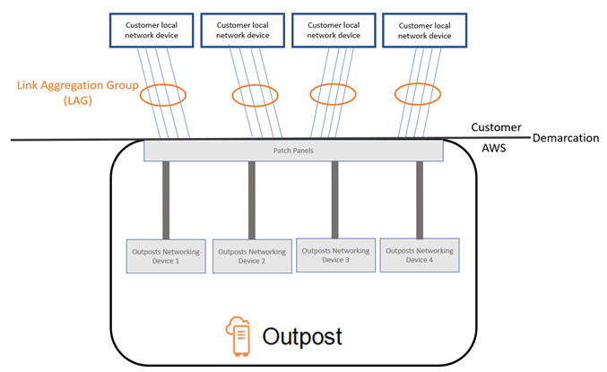
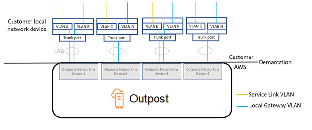

# Local network connectivity for

Outposts network racks

You need the following components to connect your Outposts network racks to your on-premises
network:

- Physical connectivity from the Outposts network racks patch panel to your customer local network
  devices.
- Link Aggregation Control Protocol (LACP) to establish link aggregation group (LAG)
  connections between your Outpost network devices and your local network devices.
- Virtual LAN (VLAN) connectivity between the Outpost and your customer local network
  devices.
- Layer 3 point-to-point connectivity for each VLAN.
- Border Gateway Protocol (BGP) for the route advertisement between the Outpost and your
  on-premises service link.
- BGP for the route advertisement between the Outpost and your on-premises local network
  device for connectivity to the local gateway.

###### Contents

- [Link aggregation](#link-aggregation "#link-aggregation")
- [Virtual LANs](#vlans "#vlans")
- [Network layer connectivity](#network-layer-connectivity "#network-layer-connectivity")
- [Service link BGP connectivity](#service-link-bgp-connectivity "#service-link-bgp-connectivity")
- [Service link infrastructure subnet advertisement and IP
  range](#service-link-subnet "#service-link-subnet")
- [Local gateway BGP connectivity](#local-gateway-bgp-connectivity "#local-gateway-bgp-connectivity")
- [Local gateway customer-owned IP subnet
  advertisement](#local-gateway-subnet "#local-gateway-subnet")

## Link aggregation

AWS Outposts uses the Link Aggregation Control Protocol (LACP) to establish four link
aggregation group (LAG) connections, one from each Outpost network device within the Outposts
Network rack to each customer upstream network device. The links from each Outpost network device
are aggregated into an Ethernet LAG to represent a single network connection. These LAGs use LACP
with standard fast timers. You can't configure LAGs to use slow timers.

To enable an Outpost installation at your site, you must configure your side of the LAG
connections on your network devices.

From a logical perspective, ignore the Outpost patch panels as the demarcation point and use
the Outpost networking devices.

You can review your LAG details on the AWS Outposts console: Choose **Networking**
and then **Link aggregation groups (LAGs)** from the left pane.

The following diagram shows four physical connections between each Outpost network device
and its connected local network device. We use Ethernet LAGs to aggregate the physical links
connecting the Outpost network devices and the customer local network devices.

## Virtual LANs

Each LAG between an Outpost network device and a local network device must be configured as
an IEEE 802.1q Ethernet trunk. This enables the use of multiple VLANs for network segregation
between data paths.

Each Outpost has the following VLANs to communicate with your local network devices:

- Service link VLAN – Enables communication between
  your Outpost and your local network devices in order to establish a service link path for the
  service link connectivity. For more information, see [AWS Outposts connectivity to AWS
  Regions](region-connectivity.md "region-connectivity.md").
- Local gateway VLAN – Enables communication between
  your Outpost and your local network devices in order to establish a local gateway path to
  connect your Outpost subnets and your local area network. Outpost local gateway leverages this
  VLAN to provide your instances the connectivity to your on-premise network, which might include
  internet access through your network. For more information, see [Local
  gateway](outposts-local-gateways.md "outposts-local-gateways.md").

You can configure the service link VLAN and local gateway VLAN only between the Outpost and
your customer local network devices. You can review your service link and LGW VLAN information on
the AWS Outposts console: choose **Networking** and then **Link aggregation
groups (LAGs)** from the navigation pane. Select the link aggregation group. Choose the
**LGW virtual interfaces (VIFs)** and **Service link virtual interfaces
(VIFs)** tabs to see the **VLAN** value.

An Outpost is designed to separate the service link and local gateway data paths into two
isolated networks. This enables you to choose which of your networks can communicate with
services running on the Outpost. It also enables you to make the service link an isolated network
from the local gateway network by using multiple route table on your customer local network
device, commonly known as Virtual Routing and Forwarding instances (VRF). The demarcation line
exists at the port of the Outpost network devices. AWS manages any infrastructure on the AWS
side of the connection, and you manage any infrastructure on your side of the line.

To integrate your Outpost with your on-premises network during the installation and on-going
operation, you must allocate the VLANs used between the Outpost network devices and the customer
local network devices. You need to provide this information to AWS before the installation. For
more information, see [Network readiness checklist](outposts-rack2ndgen-requirements.md#network-readiness-checklist "outposts-rack2ndgen-requirements.md#network-readiness-checklist").

## Network layer connectivity

To establish network layer connectivity, each Outpost network device is configured with
Virtual Interfaces (VIFs) that include the IP address for each VLAN. Through these VIFs, AWS Outposts
network devices can set up IP connectivity and BGP sessions with your local network
equipment.

We recommend the following:

- Use a dedicated subnet, with a /31 CIDR, to represent this logical point-to-point
  connectivity.
- Do not bridge the VLANs between your local network devices.

For the network layer connectivity, you must establish two paths:

- Service link path – To establish this path, specify
  a VLAN subnet with a range of /31 and an IP address for each service link VLAN on the AWS Outposts
  network device. Service link Virtual Interfaces (VIFs), created by AWS Outposts, are used for this
  path to establish IP connectivity and BGP sessions between your Outpost and your local network
  devices for service link connectivity. For more information, see [AWS Outposts connectivity to AWS
  Regions](region-connectivity.md "region-connectivity.md").
- Local gateway path – To establish this path, specify
  a VLAN subnet with a range of /31 and an IP address for the local gateway VLAN on the AWS Outposts
  network device. Local gateway VIFs that you create, are used on this path to establish IP
  connectivity and BGP sessions between your Outpost and your local network devices for your
  local resource connectivity.

You can review your service link and LGW IP connectivity information on the AWS Outposts console:
Choose **Networking** and then **Link aggregation groups
(LAGs)** from the left pane. Select the link aggregation group. Choose the
**LGW virtual interfaces (VIFs)** and **Service link virtual interfaces
(VIFs)** tabs to see the IP values.

## Service link BGP connectivity

The Outpost establishes an external BGP peering session between each Outpost network device
and the customer local network device for service link connectivity over the service link VLAN.
The BGP peering session is established between the /31 IP addresses provided for the
point-to-point VLAN. Each BGP peering session uses a private Autonomous System Number (ASN) on
the Outpost network device and an ASN that you choose for your customer local network devices. As
part of the installation process, AWS configures the attributes that you provided.

You can review your BGP information on the AWS Outposts console: Choose
**Networking** and then **Link aggregation groups (LAGs)**
from the navigation pane. Select the link aggregation group. Choose the **LGW virtual
interfaces (VIFs)** and **Service link virtual interfaces (VIFs)**
tabs to see the BGP values.

## Service link infrastructure subnet advertisement and IP

range

You provide a /24 CIDR range during the pre-installation process for the _service link infrastructure subnet_. The Outpost infrastructure uses
this range to establish connectivity to the Region through the service link. The service link
subnet is the Outpost source, which initiates the connectivity.

## Local gateway BGP connectivity

The Outpost uses a private Autonomous System Number (ASN) that you assign in order to
establish the external BGP sessions. Each Outpost network device has a single external BGP
peering to a local network device using its local gateway VLAN.

The Outpost establishes an external BGP peering session over the local gateway VLAN between
each Outpost network device and its connected customer local network device. The peering session
is established between the /31 IPs that you provided when you set up network connectivity and
uses point-to-point connectivity between each Outpost network device and customer local network
device. For more information, see [Network layer connectivity](#network-layer-connectivity "#network-layer-connectivity").

Each BGP session uses the private ASN on the Outpost network device side, and an ASN that
you choose on the customer local network device side.

We recommend that you configure customer network equipment to receive BGP advertisements
from Outposts without changing the BGP attributes, and enable BGP multipath/load balancing to
achieve optimal inbound traffic flows. AS-Path prepending is used for local gateway prefixes to
shift traffic away from network devices if maintenance is required. The customer network should
prefer routes from Outposts with an AS-Path length of 1 over routes with an AS-Path length of 4.

The customer network should advertise equal BGP prefixes with the same attributes to all
network devices. The Outpost network load balances outbound traffic between all uplinks by
default. Routing policies are used on the Outpost side to shift traffic away from a network
device if maintenance is required. This traffic shift requires equal BGP prefixes from the
customer side on all network devices. If maintenance is required on the customer network, we
recommend that you use AS-Path prepending to temporarily shift traffic array from specific
uplinks.

## Local gateway customer-owned IP subnet

advertisement

By default, the local gateway uses the private IP addresses of instances in your VPC (see
[Direct VPC
routing](routing.md#direct-vpc-routing "routing.md#direct-vpc-routing")) to facilitate communication with your on-premise network. However, you can
provide a customer-owned IP address pool (CoIP).

You can create Elastic IP addresses from this pool, and then assign the
addresses to resources on your Outpost, such as EC2 instances.

The local gateway translates the Elastic IP address to an address in the customer-owned
pool. The local gateway advertises the translated address to your on-premises network, and any
other network that communicates with the Outpost. The addresses are advertised on both local
gateway BGP sessions to the local network devices.

###### Tip

If you are not using CoIP, then BGP advertises the private IP addresses of any subnets on
your Outpost that have a route in the route table that targets the local gateway.
