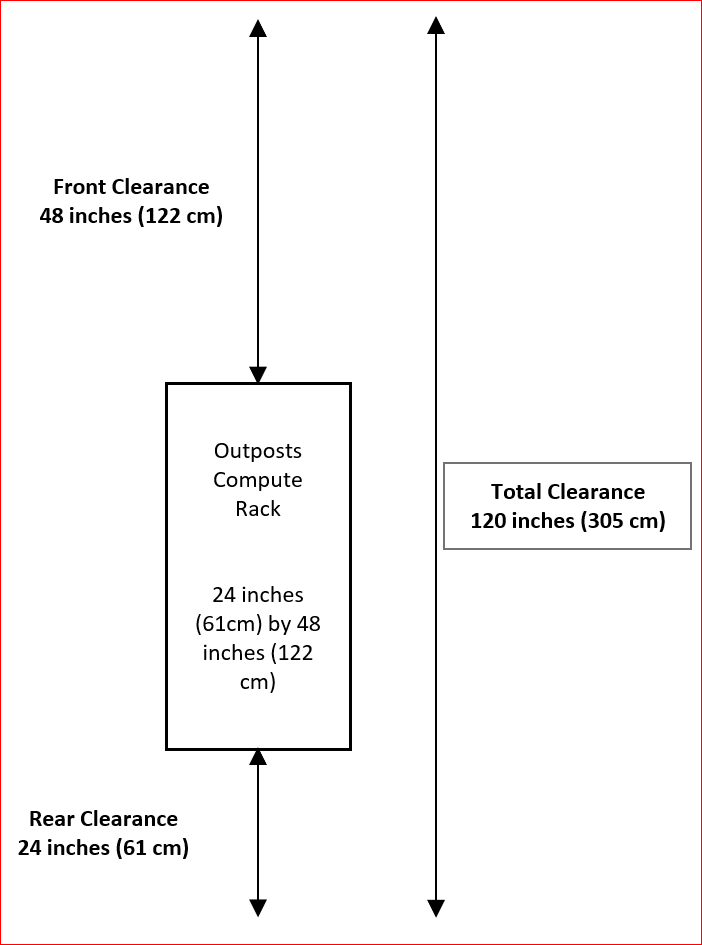
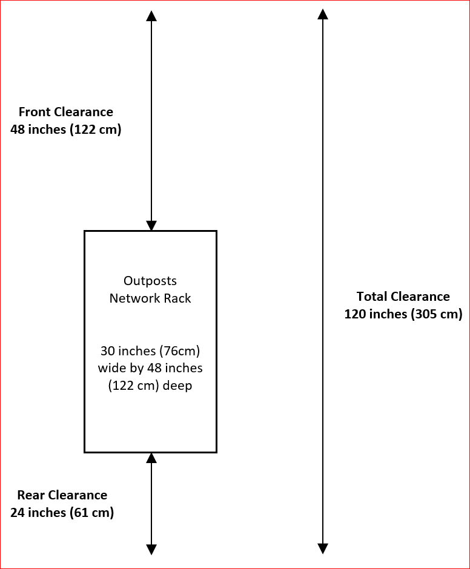
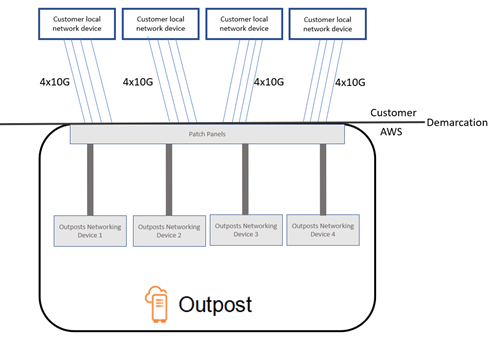
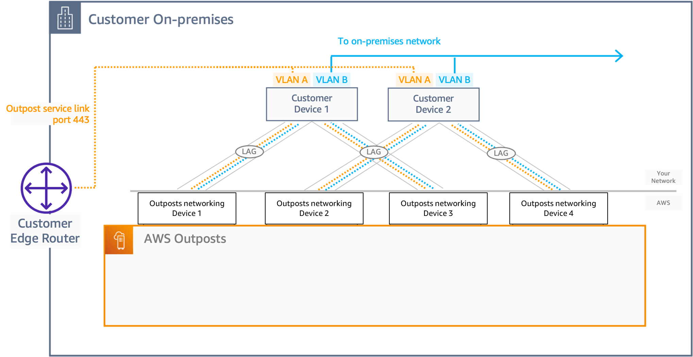
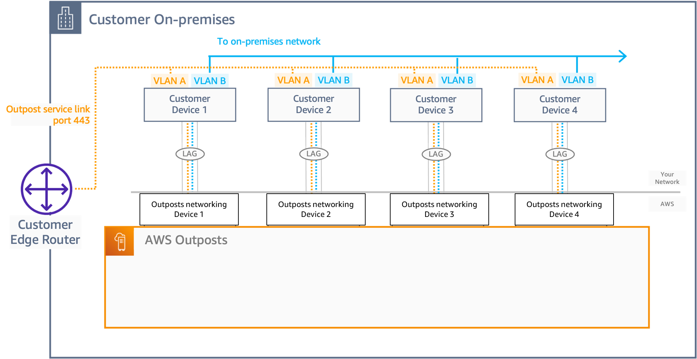

# Site requirements for second-generation

Outposts racks

This page covers the requirements for second-generation Outposts network and compute
racks.

###### Contents

- [Compute rack requirements](#compute-rack-requirements "#compute-rack-requirements")
- [Network rack requirements](#network-rack-requirements "#network-rack-requirements")
- [Power requirements for compute and
  network racks](#compute-network-power-requirements "#compute-network-power-requirements")
- [Order fulfillment](#order-fulfillment "#order-fulfillment")

## Compute rack requirements

### Facility

These are the facility requirements for compute racks.

- Temperature and humidity – The ambient
  temperature must be between 41° F (5° C) and 95° F (35° C). The relative
  humidity must be between 8 percent and 80 percent with no condensation.
- Airflow – Racks draw cold air from the front
  aisle and exhaust hot air to the back aisle. The rack position must provide at least
  145.8 times the kVA of cubic feet per minute (CFM) airflow.
- Loading dock – Your loading dock must
  accommodate a rack crate that is 94 inches (239 cm) high by 54 inches (138 cm) wide by
  51 inches (130 cm) deep.
- Weight support – Weight varies by
  configuration. You can find the weight for your configuration specified in the order
  summary at the rack point loads. The location where the rack is installed and the path
  to that location must support the specified weight. This includes any freight and
  standard elevators along the path.
- Clearance – The rack is 80 inches (203 cm)
  high by 24 inches (61 cm) wide by 48 inches (122 cm) deep. Any doorways, hallways,
  turns, ramps, and elevators must provide sufficient clearance. At the final resting
  position, there must be a 24 inch (61 cm) wide by 48 inch (122 cm) deep area for the
  Outpost, with an additional 48 inches (122 cm) of front clearance and 24 inches (61 cm)
  of rear clearance. The total minimum area required for the Outpost is 24 inch (61 cm)
  wide by 10 feet (305 cm) deep.

The following diagram shows the total minimum area required for the Outposts compute
rack, including clearance.

- Seismic bracing – To the extent required by
  regulation or code, you will install and maintain appropriate seismic anchorage and
  bracing for the rack while it is in your facility. AWS provides floor brackets that
  provide protection for up to 2.0G of seismic activity with all Outposts racks.
- Bonding point – We recommend that you provide
  a bonding wire/point at the rack position so that your electrician can bond the racks
  during installation which will be validated by the AWS-certified technician.
- Facility access – You will not change the
  facility in a way that negatively affects the ability of AWS to access, service, or
  remove the Outpost.
- Elevation – The elevation of the room where
  the rack is installed must be below 10,005 feet (3,050 meters).

## Network rack requirements

An Outposts network rack acts as a network aggregation point for one or more Outpost
compute racks and is a required component of every logical Outposts deployment.

###### Contents

- [Facility](#facility-site "#facility-site")
- [Network connectivity requirements](#facility-networking "#facility-networking")
- [Network readiness checklist](#network-readiness-checklist "#network-readiness-checklist")

### Facility

These are the facility requirements for network racks.

- Temperature and humidity – The ambient
  temperature must be between 41° F (5° C) and 95° F (35° C). The relative
  humidity must be between 8 percent and 80 percent with no condensation.
- Airflow – Racks draw cold air from the front
  aisle and exhaust hot air to the back aisle. The rack position must provide at least
  145.8 times the kVA of cubic feet per minute (CFM) airflow.
- Loading dock – Your loading dock must
  accommodate a rack crate that is 94 inches (239 cm) high by 54 inches (138 cm) wide by
  51 inches (130 cm) deep.
- Weight support – The Outposts network racks weighs
  1975 lbs (896 kg).
- Clearance – The Outposts network racks is 80 inches
  (203 cm) high, 30 inches (76 cm) wide, and 48 inches (122 cm) deep.

The following diagram shows the total minimum area required for the Outposts network
rack, including clearance.

### Network connectivity requirements

A network rack acts as a network aggregation point for one or more Outposts
compute/storage racks, and includes four physical networking devices which must be connected
to two or four upstream customer devices with a minimum of four physical links (one for each
networking device).

- Rack network requirements – Ensure that you
  meet the requirements listed in the [Network readiness checklist](outposts-rack2ndgen-requirements.md#network-readiness-checklist "outposts-rack2ndgen-requirements.md#network-readiness-checklist") and [Local
  network connectivity for Outposts racks](outposts-rack2ndgen-local-rack.md "outposts-rack2ndgen-local-rack.md") sections.
- Uplink speed – Provide uplinks with speeds of
  10 Gbps, 40 Gbps, or 100 Gbps. For bandwidth recommendations for the service link
  connection, see [Service link bandwidth recommendations](service-links.md#sl-bandwidth-recommendations "service-links.md#sl-bandwidth-recommendations").
- Fiber – Provide single-mode fiber (SMF) with
  Lucent Connector (LC), or multi-mode fiber (MMF) with Lucent Connector (LC). For the
  full list of supported fiber types and optical standards, see **Uplink speed, ports, and fiber** in [Network readiness checklist](outposts-rack2ndgen-requirements.md#network-readiness-checklist "outposts-rack2ndgen-requirements.md#network-readiness-checklist").
- Upstream device – Provide two or four upstream
  devices, which can be switches or routers. To understand how the network devices in an
  Outposts Network rack connects to your on-premises networking devices see **Physical connectivity** in [Network readiness checklist](outposts-rack2ndgen-requirements.md#network-readiness-checklist "outposts-rack2ndgen-requirements.md#network-readiness-checklist").
- Service link VLAN and a local Gateway VLAN –
  For each of the four Outposts Networking devices you must provide a Service VLAN and a
  different Local Gateway VLAN. You can choose to provide only two distinct VLANs, one for
  the Service VLAN and one for the Local gateway VLAN, or have different VLANs in each
  Outposts networking device for both Service VLAN and LGW VLAN for a total of 8 different
  VLANs. For more information on how link aggregation groups (LAGs) and VLAN are used, see
  [Link aggregation](outposts-rack2ndgen-local-rack.md#link-aggregation "outposts-rack2ndgen-local-rack.md#link-aggregation") and [Virtual LANs](outposts-rack2ndgen-local-rack.md#vlans "outposts-rack2ndgen-local-rack.md#vlans").
- CIDR and IP address requirements – Outposts
  service link requires /24 block for service link infrastructure subnets. For the
  interfaces on the Outposts networking devices that connect to customers on-premises
  networking devices, Outposts requires a 4x /31 CIDR for Service Link VLAN and 4x /31
  CIDR for Local Gateway VLAN. For the interface connectivity, you must specify the IP
  addresses for the four Outposts networking devices to use. For more information, see
  [Network layer connectivity](outposts-rack2ndgen-local-rack.md#network-layer-connectivity "outposts-rack2ndgen-local-rack.md#network-layer-connectivity").
- Customer and Outpost BGP Autonomous System Number (ASN) for
  service link VLAN and a Local Gateway VLAN – The Outpost establishes
  an external BGP (eBGP) peering session between each networking device in the Outposts
  network rack and your local network device for service link connectivity over the
  service link VLAN. In addition, it establishes an eBGP peering session from each
  networking device in the Outposts network rack to a local network device for
  connectivity to the local gateway. For more information, see [Service link BGP connectivity](outposts-rack2ndgen-local-rack.md#service-link-bgp-connectivity "outposts-rack2ndgen-local-rack.md#service-link-bgp-connectivity") and [Local gateway BGP connectivity](outposts-rack2ndgen-local-rack.md#local-gateway-bgp-connectivity "outposts-rack2ndgen-local-rack.md#local-gateway-bgp-connectivity").

###### Important

Service Link infrastructure subnets – A service
link infrastructure subnet (must be /24) is required for each Outposts
installation.

### Network readiness checklist

Use this checklist when you are gathering the information for your Outpost
configuration. This includes the LAN, WAN, and any devices between the Outpost and local
traffic destinations, and the destination in the AWS Region.

The following requirements are for Outposts network racks:

- Provide uplinks with speeds of 10 Gbps, 40 Gbps, or 100 Gbps.
- Provide either single-mode fiber (SMF) with Lucent Connector (LC), multimode fiber (MMF), or MMF OM4 with LC.
- Provide two or four upstream devices, which can be switches or routers.

An Outposts network racks has four Outpost network devices that attach to your local
network. The number of uplinks each device can support depends on your bandwidth needs
and what your router can support.

The following table shows how many uplink ports are supported for each Outpost
network device, based on the uplink speed.

| Uplink speed        | Number of uplinks |
| ------------------- | ----------------- |
| 10, 40, or 100 Gbps | 1, 2, 4, or 8     |

The uplink speed and quantity are symmetrical on each Outpost network device. If you
use 100 Gbps as the uplink speed, you must configure the link with forward error
correction (FEC CL91).

Provide either a single-mode fiber (SMF) with Lucent Connector (LC), multimode fiber
(MMF), or MMF OM4 with LC. AWS provides the optics that are compatible with the fiber
that you provide at the rack position.

In the following image, the physical demarcation is the fiber patch panel in each
Outpost. You provide the fiber cables that are required to connect the Outpost to the
patch panel.

The following images show the networking connection topologies supported on Outposts
network racks.

The following image shows the four Outposts networking devices in the Outposts
network rack connected to two upstream customer devices:

The following image shows the four Outposts networking devices in the Outposts
network rack connected to four upstream customer devices:

###### Uplink speed and ports

An Outpost has four Outpost network devices that attach to your local network. The
number of uplinks each device can support depends on your bandwidth needs and what
your router can support.

The following list shows how many uplink ports are supported for each Outpost
network device, based on the uplink speed.

**10 Gbps**

1, 2, 4, 8, 12, or 16 uplinks

**40 Gbps or 100 Gbps**

1, 2, or 4 uplinks

##### Fiber

AWS Outposts requires fibers with Lucent Connectors (LC).

The following table lists the supported optical standards and the corresponding
fiber type required. If the optical standard uses the Multi-fiber Push-On (MPO)
connector, you will need a MPO to 4 x LC Type-B breakout cable where the 4 x LC
connectors attach to the Outpost to establish one link.

| Uplink speed | Optical standard                      | Fiber type                          |
| ------------ | ------------------------------------- | ----------------------------------- |
| 10 Gbps      | – 10GBASE-IR – 10GBASE-LR          | SMF (LC)                            |
| 10 Gbps      | – 10GBASE-SR                          | MMF (LC)                            |
| 40 Gbps      | – 40GBASE-IR4 (LR4L) – 40GBASE-LR4 | SMF (LC)                            |
| 40 Gbps      | – 40GBASE-ESR4 – 40GBASE-SR4       | MMF (MPO to 4 x LC Type-B breakout) |
| 100 Gbps     | – 100GBASE-CWDM4 – 100GBASE-LR4    | SMF (LC)                            |
| 100 Gbps     | – 100G PSM4 MSA                       | SMF (MPO to 4 x LC Type-B breakout) |
| 100 Gbps     | – 100GBASE-SR4                        | MMF (MPO to 4 x LC Type-B breakout) |

Link aggregation control protocol (LACP) is required between the Outpost and your
network. You must use dynamic LAG with LACP.

The following VLANs are required for each Outpost network device. For more
information, see [Virtual LANS](outposts-rack2ndgen-local-rack.md#vlans "outposts-rack2ndgen-local-rack.md#vlans").

| Outpost network device | Service link VLAN    | Local gateway VLAN   |
| ---------------------- | -------------------- | -------------------- |
| #1                     | Valid values: 1-4094 | Valid values: 1-4094 |
| #2                     | Valid values: 1-4094 | Valid values: 1-4094 |
| #3                     | Valid values: 1-4094 | Valid values: 1-4094 |
| #4                     | Valid values: 1-4094 | Valid values: 1-4094 |

For each Outpost network device, you can choose whether to use the same VLANs or
different VLANs for the service link and local gateway. However, we recommend that each
Outpost network device have a different VLAN from the other Outpost network device. For
more information, see [Link aggregation](outposts-rack2ndgen-local-rack.md#link-aggregation "outposts-rack2ndgen-local-rack.md#link-aggregation") and [Virtual LANs](outposts-rack2ndgen-local-rack.md#vlans "outposts-rack2ndgen-local-rack.md#vlans").

We also recommend redundant layer 2 connectivity. LACP is used for link aggregation
and is not used for high availability. LACP between the Outpost network devices is not
supported.

Each of the four Outpost network devices requires a CIDR and IP address for the
service link and local gateway VLANs. We recommend allocating a dedicated subnet for
each network device. Specify a subnet and an IP address from the subnet for the Outpost
to use. For more information, see [Network layer connectivity](outposts-rack2ndgen-local-rack.md#network-layer-connectivity "outposts-rack2ndgen-local-rack.md#network-layer-connectivity").

| Outpost network device | Service link interface requirements                    | Local gateway interface requirements                     |
| ---------------------- | ------------------------------------------------------ | -------------------------------------------------------- |
| #1                     | – Service link CIDR (/31) – Service link IP address | – Local gateway CIDR (/31) – Local gateway IP address |
| #2                     | – Service link CIDR (/31) – Service link IP address | – Local gateway CIDR (/31) – Local gateway IP address |
| #3                     | – Service link CIDR (/31) – Service link IP address | – Local gateway CIDR (/31) – Local gateway IP address |
| #4                     | – Service link CIDR (/31) – Service link IP address | – Local gateway CIDR (/31) – Local gateway IP address |

The network must support 1500-bytes MTU between the Outpost and the service link
endpoints in the parent AWS Region. For more information about the service link, see
[AWS Outposts connectivity to AWS Regions](region-connectivity.md "region-connectivity.md").

The Outpost establishes an external BGP (eBGP) peering session between each Outpost
network device and your local network device for service link connectivity over the
service link VLAN. For more information, see [Service link BGP connectivity](outposts-rack2ndgen-local-rack.md#service-link-bgp-connectivity "outposts-rack2ndgen-local-rack.md#service-link-bgp-connectivity").

| Outpost      | Service link BGP requirements                                                                                                                                                                                                                 |
| ------------ | --------------------------------------------------------------------------------------------------------------------------------------------------------------------------------------------------------------------------------------------- |
| Your Outpost | – Outpost BGP Autonomous System Number (ASN). 2-byte (16-bit) or 4-byte (32-bit). From your private ASN range (64512-65534 or 4200000000-4294967294). – Must be the same ASN for all devices – Infrastructure CIDR (/31 required) |

| Local network device | Service link BGP requirements                                                                              |
| -------------------- | ---------------------------------------------------------------------------------------------------------- |
| #1                   | – Service link BGP peer IP address. – Service link BGP peer ASN. 2-byte (16-bit) or 4-byte (32-bit). |
| #2                   | – Service link BGP peer IP address. – Service link BGP peer ASN. 2-byte (16-bit) or 4-byte (32-bit). |
| #3                   | – Service link BGP peer IP address. – Service link BGP peer ASN. 2-byte (16-bit) or 4-byte (32-bit). |
| #4                   | – Service link BGP peer IP address. – Service link BGP peer ASN. 2-byte (16-bit) or 4-byte (32-bit). |

UDP and TCP 443 must be statefully listed in the firewall.

| Protocol | Source port | Source address           | Destination port | Destination address            |
| -------- | ----------- | ------------------------ | ---------------- | ------------------------------ |
| UDP      | 443         | Outpost service link /24 | 443              | Outpost Region's public routes |
| TCP      | 1025-65535  | Outpost service link /24 | 443              | Outpost Region's public routes |

You can use an Direct Connect connection or a public internet connection to connect the
Outpost back to the AWS Region. For Outpost service link connectivity, you can use NAT
or PAT at your firewall or edge router. Service link establishment is always initiated
from the Outpost.

The Outpost establishes an eBGP peering session from each Outpost network device to
a local network device for connectivity from your local network to the local gateway.
For more information, see [Local gateway BGP connectivity](outposts-rack2ndgen-local-rack.md#local-gateway-bgp-connectivity "outposts-rack2ndgen-local-rack.md#local-gateway-bgp-connectivity").

| Outpost      | Local gateway BGP requirements                                                                                                                              |
| ------------ | ----------------------------------------------------------------------------------------------------------------------------------------------------------- |
| Your Outpost | – Outpost BGP Autonomous System Number (ASN). 2-byte (16-bit) or 4-byte (32-bit). From your private ASN range (64512-65534 or 4200000000-4294967294). |

| Local network devices | Local gateway BGP requirements                                                                               |
| --------------------- | ------------------------------------------------------------------------------------------------------------ |
| #1                    | – Local gateway BGP peer IP address. – Local gateway BGP peer ASN. 2-byte (16-bit) or 4-byte (32-bit). |
| #2                    | – Local gateway BGP peer IP address. – Local gateway BGP peer ASN. 2-byte (16-bit) or 4-byte (32-bit). |
| #3                    | – Local gateway BGP peer IP address. – Local gateway BGP peer ASN. 2-byte (16-bit) or 4-byte (32-bit). |
| #4                    | – Local gateway BGP peer IP address. – Local gateway BGP peer ASN. 2-byte (16-bit) or 4-byte (32-bit). |

## Power requirements for compute and

network racks

The Outposts power shelf supports 10 kVA, 15 kVA, and 30 kVA power positions. Contact your
AWS representative if you need a custom configuration for your unique application
requirements.

The following table lists the power requirements for Outposts compute and network
racks:

| Requirement                                 | Specification                                                                                                                                                                                                                         |
| ------------------------------------------- | ------------------------------------------------------------------------------------------------------------------------------------------------------------------------------------------------------------------------------------- |
| **AC line voltage**                         | **Single-phase\* • 208 to 277 VAC; 50 or 60 Hz **Three-phase\*\*: • 208 to 250 VAC (Delta); 50 to 60 Hz • 346 to 480 VAC (Wye); 50 to 60 Hz                                                                               |
| **Power consumption**                       | 15 kVA (13 kW) or 30 kVA (26 kW)                                                                                                                                                                                                      |
| **AC protection (upstream power breakers)** | 30 A, 32 A, or 50 A                                                                                                                                                                                                                   |
| **AC inlet type (receptacle)**              | Single phase L6-30P (30A) or IEC309 P+N+E, 6 hour (32 A), three phase AH530P7W 3P+N+E, 7 hour (30A), or three phase AH532P6W 3P+N+E 6 hour (32 A), or three phase Non-NEMA twistlock Hubbell CS8365C, 3P+E, center ground (50A) |
| **Whip length**                             | 10.25 ft (3 m)                                                                                                                                                                                                                        |
| **Whip • Rack cabling input**            | From above or below the rack                                                                                                                                                                                                          |

Outposts compute racks support redundant single and three phase power drops. The following
table shows the supported power and connectors.

|            | Redundant, single-phase                                                                    | Redundant, three-phase                                                                                 | Single-phase                                                         | Three-phase                                                                           |
| ---------- | ------------------------------------------------------------------------------------------ | ------------------------------------------------------------------------------------------------------ | -------------------------------------------------------------------- | ------------------------------------------------------------------------------------- |
| **15 kVA** | 6 x L6-30P or IEC309; 3 drops to S1 and 3 drops to S2                                      | 2 x AH530P7W or AH532P6W, 1 drop to S1 and 1 drop to S2                                                | 3 x L6-30P or IEC309; 3 drops to S1                                  | 1 x AH530P7W or AH532P6W, 1 drop to S1                                                |
| **30 kVA** | 12 x L6-30P or IEC309; 3 drops to S1 and 3 drops to S2 on each of the two power shelves | 4 x AH530P7W or AH532P6W or CS8365C, 1 drop to S1 and 1 drop to S2 on each of the two power shelves | 6 x L6-30P or IEC309; 3 drops to S1 on each of the two power shelves | 2 x AH530P7W or AH532P6W or CS8365C, 1 drop to S1 on each of the two power shelves |

Outposts network racks draws 8.89 kVA and supports redundant single and three phase power
drops. The following table shows the supported power and connectors.

|            | Redundant, single-phase                               | Redundant, three-phase                                               | Single-phase                        | Three-phase                                     |
| ---------- | ----------------------------------------------------- | -------------------------------------------------------------------- | ----------------------------------- | ----------------------------------------------- |
| **10 kVA** | 4 x L6-30P or IEC309; 2 drops to S1 and 2 drops to S2 | 2 x AH530P7W, AH532P6W, or CS8365C, 1 drop to S1 and 1 drop to S2 | 2 x L6-30P or IEC309; 2 drops to S1 | 1x AH530P7W, AH532P6W, or CS8365C, 1 drop to S1 |

If the AC whips that AWS provides as previously described must be fitted with an
alternate power plug, consider the following:

- Only a certified customer-provided electrician should modify the AC whip to fit a new
  plug type.
- The installation should comply with all applicable national, state, and local safety
  requirements, and be inspected as required for electrical safety.
- You, the customer, should notify your AWS representative of modifications to the AC
  whip plug. Upon request, you will provide information about the modifications to AWS.
  You'll also include any safety inspection records issued by the authority having
  jurisdiction. This is a requirement to validate safety of the installation before having
  AWS employees perform work on the equipment.

## Order fulfillment

To fulfill the order, AWS will schedule a date and time with you. You will also receive
a checklist of items to verify or provide before the installation.

The AWS installation team will arrive at your site at the scheduled date and time. They
will place the rack at the identified position. You and your electrician are responsible for
performing the electrical connection and installation to the rack.

You must ensure that electrical installations, and any changes to those installations, are
performed by a certified electrician in accordance with all applicable laws, codes, and best
practices. You must obtain approval from AWS in writing prior to making any changes to the
Outpost hardware or the electrical installations. You agree to provide AWS with
documentation verifying compliance and the safety of any changes. AWS is not responsible for
any risks created by the Outpost electrical installation or facility electrical wiring or any
changes. You must not make any other changes to the Outposts hardware.

The team will establish network connectivity for the rack over the uplink that you
provide, and will configure the rack's capacity.

The installation is complete when you confirm that the Amazon EC2 and Amazon EBS capacity for your
rack is available from your AWS account.
