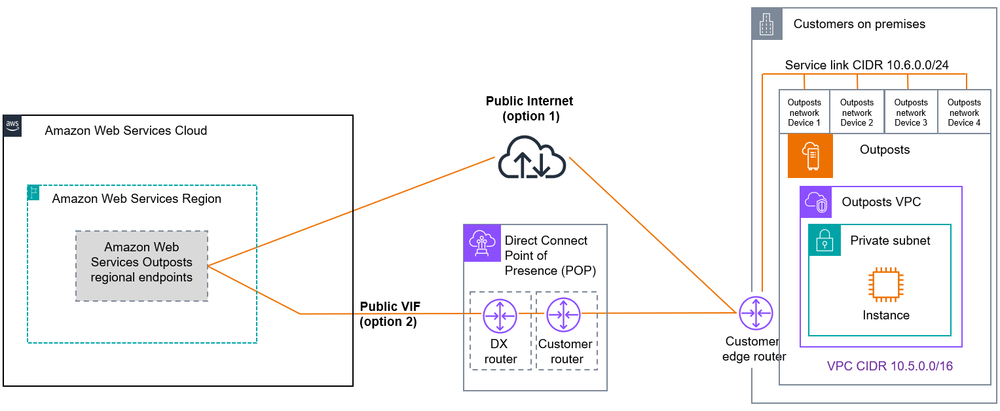

# Service link public connectivity options

You can configure the service link with a public connection for the traffic between the
Outposts and home AWS Region. You can choose to use the public internet or Direct Connect public
VIFs.

If you plan on allow-listing only AWS Region public IPs (instead of 0.0.0.0/0) on your
firewalls, you must ensure that your firewall rules are up-to-date with the current IP address
ranges. For more information, see [AWS IP address ranges](../../../vpc/latest/userguide/aws-ip-ranges.md "../../../vpc/latest/userguide/aws-ip-ranges.md") in the
_Amazon VPC User Guide_.

The following image shows both options to establish a service link public connection
between your Outposts and the AWS Region:

## Option 1. Public connectivity through the

internet

This option requires the AWS Outposts [service link infrastructure subnet IPs](outposts-rack2ndgen-local-rack.md#service-link-subnet "outposts-rack2ndgen-local-rack.md#service-link-subnet") to have access to the public IP ranges of
your AWS Region or home Region. You must allow-list AWS Region public IPs or 0.0.0.0/0
on networking devices such as your firewall.

## Option 2. Public connectivity through Direct Connect

public VIFs

This option requires the AWS Outposts [service link infrastructure subnet IPs](outposts-rack2ndgen-local-rack.md#service-link-subnet "outposts-rack2ndgen-local-rack.md#service-link-subnet") to have access to the public IP ranges of
your AWS Region or home Region over DX service. You must allow-list AWS Region public
IPs or 0.0.0.0/0 on networking devices such as your firewall.
