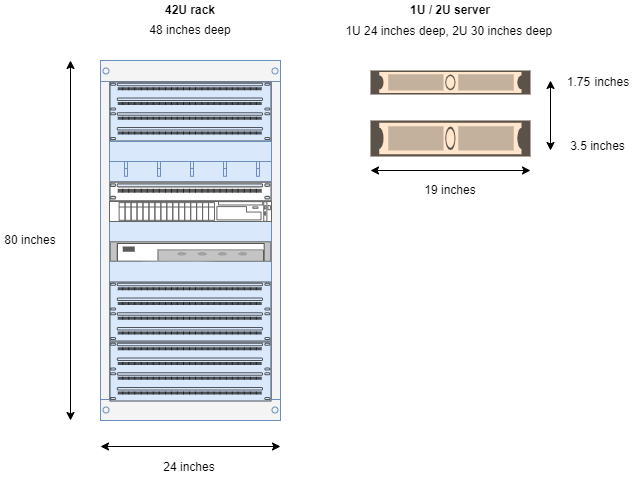
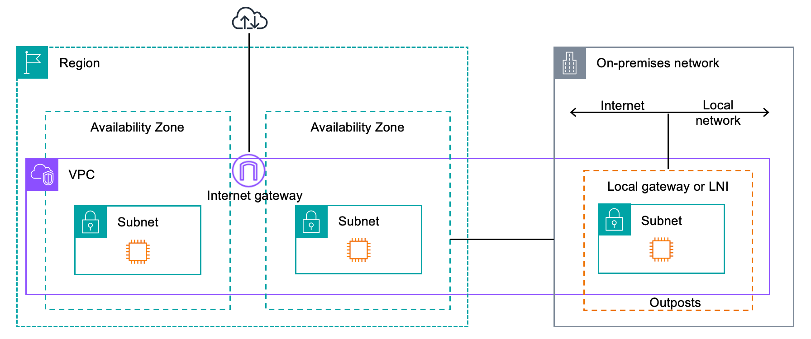

# How AWS Outposts works

AWS Outposts is designed to operate with a constant and consistent connection between your
Outpost and an AWS Region. To achieve this connection to the Region, and to the local
workloads in your on-premises environment, you must connect your Outpost to your on-premises
network. Your on-premises network must provide wide area network (WAN) access back to the Region. It must also provide LAN or WAN access to the local network where your
on-premises workloads or applications reside.

The following diagram illustrates both Outpost
form factors.

###### Contents

- [Network components](#outposts-networking-components "#outposts-networking-components")
- [VPCs and subnets](#vpc-subnet "#vpc-subnet")
- [Routing](#routing-hiw "#routing-hiw")
- [DNS](#dns "#dns")
- [Service link](#how-service-link "#how-service-link")
- [Local network interfaces](#how-servers-work "#how-servers-work")

## Network components

AWS Outposts extends an Amazon VPC from an AWS Region to an Outpost with the VPC components that
are accessible in the Region, including internet gateways, virtual private gateways,
Amazon VPC Transit Gateways, and VPC endpoints. An Outpost is homed to an Availability Zone in the Region
and is an extension of that Availability Zone that you can use for resiliency.

The following diagram shows the network components for your
Outpost.

- An AWS Region and an on-premises network
- A VPC with multiple subnets in the Region
- An Outpost in the on-premises network
- Connectivity between the Outpost and local network provided:
  - For Outposts racks: a local gateway
  - For Outposts servers: a local network interface (LNI)

## VPCs and subnets

A virtual private cloud (VPC) spans all Availability Zones in its AWS Region. You can
extend any VPC in the Region to your Outpost by adding an Outpost subnet. To add an Outpost
subnet to a VPC, specify the Amazon Resource Name (ARN) of the Outpost when you create the
subnet.

Outposts support multiple subnets. You can specify the EC2 instance subnet when you launch
the EC2 instance in your Outpost. You can't specify the underlying hardware where the instance
is deployed, because the Outpost is a pool of AWS compute and storage capacity.

Each Outpost can support multiple VPCs that can have one or more Outpost subnets. For
information about VPC quotas, see [Amazon VPC
Quotas](../../../vpc/latest/userguide/amazon-vpc-limits.md "../../../vpc/latest/userguide/amazon-vpc-limits.md") in the _Amazon VPC User Guide_.

You create Outpost subnets from the VPC CIDR range of the VPC where you created the
Outpost. You can use the Outpost address ranges for resources, such as EC2 instances that
reside in the Outpost subnet.

## Routing

By default, every Outpost subnet inherits the main route table from its VPC. You can
create a custom route table and associate it with an Outpost subnet.

The route tables for Outpost subnets work as they do for Availability Zone subnets. You
can specify IP addresses, internet gateways, local gateways, virtual private gateways, and
peering connections as destinations. For example, each Outpost subnet, either through the
inherited main route table, or a custom table, inherits the VPC local route. This means that
all traffic in the VPC, including the Outpost subnet with a destination in the VPC CIDR
remains routed in the VPC.

Outpost subnet route tables can include the following destinations:

- VPC CIDR range – AWS defines this at
  installation. This is the local route and applies to all VPC routing, including traffic
  between Outpost instances in the same VPC.
- AWS Region destinations
  – This includes prefix lists for Amazon Simple Storage Service (Amazon S3), Amazon DynamoDB gateway endpoint,
  AWS Transit Gateways, virtual private gateways, internet gateways, and VPC
  peering.

If you have a peering connection with multiple VPCs on the same Outpost, the traffic
between the VPCs remains in the Outpost and does not use the service link back to the
Region.

## DNS

For network interfaces connected to a VPC, EC2 instances in Outposts subnets can use the
Amazon Route 53 DNS Service to resolve domain names to IP addresses. Route 53 supports DNS features,
such as domain registration, DNS routing, and health checks for instances running in your
Outpost. Both public and private hosted Availability Zones are supported for routing traffic
to specific domains. Route 53 resolvers are hosted in the AWS Region. Therefore, service link
connectivity from the Outpost back to the AWS Region must be up and running for these DNS
features to work.

You might encounter longer DNS resolution times with Route 53, depending on the path latency
between your Outpost and the AWS Region. In such cases, you can use the DNS servers
installed locally in your on-premises environment. To use your own DNS servers, you must
create DHCP option sets for your on-premises DNS servers and associate them with the VPC. You
must also ensure that there is IP connectivity to these DNS servers. You might also need to
add routes to the local gateway routing table for reachability but this is only an option for
Outposts racks with local gateway. Because DHCP option sets have a VPC scope, instances in both the
Outpost subnets and the Availability Zone subnets for the VPC will try to use the specified
DNS servers for DNS name resolution.

Query logging is not supported for DNS queries originating from an Outpost.

## Service link

The service link is a connection from your Outpost back to your chosen AWS Region or
Outposts home Region. The service link is an encrypted set of VPN connections that are used
whenever the Outpost communicates with your chosen home Region. You use a virtual LAN (VLAN)
to segment traffic on the service link. The service link VLAN enables communication between
the Outpost and the AWS Region for both management of the Outpost and intra-VPC traffic
between the AWS Region and Outpost.

Your service link is created when your Outpost is provisioned. If you have a server form
factor, you create the connection. If you have a rack, AWS creates the service link. For
more information, see:

-
- [Application/workload routing](../../../whitepapers/latest/aws-outposts-high-availability-design/applicationworkload-routing.md "../../../whitepapers/latest/aws-outposts-high-availability-design/applicationworkload-routing.md") in the _AWS Outposts High Availability Design
  and Architecture Considerations_ AWS Whitepaper

## Local network interfaces

Outposts servers include a local network interface to provide connectivity to
your on-premises network. A local network interface is available only for Outposts servers running on
an Outpost subnet. You can't use a local network interface from an EC2 instance on an Outposts rack
or in the AWS Region. The local network interface is meant only for on-premises locations.
For more information, see [Local network interfaces for your Outposts servers](local-network-interface.md "local-network-interface.md").
