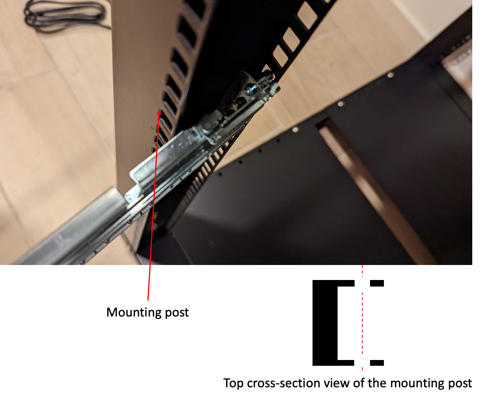

# Site requirements for Outposts servers

An Outpost site is the physical location where your Outpost operates. Sites are only
available in select countries and territories. For more
information, see [AWS Outposts servers
FAQs](https://aws.amazon.com/outposts/servers/faqs/ "https://aws.amazon.com/outposts/servers/faqs/"). Refer to the question: **In which countries and
territories are Outposts servers available?**

This page covers the requirements for Outposts servers. For the requirements for Outposts racks,
see [Site
requirements for Outposts racks](../userguide/outposts-requirements.md "../userguide/outposts-requirements.md") in the _AWS Outposts User Guide for Outposts racks_.

###### Contents

- [Facility](#faciliy-site-server "#faciliy-site-server")
- [Networking](#facility-networking-server "#facility-networking-server")
- [Power](#facility-power-server "#facility-power-server")
- [Order fulfillment](#order-fullfillment-server "#order-fullfillment-server")

## Facility

These are the facility requirements for servers.

###### Note

Specifications are for servers under normal operating conditions. For example, acoustics
may sound louder during initial installation and then operate at the rated sound power after
installation is complete.

- Temperature – The ambient temperature must be
  between 41–95° F (5–35° C).

The server will shut down when the temperature is outside this range and will restart
when the temperature is back within the range.

- Humidity – The relative humidity must be between
  8–80 percent with no condensation.
- Air quality – The air must be filtered using a
  MERV8 (or higher) filter.
- Airflow – The position of the server must ensure
  a minimum clearance of 6 inches (15 cm) between the server and walls in front of and
  behind the server to allow for sufficient airflow clearance.
- Weight – The 1U server weighs 26 pounds and the
  2U server weighs 36 pounds. Confirm that the location where you intend to put the server
  can support the weight of the server.

To see the weight requirements for different Outposts resources, choose
**Browse catalog** in the AWS Outposts console at [https://console.aws.amazon.com/outposts/](https://console.aws.amazon.com/outposts/home "https://console.aws.amazon.com/outposts/home").

- Rail-kit compatibility – The rail kit that is
  included in your shipping package is compatible with a standard L-shaped mounting bracket
  of an EIA-310-D compliant 19 inch rack. The rail kit is not compatible with a U-shaped
  mounting bracket, as shown in the following image.

[Show moreShow less](# "#")

- Rack Placement – We recommend the use of
  standard 19-inch EIA-310D racks, with a depth of at least 36 inches (914 mm).
  AWS provides a rail kit for rack-mounting the server.

      + Outposts 2U servers require space with the following dimensions: 3.5 inches height
       (88.9mm), 17.5 inches width (447 mm), 30 inches depth (762 mm)
      + Outposts 1U servers require space with the following dimensions: 1.75 inches
       height (44.45 mm), 17.5 inches width (447 mm), 24 inches depth (610 mm)
      + Mounting AWS Outposts servers vertically is not supported.
      + Outposts 1U servers are the same width as Outposts 2U servers, but half the
       height and less depth

  If you do not place the server in a rack, you must still meet the other site
  requirements.

- Serviceability – Outposts servers are
  front-aisle serviceable.
- Acoustics – rated to be less than 78 dBA sound
  power at temperatures of 80 ° F (27 ° C) and meets GR-63 CORE NEBS compliance.
- Seismic bracing – To the extent required by
  regulation or code, you will install and maintain appropriate seismic anchorage and
  bracing for the server while it is in your facility.
- Elevation – The elevation of the room where the
  rack is installed must be below 10,005 feet (3,050 meters).
- Cleaning – Wipe surfaces with damp wipes that
  contain approved antistatic cleaning chemicals.

## Networking

Each Outposts server includes non-redundant
physical uplink ports. Ports have their own speed and connector requirements as detailed
below.

| Port label | Speed           | Connector on the upstream networking device | Traffic                                                                                  |
| ---------- | --------------- | ------------------------------------------- | ---------------------------------------------------------------------------------------- | ------------------------------------------------------------------------------------ | ----------------------------------------------------------------------------------------------------------------------------------------------------------------------------------------------------------------------------------------------------------------------------------------------------------------------------------------------------------------------------------------------------------------------------------------------------------------------------------------------------------------------------------------------------------------------------------------------------------------------------------------------------------------------------------------------------------------------------------------------------------------------------------------------------------------------------------------------------------------------------------------------------------------------------------------------------------------------------------------------------------------------------------------------------------------------------------------------------------------------------------------------------------------------------------------------------------------------------------------------------------------------------------------------------------------------------------------------------------------------------------------------------------------------------------------------------------------------------------------------------------------------------------------------------------------------------------------------------------------------------------------------------------------------------------------------------------------------------------------------------------------------------------------------------------------------------------------------------------------------------------------------------------------------------------------------------------------------------------------------------------------------------------------------------------------------------------------------------------------------------------------------------------------------------------------------------------------------------------------------------------------------------------------------------------------------------------------------------------------------------------------------------------------------------------------------------------------------------------------------------------------------------------------------------------------------------------------------------------------------------------------------------------------------------------------------------------------------------------------------------------------------------------------------------------------------------------------------------------------------------------------------------------------------------------------------------------------------------------------------------------------------------------------------------------------------------------------------------------------------------------------------------------------------------------------------------------------------------------------------------------------------------------------------------------------------------------------------------------------------------------------------------------------------------------------------------------------------------------------------------------------------------------------------------------------------------------------------------------------------------------------------------------------------------------------------------------------------------------------------------------------------------------------------------------------------------------------------------------------------------------------------------------------------------------------------------------------------------------------------------------------------------------------------------------------------------------------------------------------------------------------------------------------------------------------------------------------------------------------------------------------------------------------------------------------------------------------------------------------------------------------------------------------------------- |
| Port 3     | 10Gbe           | SFP+                                        | Both service and LNI link traffic – QSFP+ breakout cable (10 feet/3 m) segments traffic. | ### Service link firewall UDP and TCP 443 must be statefully listed in the firewall. |
| Protocol   | Source Port     | Source Address                              | Destination Port                                                                         | Destination Address                                                                  |
| ---        | ---             | ---                                         | ---                                                                                      | ---                                                                                  |
| UDP        | 1024-65535      | Service Link IP                             | 53                                                                                       | DNS server                                                                           |
| UDP        | 443, 1024-65535 | Service Link IP                             | 443                                                                                      | Outposts Service Link endpoints                                                      |
| TCP        | 1024-65535      | Service Link IP                             | 443                                                                                      | Outposts Registration endpoints                                                      | You can use an AWS Direct Connect connection or a public internet connection to connect the Outpost back to the AWS Region. For Outposts service link connectivity, you can use NAT or PAT at your firewall or edge router. Service link establishment is always initiated from the Outpost. ### Service link maximum transmission unit (MTU) The network must support 1500-bytes MTU between the Outpost and the service link endpoints in the parent AWS Region. For more information about the service link, see [AWS Outposts connectivity to AWS Regions](region-connectivity.md "region-connectivity.md") in the _AWS Outposts user guide for servers_. ### Service link bandwidth recommendations For an optimal experience and resiliency, AWS requires that you use redundant connectivity of at least 500 Mbps and a maximum of 175 ms round trip latency for the service link connection to the AWS Region. The maximum utilization for each Outposts server is 500 Mbps. To increase the connection speed, use multiple Outposts servers. For example, if you have three AWS Outposts servers, the maximum connection speed increases to 1.5 Gbps (1,500 Mbps). For more information, see [Service link traffic for servers](local-server.md#lni-sl "local-server.md#lni-sl") in the _AWS Outposts user guide for servers_. Your AWS Outposts service link bandwidth requirements vary depending on workload characteristics, such as AMI size, application elasticity, burst speed needs, and Amazon VPC traffic to the Region. Note that AWS Outposts servers do not cache AMIs. AMIs are downloaded from the Region with every instance launch. To receive a custom recommendation about the service link bandwidth required for your needs, contact your AWS sales representative or APN partner. ## Power These are the power requirements for Outposts servers. ###### Requirements  • [Power support](#power-support-server "#power-support-server")  • [Power draw](#power-draw-server "#power-draw-server")  • [Power cable](#power-cable-server "#power-cable-server")  • [Power redundancy](#power-redundancy-server "#power-redundancy-server") ### Power support Servers are rated up to 1600W 90-264 VaC 47/63 Hz AC power. ### Power draw To see the power draw requirements for different Outposts resources, choose **Browse catalog** in the AWS Outposts console at [https://console.aws.amazon.com/outposts/](https://console.aws.amazon.com/outposts/home "https://console.aws.amazon.com/outposts/home"). ### Power cable The server ships with an IEC C14-C13 power cable. ###### Power cabling from server to rack Use the provided IEC C14-C13 power cable to connect the server to the rack. ###### Power cabling from server to wall outlet To connect the server to a standard wall outlet, you must use either an adapter for the C14 inlet or a country-specific power cord. Ensure that you have the correct adapter or power cord for your region to save time during server installation.  • In the United States, you need an IEC C13 to NEMA 5-15P power cord.  • In parts of Europe, you might need an IEC C13 to CEE 7/7 power cord.  • In India, you need an IEC C13 to IS1293 power cord. ### Power redundancy Servers include multiple power connections and ship with cables to enable power redundant operation. We recommend power redundancy, but redundancy is not required. Servers do not include an Uninterruptible Power Supply (UPS). ## Order fulfillment To fulfill the order, AWS will ship the Outposts server equipment, including rail mounts and required power and network cables, to the address that you provided. The box that the server is shipped in has the following dimensions:  • Box with a 2U server: + Length: 44 inches / 111.8 cm + Height: 26.5 inches / 67.3 cm + Width: 17 inches / 43.2 cm  • Box with a 1U server: + Length: 34.5 inches / 87.6 cm + Height: 24 inches / 61 cm + Width: 9 inches / 22.9 cm Your team or a third-party provider must install the equipment. For more information, see [Service link traffic for servers](../install-server/install-server.md "../install-server/install-server.md") in the _AWS Outposts user guide for servers_. The installation is complete when you confirm that the Amazon EC2 capacity for your Outposts server is available from your AWS account. |
