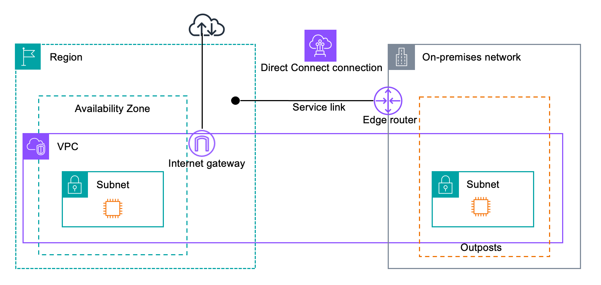
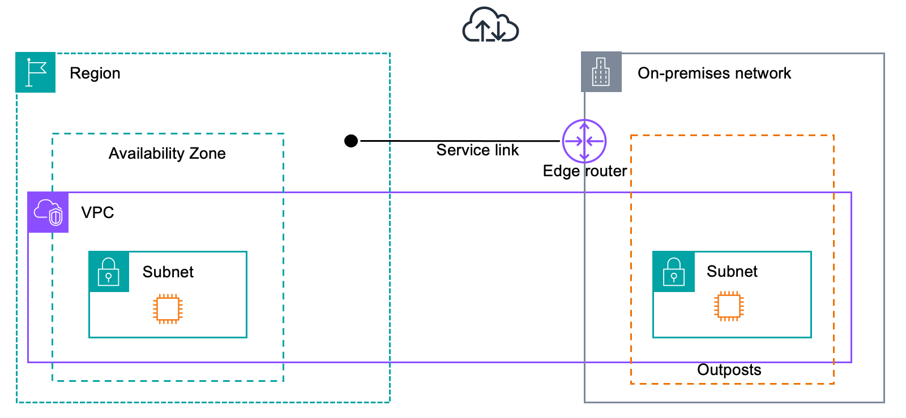

# Firewalls and the service link

This section discusses firewall configurations and the service link connection.

In the following diagram, the configuration extends the Amazon VPC from
the AWS Region to the Outpost. An AWS Direct Connect public virtual interface is the service link
connection. The following traffic goes over the service link and the AWS Direct Connect
connection:

- Management traffic to the Outpost through the service link
- Traffic between the Outpost and any associated VPCs

If you are using a stateful firewall with your internet connection to limit connectivity
from the public internet to the service link VLAN, you can block all inbound connections that
initiate from the internet. This is because the service link VPN initiates only from the
Outpost to the Region, not from the Region to the Outpost.

If you use a stateful firewall that is both UDP and TCP-aware to limit connectivity
regarding the service link VLAN, you can deny all inbound connections. If the firewall is
acting in a stateful manner, allowed outbound connections from the Outposts service link
should automatically allow reply traffic back in without explicit rule configuration. Only
outbound connections initiated from the Outpost service link need to be configured as
allowed.

| Protocol | Source Port | Source Address                        | Destination Port | Destination Address                   |
| -------- | ----------- | ------------------------------------- | ---------------- | ------------------------------------- | ---------------------------------------------------------------------------------------------------------------------------------------------------------------------------------------------------------------------------------------------------------------------------------------------------------------------------------------------------------------------------------------------------------------------------------------------------------------------------------------------- |
| UDP      | 443         | AWS Outposts service link /26         | 443              | AWS Outposts Region's public networks |
| TCP      | 1025-65535  | AWS Outposts service link /26         | 443              | AWS Outposts Region's public networks | If you use a non-stateful firewall to limit connectivity regarding the service link VLAN, you must allow outbound connections initiated from the Outposts service link to the AWS Outposts Region's public networks. You must also explicitly allow reply traffic in from the Outposts Region’s public networks inbound to the service link VLAN. Connectivity is always initiated outbound from the Outposts service link, but reply traffic must be allowed back into the service link VLAN. |
| Protocol | Source Port | Source Address                        | Destination Port | Destination Address                   |
| ---      | ---         | ---                                   | ---              | ---                                   |
| UDP      | 443         | AWS Outposts service link /26         | 443              | AWS Outposts Region's public networks |
| TCP      | 1025-65535  | AWS Outposts service link /26         | 443              | AWS Outposts Region's public networks |
| UDP      | 443         | AWS Outposts Region's public networks | 443              | AWS Outposts service link /26         |
| TCP      | 443         | AWS Outposts Region's public networks | 1025-65535       | AWS Outposts service link /26         | ###### Note Instances in an Outpost can't use the service link to communicate with instances in another Outposts. Leverage routing through the local gateway or local network interface to communicate between Outposts. AWS Outposts racks are also designed with redundant power and networking equipment, including local gateway components. For more information, see [Resilience in AWS Outposts](disaster-recovery-resiliency.md "disaster-recovery-resiliency.md").                    |
