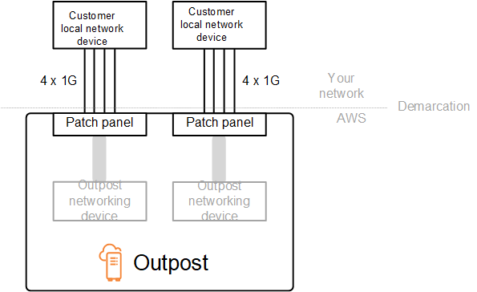
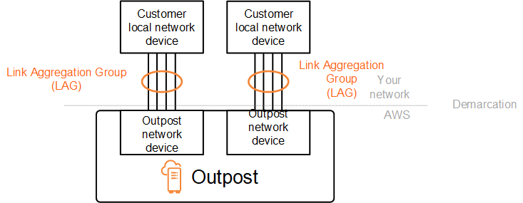
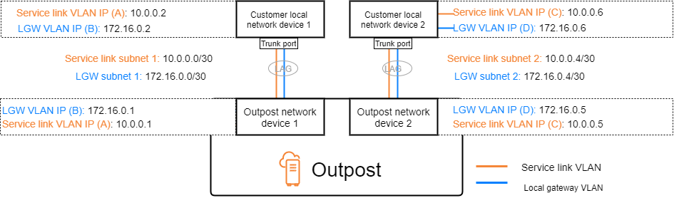
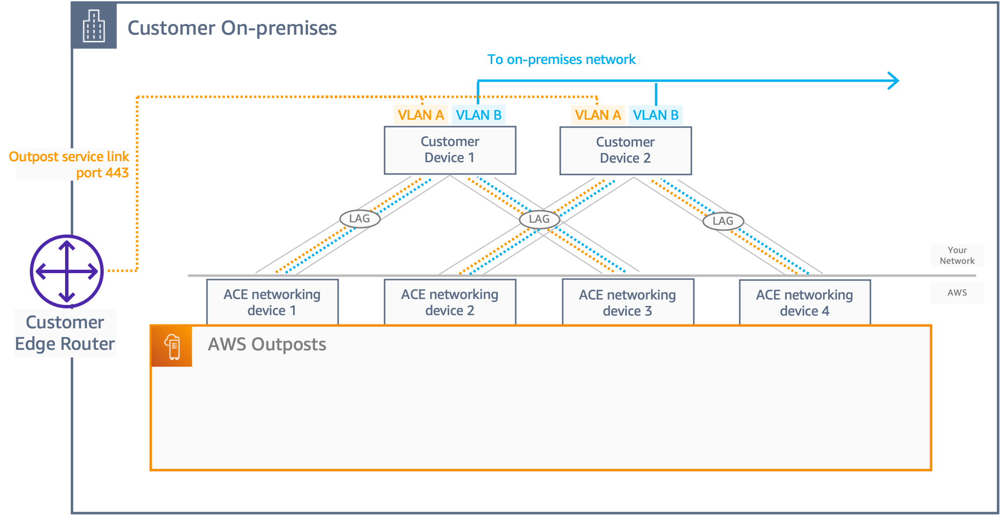
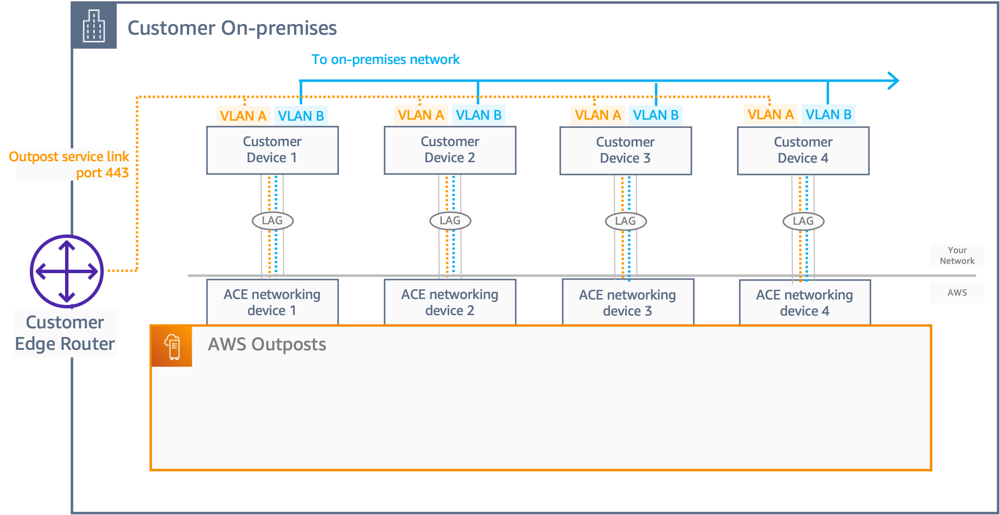
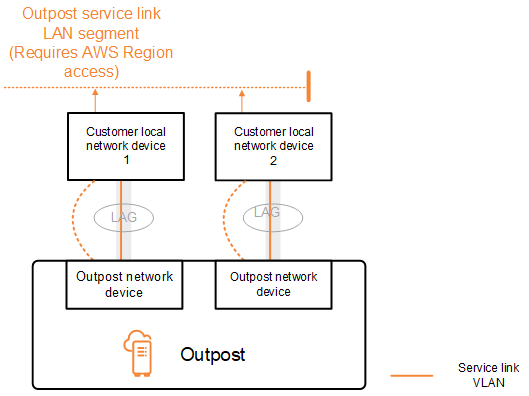
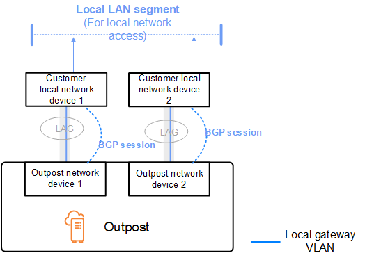
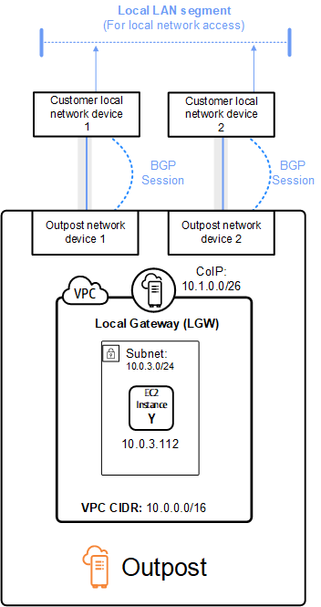

# Local network connectivity for Outposts racks

You need the following components to connect your Outposts rack to your on-premises network:

- Physical connectivity from the Outpost patch panel to your customer local network
  devices.
- Link Aggregation Control Protocol (LACP) to establish two link aggregation group (LAG)
  connections to your Outpost network devices and to your local network devices.
- Virtual LAN (VLAN) connectivity between the Outpost and your customer local network
  devices.
- Layer 3 point-to-point connectivity for each VLAN.
- Border Gateway Protocol (BGP) for the route advertisement between the Outpost and your
  on-premises service link.
- BGP for the route advertisement between the Outpost and your on-premises local network
  device for connectivity to the local gateway.

###### Contents

- [Physical connectivity](#physical-connectivity "#physical-connectivity")
- [Link aggregation](#link-aggregation "#link-aggregation")
- [Virtual LANs](#vlans "#vlans")
- [Network layer connectivity](#network-layer-connectivity "#network-layer-connectivity")
- [ACE rack connectivity](#ace-rack-connectivity "#ace-rack-connectivity")
- [Service link BGP connectivity](#service-link-bgp-connectivity "#service-link-bgp-connectivity")
- [Service link infrastructure subnet advertisement and IP
  range](#service-link-subnet "#service-link-subnet")
- [Local gateway BGP connectivity](#local-gateway-bgp-connectivity "#local-gateway-bgp-connectivity")
- [Local gateway customer-owned IP subnet
  advertisement](#local-gateway-subnet "#local-gateway-subnet")

## Physical connectivity

An Outposts rack has two physical network devices that attach to your local network.

An Outpost requires a minimum of two physical links between these Outpost network devices
and your local network devices. An Outpost supports the following uplink speeds and quantities
for each Outpost network device.

| Uplink speed        | Number of uplinks     |
| ------------------- | --------------------- |
| 1 Gbps              | 1, 2, 4, 6, or 8      |
| 10 Gbps             | 1, 2, 4, 8, 12, or 16 |
| 40 Gbps or 100 Gbps | 1, 2, or 4            |

The uplink speed and quantity are symmetrical on each Outpost network device. If you use 100
Gbps as the uplink speed, you must configure the link with forward error correction (FEC
CL91).

Outposts racks can support single-mode fiber (SMF) with Lucent Connector (LC), multimode fiber
(MMF), or MMF OM4 with LC. AWS provides the optics that are compatible with the fiber that you
provide at the rack position.

In the following diagram, the physical demarcation is the fiber patch
panel in each Outpost. You provide the fiber cables that are required to connect the Outpost to
the patch panel.

## Link aggregation

AWS Outposts uses the Link Aggregation Control Protocol (LACP) to establish link aggregation
group (LAG) connections between your Outpost network devices and your local network devices. The
links from each Outpost network device are aggregated into an Ethernet LAG to represent a single
network connection. These LAGs use LACP with standard fast timers. You can't configure LAGs to
use slow timers.

To enable an Outpost installation at your site, you must configure your side of the LAG
connections on your network devices.

From a logical perspective, ignore the Outpost patch panels as the demarcation point and use
the Outpost networking devices.

For deployments that have multiple racks, an Outpost must have four LAGs between the
aggregation layer of the Outpost network devices and your local network devices.

The following diagram shows four physical connections between each
Outpost network device and its connected local network device. We use Ethernet LAGs to aggregate
the physical links connecting the Outpost network devices and the customer local network devices.

## Virtual LANs

Each LAG between an Outpost network device and a local network device must be configured as
an IEEE 802.1q Ethernet trunk. This enables the use of multiple VLANs for network segregation
between data paths.

Each Outpost has the following VLANs to communicate with your local network devices:

- Service link VLAN – Enables communication between
  your Outpost and your local network devices in order to establish a service link path for the
  service link connectivity. For more information, see [AWS Outposts connectivity to AWS
  Regions](region-connectivity.md "region-connectivity.md").
- Local gateway VLAN – Enables communication between
  your Outpost and your local network devices in order to establish a local gateway path to
  connect your Outpost subnets and your local area network. Outpost local gateway leverages this
  VLAN to provide your instances the connectivity to your on-premise network, which might include
  internet access through your network. For more information, see [Local gateway](outposts-local-gateways.md "outposts-local-gateways.md").

You can configure the service link VLAN and local gateway VLAN only between the Outpost and
your customer local network devices.

An Outpost is designed to separate the service link and local gateway data paths into two
isolated networks. This enables you to choose which of your networks can communicate with
services running on the Outpost. It also enables you to make the service link an isolated network
from the local gateway network by using multiple route table on your customer local network
device, commonly known as Virtual Routing and Forwarding instances (VRF). The demarcation line
exists at the port of the Outpost network devices. AWS manages any infrastructure on the AWS
side of the connection, and you manage any infrastructure on your side of the line.

To integrate your Outpost with your on-premises network during the installation and on-going
operation, you must allocate the VLANs used between the Outpost network devices and the customer
local network devices. You need to provide this information to AWS before the installation. For
more information, see [Network readiness checklist](outposts-requirements.md#checklist "outposts-requirements.md#checklist").

## Network layer connectivity

To establish network layer connectivity, each Outpost network device is configured with
Virtual Interfaces (VIFs) that include the IP address for each VLAN. Through these VIFs, AWS Outposts
network devices can set up IP connectivity and BGP sessions with your local network
equipment.

We recommend the following:

- Use a dedicated subnet, with a /30 or /31 CIDR, to represent this logical point-to-point
  connectivity.
- Do not bridge the VLANs between your local network devices.

For the network layer connectivity, you must establish two paths:

- Service link path - To establish this path, specify a VLAN
  subnet with a range of /30 or /31 and an IP address for each service link VLAN on the AWS Outposts
  network device. Service link Virtual Interfaces (VIFs) are used for this path to establish IP
  connectivity and BGP sessions between your Outpost and your local network devices for service
  link connectivity. For more information, see [AWS Outposts connectivity to AWS
  Regions](region-connectivity.md "region-connectivity.md").
- Local gateway path - To establish this path, specify a VLAN
  subnet with a range of /30 or /31 and an IP address for the local gateway VLAN on the AWS Outposts
  network device. Local gateway VIFs are used on this path to establish IP connectivity and BGP
  sessions between your Outpost and your local network devices for your local resource
  connectivity.

The following diagram shows the connections from each Outpost network device to the customer
local network device for the service link path and the local gateway path. There are four VLANs
for this example:

- VLAN A is for the service link path that connects the Outpost network device 1 with the
  customer local network device 1.
- VLAN B is for the local gateway path that connects the Outpost network device 1 with the
  customer local network device 1.
- VLAN C is for the service link path that connects the Outpost network device 2 with the
  customer local network device 2.
- VLAN D is for the local gateway path that connects the Outpost network device 2 with the
  customer local network device 2.

The following table shows example values for the subnets that connect the Outpost network
device 1 with the customer local network device 1.

| VLAN | Subnet        | Customer Device 1 IP | AWS OND 1 IP |
| ---- | ------------- | -------------------- | ------------ |
| A    | 10.0.0.0/30   | 10.0.0.2             | 10.0.0.1     |
| B    | 172.16.0.0/30 | 172.16.0.2           | 172.16.0.1   |

The following table shows example values for the subnets that connect the Outpost network
device 2 with the customer local network device 2.

| VLAN | Subnet        | Customer Device 2 IP | AWS OND 2 IP |
| ---- | ------------- | -------------------- | ------------ |
| C    | 10.0.0.4/30   | 10.0.0.6             | 10.0.0.5     |
| D    | 172.16.0.4/30 | 172.16.0.6           | 172.16.0.5   |

## ACE rack connectivity

###### Note

Skip this section if you don't need an ACE rack.

An Aggregation, Core, Edge (ACE) rack acts as a network aggregation point for multi-rack
Outpost deployments. You must use an ACE rack if you have four or more compute racks. If you have
less than four compute racks but plan to expand to four or more racks in the future, we recommend
that you install an ACE rack at the earliest.

With an ACE rack, the Outposts networking devices are no longer directly attached to your
on-premises networking devices. Instead, they are connected to the ACE rack, which provides
connectivity to the Outposts racks. In this topology, AWS owns the VLAN interface allocation and
configuration between Outposts networking devices and the ACE networking devices.

An ACE rack includes four networking devices which can be connected to two upstream customer
devices in a customer on-premises network or four upstream customer devices for maximum
resiliency.

The following images show the two networking topologies.

_The following image shows the four ACE networking devices of the ACE rack
connected to two upstream customer devices:_

_The following image shows the four ACE networking devices of the ACE rack
connected to four upstream customer devices:_

## Service link BGP connectivity

The Outpost establishes an external BGP peering session between each Outpost network device
and the customer local network device for service link connectivity over the service link VLAN.
The BGP peering session is established between the /30 or /31 IP addresses provided for the
point-to-point VLAN. Each BGP peering session uses a private Autonomous System Number (ASN) on
the Outpost network device and an ASN that you choose for your customer local network devices. As
part of the installation process, AWS configures the attributes that you provided..

Consider the scenario where you have an Outpost with two Outpost network devices connected
by a service link VLAN to two customer local network devices. You configure the following
infrastructure, and customer local network device BGP ASN attributes for each service
link:

- The service link BGP ASN. 2-byte (16-bit) or 4-byte (32-bit). The valid values are
  64512-65535 or 4200000000-4294967294.
- The infrastructure CIDR. This must be a /26 CIDR per rack.
- The customer local network device 1 service link BGP peer IP address.
- The customer local network device 1 service link BGP peer ASN. The valid values are
  1-4294967294.
- The customer local network device 2 service link BGP peer IP address.
- The customer local network device 2 service link BGP peer ASN. The valid values are
  1-4294967294. For more information, see [RFC4893](https://tools.ietf.org/html/rfc4893 "https://tools.ietf.org/html/rfc4893").

The Outpost establishes an external BGP peering session over the service link VLAN using the
following process:

1. Each Outpost network device uses the ASN to establish a BGP peering session with its
   connected local network device.
2. Outpost network devices advertise the /26 CIDR range as two /27 CIDR ranges to support
   link and device failures. Each OND advertises its own /27 prefix with an AS-Path length of 1,
   plus the /27 prefixes of all other ONDs with an AS-Path length of 4 as a backup.
3. The subnet is used for connectivity from the Outpost to the AWS Region.

We recommend that you configure customer network equipment to receive BGP advertisements
from Outposts without changing the BGP attributes. The customer network should prefer routes from
Outposts with an AS-Path length of 1 over routes with an AS-Path length of 4.

The customer network should advertise equal BGP prefixes with the same attributes to all
ONDs. The Outpost network load balances outbound traffic between all uplinks by default. Routing
policies are used on the Outpost side to shift traffic away from an OND if maintenance is
required. This traffic shift requires equal BGP prefixes from the customer side on all ONDs. If
maintenance is required on the customer network, we recommend that you use AS-Path prepending to
temporarily shift traffic array from specific uplinks.

## Service link infrastructure subnet advertisement and IP

range

You provide a /26 CIDR range during the pre-installation process for the _service link infrastructure subnet_. The Outpost infrastructure uses
this range to establish connectivity to the Region through the service link. The service link
subnet is the Outpost source, which initiates the connectivity.

Outpost network devices advertise the /26 CIDR range as two /27 CIDR blocks to support link
and device failures.

You must provide a service link BGP ASN and an infrastructure subnet CIDR (/26) for the
Outpost. For each Outpost network device, provide the BGP peering IP address on the VLAN of the
local network device and the BGP ASN of the local network device.

If you have a multiple rack deployment, you must have one /26 subnet per rack.

## Local gateway BGP connectivity

The Outpost uses a private Autonomous System Number (ASN) that you assign in order to
establish the external BGP sessions. Each Outpost network device has a single external BGP
peering to a local network device using its local gateway VLAN.

The Outpost establishes an external BGP peering session over the local gateway VLAN between
each Outpost network device and its connected customer local network device. The peering session
is established between the /30 or /31 IPs that you provided when you set up network connectivity
and uses point-to-point connectivity between the Outpost network devices and customer local
network devices. For more information, see [Network layer connectivity](#network-layer-connectivity "#network-layer-connectivity").

Each BGP session uses the private ASN on the Outpost network device side, and an ASN that
you choose on the customer local network device side. AWS configures the attributes as part of
the pre-installation process.

Consider the scenario where you have an Outpost with two Outpost network devices connected
by a service link VLAN to two customer local network devices. You configure the following local
gateway and customer local network device BGP ASN attributes for each service link:

- The customer provides the local gateway BGP ASN. 2-byte (16-bit) or 4-byte (32-bit). The
  valid values are 64512-65535 or 4200000000-4294967294.
- (Optional) You provide the customer owned CIDR that gets advertised (public or private,
  /26 minimum).
- You provide the customer local network device 1 local gateway BGP peer IP address.
- You provide the customer local network device 1 local gateway BGP peer ASN. The valid
  values are 1-4294967294. For more information, see [RFC4893](https://tools.ietf.org/html/rfc4893 "https://tools.ietf.org/html/rfc4893").
- You provide the customer local network device 2 local gateway BGP peer IP address.
- You provide the customer local network device 2 local gateway BGP peer ASN. The valid
  values are 1-4294967294. For more information, see [RFC4893](https://tools.ietf.org/html/rfc4893 "https://tools.ietf.org/html/rfc4893").

We recommend that you configure customer network equipment to receive BGP advertisements
from Outposts without changing the BGP attributes, and enable BGP multipath/load balancing
to achieve optimal inbound traffic flows. AS-Path prepending is used for local gateway prefixes
to shift traffic away from ONDs if maintenance is required. The customer network should prefer
routes from Outposts with an AS-Path length of 1 over routes with an AS-Path length of 4.

The customer network should advertise equal BGP prefixes with the same attributes to
all ONDs. The Outpost network load balances outbound traffic between all uplinks by default.
Routing policies are used on the Outpost side to shift traffic away from an OND if
maintenance is required. This traffic shift requires equal BGP prefixes from the customer
side on all ONDs. If maintenance is required on the customer network, we recommend that you
use AS-Path prepending to temporarily shift traffic array from specific uplinks.

## Local gateway customer-owned IP subnet

advertisement

By default, the local gateway uses the private IP addresses of instances in your VPC (see
[Direct VPC routing](routing.md#direct-vpc-routing "routing.md#direct-vpc-routing")) to facilitate communication with your on-premise network. However,
you can provide a customer-owned IP address pool (CoIP).

You can create Elastic IP addresses from this pool, and then assign the addresses to
resources on your Outpost, such as EC2 instances.

The local gateway translates the Elastic IP address to an address in the customer-owned
pool. The local gateway advertises the translated address to your on-premises network, and any
other network that communicates with the Outpost. The addresses are advertised on both local
gateway BGP sessions to the local network devices.

###### Tip

If you are not using CoIP, then BGP advertises the private IP addresses of any subnets on
your Outpost that have a route in the route table that targets the local gateway.

Consider the scenario where you have an Outpost with two Outpost network devices connected
by a service link VLAN to two customer local network devices. The following is configured:

- A VPC with a CIDR block 10.0.0.0/16.
- A subnet in the VPC with a CIDR block 10.0.3.0/24.
- An EC2 instance in the subnet with a private IP address 10.0.3.112.
- A customer-owned IP pool (10.1.0.0/26).
- An Elastic IP address association that associates 10.0.3.112 to 10.1.0.2.
- A local gateway that uses BGP to advertise 10.1.0.0/26 to the on-premises network through
  the local devices.
- Communication between your Outpost and on-premises network will use the CoIP Elastic IPs
  to address instances in the Outpost, the VPC CIDR range is not used.

