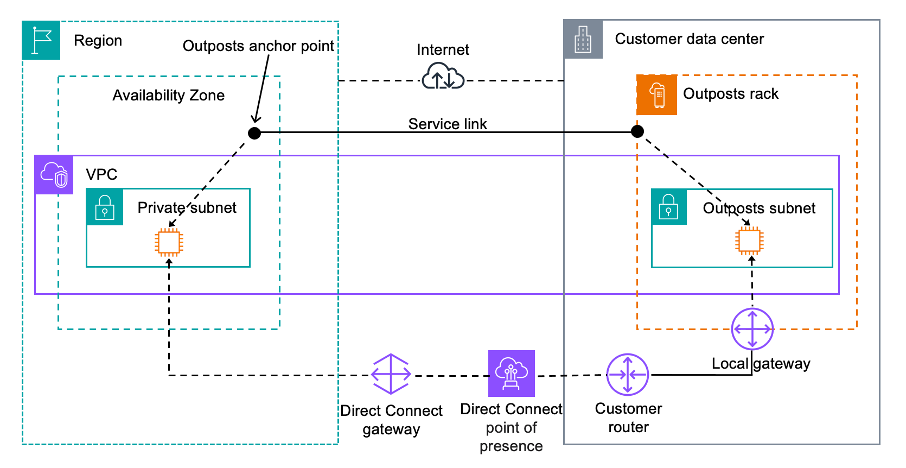

# Local gateways for your Outposts racks

The local gateway is a core component of the architecture for your Outposts racks. A local gateway
enables connectivity between your Outpost subnets and your on-premises network. If the
on-premise infrastructure provides an internet access, workloads running on Outposts racks can also
leverage the local gateway to communicate with regional services or regional workloads. This
connectivity can be achieved either by using a public connection (internet) or using AWS Direct Connect.
For more information, see [AWS Outposts connectivity to AWS Regions](region-connectivity.md "region-connectivity.md").

###### Contents

- [Basics](#local-gateway "#local-gateway")
- [Routing](#lgw-routing "#lgw-routing")
- [Connectivity](#lgw-connectivity "#lgw-connectivity")
- [Route tables](routing.md "routing.md")
- [Route table routes](manage-lgw-routes.md "manage-lgw-routes.md")
- [CoIP pools](coip-pools.md "coip-pools.md")

## Local gateway basics

AWS creates a local gateway for each Outposts rack as part of the installation process. An
Outposts rack supports a single local gateway. The local gateway is owned by the AWS account
associated with the Outposts rack.

###### Note

To understand instance bandwidth limitations for traffic going through a local gateway,
see [Amazon EC2 instance network
bandwidth](../../../AWSEC2/latest/UserGuide/ec2-instance-network-bandwidth.md "../../../AWSEC2/latest/UserGuide/ec2-instance-network-bandwidth.md") in the _Amazon EC2 User Guide_.

A local gateway has the following components:

- Route tables – Only the owner of a local gateway
  can create local gateway route tables. For more information, see [Local gateway route tables](routing.md "routing.md").
- CoIP pools – (Optional) You can use IP address
  ranges that you own to facilitate communication between the on-premises network and
  instances in your VPC. For more information, see [Customer-owned IP addresses](routing.md#ip-addressing "routing.md#ip-addressing").
- Virtual interfaces (VIFs) – Local gateway VIFs
  (Virtual Interface) is a logical interface component of Outposts racks that sets up VLAN,
  IP, and BGP connectivity between an Outposts networking device and an on-premise
  networking device for local gateway connectivity. AWS creates one VIF for each LAG and
  adds both VIFs to a VIF group. The local gateway route table must have a default route to
  the two VIFs for local network connectivity. For more information, see [Local network connectivity for Outposts racks](local-rack.md "local-rack.md").
- VIF groups – AWS adds the VIFs it creates to a
  VIF group. VIF groups are logical groupings of VIFs.
- Local gateway route table and VPC associations –
  Local gateway route table and VPC associations allow you to connect your VPCs to local
  gateway route tables. With this association, you can add route targeted to local gateway
  within your Outposts subnet route table. This enables communication between your Outposts
  subnet resources and your on-premises network through the local gateway.
- Local gateway routing domains – A local gateway
  routing domain is the association of a local gateway route table and local gateway VIF
  group. With this association, you can add a route targeted to a local gateway VIF group
  within your local gateway route table. This enables communication between your Outposts
  subnet resources and your on-premises network through the selected VIF group.

When AWS provisions your Outposts rack, we create some components and you are responsible for
creating others.

###### AWS responsibilities

- Delivers the hardware.
- Creates the local gateway.
- Creates the virtual interfaces (VIFs) and a VIF group.

###### Your responsibilities

- Create the local gateway route table.
- Associate a VPC with the local gateway route table.
- Associate a VIF group with the local gateway route table to create a local gateway
  routing domain.

## Local gateway routing

The instances in your Outpost subnet can use one of the following options for
communication with your on-premises network through the local gateway:

- Private IP addresses – The local gateway uses the private IP addresses of
  instances in your Outpost subnet to facilitate communication with your on-premises
  network. This is the default.
- Customer-owned IP addresses – The local gateway performs network address
  translation (NAT) for the customer-owned IP addresses that you assign to the instances in
  the Outpost subnet. This option supports overlapping CIDR ranges and other network
  topologies.

For more information, see [Local gateway route tables](routing.md "routing.md").

## Connectivity through a local gateway

The primary role of a local gateway is to provide connectivity from an Outpost to your
local on-premises network. It also provides connectivity to the internet through your
on-premises network. For examples, see [Direct VPC routing](routing.md#direct-vpc-routing "routing.md#direct-vpc-routing") and [Customer-owned IP addresses](routing.md#ip-addressing "routing.md#ip-addressing").

The local gateway can also provide a data plane path back to the AWS Region.
The
data plane path for the local gateway traverses from the Outpost, through the local gateway,
and to your private local gateway LAN segment. It would then follow a private path back to the
AWS service endpoints in the Region. Note that the control plane path always uses the
service link connectivity, regardless of the data plane path that you use.

You can connect your on-premises Outposts infrastructure to AWS services in the Region
privately over AWS Direct Connect. For more information, see [AWS Outposts private connectivity](https://aws.amazon.com/blogs/networking-and-content-delivery/introducing-aws-outposts-private-connectivity/ "https://aws.amazon.com/blogs/networking-and-content-delivery/introducing-aws-outposts-private-connectivity/").

The following image shows the connectivity through the local gateway:

