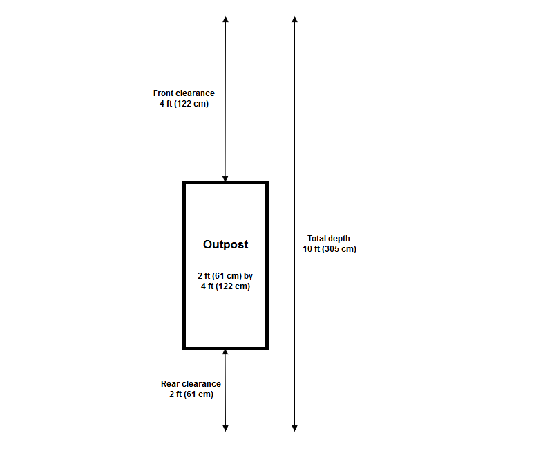

# Site requirements for Outposts racks

An Outpost site is the physical location where your Outpost operates. Sites are only
available in select countries and territories. For more information, see, [AWS Outposts rack FAQs](https://aws.amazon.com/outposts/rack/faqs/ "https://aws.amazon.com/outposts/rack/faqs/"). Refer to the question:
**In which countries and territories is Outposts rack
available?**

This page covers the requirements for Outposts racks. If you are installing an Aggregation, Core,
Edge (ACE) rack, your site must also meet the requirements listed in [Site requirements for Outpost ACE racks](outposts-ace-requirements.md "outposts-ace-requirements.md").

For the requirements for Outposts servers, see [Site requirements for Outposts servers](../server-userguide/outposts-requirements.md "../server-userguide/outposts-requirements.md") in the
_AWS Outposts User Guide for Outposts servers_.

## Facility

These are the facility requirements for racks.

- Temperature and humidity – The ambient
  temperature must be between 41° F (5° C) and 95° F (35° C). The relative
  humidity must be between 8 percent and 80 percent with no condensation.
- Airflow – Racks draw cold air from the front
  aisle and exhaust hot air to the back aisle. The rack position must provide at least 145.8
  times the kVA of cubic feet per minute (CFM) airflow.
- Loading dock – Your loading dock must
  accommodate a rack crate that is 94 inches (239 cm) high by 54 inches (138 cm) wide by 51
  inches (130 cm) deep.
- Weight support – Weight varies by configuration.
  You can find the weight for your configuration specified in the order summary at the rack
  point loads. The location where the rack is installed and the path to that location must
  support the specified weight. This includes any freight and standard elevators along the
  path.
- Clearance – The rack is 80 inches (203 cm) high
  by 24 inches (61 cm) wide by 48 inches (122 cm) deep. Any doorways, hallways, turns,
  ramps, and elevators must provide sufficient clearance. At the final resting position,
  there must be a 24 inch (61 cm) wide by 48 inch (122 cm) deep area for the Outpost, with
  an additional 48 inches (122 cm) of front clearance and 24 inches (61 cm) of rear
  clearance. The total minimum area required for the Outpost is 24 inch (61 cm) wide by 10
  feet (305 cm) deep.

The following diagram shows the total minimum area required for the Outpost, including
clearance.

- Seismic bracing – To the extent required by
  regulation or code, you will install and maintain appropriate seismic anchorage and
  bracing for the rack while it is in your facility. AWS provides floor brackets that
  provide protection for up to 2.0G of seismic activity with all Outposts racks.
- Bonding point – We recommend that you provide
  a bonding wire/point at the rack position so that your electrician can bond the racks
  during installation which will be validated by the AWS-certified technician.
- Facility access – You will not change the
  facility in a way that negatively affects the ability of AWS to access, service, or
  remove the Outpost.
- Elevation – The elevation of the room where the
  rack is installed must be below 10,005 feet (3,050 meters).

## Networking

These are the networking requirements for racks.

- Provide uplinks with speeds of 1 Gbps, 10 Gbps, 40 Gbps, or 100 Gbps.

For bandwidth recommendations for the service link connection, see [Bandwidth recommendations](service-links.md#region-bw-rec "service-links.md#region-bw-rec").

- Provide either single-mode fiber (SMF) with Lucent Connector (LC), multimode fiber
  (MMF), or MMF OM4 with LC.
- Provide one or two upstream devices, which can be switches or routers. We recommend
  two devices to provide high availability.

### Network readiness checklist

Use this checklist when you are gathering the information for your Outpost
configuration. This includes the LAN, WAN, and any devices between the Outpost and local
traffic destinations, and the destination in the AWS Region.

###### Uplink speed and ports

An Outpost has two Outpost network devices that attach to your local network. The
number of uplinks each device can support depends on your bandwidth needs and what
your router can support. For more information, see [Physical connectivity](local-rack.md#physical-connectivity "local-rack.md#physical-connectivity").

The following list shows how many uplink ports are supported for each Outpost
network device, based on the uplink speed.

**1 Gbps**

1, 2, 4, 6, or 8 uplinks

**10 Gbps**

1, 2, 4, 8, 12, or 16 uplinks

**40 Gbps or 100 Gbps**

1, 2, or 4 uplinks

##### Fiber

AWS Outposts requires fibers with Lucent Connectors (LC).

The following table lists the supported optical standards and the corresponding
fiber type required. If the optical standard uses the Multi-fiber Push-On (MPO)
connector, you will need a MPO to 4 x LC Type-B breakout cable where the 4 x LC
connectors attach to the Outpost to establish one link.

| Uplink speed | Optical standard                      | Fiber type                          |
| ------------ | ------------------------------------- | ----------------------------------- |
| 1 Gbps       | – 1000Base-LX                         | SMF (LC)                            |
| 1 Gbps       | – 1000Base-SX                         | MMF (LC)                            |
| 10 Gbps      | – 10GBASE-IR – 10GBASE-LR          | SMF (LC)                            |
| 10 Gbps      | – 10GBASE-SR                          | MMF (LC)                            |
| 40 Gbps      | – 40GBASE-IR4 (LR4L) – 40GBASE-LR4 | SMF (LC)                            |
| 40 Gbps      | – 40GBASE-ESR4 – 40GBASE-SR4       | MMF (MPO to 4 x LC Type-B breakout) |
| 100 Gbps     | – 100GBASE-CWDM4 – 100GBASE-LR4    | SMF (LC)                            |
| 100 Gbps     | – 100G PSM4 MSA                       | SMF (MPO to 4 x LC Type-B breakout) |
| 100 Gbps     | – 100GBASE-SR4                        | MMF (MPO to 4 x LC Type-B breakout) |

Link aggregation control protocol (LACP) is required between the Outpost and your
network. You must use dynamic LAG with LACP.

The following VLANs are required for each Outpost network device. For more
information, see [Virtual LANs](local-rack.md#vlans "local-rack.md#vlans").

| Outpost network device | Service link VLAN    | Local gateway VLAN   |
| ---------------------- | -------------------- | -------------------- |
| #1                     | Valid values: 1-4094 | Valid values: 1-4094 |
| #2                     | Valid values: 1-4094 | Valid values: 1-4094 |

For each Outpost network device, you can choose whether to use the same VLANs or
different VLANs for the service link and local gateway. However, we recommend that each
Outpost network device have a different VLAN from the other Outpost network device. For
more information, see [Link aggregation](local-rack.md#link-aggregation "local-rack.md#link-aggregation") and [Virtual LANs](local-rack.md#vlans "local-rack.md#vlans").

We also recommend redundant layer 2 connectivity. LACP is used for link aggregation
and is not used for high availability. LACP between the Outpost network devices is not
supported.

Each of the two Outpost network devices requires a CIDR and IP address for the
service link and local gateway VLANs. We recommend allocating a dedicated subnet for
each network device with a /30 or /31 CIDR. Specify a subnet and an IP address from the
subnet for the Outpost to use. For more information, see [Network layer connectivity](local-rack.md#network-layer-connectivity "local-rack.md#network-layer-connectivity").

| Outpost network device | Service link requirements                                     | Local gateway requirements                                      |
| ---------------------- | ------------------------------------------------------------- | --------------------------------------------------------------- |
| #1                     | – Service link CIDR (/30 or /31) – Service link IP address | – Local gateway CIDR (/30 or /31) – Local gateway IP address |
| #2                     | – Service link CIDR (/30 or /31) – Service link IP address | – Local gateway CIDR (/30 or /31) – Local gateway IP address |

The network must support 1500-bytes MTU between the Outpost and the service link
endpoints in the parent AWS Region. For more information about the service link, see
[AWS Outposts connectivity to AWS Regions](region-connectivity.md "region-connectivity.md").

The Outpost establishes an external BGP (eBGP) peering session between each Outpost
network device and your local network device for service link connectivity over the
service link VLAN. For more information, see [Service link BGP connectivity](local-rack.md#service-link-bgp-connectivity "local-rack.md#service-link-bgp-connectivity").

| Outpost      | Service link BGP requirements                                                                                                                                                                                                              |
| ------------ | ------------------------------------------------------------------------------------------------------------------------------------------------------------------------------------------------------------------------------------------ |
| Your Outpost | – Outpost BGP Autonomous System Number (ASN). 2-byte (16-bit) or 4-byte (32-bit). From your private ASN range (64512-65534 or 4200000000-4294967294). – Infrastructure CIDR (/26 required, advertised as two contiguous /27s). |

| Local network device | Service link BGP requirements                                                                              |
| -------------------- | ---------------------------------------------------------------------------------------------------------- |
| #1                   | – Service link BGP peer IP address. – Service link BGP peer ASN. 2-byte (16-bit) or 4-byte (32-bit). |
| #2                   | – Service link BGP peer IP address. – Service link BGP peer ASN. 2-byte (16-bit) or 4-byte (32-bit). |

UDP and TCP 443 must be statefully listed in the firewall.

| Protocol | Source Port | Source Address           | Destination Port | Destination Address            |
| -------- | ----------- | ------------------------ | ---------------- | ------------------------------ |
| UDP      | 443         | Outpost service link /26 | 443              | Outpost Region's public routes |
| TCP      | 1025-65535  | Outpost service link /26 | 443              | Outpost Region's public routes |

You can use an Direct Connect connection or a public internet connection to connect the
Outpost back to the AWS Region. For Outpost service link connectivity, you can use NAT
or PAT at your firewall or edge router. Service link establishment is always initiated
from the Outpost.

For more information about service link requirements, such as MTU and 175
ms latency, see [Connectivity through service
link](service-links.md "service-links.md").

The Outpost establishes an eBGP peering session from each Outpost network device to
a local network device for connectivity from your local network to the local gateway.
For more information, see [Local gateway BGP connectivity](local-rack.md#local-gateway-bgp-connectivity "local-rack.md#local-gateway-bgp-connectivity").

| Outpost      | Local gateway BGP requirements                                                                                                                                                                                            |
| ------------ | ------------------------------------------------------------------------------------------------------------------------------------------------------------------------------------------------------------------------- |
| Your Outpost | – Outpost BGP Autonomous System Number (ASN). 2-byte (16-bit) or 4-byte (32-bit). From your private ASN range (64512-65534 or 4200000000-4294967294). – CoIP CIDR to advertise (public or private, /26 minimum). |

| Local network devices | Local gateway BGP requirements                                                                               |
| --------------------- | ------------------------------------------------------------------------------------------------------------ |
| #1                    | – Local gateway BGP peer IP address. – Local gateway BGP peer ASN. 2-byte (16-bit) or 4-byte (32-bit). |
| #2                    | – Local gateway BGP peer IP address. – Local gateway BGP peer ASN. 2-byte (16-bit) or 4-byte (32-bit). |

## Power

The Outposts power shelf supports three power configurations: 5 kVA, 10 kVA, or 15 kVA.
The configuration of the power shelf depends on the total power draw of the Outpost capacity.
For example, if your Outpost resource has a maximum power draw of 9.7 kVA, you must provide
the power configurations for 10 kVA: 4 x L6-30P or IEC309, 2 drops to S1, and 2 drops to S2
for redundant, single-phase power. The three power configurations are described in the
following second table.

To see the power draw requirements for different Outpost resources, choose
**Browse catalog** in the AWS Outposts console at [https://console.aws.amazon.com/outposts/](https://console.aws.amazon.com/outposts/home "https://console.aws.amazon.com/outposts/home").

| Requirement                                 | Specification                                                                                                                                                                                                                                                                                                                                                                                                                                                                                                                                                                  |
| ------------------------------------------- | ------------------------------------------------------------------------------------------------------------------------------------------------------------------------------------------------------------------------------------------------------------------------------------------------------------------------------------------------------------------------------------------------------------------------------------------------------------------------------------------------------------------------------------------------------------------------------ |
| **AC line voltage**                         | **Single-phase\* • 208 to 277 VAC; 50 or 60 Hz **Three-phase\*\*: • 208 to 250 VAC (Delta); 50 to 60 Hz • 346 to 480 VAC (Wye); 50 to 60 Hz                                                                                                                                                                                                                                                                                                                                                                                                                        |
| **Power consumption**                       | 5 kVA (4 kW), 10 kVA (9 kW), or 15 kVA (13 kW)                                                                                                                                                                                                                                                                                                                                                                                                                                                                                                                                 |
| **AC protection (upstream power breakers)** | For both 1N input (non-redundant) and 2N input (redundant): 30 A, 32 A, or 50 A with D-curve or K-curve circuit breaker. For 2N input (redundant) only: C-curve, D-curve, or K-curve circuit breaker. B-curve or lower is not supported.                                                                                                                                                                                                                                                                                                                           |
| **AC inlet type (receptacle)**              | **Single-phase\* • 3xL6-30P, P+P+E, 30A or 3xIEC60309 P+N+E, IP67, 32A plugs **Three-phase, Wye* • 1xIEC60309, 3P+N+E, IP67, clock position 7, 30A plug or 1xIEC60309, 3P+N+E, IP67, clock position 6, 32A plug \*\*Three-phase, Delta* • 1xNon-NEMA twistlock Hubbell CS8365C, 3P+E, center ground, 50A plug NoteThe best practice is to mate an IP67 plug with an IP67 receptacle. If that isn't possible, the IP67 plug will mate with an IP44 receptacle. The rating of the combined plug and socket will become the lower rating (IP44). |
| **Whip length**                             | 10.25 ft (3 m)                                                                                                                                                                                                                                                                                                                                                                                                                                                                                                                                                                 |
| **Whip • Rack cabling input**            | From above or below the rack                                                                                                                                                                                                                                                                                                                                                                                                                                                                                                                                                   |

The power shelf has two inputs, S1 and S2, that can be configured as follows.

|            | Redundant, single-phase                               | Redundant, three-phase                                            | Single-phase | Three-phase                                     |
| ---------- | ----------------------------------------------------- | ----------------------------------------------------------------- | ------------ | ----------------------------------------------- |
| **5 kVA**  | 2 x L6-30P or IEC309; 1 drop to S1 and 1 drop to S2   | 2 x AH530P7W, AH532P6W, or CS8365C; 1 drop to S1 and 1 drop to S2 | Not offered  | 1 x AH530P7W, AH532P6W or CS8365C; 1 drop to S1 |
| **10 kVA** | 4 x L6-30P or IEC309; 2 drops to S1 and 2 drops to S2 | 2 x L6-30P or IEC309; 2 drops to S1                               |
| **15 kVA** | 6 x L6-30P or IEC309; 3 drops to S1 and 3 drops to S2 | 3 x L6-30P or IEC309; 3 drops to S1                               |

If the AC whips that AWS provides as previously described must be fitted with an
alternate power plug, consider the following:

- Only a certified customer-provided electrician should modify the AC whip to fit a new
  plug type.
- The installation should comply with all applicable national, state, and local safety
  requirements, and be inspected as required for electrical safety.
- You, the customer, should notify your AWS representative of modifications to the AC
  whip plug. Upon request, you will provide information about the modifications to AWS.
  You'll also include any safety inspection records issued by the authority having
  jurisdiction. This is a requirement to validate safety of the installation before having
  AWS employees perform work on the equipment.

## Order fulfillment

To fulfill the order, AWS will schedule a date and time with you. You will also receive
a checklist of items to verify or provide before the installation.

The AWS installation team will arrive at your site at the scheduled date and time. They
will place the rack at the identified position. You and your electrician are responsible for
performing the electrical connection and installation to the rack.

You must ensure that electrical installations, and any changes to those installations, are
performed by a certified electrician in accordance with all applicable laws, codes, and best
practices. You must obtain approval from AWS in writing prior to making any changes to the
Outpost hardware or the electrical installations. You agree to provide AWS with
documentation verifying compliance and the safety of any changes. AWS is not responsible for
any risks created by the Outpost electrical installation or facility electrical wiring or any
changes. You must not make any other changes to the Outposts hardware.

The team will establish network connectivity for the Outposts rack over the uplink that you
provide, and will configure the rack's capacity.

The installation is complete when you confirm that the Amazon EC2 and Amazon EBS capacity for your
Outposts rack is available from your AWS account.
