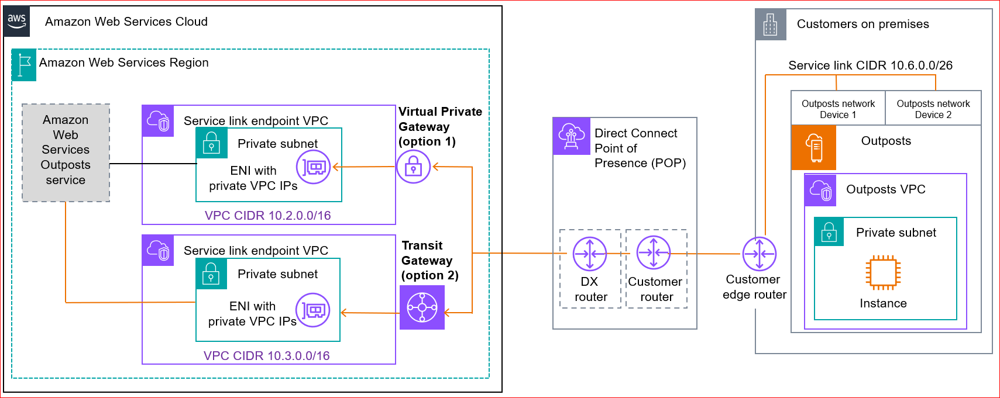

# Service link private connectivity options

You can configure the service link with a private connection for the traffic between the
Outposts and home AWS Region. You can choose to use AWS Direct Connect private or transit VIFs.

Select the private connectivity option when you create your Outpost in the AWS Outposts console.
For instructions, see [Create an
Outpost](order-outpost-capacity.md#create-outpost "order-outpost-capacity.md#create-outpost").

When you select the private connectivity option, a service link VPN connection is
established after the Outpost is installed, using a VPC and subnet that you specify. This
allows private connectivity through the VPC and minimizes public internet exposure.

The following image shows both options to establish a service link VPN private connection
between your Outposts and the AWS Region:

## Prerequisites

The following prerequisites are required before you can configure private connectivity
for your Outpost:

- You must configure permissions for an IAM entity (user or role) to allow the user
  or role to create the service-linked role for private connectivity. The IAM entity
  needs permission to access the following actions:

      + `iam:CreateServiceLinkedRole` on
       `arn:aws:iam::*:role/aws-service-role/outposts.amazonaws.com/AWSServiceRoleForOutposts*`
      + `iam:PutRolePolicy` on
       `arn:aws:iam::*:role/aws-service-role/outposts.amazonaws.com/AWSServiceRoleForOutposts*`
      + `ec2:DescribeVpcs`
      + `ec2:DescribeSubnets`

  For more information, see [AWS Identity and Access Management for
  AWS Outposts](identity-access-management.md "identity-access-management.md")

- In the same AWS account and Availability Zone as your Outpost, create a VPC for
  the sole purpose of Outpost private connectivity with a subnet /25 or larger that does
  not conflict with 10.1.0.0/16. For example, you might use 10.3.0.0/16.

###### Important

Do not delete this VPC as it maintains the connection to your
Outposts.

- Use [Security control policies (SCP)](../../../organizations/latest/userguide/orgs_manage_policies_scps.md "../../../organizations/latest/userguide/orgs_manage_policies_scps.md") to protect this VPC from being deleted.

The following sample SCP prevents the following from deletion:

    + Subnet tagged **Outposts Anchor Subnet**
    + VPC tagged **Outposts Anchor VPC**
    + Route tables tagged **Outposts Anchor Route Table**
    + Transit gateway tagged **Outposts Transit Gateway**
    + Virtual Private Gateway tagged **Outposts Virtual Private Gateway**
    + Transit gateway route table tagged **Outposts Transit Gateway Route Table**
    + Any ENI with the tag **Outposts Anchor ENI**

- Configure the subnet security group to allow traffic for UDP 443 inbound and
  outbound directions.
- Advertise the subnet CIDR to your on-premises network. You can use AWS Direct Connect to
  do so. For more information, see [AWS Direct Connect
  virtual interfaces](../../../directconnect/latest/UserGuide/WorkingWithVirtualInterfaces.md "../../../directconnect/latest/UserGuide/WorkingWithVirtualInterfaces.md") and [Working with
  AWS Direct Connect gateways](../../../directconnect/latest/UserGuide/direct-connect-gateways.md "../../../directconnect/latest/UserGuide/direct-connect-gateways.md") in the _AWS Direct Connect User Guide_.

###### Note

To select the private connectivity option when your Outpost is in
**PENDING** status, choose **Outposts** from the AWS Outposts
console and select your Outpost. Choose **Actions**, **Add private
connectivity** and follow the steps.

After you select the private connectivity option for your Outpost, AWS Outposts automatically
creates a service-linked role in your account that enables it to complete the following tasks
on your behalf:

- Creates network interfaces in the subnet and VPC that you specify, and creates a
  security group for the network interfaces.
- Grants permission to the AWS Outposts service to attach the network interfaces to a service
  link endpoint instance in the account.
- Attaches the network interfaces to the service link endpoint instances from the
  account.

###### Important

After your Outpost is installed, confirm connectivity to the private IPs in your subnet
from your Outpost.

## Option 1. Private connectivity through AWS Direct Connect

private VIFs

Create an AWS Direct Connect connection, private virtual interface, and virtual private
gateway to allow your on-premises Outpost to access the VPC.

For more information, see the following sections in the
_AWS Direct Connect User Guide_:

- [Dedicated and hosted
  connections](../../../directconnect/latest/UserGuide/WorkingWithConnections.md "../../../directconnect/latest/UserGuide/WorkingWithConnections.md")
- [Create a private virtual
  interface](../../../directconnect/latest/UserGuide/create-private-vif.md "../../../directconnect/latest/UserGuide/create-private-vif.md")
- [Virtual private gateway
  associations](../../../directconnect/latest/UserGuide/virtualgateways.md "../../../directconnect/latest/UserGuide/virtualgateways.md")

If the AWS Direct Connect connection is in a different AWS account from your VPC, see
[Associating a
virtual private gateway across accounts](../../../directconnect/latest/UserGuide/multi-account-associate-vgw.md "../../../directconnect/latest/UserGuide/multi-account-associate-vgw.md") in the
_AWS Direct Connect User Guide_.

## Option 2. Private connectivity through AWS Direct Connect

transit VIFs

Create an AWS Direct Connect connection, transit virtual interface, and transit gateway to
allow your on-premises Outpost to access the VPC.

For more information, see the following sections in the
_AWS Direct Connect User Guide_:

- [Dedicated and hosted
  connections](../../../directconnect/latest/UserGuide/WorkingWithConnections.md "../../../directconnect/latest/UserGuide/WorkingWithConnections.md")
- [Create a transit
  virtual interface to the Direct Connect gateway](../../../directconnect/latest/UserGuide/create-transit-vif-dx.md "../../../directconnect/latest/UserGuide/create-transit-vif-dx.md")
- [Transit
  gateway associations](../../../directconnect/latest/UserGuide/direct-connect-transit-gateways.md "../../../directconnect/latest/UserGuide/direct-connect-transit-gateways.md")
