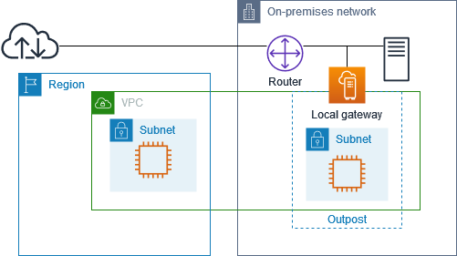
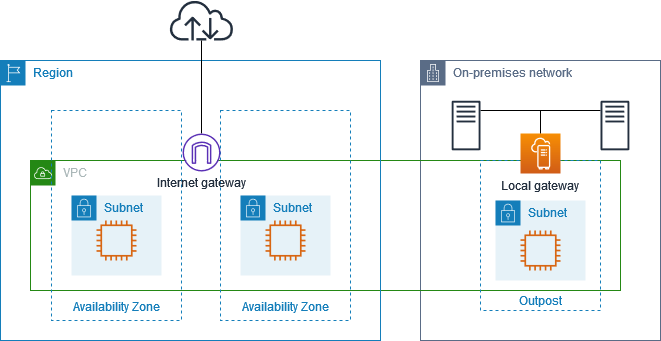

# Local gateway route tables

As part of the rack installation, AWS creates the local gateway, configures VIFs and a
VIF group. The local gateway is owned by the AWS account associated with the Outpost. You
create the local gateway route table. A local gateway route table must have an association to
VIF group and a VPC. You create and manage the association of the VIF group and the VPC. Only
the owner of the local gateway can modify the local gateway route table.

Outpost subnet route tables can include a route to local gateway VIF groups in order to
provide connectivity to your on-premises network.

Local gateway route tables have a mode that determines how instances in the Outposts
subnet communicate with your on-premises network. The default option is direct VPC routing,
which uses the private IP addresses of the instances. The other option is to use addresses
from a customer-owned IP address pool (CoIP) that you provide. Direct VPC routing and CoIP are
mutually exclusive options that control how routing works. To determine the best option for
your Outpost, see [How to choose between CoIP and Direct VPC routing modes on AWS Outposts rack](https://aws.amazon.com/blogs/compute/how-to-choose-between-coip-and-direct-vpc-routing-modes-on-aws-outposts-rack/ "https://aws.amazon.com/blogs/compute/how-to-choose-between-coip-and-direct-vpc-routing-modes-on-aws-outposts-rack/").

You can share the local gateway route table with other AWS accounts or organizational
units using AWS Resource Access Manager. For more information, see [Working with
shared AWS Outposts resources](sharing-outposts.md "sharing-outposts.md").

###### Contents

- [Direct VPC routing](#direct-vpc-routing "#direct-vpc-routing")
- [Customer-owned IP addresses](#ip-addressing "#ip-addressing")
- [Custom route tables](#working-with-route-tables "#working-with-route-tables")

## Direct VPC routing

Direct VPC routing uses the private IP address of the instances in your VPC to
facilitate communication with your on-premises network. These addresses are advertised to
your on-premises network with BGP. Advertisement to BGP is only for the private IP addresses
that belong to the subnets on your Outposts rack. This type of routing is the default mode for
Outposts. In this mode, the local gateway does not perform NAT for instances, and you do not
need to assign Elastic IP addresses to your EC2 instances. You have the option to use your
own address space instead of direct VPC routing mode. For more information, see [Customer-owned IP addresses](#ip-addressing "#ip-addressing").

Direct VPC routing mode does not support overlapping CIDR ranges.

Direct VPC routing is supported only for instance network interfaces. With network
interfaces that AWS creates on your behalf (known as requester-managed network
interfaces), their private IP addresses are not reachable from your on-premises network. For
example, VPC endpoints are not directly reachable from your on-premises network.

The following examples illustrate direct VPC routing.

###### Examples

- [Internet connectivity through
  the Region](#direct-vpc-routing-example-1 "#direct-vpc-routing-example-1")
- [Internet connectivity through
  the on-premises network](#direct-vpc-routing-example-2 "#direct-vpc-routing-example-2")

### Example: Internet connectivity through the

VPC

Instances in an Outpost subnet can access the internet through the internet gateway
attached to the VPC.

Consider the following configuration:

- The parent VPC spans two Availability Zones and has a subnet in each Availability
  Zone.
- The Outpost has one subnet.
- Each subnet has an EC2 instance.
- The local gateway uses BGP advertisement to advertise the private IP addresses of
  the Outpost subnet to the on-premises network.

###### Note

BGP advertisement is supported only for subnets on an Outpost that have a route
with the local gateway as the destination. Any other subnets are not advertised
through BGP.

In the following diagram, traffic from the instance in the Outpost subnet can use the
internet gateway for the VPC to access the internet.

To achieve internet connectivity through the parent Region, the route table for the
Outpost subnet must have the following routes.

| Destination                | Target                | Comments                                                                 |
| -------------------------- | --------------------- | ------------------------------------------------------------------------ | ---------------------------------------------------------------------------------------------------------------------------------------------------------------------------------------------------------------------------------------------------------------------------------------------------------------------------------------------------------------------------------------------------------------------------------------------------------------------------------------------------------------------------------------------------------------------------------------------------------------------------------------------------------------------------------------------------------------------------------------------------------------------------------------------------------------------------------------------------------------------------------------------------------------------------------------------------------------------------------------------------------------------------------------------------------------------------------------------------------------------------------------------------------------------------------------------------------------------------------------------------------------------------------------------------------------------------------------------------------------------------------------------------------------------------------------------------------------------------------------------------------------------------------------------------------------------------------------------------------------------------------------------------------------------------------------------------------------------------------------------------------------------------------------------------------------------------------------------------------------------------------------------------------------------------------------------------------------------------------------------------------------------------------------------------------------------------------------------------------------------------------------------------------------------------------------------------------------------------------------------------------------------------------------------------------------------------------------------------------------------------------------------------------------------------------------------------------------------------------------------------------------------------------------------------------------------------------------------------------------------------------------------------------------------------------------------------------------------------------------------------------------------------------------------------------------------------------------------------------------------------------------------------------------------------------------------------------------------------------------------------------------------------------------------------------------------------------------------------------------------------------------------------------------------------------------------------------------------------------------------------------------------------------------------------------------------------------------------------------------------------------------------------------------------------------------------------------------------------------------------------------------------------------------------------------------------------------------------------------------------------------------------------------------------------------------------------------------------------------------------------------------------------------------------------------------------------------------------------------------------------------------------------------------------------------------------------------------------- |
| `VPC CIDR`                 | Local                 | Provides connectivity between the subnets in the VPC.                    |
| 0.0.0.0                    | `internet-gateway-id` | Sends traffic destined for the internet to the internet gateway.         |
| `on-premises network CIDR` | `local-gateway-id`    | Sends traffic destined for the on-premises network to the local gateway. | ### Example: Internet connectivity through the on-premises network Instances in an Outpost subnet can access the internet through the on-premises network. Instances in the Outpost subnet do not need a public IP address or Elastic IP address. Consider the following configuration:  • The Outpost subnet has an EC2 instance.  • The router in the on-premises network performs network address translation (NAT).  • The local gateway uses BGP advertisement to advertise the private IP addresses of the Outpost subnet to the on-premises network. ###### Note BGP advertisement is supported only for subnets on an Outpost that have a route with the local gateway as the destination. Any other subnets are not advertised through BGP. In the following diagram, traffic from the instance in the Outpost subnet can use the local gateway to access the internet or the on-premises network. Traffic from the on-premises network uses the local gateway to access the instance in the Outpost subnet.  To achieve internet connectivity through the on-premises network, the route table for the Outpost subnet must have the following routes.                                                                                                                                                                                                                                                                                                                                                                                                                                                                                                                                                                                                                                                                                                                                                                                                                                                                                                                                                                                                                                                                                                                                                                                                                                                                                                                                                                                                                                                                                                                                                                                                                                                                                                                                                                                                                                                                                                                                                                                                                                                                                                                                                                                                                                                                                                                                                                                                                                                                                                                                                                                                                                                                                                                             |
| Destination                | Target                | Comments                                                                 |
| ---                        | ---                   | ---                                                                      |
| `VPC CIDR`                 | Local                 | Provides connectivity between the subnets in the VPC.                    |
| 0.0.0.0/0                  | `local-gateway-id`    | Sends traffic destined for the internet to the local gateway.            | ###### Outbound access to the internet Traffic initiated from the instance in the Outpost subnet with a destination of the internet uses the route for 0.0.0.0/0 to route traffic to the local gateway. The local gateway sends the traffic to the router. The router uses NAT to translate the private IP address to a public IP address on the router, and then sends the traffic to the destination. ###### Outbound access to the on-premises network Traffic initiated from the instance in the Outpost subnet with a destination of the on-premises network uses the route for 0.0.0.0/0 to route traffic to the local gateway. The local gateway sends the traffic to the destination in the on-premises network. ###### Inbound access from the on-premises network Traffic from the on-premises network with a destination of the instance in the Outpost subnet uses the private IP address of the instance. When the traffic reaches the local gateway, the local gateway sends the traffic to the destination in the VPC. ## Customer-owned IP addresses By default, the local gateway uses the private IP addresses of instances in your VPC to facilitate communication with your on-premises network. However, you can provide an address range, known as a _customer-owned IP address pool_ (CoIP), which supports overlapping CIDR ranges and other network topologies. If you choose CoIP, you must create an address pool, assign it to the local gateway route table, and advertise these addresses back to your customer network through BGP. Any customer-owned IP Addresses associated with your local gateway route table show in the route table as propagated routes. Customer-owned IP addresses provide local or external connectivity to resources in your on-premises network. You can assign these IP addresses to resources on your Outpost, such as EC2 instances, by allocating a new Elastic IP address from the customer-owned IP pool, and then assigning it to your resource. For more information, see [CoIP pools](coip-pools.md "coip-pools.md"). ###### Note For a customer-owned IP address pool, you must be able to route the address in your network. When you allocate an Elastic IP address from your customer-owned IP address pool, you continue to own the IP addresses in your customer-owned IP address pool. You are responsible for advertising them as needed on your internal networks or WAN. You can optionally share your customer-owned pool with multiple AWS accounts in your organization using AWS Resource Access Manager. After you share the pool, participants can allocate an Elastic IP address from the customer owned IP address pool, and then assign it to an EC2 instance on the Outpost. For more information, see [Share your AWS Outposts resources](sharing-outposts.md "sharing-outposts.md"). ###### Examples  • [Internet connectivity through Region](#coip-routing-example-1 "#coip-routing-example-1")  • [Internet connectivity through the on-premises network](#coip-routing-example-2 "#coip-routing-example-2") ### Example: Internet connectivity through the VPC Instances in an Outpost subnet can access the internet through the internet gateway attached to the VPC. Consider the following configuration:  • The parent VPC spans two Availability Zones and has a subnet in each Availability Zone.  • The Outpost has one subnet.  • Each subnet has an EC2 instance.  • There is a customer-owned IP address pool.  • The instance in the Outpost subnet has an Elastic IP address from the customer-owned IP address pool.  • The local gateway uses BGP advertisement to advertise the customer-owned IP address pool to the on-premises network.  To achieve internet connectivity through the Region, the route table for the Outpost subnet must have the following routes. |
| Destination                | Target                | Comments                                                                 |
| ---                        | ---                   | ---                                                                      |
| `VPC CIDR`                 | Local                 | Provides connectivity between the subnets in the VPC.                    |
| 0.0.0.0                    | `internet-gateway-id` | Sends traffic destined for the public internet to the internet gateway.  |
| `On-premises network CIDR` | `local-gateway-id`    | Sends traffic destined for the on-premises network to the local gateway. | ### Example: Internet connectivity through the on-premises network Instances in an Outpost subnet can access the internet through the on-premises network. Consider the following configuration:  • The Outpost subnet has an EC2 instance.  • There is a customer-owned IP address pool.  • The local gateway uses BGP advertisement to advertise the customer-owned IP address pool to the on-premises network.  • An Elastic IP address association that maps 10.0.3.112 to 10.1.0.2.  • The router in the customer on-premises network performs NAT.  To achieve internet connectivity through the local gateway, the route table for the Outpost subnet must have the following routes.                                                                                                                                                                                                                                                                                                                                                                                                                                                                                                                                                                                                                                                                                                                                                                                                                                                                                                                                                                                                                                                                                                                                                                                                                                                                                                                                                                                                                                                                                                                                                                                                                                                                                                                                                                                                                                                                                                                                                                                                                                                                                                                                                                                                                                                                                                                                                                                                                                                                                                                                                                                                                                                                                                                                                                                                                                                                                                                                                                                                                                                                                                                                                                                          |
| Destination                | Target                | Comments                                                                 |
| ---                        | ---                   | ---                                                                      |
| `VPC CIDR`                 | Local                 | Provides connectivity between the subnets in the VPC.                    |
| 0.0.0.0/0                  | `local-gateway-id`    | Sends traffic destined for the internet to the local gateway.            | ###### Outbound access to the internet Traffic initiated from the EC2 instance in the Outpost subnet with a destination of the internet uses the route for 0.0.0.0/0 to route traffic to the local gateway. The local gateway maps the private IP address of the instance to the customer-owned IP address, and then sends the traffic to the router. The router uses NAT to translate the customer-owned IP address to a public IP address on the router, and then sends the traffic to the destination. ###### Outbound access to the on-premises network Traffic initiated from the EC2 instance in the Outpost subnet with a destination of the on-premises network uses the route for 0.0.0.0/0 to route traffic to the local gateway. The local gateway translates the IP address of the EC2 instance to the customer-owned IP address (Elastic IP address), and then sends the traffic to the destination. ###### Inbound access from the on-premises network Traffic from the on-premises network with a destination of the instance in the Outpost subnet uses the customer-owned IP address (Elastic IP address) of the instance. When the traffic reaches the local gateway, the local gateway maps the customer-owned IP address (Elastic IP address) to the instance IP address, and then sends the traffic to the destination in the VPC. In addition, the local gateway route table evaluates any routes that target elastic network interfaces. If the destination address matches any static route's destination CIDR, traffic is sent to that elastic network interface. When traffic follows a static route to an elastic network interface, the destination address is preserved and is not translated to the private IP address of the network interface. ## Custom route tables You can create a custom route table for your local gateway. The local gateway route table must have an association to a VIF group and a VPC. For step-by-step directions, see [Configure local gateway connectivity](launch-instance.md#configure-lgw-connectivity "launch-instance.md#configure-lgw-connectivity").                                                                                                                                                                                                                                                                                                                                                                                                                                                                                                                                                                                                                                                                                                                                                                                                                                                                                                                                                                                                                                                                                                                                                                                                                                                                                                                                                                                                                                                                                                                                                                                                                                                                                                                                                                                                                                             |
