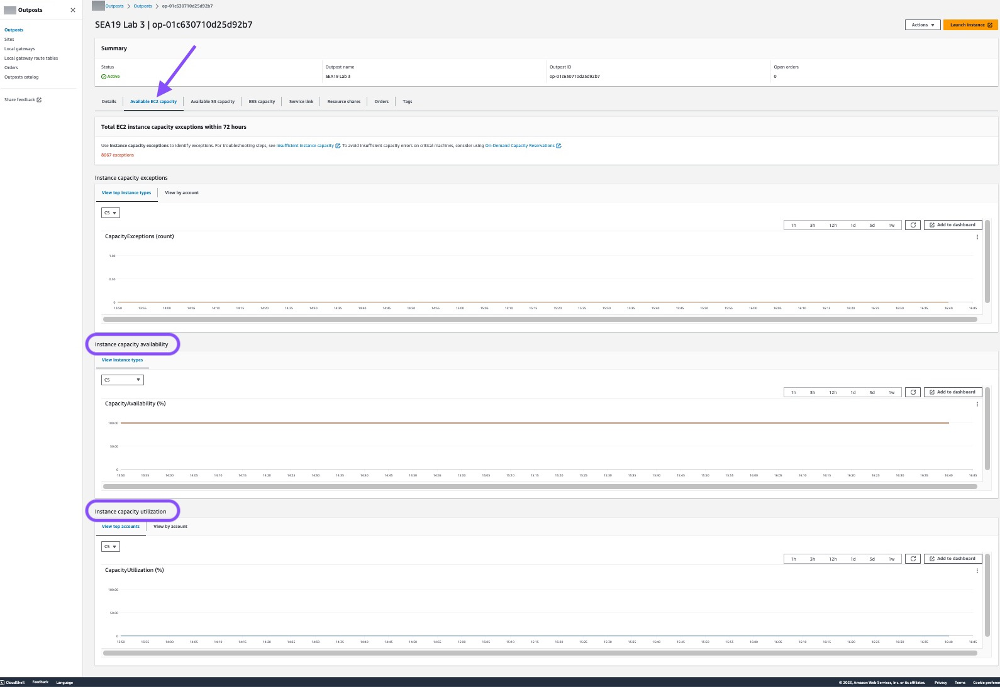
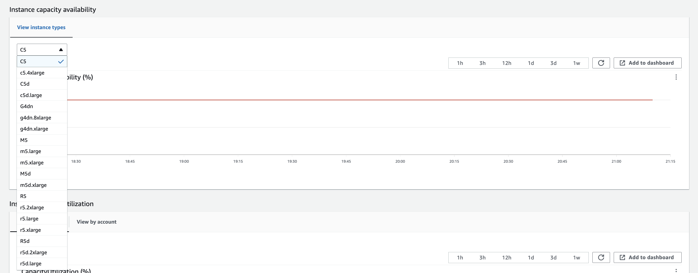

# Outposts rack end-of-term options

At the end of your AWS Outposts term, you must choose between the following options:

- [Renew your subscription](#renew-subscription "#renew-subscription") and keep your existing
  Outposts racks.
- [Prepare your Outposts racks for return](#end-subscription "#end-subscription").
- [Convert to a month-to-month subscription](#convert-subscription "#convert-subscription") and
  keep your existing Outposts racks.

## Renew your subscription

You must complete the following steps at least **5 business
days** before the current subscription for your Outposts racks ends. Failing to complete these
steps at least 5 business days before the current subscription ends might result in unanticipated
charges.

###### To renew your subscription and keep your existing Outposts racks:

1. Open the AWS Outposts console at [https://console.aws.amazon.com/outposts/](https://console.aws.amazon.com/outposts/home "https://console.aws.amazon.com/outposts/home").
2. In the navigation pane, choose **Outposts**.
3. Choose **Actions**.
4. Choose **Renew Outpost**.
5. Choose the subscription term length and payment option.

For pricing, see [AWS Outposts rack
pricing](https://aws.amazon.com/outposts/rack/pricing/ "https://aws.amazon.com/outposts/rack/pricing/"). You can also request a price quote. 6. Choose **Submit support ticket**.

###### Note

If renewing before the current subscription for your Outposts racks ends, you will be
charged immediately for any upfront fees.

Your new subscription will start the day after your current subscription ends.

If you do not indicate that you want to renew your subscription or return your Outposts rack, you
will be converted to a month-to-month subscription automatically. Your Outposts rack will be renewed on
a monthly basis at the rate of the **No Upfront** payment option
that corresponds to your AWS Outposts configuration. Your new monthly subscription will start the day
after your current subscription ends.

## Return AWS Outposts racks

You must prepare your AWS Outposts rack for return and complete the decommission process at least
**5 business days** before the current subscription for your Outposts rack
ends. AWS can't start the return process until you do so. Failing to complete these steps at
least 5 business days before the current subscription ends might result in delays in
decommissioning and unanticipated charges.

You will not be charged a shipping fee when you return an Outposts rack. However, if you
return a rack that is damaged, you might incur a cost.

###### To prepare your AWS Outposts rack for return:

###### Important

Do not power down the Outposts rack until AWS is on-site for the scheduled retrieval.

1. If the Outpost's resources are shared, you must unshare these resources.

You can unshare a shared Outpost resource in one of the following ways:

    * Use the AWS RAM console. For more information, see [Updating a resource
     share](../../../ram/latest/userguide/working-with-sharing-update.md "../../../ram/latest/userguide/working-with-sharing-update.md") in the *AWS RAM User Guide*.
    * Use the AWS CLI to run the [disassociate-resource-share](https://awscli.amazonaws.com/v2/documentation/api/latest/reference/ram/disassociate-resource-share.html "https://awscli.amazonaws.com/v2/documentation/api/latest/reference/ram/disassociate-resource-share.html") command.

For the list of Outpost resources that can be shared, see [Shareable Outpost resources](sharing-outposts.md#sharing-resources "sharing-outposts.md#sharing-resources"). 2. Terminate the active instances associated with subnets on your Outpost. To terminate the
instances, follow the instructions in [Terminate your instance](../../../AWSEC2/latest/UserGuide/terminating-instances.md "../../../AWSEC2/latest/UserGuide/terminating-instances.md") in
the _Amazon EC2 User Guide_.

###### Note

Some AWS-managed services running on your Outpost, such as Application Load Balancers
or Amazon Relational Database Service (RDS), consume EC2 capacity. However, their associated instances aren't visible
on the Amazon EC2 dashboard. You must terminate the resources tied to these services to free up
capacity. For more information, see [Why is some EC2
instance capacity missing on my Outpost?](https://repost.aws/knowledge-center/ec2-missing-capacity-on-outpost "https://repost.aws/knowledge-center/ec2-missing-capacity-on-outpost"). 3. Verify the instance-capacity-availability of your Amazon EC2 instances in your AWS
account.

    1. Open the AWS Outposts console at [https://console.aws.amazon.com/outposts/](https://console.aws.amazon.com/outposts/home "https://console.aws.amazon.com/outposts/home").
    2. Choose **Outposts**.
    3. Choose the specific Outpost you are returning.
    4. On the page for the Outpost, choose the **Available EC2 capacity**
     tab.
    5. Ensure that the **Instance capacity availability** is at 100% for each
     instance family.
    6. Ensure that the **Instance capacity utilization** is at 0% for each
     instance family.

    The following image shows the **Instance capacity availability** and
     **Instance capacity utilization** graphs on the **Available EC2
     capacity** tab.

    

    The following image shows the list of instance types.

    

[Show moreShow less](# "#") 4. Create backups of your Amazon EC2 instances and server volumes. To create the backups, follow
the instructions in [Backup and
recovery for Amazon EC2 with EBS volumes](../../../prescriptive-guidance/latest/backup-recovery/backup-recovery-ec2-ebs.md "../../../prescriptive-guidance/latest/backup-recovery/backup-recovery-ec2-ebs.md") in the _AWS Prescriptive
Guidance_ guide. 5. Delete the Amazon EBS volumes associated with your Outpost.

    1. Open the Amazon EC2 console console at [https://console.aws.amazon.com/ec2/](https://console.aws.amazon.com/ec2/ "https://console.aws.amazon.com/ec2/").
    2. From the navigation pane, choose **Volumes**.
    3. Choose **Actions** and **Delete volume**.
    4. In the confirmation dialog box, choose **Delete**.

[Show moreShow less](# "#") 6. If you have Amazon S3 on Outposts, delete any local snapshots on the Outposts.

    1. Open the Amazon EC2 console console at [https://console.aws.amazon.com/ec2/](https://console.aws.amazon.com/ec2/ "https://console.aws.amazon.com/ec2/").
    2. From the navigation pane, choose **Snapshots**.
    3. Select the snapshots with an Outpost ARN.
    4. Choose **Actions** and **Delete snapshots**.
    5. In the confirmation dialog box, choose **Delete**.

[Show moreShow less](# "#") 7. Delete any Amazon S3 buckets associated with your Outposts rack. To delete the buckets, follow the
instructions in [Deleting your Amazon S3 on Outposts
bucket](../../../AmazonS3/latest/s3-outposts/S3OutpostsDeleteBucket.md "../../../AmazonS3/latest/s3-outposts/S3OutpostsDeleteBucket.md") in the _Amazon S3 on Outposts User Guide_.

[Show moreShow less](# "#") 8. Delete any VPC associations and customer-owned IP address pool (CoIP) CIDRs associated
with your Outpost.

An AWS retrieval team will power down the rack. After it's powered down, you can destroy
the AWS Nitro Security Key or the AWS retrieval team can do so on your behalf.

###### To return your AWS Outposts racks

###### Important

AWS can't stop the return process after you have submitted your decommission
request.

1. Open the AWS Outposts console at [https://console.aws.amazon.com/outposts/](https://console.aws.amazon.com/outposts/home "https://console.aws.amazon.com/outposts/home").
2. In the navigation pane, choose **Outposts**.
3. Choose **Actions**.
4. Choose **Decommission Outpost** and follow the workflow to delete resources.
5. Choose **Submit request**.

An AWS representative will contact you to begin the decommissioning process.

###### Note

Returning your racks before the current subscription for your Outposts racks ends will not
terminate any outstanding charges associated with this Outpost.

An AWS retrieval team will power down the rack. After it's powered down, you can destroy
the AWS Nitro Security Key or the AWS retrieval team can do so on your behalf.

## Convert to a month-to-month subscription

To convert to a month-to-month subscription and keep your existing Outposts racks, no action is
needed. If you have questions, open a billing support case.

Your Outposts racks will be renewed on a monthly basis at the rate of the **No
Upfront** payment option that corresponds to your Outposts configuration. Your new
monthly subscription starts the day after your current subscription ends.
