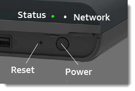

End of support notice: On May 31, 2026, AWS will end support for
AWS Panorama. After May 31, 2026, you will no longer be able to access the AWS Panorama console or AWS Panorama
resources. For more information, see [AWS Panorama end of support](panorama-end-of-support.md "panorama-end-of-support.md").

# AWS Panorama Appliance buttons and lights

The AWS Panorama Appliance has two LED lights above the power button that indicate the device status and network
connectivity.

## Status light

The LEDs change color and blink to indicate status. A slow blink is once every three seconds. A fast blink is
once per second.

###### Status LED states

- **Fast blinking green** – The appliance is booting up.
- **Solid green** – The appliance is operating normally.
- **Slow blinking blue** – The appliance is copying configuration files
  and attempting to register with AWS IoT.
- **Fast blinking blue** – The appliance is [copying a log image](monitoring-logging.md#monitoring-logging-egress "monitoring-logging.md#monitoring-logging-egress") to a USB drive.
- **Fast blinking red** – The appliance encountered an error during
  startup or is overheated.
- **Slow blinking orange** – The appliance is restoring the latest
  software version.
- **Fast blinking orange** – The appliance is restoring the minimum
  software version.

## Network light

The network LED has the following states:

###### Network LED states

- **Solid green** – An Ethernet cable is connected.
- **Blinking green** – The appliance is communicating over the
  network.
- **Solid red** – An Ethernet cable is not connected.

## Power and reset buttons

The power and reset buttons are on the front of the device underneath a protective cover. The reset button is
smaller and recessed. Use a small screwdriver or paperclip to press it.

###### To reset an appliance

1. The appliance must be plugged in and powered off. To power off the appliance, hold the power button for 1
   second and wait for the shutdown sequence to complete. The shutdown sequence takes about 10 seconds.
2. To reset the appliance, use the following button combinations. A short press is 1 second. A long press is
   5 seconds. For operations that require multiple buttons, press and hold both buttons simultaneously.
   - **Full reset** – Long press power and reset.

   Restores the minimum software version and deletes all configuration files and applications.
   - **Restore latest software version** – Short press reset.

   Reapplies the latest software update to the appliance.
   - **Restore minimum software version** – Long press reset.

   Reapplies the latest required software update to the appliance.

3. Release both buttons. The appliance powers on and the status light blinks orange for several
   minutes.
4. When the appliance is ready, the status light blinks green.

Resetting an appliance does not delete it from the AWS Panorama service. For more information, see [Deregister an appliance](appliance-manage.md#appliance-manage-delete "appliance-manage.md#appliance-manage-delete").
