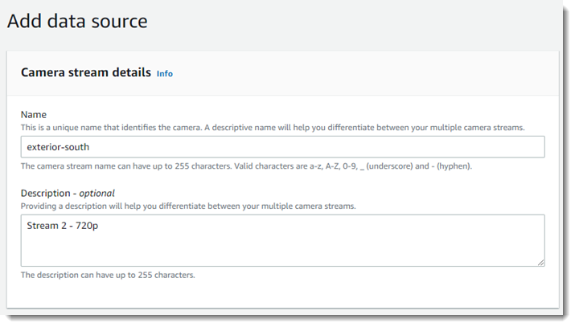

End of support notice: On May 31, 2026, AWS will end support for
AWS Panorama. After May 31, 2026, you will no longer be able to access the AWS Panorama console or AWS Panorama
resources. For more information, see [AWS Panorama end of support](panorama-end-of-support.md "panorama-end-of-support.md").

# Managing camera streams in AWS Panorama

To register video streams as data sources for your application, use the AWS Panorama console. An application can
process multiple streams simultaneously and multiple appliances can connect to the same stream.

###### Important

An application can connect to any camera stream that is routable from the local network it connects to. To
secure your video streams, configure your network to allow only RTSP traffic locally. For more information, see
[Security in AWS Panorama](panorama-security.md "panorama-security.md").

###### To register a camera stream

1. Open the AWS Panorama console [Data sources page](https://console.aws.amazon.com/panorama/home#data-sources "https://console.aws.amazon.com/panorama/home#data-sources").
2. Choose **Add data source**.

 3. Configure the following settings.

######

    * **Name** – A name for the camera stream.
    * **Description** – A short description of the camera, its location,
     or other details.
    * **RTSP URL** – A URL that specifies the camera's IP address and
     the path to the stream. For example, `rtsp://192.168.0.77/live/mpeg4/`
    * **Credentials** – If the camera stream is password protected,
     specify the username and password.

4. Choose **Save**.
   To register a camera stream with the AWS Panorama API, see [Automate device registration](api-provision.md "api-provision.md").

For a list of cameras that are compatible with the AWS Panorama Appliance, see [Supported computer vision models and cameras](gettingstarted-compatibility.md "gettingstarted-compatibility.md").

## Removing a stream

You can delete a camera stream in the AWS Panorama console.

###### To remove a camera stream

1. Open the AWS Panorama console [Data sources page](https://console.aws.amazon.com/panorama/home#data-sources "https://console.aws.amazon.com/panorama/home#data-sources").
2. Choose a camera stream.
3. Choose **Delete data source**.

Removing a camera stream from the service does not stop running applications or delete camera credentials from
Secrets Manager. To delete secrets, use the [Secrets Manager
console](https://console.aws.amazon.com/secretsmanager/home#!/listSecrets "https://console.aws.amazon.com/secretsmanager/home#!/listSecrets").
