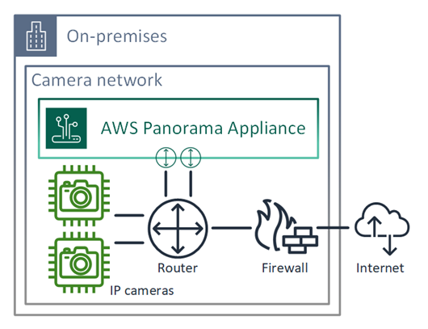
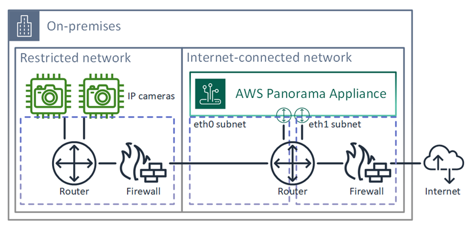

End of support notice: On May 31, 2026, AWS will end support for
AWS Panorama. After May 31, 2026, you will no longer be able to access the AWS Panorama console or AWS Panorama
resources. For more information, see [AWS Panorama end of support](panorama-end-of-support.md "panorama-end-of-support.md").

# Connecting the AWS Panorama Appliance to your network

The AWS Panorama Appliance requires connectivity to both the AWS cloud and your on-premises network of IP cameras. You
can connect the appliance to a single firewall that grants access to both, or connect each of the device's two
network interfaces to a different subnet. In either case, you must secure the appliance's network connections to
prevent unauthorized access to your camera streams.

###### Sections

- [Single network configuration](#appliance-network-single "#appliance-network-single")
- [Dual network configuration](#appliance-network-dual "#appliance-network-dual")
- [Configuring service access](#security-infrastructure-internet "#security-infrastructure-internet")
- [Configuring local network access](#security-infrastructure-local "#security-infrastructure-local")
- [Private connectivity](#appliance-network-vpn "#appliance-network-vpn")

## Single network configuration

The appliance has two Ethernet ports. If you route all traffic to and from the device through a single router,
you can use the second port for redundancy in case the physical connection to the first port is broken. Configure
your router to allow the appliance to connect only to camera streams and the internet, and to block camera streams
from otherwise leaving your internal network.

For details on the ports and endpoints that the appliance needs access to, see [Configuring service access](#security-infrastructure-internet "#security-infrastructure-internet") and [Configuring local network access](#security-infrastructure-local "#security-infrastructure-local").

## Dual network configuration

For an extra layer of security, you can place the appliance in an internet-connected network separate from
your camera network. A firewall between your restricted camera network and the appliance's network only allows the
appliance to access video streams. If your camera network was previously air-gapped for security purposes, you
might prefer this method over connecting the camera network to a router that also grants access to the
internet.

The following example shows the appliance connecting to a different subnet on each port. The router places the
`eth0` interface on a subnet that routes to the camera network, and `eth1` on a subnet
that routes to the internet.

You can confirm the IP address and MAC address of each port in the AWS Panorama console.

## Configuring service access

During [provisioning](gettingstarted-setup.md "gettingstarted-setup.md"), you can configure the appliance to request a
specific IP address. Choose an IP address ahead of time to simplify firewall configuration and ensure that the
appliance's address doesn't change if it's offline for a long period of time.

The appliance uses AWS services to coordinate software updates and deployments. Configure your firewall to
allow the appliance to connect to these endpoints.

###### Internet access

- **AWS IoT (HTTPS and MQTT, ports 443, 8443 and 8883)** – AWS IoT Core
  and device management endpoints. For details, see [AWS IoT
  Device Management endpoints and quotas](../../../general/latest/gr/iot_device_management.md "../../../general/latest/gr/iot_device_management.md") in the Amazon Web Services General Reference.
- **AWS IoT credentials (HTTPS, port 443)** –
  `credentials.iot.<region>.amazonaws.com` and subdomains.
- **Amazon Elastic Container Registry (HTTPS, port 443)** –
  `api.ecr.<region>.amazonaws.com`, `dkr.ecr.<region>.amazonaws.com` and
  subdomains.
- **Amazon CloudWatch (HTTPS, port 443)** –
  `monitoring.<region>.amazonaws.com`.
- **Amazon CloudWatch Logs (HTTPS, port 443)** –
  `logs.<region>.amazonaws.com`.
- **Amazon Simple Storage Service (HTTPS, port 443)** –
  `s3.<region>.amazonaws.com`, `s3-accesspoint.<region>.amazonaws.com` and
  subdomains.

If your application calls other AWS services, the appliance needs access to the endpoints for those services
as well. For more information, see [Service endpoints and
quotas](../../../general/latest/gr/aws-service-information.md "../../../general/latest/gr/aws-service-information.md").

## Configuring local network access

The appliance needs access to RTSP video streams locally, but not over the internet. Configure your firewall
to allow the appliance to access RTSP streams on port 554 internally, and to not allow streams to go out to or
come in from the internet.

###### Local access

- **Real-time streaming protocol (RTSP, port 554)** – To read camera
  streams.
- **Network time protocol (NTP, port 123)** – To keep the appliance's
  clock in sync. If you don't run an NTP server on your network, the appliance can also connect to public NTP
  servers over the internet.

## Private connectivity

The AWS Panorama Appliance does not need internet access if you deploy it in a private VPC subnet with a VPN connection
to AWS. You can use Site-to-Site VPN or Direct Connect to create a VPN connection between an on-premises router and AWS. Within
your private VPC subnet, you create endpoints that let the appliance connect to Amazon Simple Storage Service, AWS IoT, and other
services. For more information, see [Connecting an appliance to a private subnet](api-endpoints.md#services-vpc-appliance "api-endpoints.md#services-vpc-appliance").
