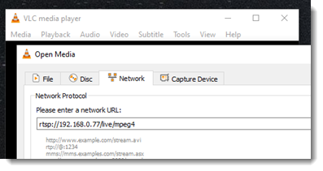
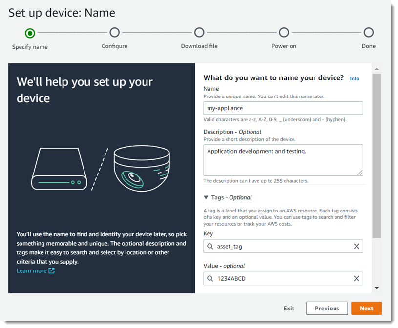
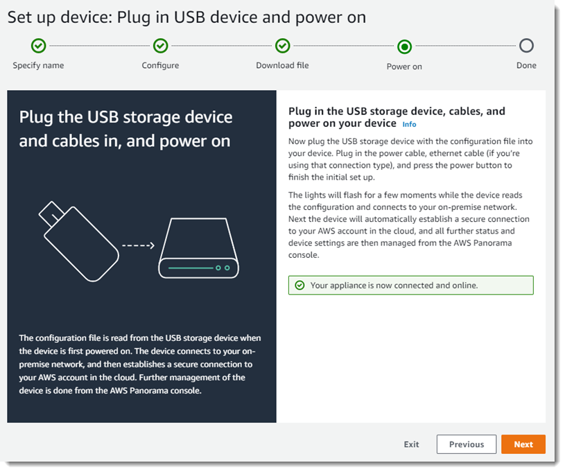
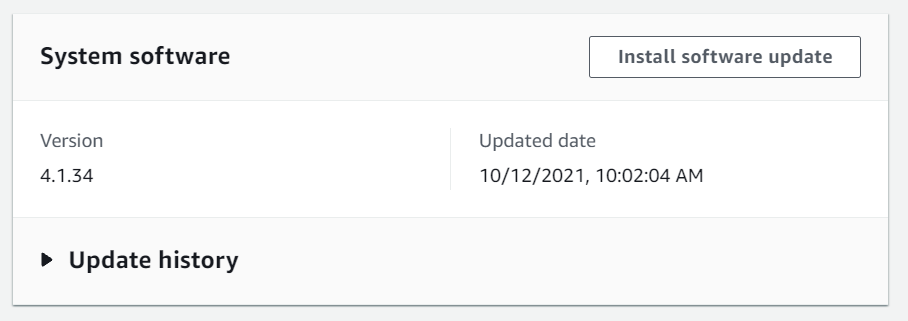

End of support notice: On May 31, 2026, AWS will end support for
AWS Panorama. After May 31, 2026, you will no longer be able to access the AWS Panorama console or AWS Panorama
resources. For more information, see [AWS Panorama end of support](panorama-end-of-support.md "panorama-end-of-support.md").

# Setting up the AWS Panorama Appliance

To get started using your AWS Panorama Appliance or [compatible
device](gettingstarted-concepts.md#gettingstarted-concepts-devices "gettingstarted-concepts.md#gettingstarted-concepts-devices"), register it in the AWS Panorama console and update its software. During the setup process, you create
an appliance _resource_ in AWS Panorama that represents the physical appliance, and copy files to the
appliance with a USB drive. The appliance uses these certificates and configuration files to connect to the AWS Panorama
service. Then you use the AWS Panorama console to update the appliance's software and register cameras.

###### Sections

- [Prerequisites](#gettingstarted-prerequisites "#gettingstarted-prerequisites")
- [Register and configure the AWS Panorama Appliance](#gettingstarted-device "#gettingstarted-device")
- [Upgrade the appliance software](#gettingstarted-upgrade "#gettingstarted-upgrade")
- [Add a camera stream](#gettingstarted-setup-camera "#gettingstarted-setup-camera")
- [Next steps](#gettingstarted-setup-nextsteps "#gettingstarted-setup-nextsteps")

## Prerequisites

To follow this tutorial, you need an AWS Panorama Appliance or compatible device and the following hardware:

######

- **Display** – A display with HDMI input for viewing the sample
  application output.
- **USB drive** (included with AWS Panorama Appliance) – A FAT32-formatted USB 3.0
  flash memory drive with at least 1 GB of storage, for transferring an archive with configuration files and a
  certificate to the AWS Panorama Appliance.
- **Camera** – An IP camera that outputs an RTSP video stream.

Use the tools and instructions provided by your camera's manufacturer to identify the camera's IP address and
stream path. You can use a video player such as [VLC](https://www.videolan.org/ "https://www.videolan.org/") to verify the
stream URL, by opening it as a network media source:

The AWS Panorama console uses other AWS services to assemble application components, manage permissions, and verify
settings. To register an appliance and deploy the sample application, you need the following permissions:

######

- [AWSPanoramaFullAccess](https://console.aws.amazon.com/iam/home#/policies/arn:aws:iam::aws:policy/AWSPanoramaFullAccess "https://console.aws.amazon.com/iam/home#/policies/arn:aws:iam::aws:policy/AWSPanoramaFullAccess") –
  Provides full access to AWS Panorama, AWS Panorama access points in Amazon S3, appliance credentials in AWS Secrets Manager,
  and appliance logs in Amazon CloudWatch. Includes permission to create a [service-linked role](permissions-services.md "permissions-services.md") for AWS Panorama.
- **AWS Identity and Access Management (IAM)** – On first run, to create roles used by the
  AWS Panorama service and the AWS Panorama Appliance.

If you don't have permission to create roles in IAM, have an administrator open [the AWS Panorama console](https://console.aws.amazon.com/panorama/home "https://console.aws.amazon.com/panorama/home") and accept the prompt to create service
roles.

## Register and configure the AWS Panorama Appliance

The AWS Panorama Appliance is a hardware device that connects to network-enabled cameras over a local network connection. It uses a
Linux-based operating system that includes the AWS Panorama Application SDK and supporting software for running computer vision applications.

To connect to AWS for appliance management and application deployment, the appliance uses a device
certificate. You use the AWS Panorama console to generate a provisioning certificate. The appliance uses this temporary
certificate to complete initial setup and download a permanent device certificate.

###### Important

The provisioning certificate that you generate in this procedure is only valid for 5 minutes. If you do not
complete the registration process within this time frame, you must start over.

###### To register a appliance

1. Connect the USB drive to your computer. Prepare the appliance by connecting the network and power cables.
   The appliance powers on and waits for a USB drive to be connected.
2. Open the AWS Panorama console [Getting started page](https://console.aws.amazon.com/panorama/home#getting-started "https://console.aws.amazon.com/panorama/home#getting-started").
3. Choose **Add device**.
4. Choose **Begin setup**.
5. Enter a name and description for the device resource that represents the appliance in AWS Panorama. Choose
   **Next**

 6. If you need to manually assign an IP address, NTP server, or DNS settings, choose **Advanced
network settings**. Otherwise, choose **Next**. 7. Choose **Download archive**. Choose **Next**. 8. Copy the configuration archive to the root directory of the USB drive. 9. Connect the USB drive to the USB 3.0 port on the front of the appliance, next to the HDMI port.

When you connect the USB drive, the appliance copies the configuration archive and network configuration
file to itself and connects to the AWS Cloud. The appliance's status light turns from green to blue while it
completes the connection, and then back to green. 10. To continue, choose **Next**.

 11. Choose **Done**.

## Upgrade the appliance software

The AWS Panorama Appliance has several software components, including a Linux operating system, the [AWS Panorama application SDK](applications-panoramasdk.md "applications-panoramasdk.md"), and supporting computer vision libraries and
frameworks. To ensure that you can use the latest features and applications with your appliance, upgrade its
software after setup and whenever an update is available.

###### To update the appliance software

1. Open the AWS Panorama console [Devices page](https://console.aws.amazon.com/panorama/home#devices "https://console.aws.amazon.com/panorama/home#devices").
2. Choose an appliance.
3. Choose **Settings**
4. Under **System software**, choose **Install software update**.

 5. Choose a new version and then choose **Install**.

###### Important

Before you continue, remove the USB drive from the appliance and format it to delete its contents. The
configuration archive contains sensitive data and is not deleted automatically.

The upgrade process can take 30 minutes or more. You can monitor its progress in the AWS Panorama console or on a
connected monitor. When the process completes, the appliance reboots.

## Add a camera stream

Next, register a camera stream with the AWS Panorama console.

###### To register a camera stream

1. Open the AWS Panorama console [Data sources page](https://console.aws.amazon.com/panorama/home#data-sources "https://console.aws.amazon.com/panorama/home#data-sources").
2. Choose **Add data source**.

 3. Configure the following settings.

######

    * **Name** – A name for the camera stream.
    * **Description** – A short description of the camera, its location,
     or other details.
    * **RTSP URL** – A URL that specifies the camera's IP address and
     the path to the stream. For example, `rtsp://192.168.0.77/live/mpeg4/`
    * **Credentials** – If the camera stream is password protected,
     specify the username and password.

4. Choose **Save**.

AWS Panorama stores your camera's credentials securely in AWS Secrets Manager. Multiple applications can process the same
camera stream simultaneously.

## Next steps

If you encountered errors during setup, see [Troubleshooting](panorama-troubleshooting.md "panorama-troubleshooting.md").

To deploy a sample application, continue to [the next
topic](gettingstarted-deploy.md "gettingstarted-deploy.md").
