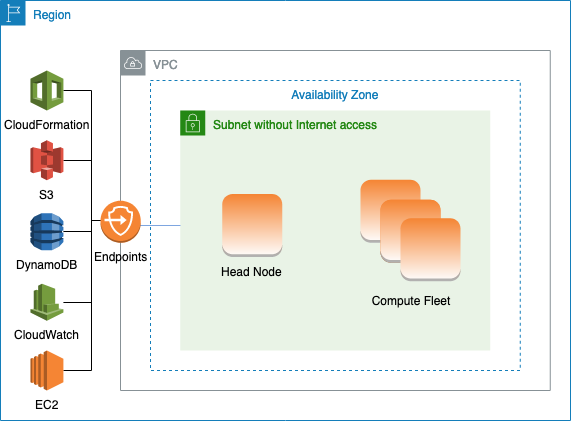

# AWS ParallelCluster in a single subnet with no internet

access

A subnet without internet access doesn't allow inbound or outbound connections to the
internet. This AWS ParallelCluster configuration can help customers concerned with security further
enhance the security of their AWS ParallelCluster resources. AWS ParallelCluster nodes are built
from AWS ParallelCluster AMIs that include all of the software that's required to run a cluster
with no internet access. This way, AWS ParallelCluster can create and manage clusters with nodes
that don't have internet access.

In this section, you learn about how to configure the cluster. You also learn about
limitations in running clusters without internet access.


**Configuring VPC endpoints**

To ensure the proper functioning of the cluster, the cluster nodes must be able to interact with a number of AWS Services.

Create and configure the following [VPC endpoints](../../../vpc/latest/privatelink/vpc-endpoints.md "../../../vpc/latest/privatelink/vpc-endpoints.md") so that
cluster nodes can interact with the AWS Services, without internet access:

Commercial and AWS GovCloud (US) partitions

| Service                           | Service name                                   | Type      |
| --------------------------------- | ---------------------------------------------- | --------- |
| Amazon CloudWatch                 | com.amazonaws.`region-id`.logs                 | Interface |
| CloudFormation                    | com.amazonaws.`region-id`.cloudformation       | Interface |
| Amazon EC2                        | com.amazonaws.`region-id`.ec2                  | Interface |
| Amazon S3                         | com.amazonaws.`region-id`.s3                   | Gateway   |
| Amazon DynamoDB                   | com.amazonaws.`region-id`.dynamodb             | Gateway   |
| AWS Secrets Manager\*\*           | com.amazonaws.`region-id`.secretsmanager       | Interface |
| AWS Elastic Load Balancing\*\*\*  | com.amazonaws.`region-id`.elasticloadbalancing | Interface |
| AWS Amazon EC2 Auto Scaling\*\*\* | com.amazonaws.`region-id`.autoscaling          | Interface |

China partition

| Service                           | Service name                                   | Type      |
| --------------------------------- | ---------------------------------------------- | --------- |
| Amazon CloudWatch                 | com.amazonaws.`region-id`.logs                 | Interface |
| CloudFormation                    | cn.com.amazonaws.`region-id`.cloudformation    | Interface |
| Amazon EC2                        | cn.com.amazonaws.`region-id`.ec2               | Interface |
| Amazon S3                         | com.amazonaws.`region-id`.s3                   | Gateway   |
| Amazon DynamoDB                   | com.amazonaws.`region-id`.dynamodb             | Gateway   |
| AWS Secrets Manager\*\*           | com.amazonaws.`region-id`.secretsmanager       | Interface |
| AWS Elastic Load Balancing\*\*\*  | com.amazonaws.`region-id`.elasticloadbalancing | Interface |
| AWS Amazon EC2 Auto Scaling\*\*\* | cn.com.amazonaws.`region-id`.autoscaling       | Interface |

\*\* This endpoint is only required when [DirectoryService](DirectoryService-v3.md#DirectoryService-v3.properties "DirectoryService-v3.md#DirectoryService-v3.properties") is enabled, otherwise it is optional.

\*\*\* These endpoints are only required when [LoginNodes](LoginNodes-v3.md "LoginNodes-v3.md")
is enabled, otherwise they are optional.

All instances in the VPC must have proper security groups to communicate with the endpoints. You can do this by adding security groups to
[AdditionalSecurityGroups](HeadNode-v3.md#yaml-HeadNode-Networking-AdditionalSecurityGroups "HeadNode-v3.md#yaml-HeadNode-Networking-AdditionalSecurityGroups") under the [HeadNode](HeadNode-v3.md "HeadNode-v3.md") and [AdditionalSecurityGroups](Scheduling-v3.md#yaml-Scheduling-SlurmQueues-Networking-AdditionalSecurityGroups "Scheduling-v3.md#yaml-Scheduling-SlurmQueues-Networking-AdditionalSecurityGroups") under the [SlurmQueues](Scheduling-v3.md#Scheduling-v3-SlurmQueues "Scheduling-v3.md#Scheduling-v3-SlurmQueues") configurations.
For example, if the VPC endpoints are created without explicitly specifying a security group, the default security group is associated with
the endpoints. By adding the default security group to `AdditionalSecurityGroups`, you enable the communication between the cluster
and the endpoints.

###### Note

When you use IAM policies to restrict access to VPC endpoints, you must add the following to the Amazon S3 VPC endpoint:

```
PolicyDocument:
  Version: 2012-10-17
  Statement:
    - Effect: Allow
      Principal: "*"
      Action:
        - "s3:PutObject"
      Resource:
        - !Sub "arn:${AWS::Partition}:s3:::cloudformation-waitcondition-${AWS::Region}/*"
```

**Disable Route 53 and use Amazon EC2 hostnames**

When creating a Slurm cluster, AWS ParallelCluster creates a private Route 53 hosted zone that is used to resolve the custom compute node
hostnames, such as `{queue_name}-{st|dy}-{compute_resource}-{N}`. Because Route 53 doesn't support VPC endpoints, this feature must be
disabled. Additionally, AWS ParallelCluster must be configured to use the default Amazon EC2 hostnames, such as `ip-1-2-3-4`. Apply the
following settings to your cluster configuration:

```
...
Scheduling:
  ...
  SlurmSettings:
    Dns:
      DisableManagedDns: true
      UseEc2Hostnames: true
```

###### Warning

For clusters created with [SlurmSettings](Scheduling-v3.md#Scheduling-v3-SlurmSettings "Scheduling-v3.md#Scheduling-v3-SlurmSettings") / [Dns](Scheduling-v3.md#Scheduling-v3-SlurmSettings-Dns "Scheduling-v3.md#Scheduling-v3-SlurmSettings-Dns") / [DisableManagedDns](Scheduling-v3.md#yaml-Scheduling-SlurmSettings-Dns-DisableManagedDns "Scheduling-v3.md#yaml-Scheduling-SlurmSettings-Dns-DisableManagedDns") and [UseEc2Hostnames](Scheduling-v3.md#yaml-Scheduling-SlurmSettings-Dns-UseEc2Hostnames "Scheduling-v3.md#yaml-Scheduling-SlurmSettings-Dns-UseEc2Hostnames")
set to `true`, the Slurm `NodeName` isn't resolved by the DNS. Use the Slurm `NodeHostName` instead.

###### Note

**This note isn't relevant starting with AWS ParallelCluster version 3.3.0.**

For AWS ParallelCluster supported versions prior to 3.3.0:

When `UseEc2Hostnames` is set to `true`, the Slurm configuration file is set with the
AWS ParallelCluster `prolog` and `epilog` scripts:

- `prolog` runs to add nodes info to `/etc/hosts` on compute nodes when
  each job is allocated.
- `epilog` runs to clean contents written by `prolog`.
  To add custom `prolog` or `epilog` scripts, add them to the `/opt/slurm/etc/pcluster/prolog.d/`
  or `/opt/slurm/etc/pcluster/epilog.d/` folders respectively.

**Cluster configuration**

Learn how to configure your cluster to run in a subnet with no connection to the internet.

The configuration for this architecture requires the following settings:

```
# Note that all values are only provided as examples
...
HeadNode:
  ...
  Networking:
    SubnetId: subnet-1234567890abcdef0 # the VPC of the subnet needs to have VPC endpoints
    AdditionalSecurityGroups:
      - sg-abcdef01234567890 # optional, the security group that enables the communication between the cluster and the VPC endpoints
LoginNodes: # optional, if enabled, requires creation and configuration of VPC endpoints for AWS Elastic Load Balancing (ELB) and Auto Scaling services
  Pools:
    - ...
      Networking:
        SubnetIds:
          - subnet-1234567890abcdef0 # the VPC of the subnet needs to have VPC endpoints attached
        AdditionalSecurityGroups:
          - sg-1abcdef01234567890 # optional, the security group that enables the communication between the cluster and the VPC endpoints
Scheduling:
  Scheduler: Slurm # Cluster in a subnet without internet access is supported only when the scheduler is Slurm.
  SlurmSettings:
    Dns:
      DisableManagedDns: true
      UseEc2Hostnames: true
  SlurmQueues:
    - ...
      Networking:
        SubnetIds:
          - subnet-1234567890abcdef0 # the VPC of the subnet needs to have VPC endpoints attached
        AdditionalSecurityGroups:
          - sg-1abcdef01234567890 # optional, the security group that enables the communication between the cluster and the VPC endpoints
```

- [SubnetId(s)](HeadNode-v3.md#yaml-HeadNode-Networking-SubnetId "HeadNode-v3.md#yaml-HeadNode-Networking-SubnetId"): The subnet without internet access.

To enable communication between AWS ParallelCluster and AWS Services, the VPC of the subnet must have the VPC endpoints attached. Before
you create your cluster, verify that [auto-assign public IPv4 address is disabled](../../../vpc/latest/userguide/vpc-ip-addressing.md#subnet-public-ip "../../../vpc/latest/userguide/vpc-ip-addressing.md#subnet-public-ip") in the subnet to ensure that the `pcluster` commands have access to the
cluster.

- [AdditionalSecurityGroups](HeadNode-v3.md#yaml-HeadNode-Networking-AdditionalSecurityGroups "HeadNode-v3.md#yaml-HeadNode-Networking-AdditionalSecurityGroups"): The security group that
  enables the communication between the cluster and the VPC endpoints.

Optional:

    + If the VPC endpoints are created without explicitly specifying a security group, the default security group of the VPC is
     associated. Therefore, provide the default security group to `AdditionalSecurityGroups`.
    + If custom security groups are used when creating the cluster and/or the VPC endpoints, `AdditionalSecurityGroups` is
     unnecessary as long as the custom security groups enable communication between the cluster and the VPC endpoints.

- [Scheduler](Scheduling-v3.md#yaml-Scheduling-Scheduler "Scheduling-v3.md#yaml-Scheduling-Scheduler"): The cluster scheduler.

`slurm` is the only valid value. Only the Slurm scheduler supports a cluster in a subnet without internet access.

- [SlurmSettings](Scheduling-v3.md#Scheduling-v3-SlurmSettings "Scheduling-v3.md#Scheduling-v3-SlurmSettings"): The Slurm settings.

See the preceding section _Disable Route53 and use Amazon EC2 hostnames_.
**Limitations**

- _Connecting to the head node over SSH or Amazon DCV:_ When connecting to a cluster, make sure the client of the connection
  can reach the head node of the cluster through its private IP address. If the client isn't in the same VPC as the head node, use a proxy
  instance in a public subnet of the VPC. This requirement applies to both SSH and DCV connections. The public IP of a head node isn't
  accessible if the subnet doesn't have internet access. The `pcluster ssh` and `dcv-connect` commands use the public IP
  if it exists or the private IP. Before you create your cluster, verify that [auto-assign public IPv4 address is disabled](../../../vpc/latest/userguide/vpc-ip-addressing.md#subnet-public-ip "../../../vpc/latest/userguide/vpc-ip-addressing.md#subnet-public-ip") in the subnet to
  ensure that the `pcluster` commands have access to the cluster.

The following example shows how you can connect to a DCV session running in the head node of your cluster. You connect through a proxy
Amazon EC2 instance. The instance functions as a Amazon DCV server for your PC and as the client for the head node in the private subnet.

Connect over DCV through a proxy instance in a public subnet:

    1. Create an Amazon EC2 instance in a public subnet, which is in the same VPC as the cluster’s subnet.
    2. Ensure that the Amazon DCV client and server are installed on your Amazon EC2 instance.
    3. Attach an AWS ParallelCluster User Policy to the proxy Amazon EC2 instance. For more information, see [AWS ParallelCluster example pcluster user policies](iam-roles-in-parallelcluster-v3.md#iam-roles-in-parallelcluster-v3-example-user-policies "iam-roles-in-parallelcluster-v3.md#iam-roles-in-parallelcluster-v3-example-user-policies").
    4. Install AWS ParallelCluster on the proxy Amazon EC2 instance.
    5. Connect over DCV to the proxy Amazon EC2 instance.
    6. Use the `pcluster dcv-connect` command on the proxy instance to connect to the cluster inside the subnet without internet
     access.

- _Interacting with other AWS services:_ Only services strictly required by AWS ParallelCluster are listed above. If
  your cluster must interact with other services, create the corresponding VPC endpoints.
