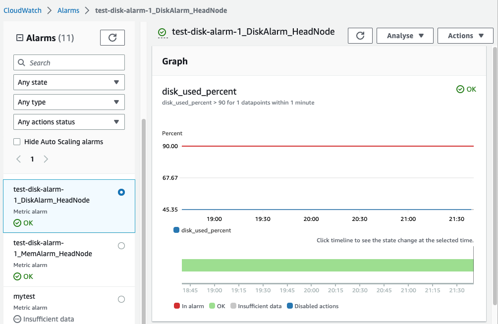
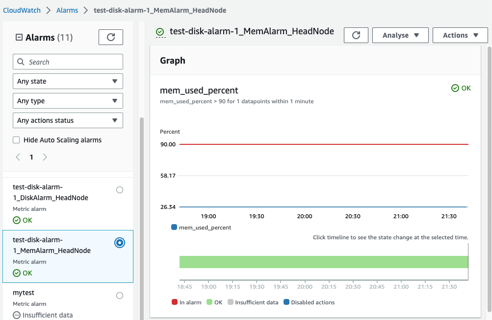

# Amazon CloudWatch alarms for cluster metrics

Starting with AWS ParallelCluster version 3.6, you can configure your cluster with Amazon CloudWatch alarms for monitoring
the head node. One alarm monitors the root volume `disk_used_percent`. The other alarm monitors the
`mem_used_percent` metric. For more information,
see [Metrics collected by the CloudWatch agent](../../../AmazonCloudWatch/latest/monitoring/metrics-collected-by-CloudWatch-agent.md "../../../AmazonCloudWatch/latest/monitoring/metrics-collected-by-CloudWatch-agent.md")
in the _Amazon CloudWatch User Guide_.

###### The alarms are named as follows:

- ``cluster-name`\_DiskAlarm_HeadNode`
- ``cluster-name`\_MemAlarm_HeadNode`
`cluster-name` is the name of your cluster.

Access the alarms in the CloudWatch console by choosing **Alarms** in the navigation pane. The following images show the disk usage
alarm and memory usage alarm for a cluster.

The disk usage alarm is in the `ALARM` state when the disk usage percentage is greater than 90% for 1 data point, within a 1 minute
time period.

The memory usage alarm is in the `ALARM` state when the memory usage percentage is greater than 90% for 1 data point, within a 1
minute time period.

###### Note

AWS ParallelCluster doesn't configure alarm actions by default. For information about how to set up alarm actions, such as
sending notifications, see [Alarm actions](../../../AmazonCloudWatch/latest/monitoring/AlarmThatSendsEmail.md#alarms-and-actions "../../../AmazonCloudWatch/latest/monitoring/AlarmThatSendsEmail.md#alarms-and-actions").
For more information about Amazon CloudWatch alarms, see [Using Amazon CloudWatch alarms](../../../AmazonCloudWatch/latest/monitoring/AlarmThatSendsEmail.md "../../../AmazonCloudWatch/latest/monitoring/AlarmThatSendsEmail.md")
in the _Amazon CloudWatch User Guide_.

If you don’t want to create these Amazon CloudWatch alarms, deactivate them by setting [Monitoring](Monitoring-v3.md "Monitoring-v3.md") /
[Dashboards](Monitoring-v3.md#yaml-Monitoring-Dashboards "Monitoring-v3.md#yaml-Monitoring-Dashboards") / [CloudWatch](Monitoring-v3.md#yaml-Monitoring-Dashboard-CloudWatch "Monitoring-v3.md#yaml-Monitoring-Dashboard-CloudWatch") / [Enabled](Monitoring-v3.md#yaml-Monitoring-Dashboard-CloudWatch-Enabled "Monitoring-v3.md#yaml-Monitoring-Dashboard-CloudWatch-Enabled") to `false` in the
cluster configuration. This also disables the creation of the Amazon CloudWatch dashboard. For more information, see [Amazon CloudWatch dashboard](cloudwatch-dashboard-v3.md "cloudwatch-dashboard-v3.md").

###### Note

If you deactivate the creation of the Amazon CloudWatch dashboard, you also deactivate the Amazon CloudWatch `disk_used_percent` and
`memory_used_percent` alarms for your cluster.
