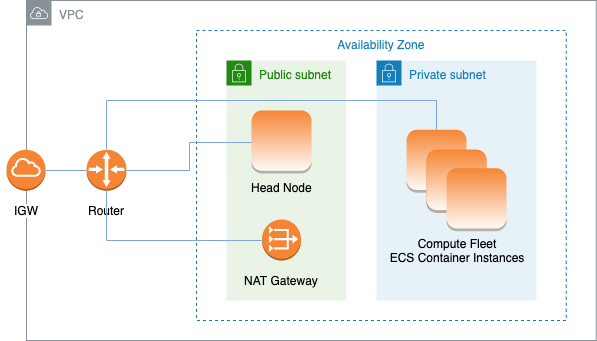

# AWS ParallelCluster with AWS Batch

scheduler

When you use `awsbatch` as the scheduler type, AWS ParallelCluster creates an AWS Batch managed compute environment. The AWS Batch
environment manages Amazon Elastic Container Service (Amazon ECS) container instances. These instances are launched in the subnet configured in
the [AwsBatchQueues](Scheduling-v3.md#Scheduling-v3-AwsBatchQueues "Scheduling-v3.md#Scheduling-v3-AwsBatchQueues") / [Networking](Scheduling-v3.md#Scheduling-v3-AwsBatchQueues-Networking "Scheduling-v3.md#Scheduling-v3-AwsBatchQueues-Networking") /
[SubnetIds](Scheduling-v3.md#yaml-Scheduling-AwsBatchQueues-Networking-SubnetIds "Scheduling-v3.md#yaml-Scheduling-AwsBatchQueues-Networking-SubnetIds") parameter. For AWS Batch to function correctly, Amazon ECS container instances need
external network access to communicate with the Amazon ECS service endpoint. This translates into the following scenarios:

- The Subnet ID specified for the queue uses a [NAT gateway](../../../vpc/latest/userguide/vpc-nat-gateway.md "../../../vpc/latest/userguide/vpc-nat-gateway.md") to access the internet. We recommended this approach.
- Instances launched in the queue subnet have public IP addresses and can reach the internet through an Internet Gateway.
  Additionally, if you're interested in multi-node parallel jobs (from the [AWS Batch docs](../../../batch/latest/userguide/multi-node-parallel-jobs.md#mnp-ce "../../../batch/latest/userguide/multi-node-parallel-jobs.md#mnp-ce")):

AWS Batch multi-node parallel jobs use the Amazon ECS `awsvpc` network mode. This gives your multi-node parallel job
containers the same networking properties as Amazon EC2 instances. Each multi-node parallel job container gets its own elastic network interface, a primary
private IP address, and an internal DNS hostname. The network interface is created in the same Amazon VPC subnet as its host compute resource. Any
security groups that are applied to your compute resources are also applied to it.

When using Amazon ECS Task Networking, the `awsvpc` network mode doesn't provide elastic network interfaces with public IP
addresses for tasks that use the Amazon EC2 launch type. To access the internet, tasks that use the Amazon EC2 launch type must be launched in a
private subnet that's configured to use a NAT gateway.

You must configure a [NAT gateway](../../../vpc/latest/userguide/vpc-nat-gateway.md "../../../vpc/latest/userguide/vpc-nat-gateway.md") in order to enable the cluster to run multi-node parallel jobs.



All the previous configuration and considerations are valid for AWS Batch, too. The following is an example of a AWS Batch networking configuration.

```
# Note that all values are only provided as examples
HeadNode:
  ...
  Networking:
    SubnetId: subnet-12345678 # subnet with internet gateway, NAT gateway or proxy
    #ElasticIp: true | false | eip-12345678
    #Proxy:
      #HttpProxyAddress: http://proxy-address:port
  Ssh:
    KeyName: ec2-key-name
Scheduling:
  Scheduler: awsbatch
  AwsBatchQueues:
    - ...
      Networking:
        SubnetIds:
          - subnet-23456789 # subnet with internet gateway, NAT gateway or proxy
        #AssignPublicIp: true | false

```

In the [Scheduling](Scheduling-v3.md "Scheduling-v3.md") / [AwsBatchQueues](Scheduling-v3.md#Scheduling-v3-AwsBatchQueues "Scheduling-v3.md#Scheduling-v3-AwsBatchQueues") /
[Networking](Scheduling-v3.md#Scheduling-v3-AwsBatchQueues-Networking "Scheduling-v3.md#Scheduling-v3-AwsBatchQueues-Networking") section, the [SubnetIds](Scheduling-v3.md#yaml-Scheduling-AwsBatchQueues-Networking-SubnetIds "Scheduling-v3.md#yaml-Scheduling-AwsBatchQueues-Networking-SubnetIds")
is a list type but, currently, only one subnet is supported.

For more information, see the following topics:

- [AWS Batch managed compute
  environments](../../../batch/latest/userguide/compute_environments.md#managed_compute_environments "../../../batch/latest/userguide/compute_environments.md#managed_compute_environments")
- [AWS Batch multi-node parallel jobs](../../../batch/latest/userguide/multi-node-parallel-jobs.md "../../../batch/latest/userguide/multi-node-parallel-jobs.md")
- [Amazon ECS task networking with the awsvpc network
  mode](../../../AmazonECS/latest/developerguide/task-networking.md "../../../AmazonECS/latest/developerguide/task-networking.md")
