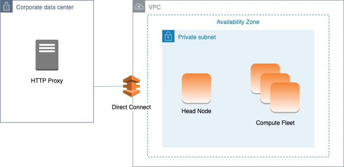

# AWS ParallelCluster in a single private subnet connected using

AWS Direct Connect

When [Scheduling](Scheduling-v3.md "Scheduling-v3.md") / [SlurmQueues](Scheduling-v3.md#Scheduling-v3-SlurmQueues "Scheduling-v3.md#Scheduling-v3-SlurmQueues") / [Networking](Scheduling-v3.md#Scheduling-v3-SlurmQueues-Networking "Scheduling-v3.md#Scheduling-v3-SlurmQueues-Networking") / [AssignPublicIp](Scheduling-v3.md#yaml-Scheduling-SlurmQueues-Networking-AssignPublicIp "Scheduling-v3.md#yaml-Scheduling-SlurmQueues-Networking-AssignPublicIp") is set to `false`, the subnets must be
correctly set up to use the Proxy for all traffic. Web access is required for both head and
compute nodes.



The configuration for this architecture requires the following settings:

```
# Note that all values are only provided as examples
HeadNode:
  ...
  Networking:
    SubnetId: subnet-34567890 # subnet with proxy
    Proxy:
      HttpProxyAddress: http://proxy-address:port
  Ssh:
    KeyName: ec2-key-name
Scheduling:
  Scheduler: slurm
  SlurmQueues:
    - ...
      Networking:
        SubnetIds:
          - subnet-34567890 # subnet with proxy
        AssignPublicIp: false
        Proxy:
          HttpProxyAddress: http://proxy-address:port

```
