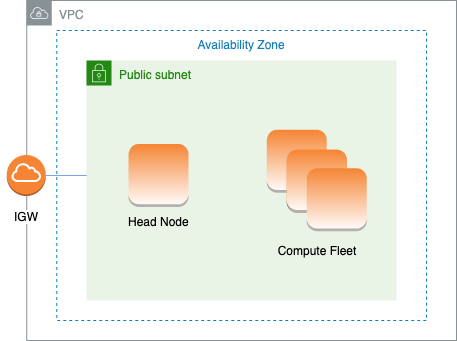

# AWS ParallelCluster in a single public subnet

In this configuration, all instances of the cluster must be assigned a public IP in order
to get internet access. To achieve this, do the following:

- Make sure the head node is assigned a public IP address by either turning on the
  "Enable auto-assign public IPv4 address" setting for the subnet used in [HeadNode](HeadNode-v3.md "HeadNode-v3.md") / [Networking](HeadNode-v3.md#HeadNode-v3-Networking "HeadNode-v3.md#HeadNode-v3-Networking") / [SubnetId](HeadNode-v3.md#yaml-HeadNode-Networking-SubnetId "HeadNode-v3.md#yaml-HeadNode-Networking-SubnetId") or by assigning
  an Elastic IP in [HeadNode](HeadNode-v3.md "HeadNode-v3.md") / [Networking](HeadNode-v3.md#HeadNode-v3-Networking "HeadNode-v3.md#HeadNode-v3-Networking") / [ElasticIp](HeadNode-v3.md#yaml-HeadNode-Networking-ElasticIp "HeadNode-v3.md#yaml-HeadNode-Networking-ElasticIp").
- Make sure the compute nodes are assigned a public IP address by either turning on the
  "Enable auto-assign public IPv4 address" setting for the subnet used in [Scheduling](Scheduling-v3.md "Scheduling-v3.md") / [SlurmQueues](Scheduling-v3.md#Scheduling-v3-SlurmQueues "Scheduling-v3.md#Scheduling-v3-SlurmQueues") / [Networking](Scheduling-v3.md#Scheduling-v3-SlurmQueues-Networking "Scheduling-v3.md#Scheduling-v3-SlurmQueues-Networking") / [SubnetIds](Scheduling-v3.md#yaml-Scheduling-SlurmQueues-Networking-SubnetIds "Scheduling-v3.md#yaml-Scheduling-SlurmQueues-Networking-SubnetIds")
  or by setting [AssignPublicIp](Scheduling-v3.md#yaml-Scheduling-SlurmQueues-Networking-AssignPublicIp "Scheduling-v3.md#yaml-Scheduling-SlurmQueues-Networking-AssignPublicIp"): true in [Scheduling](Scheduling-v3.md "Scheduling-v3.md") / [SlurmQueues](Scheduling-v3.md#Scheduling-v3-SlurmQueues "Scheduling-v3.md#Scheduling-v3-SlurmQueues") / [Networking](Scheduling-v3.md#Scheduling-v3-SlurmQueues-Networking "Scheduling-v3.md#Scheduling-v3-SlurmQueues-Networking").
- If you define a p4d instance type, or another instance type that has
  multiple network interfaces or a network interface card to the head node, you must set
  [HeadNode](HeadNode-v3.md "HeadNode-v3.md") / [Networking](HeadNode-v3.md#HeadNode-v3-Networking "HeadNode-v3.md#HeadNode-v3-Networking") / [ElasticIp](HeadNode-v3.md#yaml-HeadNode-Networking-ElasticIp "HeadNode-v3.md#yaml-HeadNode-Networking-ElasticIp") to
  `true` to provide public access. AWS public IPs can only be assigned to
  instances launched with a single network interface. For this case, we recommend that you
  use a [NAT
  gateway](../../../vpc/latest/userguide/vpc-nat-gateway.md "../../../vpc/latest/userguide/vpc-nat-gateway.md") to provide public access to the cluster compute nodes. For more
  information on IP addresses, see [Assign
  a public IPv4 address during instance launch](../../../AWSEC2/latest/UserGuide/using-instance-addressing.md#public-ip-addresses "../../../AWSEC2/latest/UserGuide/using-instance-addressing.md#public-ip-addresses") in the _Amazon EC2 User Guide
  for Linux Instances_.
- You can't define a p4d or hp6id instance type, or
  another instance type that has multiple network interfaces or a network interface card to
  compute nodes because AWS public IPs can only be assigned to instances launched with a
  single network interface. For more information on IP addresses, see [Assign
  a public IPv4 address during instance launch](../../../AWSEC2/latest/UserGuide/using-instance-addressing.md#public-ip-addresses "../../../AWSEC2/latest/UserGuide/using-instance-addressing.md#public-ip-addresses") in the _Amazon EC2 User Guide
  for Linux Instances_.
  For more information, see [Enabling
  internet access](../../../vpc/latest/userguide/VPC_Internet_Gateway.md#vpc-igw-internet-access "../../../vpc/latest/userguide/VPC_Internet_Gateway.md#vpc-igw-internet-access") in _Amazon VPC User Guide_.



The configuration for this architecture requires the following settings:

```
# Note that all values are only provided as examples
HeadNode:
  ...
  Networking:
    SubnetId: subnet-12345678 # subnet with internet gateway
    #ElasticIp: true | false | eip-12345678
Scheduling:
  Scheduler: slurm
  SlurmQueues:
    - ...
      Networking:
        SubnetIds:
          - subnet-12345678 # subnet with internet gateway
        #AssignPublicIp: true

```
