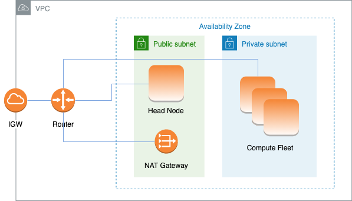

# AWS ParallelCluster using two subnets

In this configuration, only the head node of the cluster is required to have a public IP
assigned. You can achieve this by either turning on the "Enable auto-assign public IPv4
address" setting for the subnet used in [HeadNode](HeadNode-v3.md "HeadNode-v3.md") / [Networking](HeadNode-v3.md#HeadNode-v3-Networking "HeadNode-v3.md#HeadNode-v3-Networking") / [SubnetId](HeadNode-v3.md#yaml-HeadNode-Networking-SubnetId "HeadNode-v3.md#yaml-HeadNode-Networking-SubnetId") or by assigning an Elastic IP in [HeadNode](HeadNode-v3.md "HeadNode-v3.md") / [Networking](HeadNode-v3.md#HeadNode-v3-Networking "HeadNode-v3.md#HeadNode-v3-Networking") / [ElasticIp](HeadNode-v3.md#yaml-HeadNode-Networking-ElasticIp "HeadNode-v3.md#yaml-HeadNode-Networking-ElasticIp").

If you define a p4d instance type or another instance type that has multiple network
interfaces or a network interface card to the head node, you must set [HeadNode](HeadNode-v3.md "HeadNode-v3.md") / [Networking](HeadNode-v3.md#HeadNode-v3-Networking "HeadNode-v3.md#HeadNode-v3-Networking") / [ElasticIp](HeadNode-v3.md#yaml-HeadNode-Networking-ElasticIp "HeadNode-v3.md#yaml-HeadNode-Networking-ElasticIp") to `true` to provide public access. AWS public
IPs can only be assigned to instances launched with a single network interface. For more
information on IP addresses, see [Assign a
public IPv4 address during instance launch](../../../AWSEC2/latest/UserGuide/using-instance-addressing.md#public-ip-addresses "../../../AWSEC2/latest/UserGuide/using-instance-addressing.md#public-ip-addresses") in the _Amazon EC2 User Guide for
Linux Instances_.

This configuration requires a [NAT gateway](../../../vpc/latest/userguide/vpc-nat-gateway.md "../../../vpc/latest/userguide/vpc-nat-gateway.md") or an internal proxy in
the subnet used for the queues, to give internet access to the compute instances.



The configuration to use an existing private subnet for compute instances requires the following settings:

```
# Note that all values are only provided as examples
HeadNode:
  ...
  Networking:
    SubnetId: subnet-12345678 # subnet with internet gateway
    #ElasticIp: true | false | eip-12345678
Scheduling:
  Scheduler: slurm
  SlurmQueues:
    - ...
      Networking:
        SubnetIds:
          - subnet-23456789 # subnet with NAT gateway
        #AssignPublicIp: false

```
