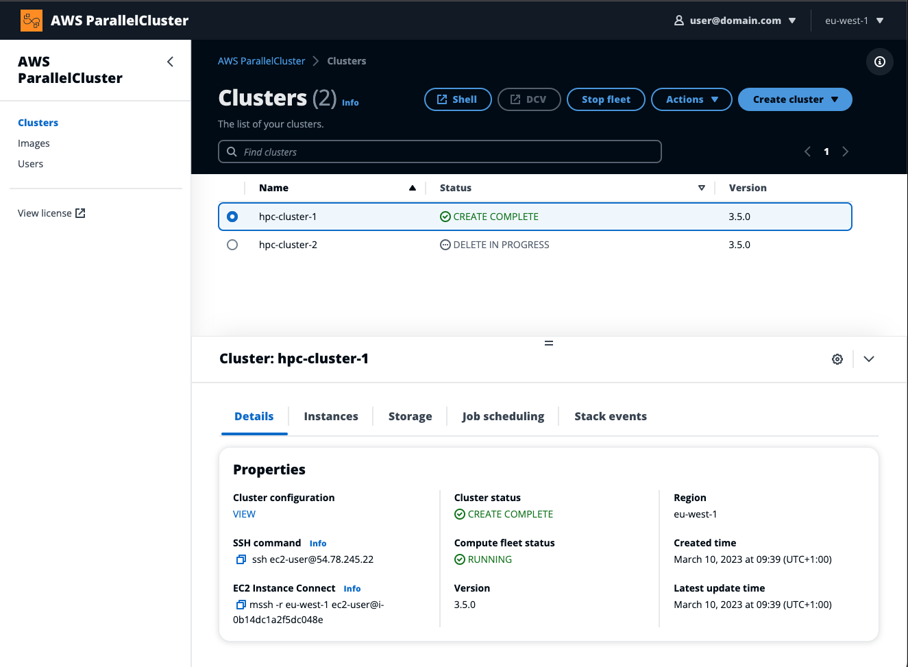

# AWS ParallelCluster UI

The AWS ParallelCluster UI (PCUI) is a web-based user interface that serves as a dashboard for
creating, monitoring, and managing clusters. You install and access the
PCUI in your AWS account. The PCUI is added with AWS ParallelCluster version 3.5.0.

To install the PCUI and get started, see [Installing the PCUI](install-pcui-v3.md "install-pcui-v3.md") and
[Configure and create a cluster with the
PCUI](configure-create-pcui-v3.md "configure-create-pcui-v3.md").

###### The PCUI supports the following features:

- Displays the following:
  - The list of clusters you've created in your AWS account with AWS ParallelCluster.
  - The available status and details for your listed clusters.
  - CloudFormation stack event and AWS ParallelCluster logs that you can use for monitoring.
  - The status of jobs that are running on your clusters.
  - The list of custom images that you can use to build clusters.
  - The list of official images that the UI uses to create clusters.
  - The list of users that have access to the PCUI. You can add and remove users.

- Provides step-by-step guidance for creating and editing (updating) a cluster and selecting supported cluster features to add, edit, or
  remove. Inaccessible input fields can't be changed for the cluster configuration being edited. You have the option to perform a dry run validation
  of your cluster configuration before cluster deployment.
- Features direct shell links to access the head node in the **Clusters** view. Choose **Add SSM session** during the step-by-step
  guidance to add the direct shell access, and the **SSM Managed Instance Core** policy on the head node.

###### Consider the following when using the PCUI to create and manage your clusters:

- You can only create and edit clusters or build images with the same AWS ParallelCluster version that was used to create the PCUI. Earlier
  version clusters or images can only be viewed. If you manage multiple versions of clusters and images, we recommend that you create an PCUI
  instance to support each version.
- The PCUI is designed to mirror the `pcluster` CLI functionality. There are some differences. If you align with the step-by-step
  guidance, then you are using all of the supported features. Before deployment, you have the option to edit the cluster or image configuration
  manually. If you do this, we recommend that you validate the configuration by choosing **Dry run** to verify that your edits are
  fully supported.

###### Note

PCUI doesn't support AWS Batch.
