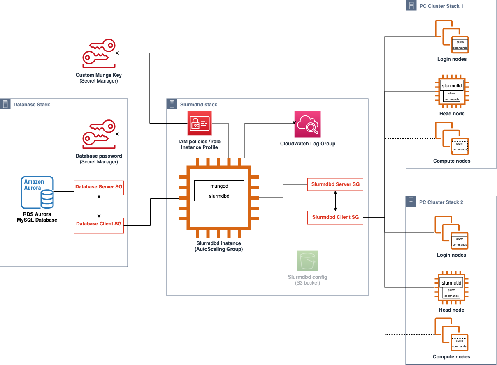

# Slurm accounting with AWS ParallelCluster

Starting with version 3.3.0, AWS ParallelCluster supports Slurm accounting with the cluster configuration parameter [SlurmSettings](Scheduling-v3.md#Scheduling-v3-SlurmSettings "Scheduling-v3.md#Scheduling-v3-SlurmSettings") / [Database](Scheduling-v3.md#Scheduling-v3-SlurmSettings-Database "Scheduling-v3.md#Scheduling-v3-SlurmSettings-Database").

Starting with version 3.10.0, AWS ParallelCluster supports Slurm accounting with an external Slurmdbd with the cluster configuration
parameter [SlurmSettings](Scheduling-v3.md#Scheduling-v3-SlurmSettings "Scheduling-v3.md#Scheduling-v3-SlurmSettings") / [ExternalSlurmdbd](Scheduling-v3.md#Scheduling-v3-SlurmSettings-ExternalSlurmdbd "Scheduling-v3.md#Scheduling-v3-SlurmSettings-ExternalSlurmdbd").
Using an external Slurmdbd is recommended if multiple clusters share the same database.

With Slurm accounting, you can integrate an external accounting database to do the following:

- Manage cluster users or groups of users and other entities. With this capability, you can use Slurm's more advanced features, such as
  resource limit enforcement, fair-share, and QOSs.
- Collect and save job data, such as the user that ran the job, the job's duration, and the resources it uses. You can view the saved data with
  the `sacct` utility.

###### Note

AWS ParallelCluster supports Slurm accounting for [Slurm supported
MySQL database servers](https://slurm.schedmd.com/accounting.html#mysql-configuration "https://slurm.schedmd.com/accounting.html#mysql-configuration").

## Working with Slurm accounting using external

Slurmdbd in AWS ParallelCluster v3.10.0 and later

Before you configure Slurm accounting, you must have an existing external Slurmdbd database server, which connects to an existing external database server.

To configure this, define the following:

- The address of the external Slurmdbd server in [ExternalSlurmdbd](Scheduling-v3.md#Scheduling-v3-SlurmSettings-ExternalSlurmdbd "Scheduling-v3.md#Scheduling-v3-SlurmSettings-ExternalSlurmdbd") / [Host](Scheduling-v3.md#yaml-Scheduling-SlurmSettings-ExternalSlurmdbd-Host "Scheduling-v3.md#yaml-Scheduling-SlurmSettings-ExternalSlurmdbd-Host"). The server must exist and be reachable from the head node.
- The munge key to communicate with the external Slurmdbd server in [MungeKeySecretArn](Scheduling-v3.md#yaml-Scheduling-SlurmSettings-MungeKeySecretArn "Scheduling-v3.md#yaml-Scheduling-SlurmSettings-MungeKeySecretArn").

To step through a tutorial, see [Creating a cluster with an external Slurmdbd accounting](external-slurmdb-accounting.md "external-slurmdb-accounting.md").

###### Note

You are responsible to manage the Slurm database accounting entities.

The architecture of the AWS ParallelCluster external SlurmDB support feature enables multiple clusters sharing the same SlurmDB and the same database.



###### Warning

Traffic between AWS ParallelCluster and the external SlurmDB is not encrypted. It is recommended to run the cluster and the external SlurmDB in a trusted network.

## Working with Slurm accounting using head node Slurmdbd in AWS ParallelCluster v3.3.0 and later

Before you configure Slurm accounting, you must have an existing external database server and database that uses `mysql`
protocol.

To configure Slurm accounting with AWS ParallelCluster, you must define the following:

- The URI for the external database server in [Database](Scheduling-v3.md#Scheduling-v3-SlurmSettings-Database "Scheduling-v3.md#Scheduling-v3-SlurmSettings-Database") / [Uri](Scheduling-v3.md#yaml-Scheduling-SlurmSettings-Database-Uri "Scheduling-v3.md#yaml-Scheduling-SlurmSettings-Database-Uri"). The server must exist and be reachable from the head node.
- Credentials to access the external database that are defined in [Database](Scheduling-v3.md#Scheduling-v3-SlurmSettings-Database "Scheduling-v3.md#Scheduling-v3-SlurmSettings-Database") / [PasswordSecretArn](Scheduling-v3.md#yaml-Scheduling-SlurmSettings-Database-PasswordSecretArn "Scheduling-v3.md#yaml-Scheduling-SlurmSettings-Database-PasswordSecretArn") and [Database](Scheduling-v3.md#Scheduling-v3-SlurmSettings-Database "Scheduling-v3.md#Scheduling-v3-SlurmSettings-Database") / [UserName](Scheduling-v3.md#yaml-Scheduling-SlurmSettings-Database-UserName "Scheduling-v3.md#yaml-Scheduling-SlurmSettings-Database-UserName"). AWS ParallelCluster uses this information to configure accounting at the Slurm level and the `slurmdbd` service on
  the head node. `slurmdbd` is the daemon that manages communication between the cluster and the database server.

To step through a tutorial, see [Creating a cluster with Slurm accounting](tutorials_07_slurm-accounting-v3.md "tutorials_07_slurm-accounting-v3.md").

###### Note

AWS ParallelCluster performs a basic bootstrap of the Slurm accounting database by setting the default cluster user as database admin in the
Slurm database. AWS ParallelCluster doesn't add any other user to the accounting database. The customer is responsible for managing the accounting
entities in the Slurm database.

AWS ParallelCluster configures [`slurmdbd`](https://slurm.schedmd.com/slurmdbd.html "https://slurm.schedmd.com/slurmdbd.html") to ensure that a cluster has
its own Slurm database on the database server. The same database server can be used across multiple clusters, but each cluster has its own
separate database. AWS ParallelCluster uses the cluster name to define the name for the database in the `slurmdbd` configuration file
[`StorageLoc`](https://slurm.schedmd.com/slurmdbd.conf.html#OPT_StorageLoc "https://slurm.schedmd.com/slurmdbd.conf.html#OPT_StorageLoc") parameter. Consider the following
situation. A database that's present on the database server includes a cluster name that doesn't map to an active cluster name. In this case, you
can create a new cluster with that cluster name to map to that database. Slurm reuses the database for the new cluster.

###### Warning

- We don't recommend setting up more than one cluster to use the same database at once. Doing so can lead to performance issues or even
  database deadlock situations.
- If Slurm accounting is enabled on the head node of a cluster, we recommend using an instance type with a powerful CPU, more memory, and
  higher network bandwidth. Slurm accounting can add strain on the head node of the cluster.

In the current architecture of the AWS ParallelCluster Slurm accounting feature, each cluster has its own instance of the
`slurmdbd` daemon as shown in the following diagram example configurations.


If you're adding custom Slurm multi-cluster or federation functionalities to your cluster environment, all clusters must reference the same
`slurmdbd` instance. For this alternative, we recommend that you enable AWS ParallelCluster Slurm accounting on one cluster and
manually configure the other clusters to connect to the `slurmdbd` that are hosted on the first cluster.

If you're using AWS ParallelCluster versions prior to version 3.3.0, refer to the alternative method to implement Slurm accounting that's
described in this [HPC
Blog Post](https://aws.amazon.com/blogs/compute/enabling-job-accounting-for-hpc-with-aws-parallelcluster-and-amazon-rds/ "https://aws.amazon.com/blogs/compute/enabling-job-accounting-for-hpc-with-aws-parallelcluster-and-amazon-rds/").

## Slurm accounting considerations

### Database and cluster on different VPCs

To enable Slurm accounting, a database server is needed to serve as a backend for the read and write operations that the
`slurmdbd` daemon performs. Before the cluster is created or updated to enable Slurm accounting, the head node must be able to reach
the database server.

If you need to deploy the database server on a VPC other than the one that the cluster uses, consider the following:

- To enable communication between the `slurmdbd` on the cluster side and the database server, you must set up connectivity between
  the two VPCs. For more information, see [VPC Peering](../../../vpc/latest/peering/what-is-vpc-peering.md "../../../vpc/latest/peering/what-is-vpc-peering.md") in the
  _Amazon Virtual Private Cloud User Guide_.
- You must create the security group that you want to attach to the head node on the VPC of the cluster. After the two VPCs have been peered,
  cross-linking between the database side and the cluster side security groups is available. For more information, see [Security Group Rules](../../../vpc/latest/userguide/VPC_SecurityGroups.md#SecurityGroupRules "../../../vpc/latest/userguide/VPC_SecurityGroups.md#SecurityGroupRules") in the _Amazon Virtual Private Cloud User
  Guide_.

### Configuring TLS encryption between `slurmdbd` and the database

server

With the default Slurm accounting configuration that AWS ParallelCluster provides, `slurmdbd` establishes a TLS encrypted
connection to the database server, if the server supports TLS encryption. AWS database services such as Amazon RDS and Amazon Aurora support
TLS encryption by default.

You can require secure connections on the server side by setting the `require_secure_transport` parameter on the database server.
This is configured in the provided CloudFormation template.

Following security best practice, we recommend that you also enable server identity verification on the `slurmdbd` client. To do
this, configure the [StorageParameters](https://slurm.schedmd.com/slurmdbd.conf.html#OPT_StorageParameters "https://slurm.schedmd.com/slurmdbd.conf.html#OPT_StorageParameters") in the
`slurmdbd.conf`. Upload the server CA certificate to the head node of the cluster. Next, set the [SSL_CA](https://slurm.schedmd.com/slurmdbd.conf.html#OPT_SSL_CA "https://slurm.schedmd.com/slurmdbd.conf.html#OPT_SSL_CA") option of `StorageParameters` in
`slurmdbd.conf` to the path of the server CA certificate on the head node. Doing this enables server identity verification on the
`slurmdbd` side. After you make these changes, restart the `slurmdbd` service to re-establish connectivity to the database
server with identity verification enabled.

### Updating the database credentials

To update the values for [Database](Scheduling-v3.md#Scheduling-v3-SlurmSettings-Database "Scheduling-v3.md#Scheduling-v3-SlurmSettings-Database") / [UserName](Scheduling-v3.md#yaml-Scheduling-SlurmSettings-Database-UserName "Scheduling-v3.md#yaml-Scheduling-SlurmSettings-Database-UserName") or [PasswordSecretArn](Scheduling-v3.md#yaml-Scheduling-SlurmSettings-Database-PasswordSecretArn "Scheduling-v3.md#yaml-Scheduling-SlurmSettings-Database-PasswordSecretArn"), you must first stop the compute fleet. Suppose that
the secret value that's stored in the AWS Secrets Manager secret is changed and its ARN isn't changed. In this situation, the cluster
doesn't automatically update the database password to the new value. To update the cluster for the new secret value, run the following command
from the head node.

```
`$` sudo /opt/parallelcluster/scripts/slurm/update_slurm_database_password.sh
```

###### Warning

To avoid losing accounting data, we recommend that you only change the database password when the compute fleet is stopped.

### Database monitoring

We recommend that you enable the monitoring features of the AWS database services. For more information, see [Amazon RDS monitoring](../../../AmazonRDS/latest/UserGuide/CHAP_Monitoring.md "../../../AmazonRDS/latest/UserGuide/CHAP_Monitoring.md") or [Amazon Aurora monitoring](../../../AmazonRDS/latest/AuroraUserGuide/MonitoringAurora.md "../../../AmazonRDS/latest/AuroraUserGuide/MonitoringAurora.md") documentation.
