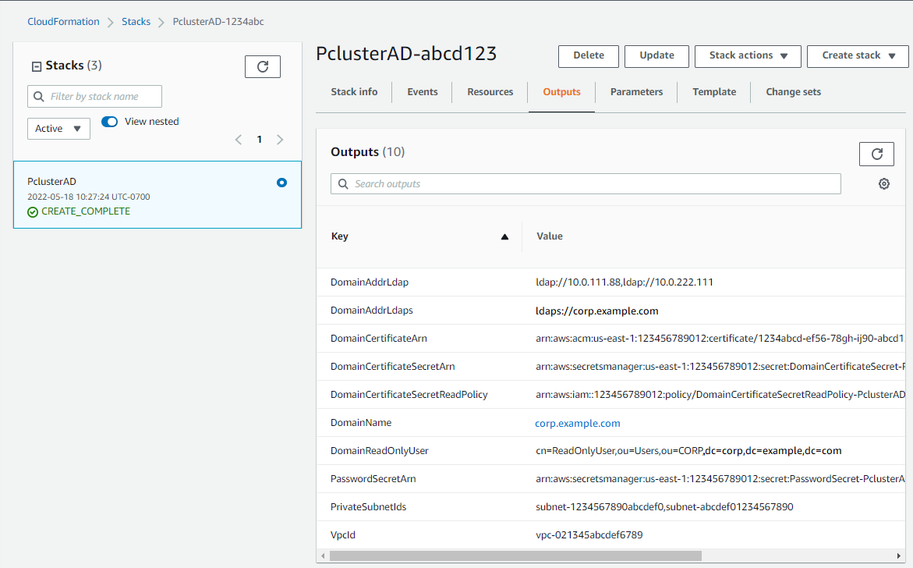

# Create the AD infrastructure

Choose the _Automated_ tab to create the Active Directory (AD) infrastructure with an CloudFormation quick create template.

Choose the _Manual_ tab to manually create the AD infrastructure.

1.  Sign in to the AWS Management Console.
2.  Open [CloudFormation Quick Create (region us-east-1)](https://us-east-1.console.aws.amazon.com/cloudformation/home?region=us-east-1#/stacks/create/review?stackName=pcluster-ad&templateURL=https://us-east-1-aws-parallelcluster.s3.amazonaws.com/templates/1-click/ad-integration.yaml "https://us-east-1.console.aws.amazon.com/cloudformation/home?region=us-east-1#/stacks/create/review?stackName=pcluster-ad&templateURL=https://us-east-1-aws-parallelcluster.s3.amazonaws.com/templates/1-click/ad-integration.yaml") to create the following resources in the CloudFormation console:
    - A VPC with two subnets and routing for public access, if no VPC is specified.
    - An AWS Managed Microsoft AD.
    - An Amazon EC2 instance that's joined to the AD that you can use to manage the directory.

3.  In the **Quick create stack** page **Parameters** section, enter passwords for the
    following parameters:

        * **AdminPassword**
        * **ReadOnlyPassword**
        * **UserPassword**

    Make note of the passwords. You use them later on in this tutorial.

4.  For **DomainName**, enter `corp.example.com`
5.  For **Keypair**, enter the name of an Amazon EC2 key pair.
6.  Check the boxes to acknowledge each of the access capabilities at the bottom of the page.
7.  Choose **Create stack**.
8.  After the CloudFormation stack has reached the `CREATE_COMPLETE` state, choose the **Outputs** tab of the stack.
    Make a note of the output resource names and IDs because you need to use them in later steps. The outputs provide the information that's
    needed to create the cluster.

 9. To complete the exercises [(Optional) Manage AD users and groups](tutorials_05_multi-user-ad-step2.md "tutorials_05_multi-user-ad-step2.md"), you need the directory ID.
Choose **Resources** and scroll down to make note of the directory ID. 10. Continue at [(Optional) Manage AD users and groups](tutorials_05_multi-user-ad-step2.md "tutorials_05_multi-user-ad-step2.md") or [Create the cluster](tutorials_05_multi-user-ad-step3.md "tutorials_05_multi-user-ad-step3.md").
Create a VPC for the directory service with two subnets in different Availability Zones and an AWS Managed Microsoft AD.

###### Note

- The directory and domain name is `corp.example.com`. The short name is `CORP`.
- Change the `Admin` password in the script.
- The Active Directory (AD) takes at least 15 minutes to create.
  Use the following Python script to create the VPC, subnets, and AD resources in your local AWS Region. Save this file as
  `ad.py` and run it.

```
import boto3
import time
from pprint import pprint

vpc_name = "PclusterVPC"
ad_domain = "corp.example.com"
admin_password = `"asdfASDF1234"`

ec2 = boto3.client("ec2")
ds = boto3.client("ds")
region = boto3.Session().region_name

# Create the VPC, Subnets, IGW, Routes
vpc = ec2.create_vpc(CidrBlock="10.0.0.0/16")["Vpc"]
vpc_id = vpc["VpcId"]
time.sleep(30)
ec2.create_tags(Resources=[vpc_id], Tags=[{"Key": "Name", "Value": vpc_name}])
subnet1 = ec2.create_subnet(VpcId=vpc_id, CidrBlock="10.0.0.0/17", AvailabilityZone=f"{region}a")["Subnet"]
subnet1_id = subnet1["SubnetId"]
time.sleep(30)
ec2.create_tags(Resources=[subnet1_id], Tags=[{"Key": "Name", "Value": f"{vpc_name}/subnet1"}])
ec2.modify_subnet_attribute(SubnetId=subnet1_id, MapPublicIpOnLaunch={"Value": True})
subnet2 = ec2.create_subnet(VpcId=vpc_id, CidrBlock="10.0.128.0/17", AvailabilityZone=f"{region}b")["Subnet"]
subnet2_id = subnet2["SubnetId"]
time.sleep(30)
ec2.create_tags(Resources=[subnet2_id], Tags=[{"Key": "Name", "Value": f"{vpc_name}/subnet2"}])
ec2.modify_subnet_attribute(SubnetId=subnet2_id, MapPublicIpOnLaunch={"Value": True})
igw = ec2.create_internet_gateway()["InternetGateway"]
ec2.attach_internet_gateway(InternetGatewayId=igw["InternetGatewayId"], VpcId=vpc_id)
route_table = ec2.describe_route_tables(Filters=[{"Name": "vpc-id", "Values": [vpc_id]}])["RouteTables"][0]
ec2.create_route(RouteTableId=route_table["RouteTableId"], DestinationCidrBlock="0.0.0.0/0", GatewayId=igw["InternetGatewayId"])
ec2.modify_vpc_attribute(VpcId=vpc_id, EnableDnsSupport={"Value": True})
ec2.modify_vpc_attribute(VpcId=vpc_id, EnableDnsHostnames={"Value": True})

# Create the Active Directory
ad = ds.create_microsoft_ad(
    Name=ad_domain,
    Password=admin_password,
    Description="ParallelCluster AD",
    VpcSettings={"VpcId": vpc_id, "SubnetIds": [subnet1_id, subnet2_id]},
    Edition="Standard",
)
directory_id = ad["DirectoryId"]

# Wait for completion
print("Waiting for the directory to be created...")
directories = ds.describe_directories(DirectoryIds=[directory_id])["DirectoryDescriptions"]
directory = directories[0]
while directory["Stage"] in {"Requested", "Creating"}:
    time.sleep(3)
    directories = ds.describe_directories(DirectoryIds=[directory_id])["DirectoryDescriptions"]
    directory = directories[0]

dns_ip_addrs = directory["DnsIpAddrs"]

pprint({"directory_id": directory_id,
        "vpc_id": vpc_id,
        "subnet1_id": subnet1_id,
        "subnet2_id": subnet2_id,
        "dns_ip_addrs": dns_ip_addrs})
```

The following is example output from the Python script.

```
{
  "directory_id": "d-abcdef01234567890",
  "dns_ip_addrs": ["192.0.2.254", "203.0.113.237"],
  "subnet1_id": "subnet-021345abcdef6789",
  "subnet2_id": "subnet-1234567890abcdef0",
  "vpc_id": "vpc-021345abcdef6789"
}
```

Make a note of the output resource names and IDs. You use them in later steps.

After the script completes, continue to the next step.

New Amazon EC2 console

1. Sign in to the AWS Management Console.
2. If you don't have a role with the policies listed in step 4 attached, open the IAM console at [https://console.aws.amazon.com/iam/](https://console.aws.amazon.com/iam/ "https://console.aws.amazon.com/iam/"). Otherwise, skip to step 5.
3. Create the `ResetUserPassword` policy, replacing the red highlighted content with your AWS Region ID, Account ID, and the directory ID from the output of
   the script you ran to create the AD.

ResetUserPassword

```
{
       "Statement": [
        {
            "Action": [
                "ds:ResetUserPassword"
            ],
            "Resource": "arn:aws:ds:`region-id`:`123456789012`:directory/`d-abcdef01234567890`",
            "Effect": "Allow"
        }
    ]
}
```

4. Create an IAM role with the following policies attached.
   - AWS managed policy [AmazonSSMManagedInstanceCore](https://console.aws.amazon.com/iam/home#/policies/arn:aws:iam::aws:policy/AmazonSSMManagedInstanceCore "https://console.aws.amazon.com/iam/home#/policies/arn:aws:iam::aws:policy/AmazonSSMManagedInstanceCore")
   - AWS managed policy [AmazonSSMDirectoryServiceAccess](https://console.aws.amazon.com/iam/home#/policies/arn:aws:iam::aws:policy/AmazonSSMDirectoryServiceAccess "https://console.aws.amazon.com/iam/home#/policies/arn:aws:iam::aws:policy/AmazonSSMDirectoryServiceAccess")
   - ResetUserPassword policy

5. Open the Amazon EC2 console at
   [https://console.aws.amazon.com/ec2/](https://console.aws.amazon.com/ec2/ "https://console.aws.amazon.com/ec2/").
6. In the **Amazon EC2 Dashboard**, choose **Launch Instance**.
7. In **Application and OS Images**, select a recent Amazon Linux 2 AMI.
8. For **Instance type**, choose t2.micro.
9. For **Key pair**, choose a key pair.
10. For **Network settings**, choose **Edit**.
11. For **VPC**, select the directory VPC.
12. Scroll down and select **Advanced details**.
13. In **Advanced details**, **Domain join directory**, choose `corp.example.com`.
14. For **IAM Instance profile**, choose the role you created in step 1 or a role with policies listed in step 4 attached.
15. In **Summary** choose **Launch instance**.
16. Make note of the Instance ID (for example, i-1234567890abcdef0) and wait for the instance to finish launching.
17. After the instance has launched, continue to the next step.

Old Amazon EC2 console

1. Sign in to the AWS Management Console.
2. If you don't have a role with the policies listed in step 4 attached, open the IAM console at [https://console.aws.amazon.com/iam/](https://console.aws.amazon.com/iam/ "https://console.aws.amazon.com/iam/"). Otherwise, skip to step 5.
3. Create the `ResetUserPassword` policy. Replace the red highlighted content with your AWS Region ID, AWS account ID,
   and the directory ID from the output of the script you ran to create the Active Directory (AD).

ResetUserPassword

```
{
        "Statement": [
            {
                "Action": [
                    "ds:ResetUserPassword"
                ],
                "Resource": "arn:aws:ds:`region-id`:`123456789012`:directory/`d-abcdef01234567890`",
                "Effect": "Allow"
            }
        ]
     }
```

4. Create an IAM role with the following policies attached.
   - AWS managed policy [AmazonSSMManagedInstanceCore](https://console.aws.amazon.com/iam/home#/policies/arn:aws:iam::aws:policy/AmazonSSMManagedInstanceCore "https://console.aws.amazon.com/iam/home#/policies/arn:aws:iam::aws:policy/AmazonSSMManagedInstanceCore")
   - AWS managed policy [AmazonSSMDirectoryServiceAccess](https://console.aws.amazon.com/iam/home#/policies/arn:aws:iam::aws:policy/AmazonSSMDirectoryServiceAccess "https://console.aws.amazon.com/iam/home#/policies/arn:aws:iam::aws:policy/AmazonSSMDirectoryServiceAccess")
   - ResetUserPassword policy

5. Open the Amazon EC2 console at
   [https://console.aws.amazon.com/ec2/](https://console.aws.amazon.com/ec2/ "https://console.aws.amazon.com/ec2/").
6. In the **Amazon EC2 Dashboard**, choose **Launch Instance**.
7. In **Application and OS Images**, select a recent Amazon Linux 2 AMI.
8. For **Instance type**, choose t2.micro.
9. For **Key pair**, choose a key pair.
10. In **Network settings**, choose **Edit**.
11. In **Network settings**, **VPC**, select
    the directory VPC.
12. Scroll down and select **Advanced details**.
13. In **Advanced details**, **Domain join directory**, choose `corp.example.com`.
14. In **Advanced details**, **Instance profile**, choose the role that you created in step 1 or a
    role with the policies that are listed in step 4 attached.
15. In **Summary** choose **Launch instance**.
16. Make note of the Instance ID (for example, i-1234567890abcdef0) and wait for the instance to finish launching.
17. After the instance has launched, continue to the next step.

18. ###### Connect to your instance and join the AD realm as `admin`.

Run the following commands to connect to the instance.

```
`$` `INSTANCE_ID=`"i-1234567890abcdef0"``
```

```
`$` `PUBLIC_IP=$(aws ec2 describe-instances \
--instance-ids $INSTANCE_ID \
--query "Reservations[0].Instances[0].PublicIpAddress" \
--output text)`
```

```
`$` `ssh -i `~/.ssh/keys/keypair.pem` ec2-user@$PUBLIC_IP`
```

2. ###### Install necessary software and join the realm.

```
`$` `sudo yum -y install sssd realmd oddjob oddjob-mkhomedir adcli samba-common samba-common-tools krb5-workstation openldap-clients policycoreutils-python`
```

3. ###### Replace the admin password with your `admin` password.

```
`$` `ADMIN_PW=`"asdfASDF1234"``
```

````
`$` `echo $ADMIN_PW | sudo realm join -U Admin `corp.example.com```Password for Admin:`
````

If the preceding has succeeded, you're joined to the realm and can proceed to the next step.

1. ###### Create the ReadOnlyUser and an additional user.

In this step, you use [adcli](https://www.mankier.com/package/adcli "https://www.mankier.com/package/adcli") and [openldap-clients](https://www.mankier.com/package/openldap-clients "https://www.mankier.com/package/openldap-clients") tools that you installed in a preceding step.

```
`$` `echo $ADMIN_PW | adcli create-user -x -U Admin --domain=`corp.example.com` --display-name=ReadOnlyUser ReadOnlyUser`
```

```
`$` `echo $ADMIN_PW | adcli create-user -x -U Admin --domain=`corp.example.com` --display-name=`user000 user000``
```

2. **Verify the users are created:**

The directory DNS IP addresses are outputs of the Python script.

```
`$` `DIRECTORY_IP=`"192.0.2.254"``
```

```
`$` `ldapsearch -x -h $DIRECTORY_IP -D Admin -w $ADMIN_PW -b "cn=ReadOnlyUser,ou=Users,ou=CORP,dc=`corp`,dc=`example`,dc=`com`"`
```

```
`$` `ldapsearch -x -h $DIRECTORY_IP -D Admin -w $ADMIN_PW -b "cn=`user000`,ou=Users,ou=CORP,dc=`corp`,dc=`example`,dc=`com`"`
```

By default, when you create a user with the `ad-cli`, the user is disabled. 3. ###### **Reset and activate the user passwords from your local machine:**

Log out of your Amazon EC2 instance.

###### Note

    * `ro-p@ssw0rd` is the password of `ReadOnlyUser`, retrieved from AWS Secrets Manager.
    * `user-p@ssw0rd` is the password of a cluster user that's provided when you connect (`ssh`) to the
     cluster.

The `directory-id` is an output of the Python script.

```
`$` `DIRECTORY_ID=`"d-abcdef01234567890"``
```

```
`$` `aws ds reset-user-password \
--directory-id $DIRECTORY_ID \
--user-name "ReadOnlyUser" \
--new-password `"ro-p@ssw0rd"` \
--region `"region-id"``
```

```
`$` `aws ds reset-user-password \
--directory-id $DIRECTORY_ID \
--user-name `"user000"` \
--new-password `"user-p@ssw0rd"` \
--region `"region-id"``
```

4. **Add the password to a Secrets Manager secret.**

Now that you created a `ReadOnlyUser` and set the password, store it in a secret that AWS ParallelCluster uses for validating
logins.

Use Secrets Manager to create a new secret to hold the password for the `ReadOnlyUser` as the value. The secret value format must be
plain text only (not JSON format). Make note of the secret ARN for future steps.

```
`$` `aws secretsmanager create-secret --name `"ADSecretPassword"` \
--region `region_id` \
--secret-string `"ro-p@ssw0rd"` \
--query ARN \
--output text``arn:aws:secretsmanager:region-id:123456789012:secret:ADSecretPassword-1234`
```

Make a note of resource IDs. You use them in steps later on.

1. ###### Generate domain certificate, locally.

```
``$` PRIVATE_KEY="corp-example-com.key"
CERTIFICATE="corp-example-com.crt"
printf ".\n.\n.\n.\n.\ncorp.example.com\n.\n" | openssl req -x509 -sha256 -nodes -newkey rsa:2048 -keyout $PRIVATE_KEY -days 365 -out $CERTIFICATE`
```

2. ###### Store the certificate to Secrets Manager to make it retrievable from within the cluster later on.

````
``$` aws secretsmanager create-secret --name example-cert \
 --secret-string file://$CERTIFICATE \
 --region `region-id```{
 "ARN": "arn:aws:secretsmanager:region-id:123456789012:secret:example-cert-123abc",
 "Name": "example-cert",
 "VersionId": "14866070-092a-4d5a-bcdd-9219d0566b9c"
}`
````

3. Add the following policy to the IAM role that you created to join the Amazon EC2 instance to the AD domain.

`PutDomainCertificateSecrets`

```
{
    "Statement": [
        {
            "Action": [
                "secretsmanager:PutSecretValue"
            ],
            "Resource": [
                "arn:aws:secretsmanager:`region-id`:`123456789012`:secret:`example-cert-123abc`"
            ],
            "Effect": "Allow"
        }
    ]
}
```

4. ###### Import the certificate to AWS Certificate Manager (ACM).

````
``$` aws acm import-certificate --certificate fileb://$CERTIFICATE \
 --private-key fileb://$PRIVATE_KEY \
 --region `region-id```{
 "CertificateArn": "arn:aws:acm:region-id:123456789012:certificate/343db133-490f-4077-b8d4-3da5bfd89e72"
}`
````

5. ###### Create and the load balancer that is put in front of the Active Directory endpoints.

````
``$` aws elbv2 create-load-balancer --name CorpExampleCom-NLB \
 --type network \
 --scheme internal \
 --subnets `subnet-1234567890abcdef0 subnet-021345abcdef6789` \
 --region `region-id```{
 "LoadBalancers": [
 {
 "LoadBalancerArn": "arn:aws:elasticloadbalancing:region-id:123456789012:loadbalancer/net/CorpExampleCom-NLB/3afe296bf4ba80d4",
 "DNSName": "CorpExampleCom-NLB-3afe296bf4ba80d4.elb.region-id.amazonaws.com",
 "CanonicalHostedZoneId": "Z2IFOLAFXWLO4F",
 "CreatedTime": "2022-05-05T12:56:55.988000+00:00",
 "LoadBalancerName": "CorpExampleCom-NLB",
 "Scheme": "internal",
 "VpcId": "vpc-021345abcdef6789",
 "State": {
 "Code": "provisioning"
 },
 "Type": "network",
 "AvailabilityZones": [
 {
 "ZoneName": "region-idb",
 "SubnetId": "subnet-021345abcdef6789",
 "LoadBalancerAddresses": []
 },
 {
 "ZoneName": "region-ida",
 "SubnetId": "subnet-1234567890abcdef0",
 "LoadBalancerAddresses": []
 }
 ],
 "IpAddressType": "ipv4"
 }
 ]
}`
````

6. ###### Create the target group that's targeting the Active Directory endpoints.

````
``$` aws elbv2 create-target-group --name CorpExampleCom-Targets --protocol TCP \
 --port 389 \
 --target-type ip \
 --vpc-id `vpc-021345abcdef6789` \
 --region `region-id```{
 "TargetGroups": [
 {
 "TargetGroupArn": "arn:aws:elasticloadbalancing:region-id:123456789012:targetgroup/CorpExampleCom-Targets/44577c583b695e81",
 "TargetGroupName": "CorpExampleCom-Targets",
 "Protocol": "TCP",
 "Port": 389,
 "VpcId": "vpc-021345abcdef6789",
 "HealthCheckProtocol": "TCP",
 "HealthCheckPort": "traffic-port",
 "HealthCheckEnabled": true,
 "HealthCheckIntervalSeconds": 30,
 "HealthCheckTimeoutSeconds": 10,
 "HealthyThresholdCount": 3,
 "UnhealthyThresholdCount": 3,
 "TargetType": "ip",
 "IpAddressType": "ipv4"
 }
 ]
}`
````

7. ###### Register the Active Directory (AD) endpoints into the target group.

```
``$` aws elbv2 register-targets --target-group-arn arn:aws:elasticloadbalancing:`region-id`:`123456789012`:targetgroup/CorpExampleCom-Targets/`44577c583b695e81` \
 --targets Id=`192.0.2.254`,Port=389 Id=`203.0.113.237`,Port=389 \
 --region `region-id``
```

8. ###### Create the LB listener with the certificate.

````
``$` aws elbv2 create-listener --load-balancer-arn arn:aws:elasticloadbalancing:`region-id`:`123456789012`:loadbalancer/net/CorpExampleCom-NLB/`3afe296bf4ba80d4` \
 --protocol TLS \
 --port 636 \
 --default-actions Type=forward,TargetGroupArn=arn:aws:elasticloadbalancing:`region-id`:`123456789012`:targetgroup/CorpExampleCom-Targets/`44577c583b695e81` \
 --ssl-policy ELBSecurityPolicy-TLS-1-2-2017-01 \
 --certificates CertificateArn=arn:aws:acm:`region-id`:`123456789012`:certificate/`343db133-490f-4077-b8d4-3da5bfd89e72` \
 --region `region-id```"Listeners": [
 {
 "ListenerArn": "arn:aws:elasticloadbalancing:region-id:123456789012:listener/net/CorpExampleCom-NLB/3afe296bf4ba80d4/a8f9d97318743d4b",
 "LoadBalancerArn": "arn:aws:elasticloadbalancing:region-id:123456789012:loadbalancer/net/CorpExampleCom-NLB/3afe296bf4ba80d4",
 "Port": 636,
 "Protocol": "TLS",
 "Certificates": [
 {
 "CertificateArn": "arn:aws:acm:region-id:123456789012:certificate/343db133-490f-4077-b8d4-3da5bfd89e72"
 }
 ],
 "SslPolicy": "ELBSecurityPolicy-TLS-1-2-2017-01",
 "DefaultActions": [
 {
 "Type": "forward",
 "TargetGroupArn": "arn:aws:elasticloadbalancing:region-id:123456789012:targetgroup/CorpExampleCom-Targets/44577c583b695e81",
 "ForwardConfig": {
 "TargetGroups": [
 {
 "TargetGroupArn": "arn:aws:elasticloadbalancing:region-id:123456789012:targetgroup/CorpExampleCom-Targets/44577c583b695e81"
 }
 ]
 }
 }
 ]
 }
 ]
}`
````

9. ###### Create the hosted zone to make the domain discoverable within the cluster VPC.

```
``$` aws route53 create-hosted-zone --name corp.example.com \
 --vpc VPCRegion=`region-id`,VPCId=`vpc-021345abcdef6789` \
 --caller-reference "ParallelCluster AD Tutorial"``{
 "Location": "https://route53.amazonaws.com/2013-04-01/hostedzone/Z09020002B5MZQNXMSJUB",
 "HostedZone": {
 "Id": "/hostedzone/Z09020002B5MZQNXMSJUB",
 "Name": "corp.example.com.",
 "CallerReference": "ParallelCluster AD Tutorial",
 "Config": {
 "PrivateZone": true
 },
 "ResourceRecordSetCount": 2
 },
 "ChangeInfo": {
 "Id": "/change/C05533343BF3IKSORW1TQ",
 "Status": "PENDING",
 "SubmittedAt": "2022-05-05T13:21:53.863000+00:00"
 },
 "VPC": {
 "VPCRegion": "region-id",
 "VPCId": "vpc-021345abcdef6789"
 }
}`
```

10. ###### Create a file that's named `recordset-change.json` with the following content. `HostedZoneId` is the canonical
    hosted zone ID of the load balancer.

```
{
  "Changes": [
    {
      "Action": "CREATE",
      "ResourceRecordSet": {
        "Name": "corp.example.com",
        "Type": "A",
        "Region": `"region-id"`,
        "SetIdentifier": "example-active-directory",
        "AliasTarget": {
          "HostedZoneId": `"Z2IFOLAFXWLO4F"`,
          "DNSName": "CorpExampleCom-NLB-`3afe296bf4ba80d4`.elb.`region-id`.amazonaws.com",
          "EvaluateTargetHealth": true
        }
      }
    }
  ]
}
```

11. ###### Submit the recordset change to the hosted zone, this time using the hosted zone ID.

```
``$` aws route53 change-resource-record-sets --hosted-zone-id `Z09020002B5MZQNXMSJUB` \
 --change-batch file://recordset-change.json``{
 "ChangeInfo": {
 "Id": "/change/C0137926I56R3GC7XW2Y",
 "Status": "PENDING",
 "SubmittedAt": "2022-05-05T13:40:36.553000+00:00"
 }
}`
```

12. ###### Create a policy document `policy.json` with the following content.

JSON

```
`{
 "Version":"2012-10-17",
 "Statement": [
 {
 "Action": [
 "secretsmanager:GetSecretValue"
 ],
 "Resource": [
 "arn:aws:secretsmanager:`us-east-1`:`123456789012`:secret:example-cert-`abc123`"
 ],
 "Effect": "Allow"
 }
 ]
}`

```

13. ###### Create a policy document that is named `policy.json` with the following content.

```
``$` aws iam create-policy --policy-name ReadCertExample \
 --policy-document file://policy.json``{
 "Policy": {
 "PolicyName": "ReadCertExample",
 "PolicyId": "ANPAUUXUVBC42VZSI4LDY",
 "Arn": "arn:aws:iam::123456789012:policy/ReadCertExample-efg456",
 "Path": "/",
 "DefaultVersionId": "v1",
 "AttachmentCount": 0,
 "PermissionsBoundaryUsageCount": 0,
 "IsAttachable": true,
 "CreateDate": "2022-05-05T13:42:18+00:00",
 "UpdateDate": "2022-05-05T13:42:18+00:00"
 }
}`
```

14. Continue to follow the steps at [(Optional) Manage AD users and groups](tutorials_05_multi-user-ad-step2.md "tutorials_05_multi-user-ad-step2.md") or
    [Create the cluster](tutorials_05_multi-user-ad-step3.md "tutorials_05_multi-user-ad-step3.md").
