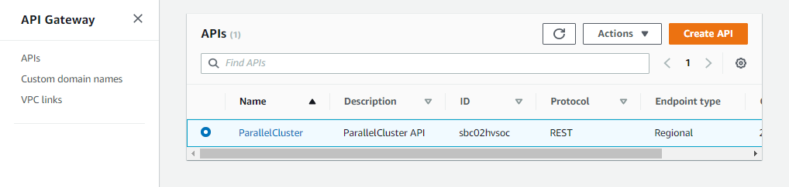
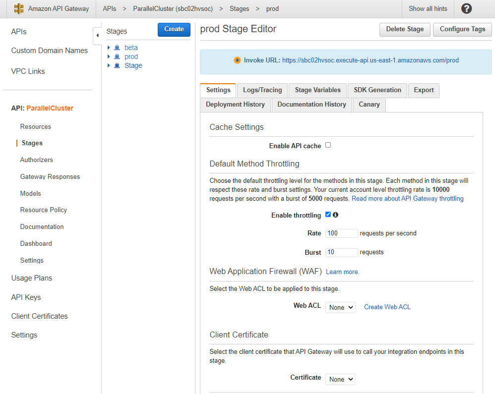
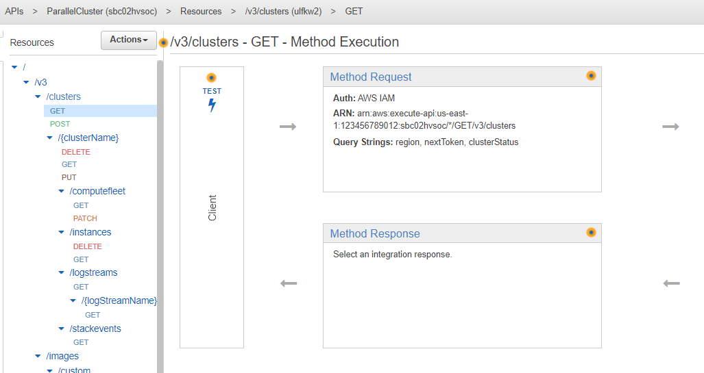
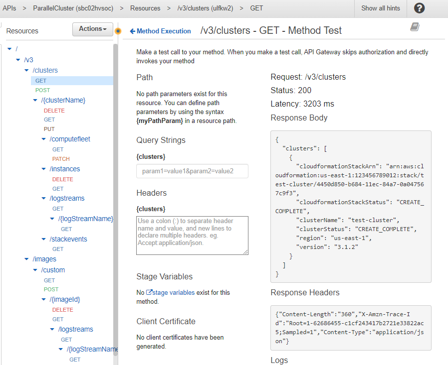

# Using the AWS ParallelCluster API

In this tutorial, you build and test the API with [Amazon API Gateway](../../../apigateway/latest/developerguide/welcome.md "../../../apigateway/latest/developerguide/welcome.md") and an AWS ParallelCluster CloudFormation template. Then, you use the example client available on GitHub to use the API. For more
information about using the API, see the [AWS ParallelCluster API](api-reference-v3.md "api-reference-v3.md").

For more information, see [Create a custom component with Image Builder](../../../imagebuilder/latest/userguide/create-component.md "../../../imagebuilder/latest/userguide/create-component.md") in the _EC2 Image Builder User Guide_.

When using the AWS ParallelCluster command line interface (CLI) or API, you only pay for
the AWS resources that are created when you create or update AWS ParallelCluster images and clusters. For more information,
see [AWS services used by AWS ParallelCluster](aws-services-v3.md "aws-services-v3.md").

###### Prerequisites

- The AWS CLI is [installed](../../../cli/latest/userguide/getting-started-install.md "../../../cli/latest/userguide/getting-started-install.md") and configured in your compute environment.
- AWS ParallelCluster is installed in a virtual environment. For more information,
  see [Install AWS ParallelCluster in a virtual environment (recommended)](install-v3-virtual-environment.md "install-v3-virtual-environment.md").
- You have an [Amazon EC2 key pair](../../../AWSEC2/latest/UserGuide/ec2-key-pairs.md "../../../AWSEC2/latest/UserGuide/ec2-key-pairs.md").
- You have an IAM role with the [permissions](iam-roles-in-parallelcluster-v3.md#iam-roles-in-parallelcluster-v3-example-user-policies "iam-roles-in-parallelcluster-v3.md#iam-roles-in-parallelcluster-v3-example-user-policies") that are required to run the [pcluster](pcluster-v3.md "pcluster-v3.md") CLI.

###### Stay in your home user directory and activate your virtual environment:

1. Install a helpful JSON command line processor.

```
``$` sudo yum groupinstall -y "Development Tools"
 sudo yum install -y jq python3-devel`
```

2. Run the following command to get your AWS ParallelCluster version and assign it to an environment variable.

```
``$` PCLUSTER_VERSION=$(pcluster version | jq -r '.version')
 echo "export PCLUSTER_VERSION=${PCLUSTER_VERSION}" |tee -a ~/.bashrc`
```

3. Create an environment variable and assign your Region ID to it.

```
``$` export AWS_DEFAULT_REGION=`"us-east-1"`
 echo "export AWS_DEFAULT_REGION=${AWS_DEFAULT_REGION}" |tee -a ~/.bashrc`
```

4. Run the following commands to deploy the API.

```
`API_STACK_NAME=`"pc-api-stack"`
 echo "export API_STACK_NAME=${API_STACK_NAME}" |tee -a ~/.bashrc`
```

```
`aws cloudformation create-stack \
 --region ${AWS_DEFAULT_REGION} \
 --stack-name ${API_STACK_NAME} \
 --template-url https://${AWS_DEFAULT_REGION}-aws-parallelcluster.s3.${AWS_DEFAULT_REGION}.amazonaws.com/parallelcluster/${PCLUSTER_VERSION}/api/parallelcluster-api.yaml \
 --capabilities CAPABILITY_NAMED_IAM CAPABILITY_AUTO_EXPAND \
 --parameters ParameterKey=EnableIamAdminAccess,ParameterValue=true`
     `{
 "StackId": "arn:aws:cloudformation:us-east-1:123456789012:stack/my-api-stack/abcd1234-ef56-gh78-ei90-1234abcd5678"
 }`
```

After the process completes, proceed to the next step.

1. Sign in to the AWS Management Console.
2. Navigate to the [Amazon API Gateway console](https://console.aws.amazon.com/apigateway/home "https://console.aws.amazon.com/apigateway/home").
3. Choose your API deployment.

 4. Choose **Stages** and select a stage.

 5. Note the URL that API Gateway provides for accessing or invoking your API. It's highlighted in blue. 6. Choose **Resources**, and select **`GET`** under **`/clusters`**. 7. Choose the **TEST** icon and then scroll down and choose **TEST** icon.



The response to your `/clusters GET` appears.


Clone the AWS ParallelCluster source code, `cd` to the `api` directory, and
install the Python client libraries.

1. ```
   ``$` git clone -b v${PCLUSTER_VERSION} https://github.com/aws/aws-parallelcluster aws-parallelcluster-v${PCLUSTER_VERSION}
    cd aws-parallelcluster-v${PCLUSTER_VERSION}/api`
   ```

```


```

``$` pip3 install client/src`

```
2. Navigate back to your home user directory.
3. Export the API Gateway base URL that the client uses when running.


```

``$` export PCLUSTER_API_URL=$( aws cloudformation describe-stacks --stack-name ${API_STACK_NAME} --query 'Stacks[0].Outputs[?OutputKey==`ParallelClusterApiInvokeUrl`].OutputValue' --output text )
 echo "export PCLUSTER_API_URL=${PCLUSTER_API_URL}" |tee -a ~/.bashrc`

```
4. Export a cluster name that the client uses to create a cluster.


```

``$` export CLUSTER_NAME="test-api-cluster"
echo "export CLUSTER_NAME=${CLUSTER_NAME}" |tee -a ~/.bashrc`

```
5. Run the following commands to store the credentials that the example client uses to access the API.


```

``$` export PCLUSTER_API_USER_ROLE=$( aws cloudformation describe-stacks --stack-name ${API_STACK_NAME} --query 'Stacks[0].Outputs[?OutputKey==`ParallelClusterApiUserRole`].OutputValue' --output text )
 echo "export PCLUSTER_API_USER_ROLE=${PCLUSTER_API_USER_ROLE}" |tee -a ~/.bashrc`

```
1. Copy the following example client code to `test_pcluster_client.py` in your home user directory. The client code makes requests
 to do the following:


	* Create the cluster.
	* Describe the cluster.
	* List the clusters.
	* Describe the compute fleet.
	* Describe the cluster instances.

```

# Copyright 2021 Amazon.com, Inc. or its affiliates. All Rights Reserved.

# SPDX-License-Identifier: MIT-0

#

# Permission is hereby granted, free of charge, to any person obtaining a copy of this

# software and associated documentation files (the "Software"), to deal in the Software

# without restriction, including without limitation the rights to use, copy, modify,

# merge, publish, distribute, sublicense, and/or sell copies of the Software, and to

# permit persons to whom the Software is furnished to do so.

#

# THE SOFTWARE IS PROVIDED "AS IS", WITHOUT WARRANTY OF ANY KIND, EXPRESS OR IMPLIED,

# INCLUDING BUT NOT LIMITED TO THE WARRANTIES OF MERCHANTABILITY, FITNESS FOR A

# PARTICULAR PURPOSE AND NONINFRINGEMENT. IN NO EVENT SHALL THE AUTHORS OR COPYRIGHT

# HOLDERS BE LIABLE FOR ANY CLAIM, DAMAGES OR OTHER LIABILITY, WHETHER IN AN ACTION

# OF CONTRACT, TORT OR OTHERWISE, ARISING FROM, OUT OF OR IN CONNECTION WITH THE

# SOFTWARE OR THE USE OR OTHER DEALINGS IN THE SOFTWARE.

#

# Author: Evan F. Bollig (Github: bollig)

import time, datetime
import os
import pcluster_client
from pprint import pprint
from pcluster_client.api import (
cluster_compute_fleet_api,
cluster_instances_api,
cluster_operations_api
)
from pcluster_client.model.create_cluster_request_content import CreateClusterRequestContent
from pcluster_client.model.cluster_status import ClusterStatus
region=os.environ.get("AWS_DEFAULT_REGION")

# Defining the host is optional and defaults to http://localhost

# See configuration.py for a list of all supported configuration parameters.

configuration = pcluster_client.Configuration(
host = os.environ.get("PCLUSTER_API_URL")
)
cluster_name=os.environ.get("CLUSTER_NAME")

# Enter a context with an instance of the API client

with pcluster_client.ApiClient(configuration) as api_client:
cluster_ops = cluster_operations_api.ClusterOperationsApi(api_client)
fleet_ops = cluster_compute_fleet_api.ClusterComputeFleetApi(api_client)
instance_ops = cluster_instances_api.ClusterInstancesApi(api_client)

    # Create cluster
    build_done = False
    try:
        with open('cluster-config.yaml', encoding="utf-8") as f:
            body = CreateClusterRequestContent(cluster_name=cluster_name, cluster_configuration=f.read())
            api_response = cluster_ops.create_cluster(body, region=region)
    except pcluster_client.ApiException as e:
        print("Exception when calling create_cluster: %s\n" % e)
        build_done = True
    time.sleep(60)

    # Confirm cluster status with describe_cluster
    while not build_done:
        try:
            api_response = cluster_ops.describe_cluster(cluster_name, region=region)
            pprint(api_response)
            if api_response.cluster_status == ClusterStatus('CREATE_IN_PROGRESS'):
                print('. . . working . . .', end='', flush=True)
                time.sleep(60)
            elif api_response.cluster_status == ClusterStatus('CREATE_COMPLETE'):
                print('READY!')
                build_done = True
            else:
                print('ERROR!!!!')
                build_done = True
        except pcluster_client.ApiException as e:
            print("Exception when calling describe_cluster: %s\n" % e)

    # List clusters
    try:
        api_response = cluster_ops.list_clusters(region=region)
        pprint(api_response)
    except pcluster_client.ApiException as e:
        print("Exception when calling list_clusters: %s\n" % e)

    # DescribeComputeFleet
    try:
        api_response = fleet_ops.describe_compute_fleet(cluster_name, region=region)
        pprint(api_response)
    except pcluster_client.ApiException as e:
        print("Exception when calling compute fleet: %s\n" % e)

    # DescribeClusterInstances
    try:
        api_response = instance_ops.describe_cluster_instances(cluster_name, region=region)
        pprint(api_response)
    except pcluster_client.ApiException as e:
        print("Exception when calling describe_cluster_instances: %s\n" % e)

```
2. Create a cluster configuration.


```

``$` pcluster configure --config cluster-config.yaml`

```
3. The API Client library automatically detects configuration details from your environment variables (for example,
 `AWS_ACCESS_KEY_ID`, `AWS_SECRET_ACCESS_KEY`, or `AWS_SESSION_TOKEN`) or `$HOME/.aws`. The
 following command switches your current IAM role to the designated ParallelClusterApiUserRole.


```

``$` eval $(aws sts assume-role --role-arn ${PCLUSTER_API_USER_ROLE} --role-session-name ApiTestSession | jq -r '.Credentials | "export AWS_ACCESS_KEY_ID=\(.AccessKeyId)\nexport AWS_SECRET_ACCESS_KEY=\(.SecretAccessKey)\nexport AWS_SESSION_TOKEN=\(.SessionToken)\n"')`

```

Error to watch for:


If you see an error similar to the following, you already assumed the ParallelClusterApiUserRole and your
 `AWS_SESSION_TOKEN` has expired.


```

An error occurred (AccessDenied) when calling the AssumeRole operation:
User: arn:aws:sts::XXXXXXXXXXXX:assumed-role/ParallelClusterApiUserRole-XXXXXXXX-XXXX-XXXX-XXXX-XXXXXXXXXXXX/ApiTestSession
is not authorized to perform: sts:AssumeRole on resource: arn:aws:iam::XXXXXXXXXXXX:role/ParallelClusterApiUserRole-XXXXXXXX-XXXX-XXXX-XXXX-XXXXXXXXXXXX

```

Drop the role and then re-run the `aws sts assume-role` command to use the ParallelClusterApiUserRole.


```

``$` unset AWS_SESSION_TOKEN
unset AWS_SECRET_ACCESS_KEY
unset AWS_ACCESS_KEY_ID`

```

To provide your current user permissions for API access, you must
 [expand the Resource Policy](../../../apigateway/latest/developerguide/apigateway-resource-policies.md "../../../apigateway/latest/developerguide/apigateway-resource-policies.md").
4. Run the following command to test the example client.


```

``$` python3 test_pcluster_client.py``{'cluster_configuration': 'Region: us-east-1\n'
'Image:\n'
' Os: alinux2\n'
'HeadNode:\n'
' InstanceType: t2.micro\n'
' Networking . . . :\n'
' SubnetId: subnet-1234567890abcdef0\n'
' Ssh:\n'
' KeyName: adpc\n'
'Scheduling:\n'
' Scheduler: slurm\n'
' SlurmQueues:\n'
' - Name: queue1\n'
' ComputeResources:\n'
' - Name: t2micro\n'
' InstanceType: t2.micro\n'
' MinCount: 0\n'
' MaxCount: 10\n'
' Networking . . . :\n'
' SubnetIds:\n'
' - subnet-1234567890abcdef0\n',
'cluster_name': 'test-api-cluster'}
{'cloud_formation_stack_status': 'CREATE_IN_PROGRESS',
'cloudformation_stack_arn': 'arn:aws:cloudformation:us-east-1:123456789012:stack/test-api-cluster/abcd1234-ef56-gh78-ij90-1234abcd5678',
'cluster_configuration': {'url': 'https://parallelcluster-021345abcdef6789-v1-do-not-delete...},
'cluster_name': 'test-api-cluster',
'cluster_status': 'CREATE_IN_PROGRESS',
'compute_fleet_status': 'UNKNOWN',
'creation_time': datetime.datetime(2022, 4, 28, 16, 18, 47, 972000, tzinfo=tzlocal()),
'last_updated_time': datetime.datetime(2022, 4, 28, 16, 18, 47, 972000, tzinfo=tzlocal()),
'region': 'us-east-1',
'tags': [{'key': 'parallelcluster:version', 'value': '3.1.3'}],
'version': '3.1.3'}
.
.
.
. . . working . . . {'cloud_formation_stack_status': 'CREATE_COMPLETE',
'cloudformation_stack_arn': 'arn:aws:cloudformation:us-east-1:123456789012:stack/test-api-cluster/abcd1234-ef56-gh78-ij90-1234abcd5678',
'cluster_configuration': {'url': 'https://parallelcluster-021345abcdef6789-v1-do-not-delete...},
'cluster_name': 'test-api-cluster',
'cluster_status': 'CREATE_COMPLETE',
'compute_fleet_status': 'RUNNING',
'creation_time': datetime.datetime(2022, 4, 28, 16, 18, 47, 972000, tzinfo=tzlocal()),
'head_node': {'instance_id': 'i-abcdef01234567890',
'instance_type': 't2.micro',
'launch_time': datetime.datetime(2022, 4, 28, 16, 21, 46, tzinfo=tzlocal()),
'private_ip_address': '172.31.27.153',
'public_ip_address': '52.90.156.51',
'state': 'running'},
'last_updated_time': datetime.datetime(2022, 4, 28, 16, 18, 47, 972000, tzinfo=tzlocal()),
'region': 'us-east-1',
'tags': [{'key': 'parallelcluster:version', 'value': '3.1.3'}],
'version': '3.1.3'}
READY!`

```
1. Copy the following example client code to `delete_cluster_client.py`. The client code makes a request to delete the cluster.


```

# Copyright 2021 Amazon.com, Inc. or its affiliates. All Rights Reserved.

# SPDX-License-Identifier: MIT-0

#

# Permission is hereby granted, free of charge, to any person obtaining a copy of this

# software and associated documentation files (the "Software"), to deal in the Software

# without restriction, including without limitation the rights to use, copy, modify,

# merge, publish, distribute, sublicense, and/or sell copies of the Software, and to

# permit persons to whom the Software is furnished to do so.

#

# THE SOFTWARE IS PROVIDED "AS IS", WITHOUT WARRANTY OF ANY KIND, EXPRESS OR IMPLIED,

# INCLUDING BUT NOT LIMITED TO THE WARRANTIES OF MERCHANTABILITY, FITNESS FOR A

# PARTICULAR PURPOSE AND NONINFRINGEMENT. IN NO EVENT SHALL THE AUTHORS OR COPYRIGHT

# HOLDERS BE LIABLE FOR ANY CLAIM, DAMAGES OR OTHER LIABILITY, WHETHER IN AN ACTION

# OF CONTRACT, TORT OR OTHERWISE, ARISING FROM, OUT OF OR IN CONNECTION WITH THE

# SOFTWARE OR THE USE OR OTHER DEALINGS IN THE SOFTWARE.

#

# Author: Evan F. Bollig (Github: bollig)

import time, datetime
import os
import pcluster_client
from pprint import pprint
from pcluster_client.api import (
cluster_compute_fleet_api,
cluster_instances_api,
cluster_operations_api
)
from pcluster_client.model.create_cluster_request_content import CreateClusterRequestContent
from pcluster_client.model.cluster_status import ClusterStatus
region=os.environ.get("AWS_DEFAULT_REGION")

# Defining the host is optional and defaults to http://localhost

# See configuration.py for a list of all supported configuration parameters.

configuration = pcluster_client.Configuration(
host = os.environ.get("PCLUSTER_API_URL")
)
cluster_name=os.environ.get("CLUSTER_NAME")

# Enter a context with an instance of the API client

with pcluster_client.ApiClient(configuration) as api_client:
cluster_ops = cluster_operations_api.ClusterOperationsApi(api_client)

    # Delete the cluster
    gone = False
    try:
        api_response = cluster_ops.delete_cluster(cluster_name, region=region)
    except pcluster_client.ApiException as e:
        print("Exception when calling delete_cluster: %s\n" % e)
    time.sleep(60)

    # Confirm cluster status with describe_cluster
    while not gone:
        try:
            api_response = cluster_ops.describe_cluster(cluster_name, region=region)
            pprint(api_response)
            if api_response.cluster_status == ClusterStatus('DELETE_IN_PROGRESS'):
                print('. . . working . . .', end='', flush=True)
                time.sleep(60)
        except pcluster_client.ApiException as e:
            gone = True
            print("DELETE COMPLETE or Exception when calling describe_cluster: %s\n" % e)

```
2. Run the following command to delete the cluster.


```

``$` python3 delete_cluster_client.py``{'cloud_formation_stack_status': 'DELETE_IN_PROGRESS',
'cloudformation_stack_arn': 'arn:aws:cloudformation:us-east-1:123456789012:stack/test-api-cluster/abcd1234-ef56-gh78-ij90-1234abcd5678',
'cluster_configuration': {'url': 'https://parallelcluster-021345abcdef6789-v1-do-not-delete...},
'cluster_name': 'test-api-cluster',
'cluster_status': 'DELETE_IN_PROGRESS',
'compute_fleet_status': 'UNKNOWN',
'creation_time': datetime.datetime(2022, 4, 28, 16, 50, 47, 943000, tzinfo=tzlocal()),
'head_node': {'instance_id': 'i-abcdef01234567890',
'instance_type': 't2.micro',
'launch_time': datetime.datetime(2022, 4, 28, 16, 53, 48, tzinfo=tzlocal()),
'private_ip_address': '172.31.17.132',
'public_ip_address': '34.201.100.37',
'state': 'running'},
'last_updated_time': datetime.datetime(2022, 4, 28, 16, 50, 47, 943000, tzinfo=tzlocal()),
'region': 'us-east-1',
'tags': [{'key': 'parallelcluster:version', 'value': '3.1.3'}],
'version': '3.1.3'}
.
.
.
. . . working . . . {'cloud_formation_stack_status': 'DELETE_IN_PROGRESS',
'cloudformation_stack_arn': 'arn:aws:cloudformation:us-east-1:123456789012:stack/test-api-cluster/abcd1234-ef56-gh78-ij90-1234abcd5678',
'cluster_configuration': {'url': 'https://parallelcluster-021345abcdef6789-v1-do-not-delete...},
'cluster_name': 'test-api-cluster',
'cluster_status': 'DELETE_IN_PROGRESS',
'compute_fleet_status': 'UNKNOWN',
'creation_time': datetime.datetime(2022, 4, 28, 16, 50, 47, 943000, tzinfo=tzlocal()),
'last_updated_time': datetime.datetime(2022, 4, 28, 16, 50, 47, 943000, tzinfo=tzlocal()),
'region': 'us-east-1',
'tags': [{'key': 'parallelcluster:version', 'value': '3.1.3'}],
'version': '3.1.3'}
. . . working . . . DELETE COMPLETE or Exception when calling describe_cluster: (404)
Reason: Not Found
.
.
.
HTTP response body: {"message":"Cluster 'test-api-cluster' does not exist or belongs to an incompatible ParallelCluster major version."}`

```
3. After you are finished testing, unset the environment variables.


```

``$` unset AWS_SESSION_TOKEN
unset AWS_SECRET_ACCESS_KEY
unset AWS_ACCESS_KEY_ID`

```
You can use the AWS Management Console or AWS CLI to delete your API.

1. From the CloudFormation console, choose the API stack and then choose **Delete**.
2. Run the following command if using the AWS CLI.


Using CloudFormation.


```

``$` aws cloudformation delete-stack --stack-name ${API_STACK_NAME}`

```

```
