# AWS ParallelCluster UI Integration with Identity Center

The goal of this tutorial is to demonstrate how to integrate AWS ParallelCluster UI with IAM Identity Center for a single sign-on solution that unifies users in Active Directory that can be shared with AWS ParallelCluster clusters.

When using AWS ParallelCluster, you only pay for
the AWS resources that are created when you create or update AWS ParallelCluster images and clusters. For more information,
see [AWS services used by AWS ParallelCluster](aws-services-v3.md "aws-services-v3.md").

###### Prerequisites:

- An existing AWS ParallelCluster UI which can be installed following the instructions
  [here.](install-pcui-v3.md "install-pcui-v3.md")
- An existing Managed Active Directory, preferably one that you will also use for
  [integrating with AWS ParallelCluster](tutorials_05_multi-user-ad.md "tutorials_05_multi-user-ad.md").

## Enable IAM Identity Center

If you already have an identity center connected to the your AWS Managed Microsoft AD (Active Directory) it can be used and you can skip to the section **Adding your Application to IAM Identity Center**.

If you do not already have an identity center connected to an AWS Managed Microsoft AD, follow the steps below to set it up.

Enabling Identity Center

1. In the console, navigate to IAM Identity Center. (Make sure you are in the region in which you have your AWS Managed Microsoft AD.)
2. Click the **Enable** button, this may ask if you want to enable organizations, this is a requirement so you can select to enable it. **Note** : This will email the administrator of your account with a confirmation email that you should follow the link to confirm.

Connecting Identity Center to Managed AD

1. On the next page after enabling identity center you should see Recommended Set Up Steps, under Step 1, select **Choose Your Identity Source**.
2. In the Identity Source section, click on the **Actions** drop down menu (in the top right), then select **Change Identity Source**.
3. Select **Active Directory**.
4. Under **Existing Directories**, choose your directory.
5. Click Next.
6. Review your changes, scroll to the bottom, type ACCEPT into the text box to confirm, then click **Change Identity Source**.
7. Wait for the changes to complete, then you should see a green banner at the top.

Syncing users and groups to Identity Center

1. In the green banner click **Start Guided Setup** (button in the top right one)

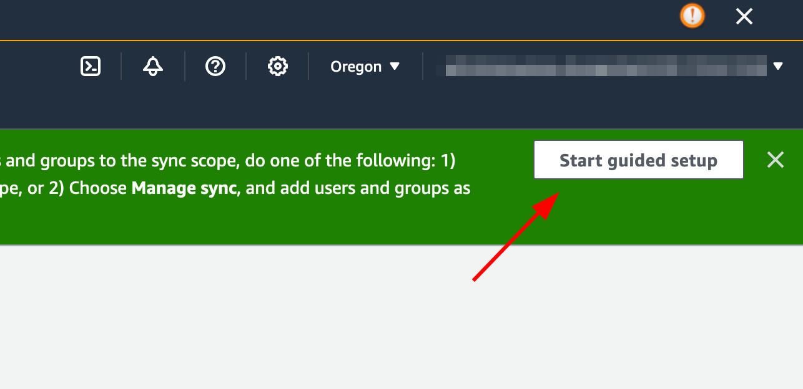 2. In the **Configure Attribute Mappings**, click **Next** 3. In the Configure sync scope section, type in the name of the users you want synced to identity center, then click **Add** 4. Once finished adding users and groups, click **Next**

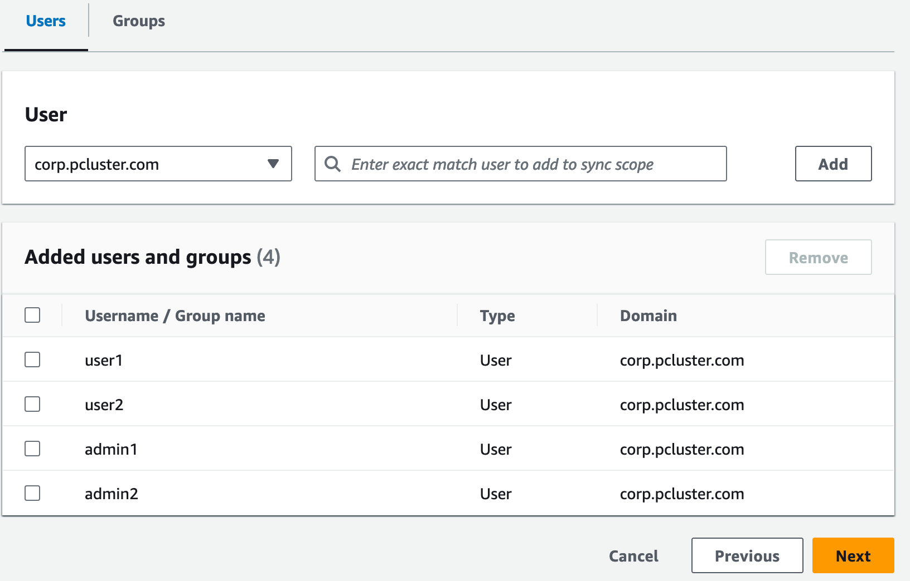 5. Review your changes, then click **Save configuration** 6. If you see a warning in the next screen about users not being synced, select the **Resume sync button** in the top right. 7. Next, to enable users, In the **Users** tab on the left, select a user and then click **Enable user access** > **Enable user access**

**Note**: You may need to select Resume sync if you have a warning banner at the top and then wait for users to sync (try the refresh button to see if they are synced yet).

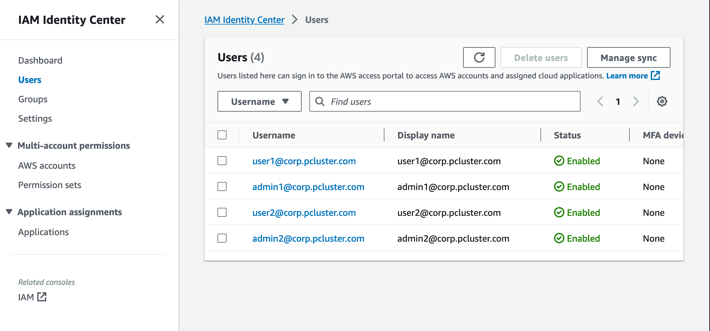

## Adding your Application to IAM Identity Center

Once you have synced your users with IAM Identity Center, you will need to add a new application. This configures which SSO enabled applications will be available from your IAM Identity Center portal. In this case, we will be adding AWS ParallelCluster UI as an application while IAM Identity Center will be the identity provider.

The next step will add the AWS ParallelCluster UI as an application in IAM Identity
Center. AWS ParallelCluster UI is a web portal that helps the user to manage their clusters.
For more information see [AWS ParallelCluster UI](pcui-using-v3.md "pcui-using-v3.md").

Setting up the application in Identity Center

1. Under **IAM Identity Center** > **Applications** (found on the left menu bar, click on Applications)
2. Click **Add Application**
3. Select **Add custom SAML 2.0 application**
4. Click **Next**
5. Select the display name and description you would like to use (e.g. PCUI and AWS ParallelCluster UI)
6. Under **IAM Identity Center metadata**, copy the link for IAM Identity Center SAML metadata file and save for later, this will be used when configuring SSO on the web app
7. Under **Application properties**, in the Application start URL, put your PCUI address. This can be found by going to the CloudFormation console, selecting the stack that corresponds to PCUI (e.g. parallelcluster-ui) and going to the **Outputs** tab to find ParallelClusterUIUrl

e.g. https://m2iwazsi1j.execute-api.us-east-1.amazonaws.com 8. Under **Application metadata**, choose **Manually type your metadata values**. Then provide the following values.

    1. **Important**: Make sure to replace the domain-prefix, region, and userpool-id values with information that's specific to your environment.
    2. The domain prefix, region and userpool-id can be obtained by opening the **Amazon Cognito** > **User pools console**

    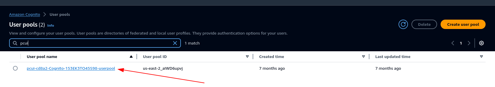
    3. Select the user pool that corresponds to PCUI (which will have a User pool name like pcui-cd8a2-Cognito-153EK3TO45S98-userpool)
    4. Navigate to **App Integration**

    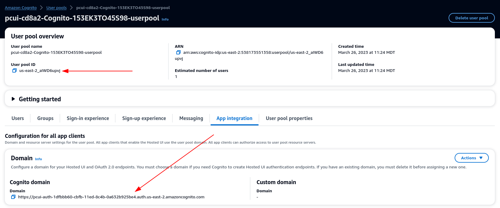

9. Application Assertion Consumer Service (ACS) URL: https://<domain-prefix>.auth.<region>.amazoncognito.com/saml2/idpresponse

Application SAML audience: urn:amazon:cognito:sp:<userpool-id> 10. Choose **Submit**. Then, go to the **Details** page for the application that you added. 11. Select the **Actions** dropdown list and choose **Edit attribute mappings**. Then, provide the following attributes.

    1. User attribute in the application: **subject** (Note: **subject** is prefilled.) → Maps to this string value or user attribute in IAM Identity Center: **${user:email}**, Format: **emailAddress**
    2. User attribute in the application: **email** → Maps to this string value or user attribute in IAM Identity Center: **${user:email}**, Format: **unspecified**

    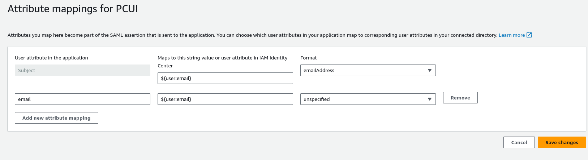

12. Save your changes.
13. Choose the **Assign Users** button and then assign your user to the application. These are the users in your Active Directory that will have access to the PCUI interface.

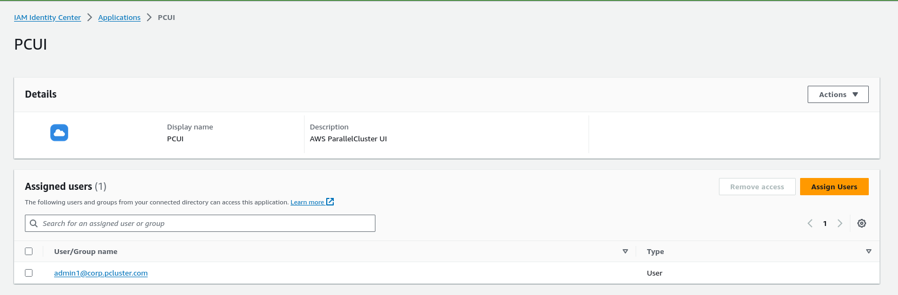

Configure IAM Identity Center as a SAML IdP in your user pool

1. In your user pool settings, select **Sign-in experience** > **Add identity provider**

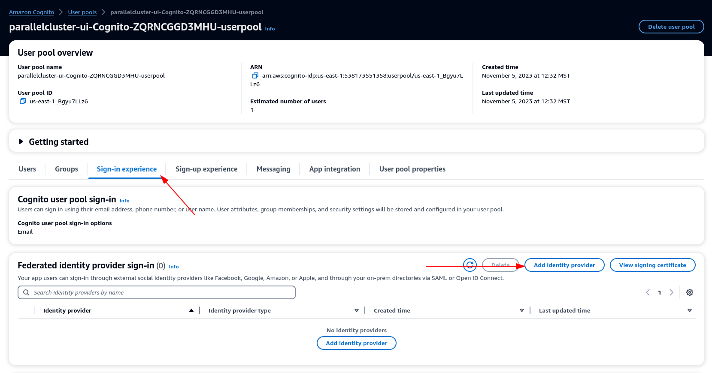 2. Choose a SAML IdP 3. For **Provider name** provide **IdentityCenter** 4. Under **Metadata document source** choose **Enter metadata document endpoint URL** and provide the URL copied during the Application setup of Identity Center 5. Under the **Attributes**, for email choose email

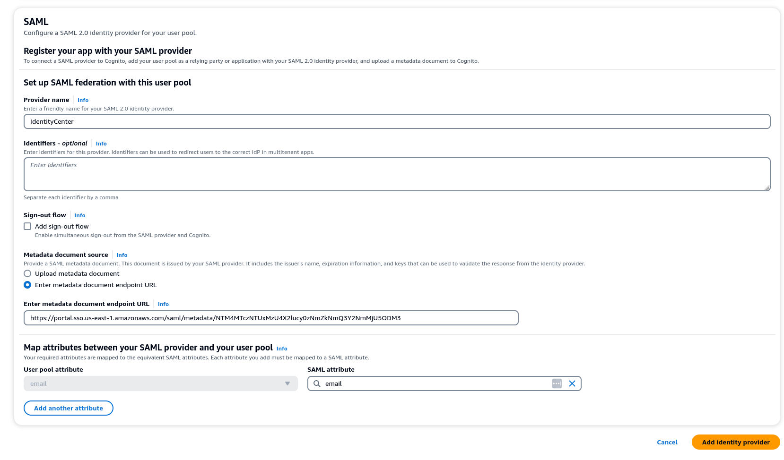 6. Select **Add identity provider**.

Integrate the IdP with the user pool app client

1. Next, under the **App Integration** section of your user pool, choose the client listed under **App client list**

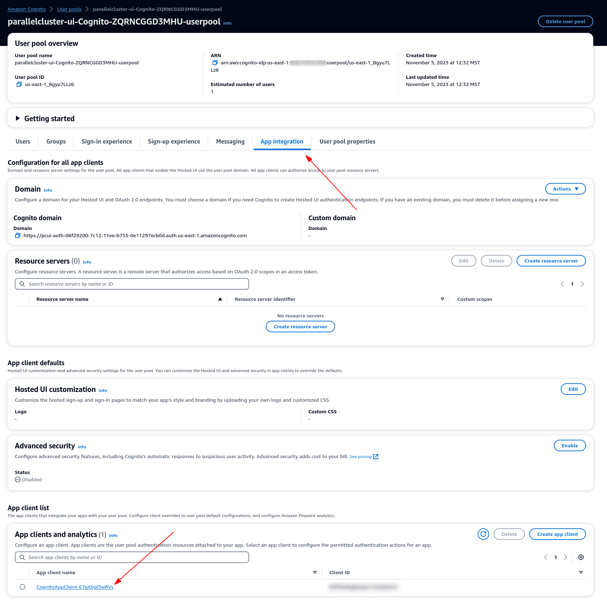 2. Under **Hosted UI** choose **Edit** 3. Under **Identity providers** choose **IdentityCenter** as well. 4. Choose **Save changes**

Validate your setup

1. Next we will validate the setup that we just created by logging in to PCUI. Sign in to your PCUI portal and you should now see an option to sign in with your Corporate ID:

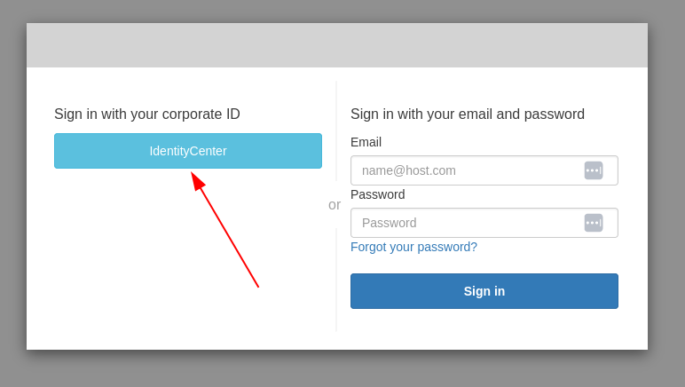 2. Clicking the **IdentityCenter** button should take you to the IAM Identity Center IdP login followed by a page with your applications on it which includes PCUI, open that application. 3. Once you get to the following screen, your user will have been added to the Cognito user pool.

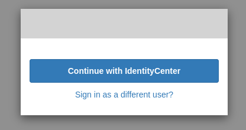

Make your user an administrator

1. Now navigate to the **Amazon Cognito** > **User pools console** and select the newly created user which should have a prefix of identitycenter

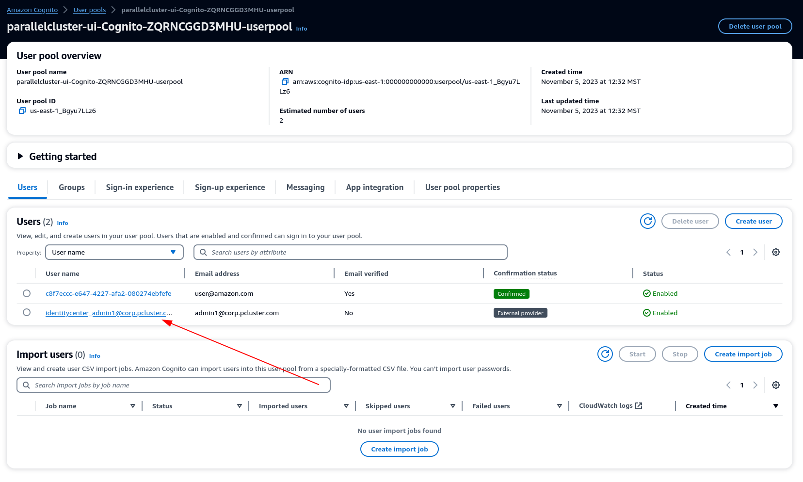 2. Under **Group memberships** select **Add user to group**, choose **admin** and click **Add**. 3. Now when you click **Continue with IdentityCenter** you will be navigated to the AWS ParallelCluster UI page.
