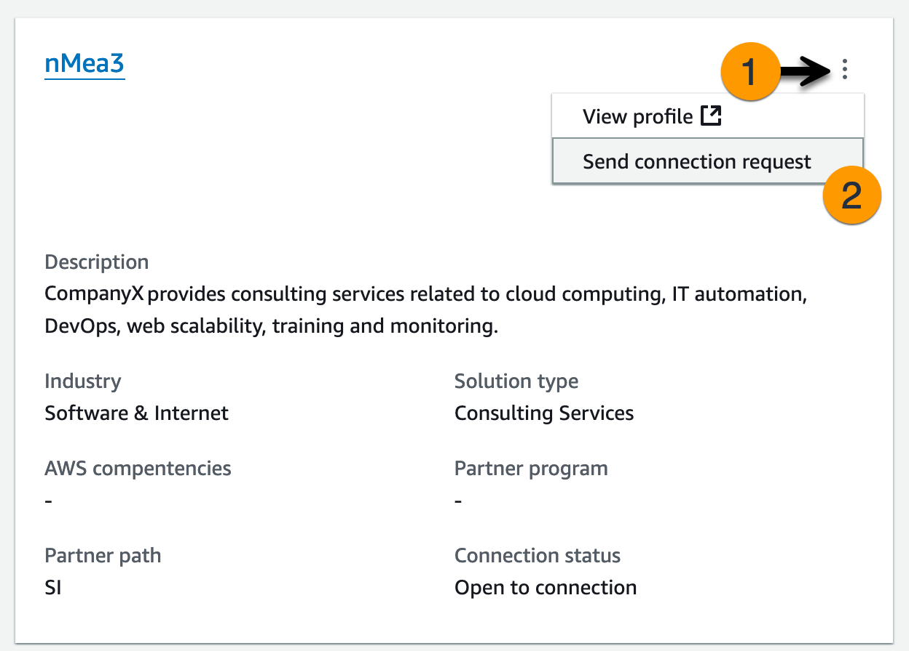

# Partner connections

You can discover other AWS Partners to connect and collaborate with by going to **Partner
connections**. Once you've connected with other partners, you can manage your
connections from the same page. An existing connection is required to collaborate on a
multi-partner opportunity together.

###### Note

Only AWS Partners who have linked their AWS Partner Central account with their AWS Marketplace account can use
Partner connections. You can use any AWS account to complete the linking process. For more
information, see [Linking AWS Partner Central
accounts with AWS Marketplace seller accounts](../getting-started/account-linking.md "../getting-started/account-linking.md").

###### To access partner connections:

1. Sign in to [AWS Partner Central](https://partnercentral.awspartner.com/partnercentral2/s/login "https://partnercentral.awspartner.com/partnercentral2/s/login").
2. From the top navigation, choose **Partner connections**.

You can use **Find and connect** to discover other AWS Partners and send connection requests. Use **Manage partner connections** to
respond to connection invitations and manage your active connections.

###### Topics

- [Finding and connecting with partners](#finding-connecting-partners "#finding-connecting-partners")
- [Managing connections](#managing-partner-connections "#managing-partner-connections")

## Finding and connecting with partners

From **Find and connect**, you can search for partners to connect with
using either the **Partner finder** or the **AI-recommended
connections**. Use the search criteria provided in Partner finder to refine your search
and find partners who align. AI-recommended connections provides you with suggestions based on
your profile and open opportunities.

###### To send a connection request:

1. When you have found a partner to connect with, choose the options menu in their info
   card.
2. Choose **Send connection request**.
3. In the **Send connection request** modal, enter your introduction in
   **Message to partner**, and choose **Send connection
   request**.

_Partner connections — Send a connection request_

## Managing connections

From **Manage partner connections**, you can manage existing partner connections as well as both incoming and outgoing connection requests.

###### To respond to a connection request:

You can respond to any connection request with the **Request status** as **Pending response**.

1. From **Connection requests**, select a connection. Alternatively, you can choose the **Connection ID** to view details and respond.
2. Choose **Accept** or **Reject**.

Connection requests can have the following statuses:

- Pending response—Waiting for a response from the recipient.
- Cancelled—The sender cancelled the request.
- Rejected—The recipient rejected the request.

###### To end a connection:

If you no longer want to be connected to a partner, you can end the connection.

1. Select the partner you no longer want to be connected with. Alternatively, you can also
   choose the partner to view details.
2. Choose **End connection**.

Your connections can have the following statuses:

- Connected—This connection is active, and you can share opportunities with this
  partner.
- Not connected—This connection has ended, and you can no longer share opportunities
  with this partner. Either partner can end a connection.
