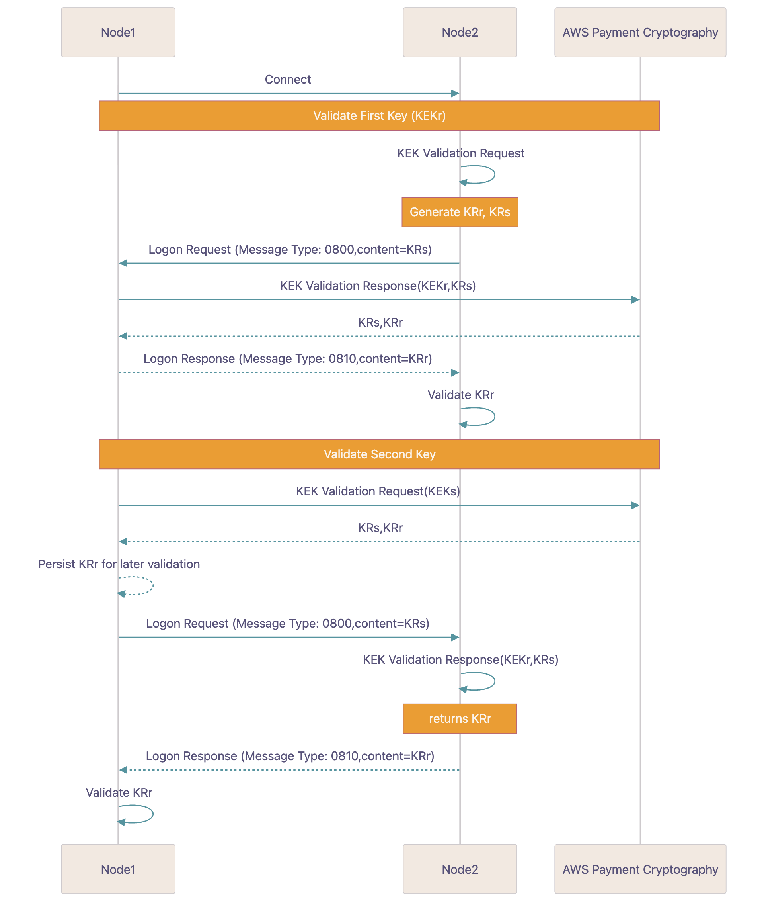

# Validation of KEK


When your service (node1) connects to node2, each side will ensure
that they are using the same KEK for subsequent operations using a process called KEK Validation.

**1. Steps to validate the first key**

**1.1 Receive KRs**

Node2 will generate a KRs and send it to you as part of the logon process. They may use AWS Payment Cryptography to generate
this value or another solution.

**1.2 Generate KEK Validation Response**

Your node will generate a KEK Validation response with inputs as the KEK(r) and the KRs provided in step 1.

```
`cat >> generate-kek-validation-response.json
{
 "KekValidationType": {
 "KekValidationResponse": {
 "RandomKeySend": "9217DC67B8763BABCFDF3DADFCD0F84A"
 }
 },
 "RandomKeySendVariantMask": "VARIANT_MASK_82",
 "KeyIdentifier": "arn:aws:payment-cryptography:us-east-2:111122223333:key/ov6icy4ryas4zcza"
}`

```

```
`$` `aws payment-cryptography-data generate-as2805-kek-validation --cli-input-json file://generate-kek-validation-response.json`
```

```
`{
 "KeyArn": "arn:aws:payment-cryptography:us-east-2:111122223333:key/ov6icy4ryas4zcza",
 "KeyCheckValue": "0A3674",
 "RandomKeyReceive": "A4B7E249C40C98178C1B856DB7FB76EB",
 "RandomKeySend": "9217DC67B8763BABCFDF3DADFCD0F84A"
}`
```

**1.3 Return calculated KRr**

Return the calculated KRr to node2. That node will compare it against the calculated value from step 1.

**2.Steps to validate the second key**

**2.1 Generate KRr and KRs**

Your node will generate a random value and an inverted(reversed) copy of this value using AWS Payment Cryptography.
The service will output both of these values wrapped by the KEK(s). These are known as KR(s) and KR(r).

```
`cat >> generate-kek-validation-request.json
{
 "KekValidationType": {
 "KekValidationRequest": {
 "DeriveKeyAlgorithm": "TDES_2KEY"
 }
 },
"RandomKeySendVariantMask": "VARIANT_MASK_82",
 "KeyIdentifier": "arn:aws:payment-cryptography:us-east-2:111122223333:key/rhfm6tenpxapkmrv"
}`

```

```
`$` `aws payment-cryptography-data generate-as2805-kek-validation --cli-input-json file://generate-kek-validation-request.json`
```

```
`{
 "KeyArn": "arn:aws:payment-cryptography:us-east-2:111122223333:key/rhfm6tenpxapkmrv",
 "KeyCheckValue": "DC1081",
 "RandomKeyReceive": "A4B7E249C40C98178C1B856DB7FB76EB",
 "RandomKeySend": "9217DC67B8763BABCFDF3DADFCD0F84A"
}`
```

**2.2 Send KRs to node2**

Send the KRs to node2. Keep the KRr for later validation.

**2.3 Node2 generates KEK validation response**

Node2 uses the KEKr and KRs, generates the KRr and sends it back to your service.

**2.4 Validate response**

Compare KRr from step 1 and the value returned from step 3. If they match, proceed.
