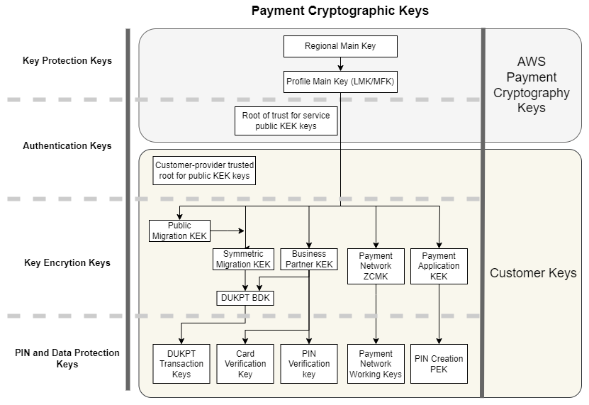

# Foundations

The topics in this chapter describe the cryptographic primitives of AWS Payment Cryptography and where they are used.
They also introduce the basic elements of the service.

###### Topics

- [Cryptographic primitives](#w4aac36c19b7 "#w4aac36c19b7")
- [Entropy and random number generation](#w4aac36c19b9 "#w4aac36c19b9")
- [Symmetric key operations](#w4aac36c19c11 "#w4aac36c19c11")
- [Asymmetric key operations](#w4aac36c19c13 "#w4aac36c19c13")
- [Key storage](#w4aac36c19c15 "#w4aac36c19c15")
- [Key import using symmetric keys](#w4aac36c19c17 "#w4aac36c19c17")
- [Key import using asymmetric keys](#w4aac36c19c19 "#w4aac36c19c19")
- [Key export](#w4aac36c19c21 "#w4aac36c19c21")
- [Derived Unique Key Per Transaction (DUKPT) protocol](#w4aac36c19c23 "#w4aac36c19c23")
- [Key hierarchy](#w4aac36c19c25 "#w4aac36c19c25")

## Cryptographic primitives

AWS Payment Cryptography uses parameter-able, standard cryptographic algorithms so that applications can implement the algorithms needed for their use case. The set of cryptographic algorithms is defined by PCI, ANSI X9, EMVco, and ISO standards.
All cryptography is performed by PCI PTS HSM standard-listed HSMs running in PCI mode.

## Entropy and random number generation

AWS Payment Cryptography key generation is performed on the AWS Payment Cryptography HSMs. The HSMs implement a random number generator that meets the PCI PTS HSM requirement for all supported key types and parameters.

## Symmetric key operations

Symmetric key algorithms and key strengths defined in ANSI X9 TR 31, ANSI X9.24, and PCI PIN Annex C are supported:

- Hash functions
  — Algorithms from the SHA2 and SHA3 family with output size greater than 2551. Except for backwards compatibility with pre-PCI PTS POI v3 terminals.
- Encryption and decryption
  — AES with key size greater than or equal to 128 bits, or TDEA with keys size greater than or equal to 112 bits (2 key or 3 key).
- Message Authentication Codes (MACs)
  CMAC or GMAC with AES, as well as HMAC with an approved hash function and a key size greater than or equal to 128.

AWS Payment Cryptography uses AES 256 for HSM main keys, data protection keys, and TLS session keys.

Note: Some of the listed functions are used internally to support standard protocols and data structures. See the API documentation for algorithms supported by specific actions.

## Asymmetric key operations

Asymmetric key algorithms and key strengths defined in ANSI X9 TR 31, ANSI X9.24, and PCI PIN Annex C are supported:

- Approved key establishment schemes — as described in NIST SP800-56A (ECC/FCC2-based key agreement), NIST SP800-56B (IFC-based key agreement), and NIST SP800-38F (AES-based key encryption/wrapping).

AWS Payment Cryptography hosts only allow connections to the service using TLS with a cipher suite that provides [perfect forward secrecy](https://nvlpubs.nist.gov/nistpubs/SpecialPublications/NIST.SP.800-52r2.pdf "https://nvlpubs.nist.gov/nistpubs/SpecialPublications/NIST.SP.800-52r2.pdf").

Note: Some of the listed functions are used internally to support standard protocols and data structures. See the API documentation for algorithms supported by specific actions.

## Key storage

AWS Payment Cryptography keys are protected by HSM AES 256 main keys and stored in ANSI X9 TR 31 key blocks in an encrypted database. The database is replicated to in-memory database on AWS Payment Cryptography servers.

According to PCI PIN Security Normative Annex C, AES 256 keys are equally as strong as or stronger than:

- 3-key TDEA
- RSA 15360 bit
- ECC 512 bit
- DSA, DH, and MQV 15360/512

## Key import using symmetric keys

AWS Payment Cryptography supports import of cryptograms and key blocks with symmetric
or public keys with a symmetric key encryption key (KEK) that is as strong or
stronger than the protected key for import.

## Key import using asymmetric keys

AWS Payment Cryptography supports import of cryptograms and key blocks with symmetric or public keys protected by a private key encryption key (KEK) that is as strong or stronger than the protected key for import.
The public key provided for decryption must have its authenticity and integrity ensured by a certificate from an authority trusted by the customer.

Public KEK provided by AWS Payment Cryptography have the authentication and integrity protection of a certificate authority (CA) with attested compliance to PCI PIN Security and PCI P2PE Annex A.

## Key export

Keys can be exported and protected by keys with the appropriate KeyUsage and that are as strong as or stronger than the key to be exported.

## Derived Unique Key Per Transaction (DUKPT) protocol

AWS Payment Cryptography supports with TDEA and AES base derivation keys (BDK) as described by ANSI X9.24-3.

## Key hierarchy

The AWS Payment Cryptography key hierarchy ensures that keys are always protected by keys as strong as or stronger than the keys they protect.

AWS Payment Cryptography keys are used for key protection within the service:

| Key                                                                             | Description                                                                                                                                                                                                                                                                                  |
| ------------------------------------------------------------------------------- | -------------------------------------------------------------------------------------------------------------------------------------------------------------------------------------------------------------------------------------------------------------------------------------------- |
| Regional Main Key                                                               | Protects virtual HSM images, or profiles, used for cryptographic processing. This key exists only in HSM and secure backups.                                                                                                                                                                 |
| Profile Main Key                                                                | Top level customer key protection key, traditionally called a Local Master Key (LMK) or Master File Key (MFK) for customer keys. This key exists only in HSM and secure backups. Profiles define distinct HSM configurations as required by security standards for payments use cases. |
| Root of trust for AWS Payment Cryptography public key encryption key (KEK) keys | The trusted root public key and certificate for authenticating and validating public keys supplied by AWS Payment Cryptography for key import and export using asymmetric keys.                                                                                                              |

Customer keys are grouped by keys used to protect other keys and keys that protect payment-related data. These are examples of customer keys of both types:

| Key                                                                  | Description                                                                                                                                                                                                                                                                                                                                                                                                                          |
| -------------------------------------------------------------------- | ------------------------------------------------------------------------------------------------------------------------------------------------------------------------------------------------------------------------------------------------------------------------------------------------------------------------------------------------------------------------------------------------------------------------------------ |
| Customer-provided trusted root for public KEK keys                   | Public key and certificate supplied by you as the root of trust for authenticating and validating public keys that you supply for key import and export using asymmetric keys.                                                                                                                                                                                                                                                       |
| Key Encryption Keys (KEK)                                            | KEK are used solely to encrypt other keys for exchange between external key stores and AWS Payment Cryptography, business partners, payment networks, or different applications within your organization.                                                                                                                                                                                                                            |
| Derived Unique Key Per Transaction (DUKPT) base derivation key (BDK) | BDKs are used to create unique keys for each payment terminal and translate transactions from multiple terminals to a single acquiring bank, or acquirer, working key. The best practice, which is required by PCI Point-to-Point Encryption (P2PE), is that different BDKs are used for different terminal models, key injection or initialization services, or other segmentation to limit the impact of compromising a BDK. |
| Payment network zone control master key (ZCMK)                       | ZCMK, also referred to as zone keys or zone master keys, are provided by payment networks to establish initial working keys.                                                                                                                                                                                                                                                                                                         |
| DUKPT transaction keys                                               | Payment terminals configured for DUKPT derive a unique key for the terminal and transaction. The HSM receiving the transaction can determine the key from the terminal identifier and transaction sequence number.                                                                                                                                                                                                                   |
| Card data preparation keys                                           | EMV issuer master keys, EMV card keys and verification values, and card personalization data file protection keys are used to create data for individual cards for use by a card personalization provider. These keys and cryptographic validation data are also used by issuing banks, or issuers, for authenticating card data as part of authorizing transactions.                                                             |
| Card data preparation keys                                           | EMV issuer master keys, EMV card keys and verification values, and card personalization data file protection keys are used to create data for individual cards for use by a card personalization provider. These keys and cryptographic validation data are also used by issuing banks, or issuers, for authenticating card data as part of authorizing transactions.                                                             |
| Payment network working keys                                         | Often referred to as issuer working key or acquirer working key, these are the keys that encrypt transaction sent to or received from payment networks. These keys are rotated frequently by the network, often daily or hourly. These are PIN encryption keys (PEK) for PIN/Debit transactions.                                                                                                                                  |
| Personal Identification Number (PIN) encryption keys (PEK)           | Applications that create or decrypt PIN blocks use PEK to prevent storage or transmission of clear text PIN.                                                                                                                                                                                                                                                                                                                         |
