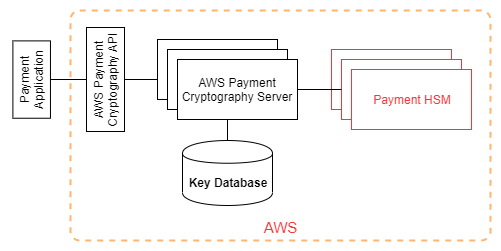

# Cryptographic details

AWS Payment Cryptography provides a web interface to generate and manage cryptographic
keys for payment
transactions. AWS Payment Cryptography offers standard key management services
and payment transaction cryptography and tools you can use for centralized management and auditing. This documentation provides a
detailed description of the cryptographic operations you can use in AWS Payment Cryptography to assist you in evaluating the features offered by the service.

AWS Payment Cryptography contains multiple interfaces (including a RESTful API, through the AWS CLI, AWS SDK
and the AWS Management Console) to request cryptographic operations of a
distributed fleet of
[PCI PTS HSM-validated](cryptographic-details-internalops.md "cryptographic-details-internalops.md")
[hardware security modules](terminology.md#terms.hsm "terminology.md#terms.hsm").

AWS Payment Cryptography is a tiered service consisting of web-facing AWS Payment Cryptography hosts and a tier of HSMs.
The grouping of these tiered hosts forms the AWS Payment Cryptography stack.
All requests to AWS Payment Cryptography must be made over the
Transport Layer Security protocol (TLS) and terminate on an AWS Payment Cryptography host.
The service hosts only allow TLS with a cipher suite that provides
[perfect forward secrecy](https://nvlpubs.nist.gov/nistpubs/SpecialPublications/NIST.SP.800-52r2.pdf "https://nvlpubs.nist.gov/nistpubs/SpecialPublications/NIST.SP.800-52r2.pdf").
The service authenticates and authorizes your requests using the same
credential and policy mechanisms of IAM
that are available for all other AWS API operations.

AWS Payment Cryptography servers connect to the underlying [HSM](terminology.md#terms.hsm "terminology.md#terms.hsm")
via a private, non-virtual network. Connections between service
components and [HSM](terminology.md#terms.hsm "terminology.md#terms.hsm")
are secured with mutual TLS (mTLS) for authentication and encryption.

###### Topics

- [Design goals](cryptographic-details.md "cryptographic-details.md")
- [Foundations](cryptographic-details.md "cryptographic-details.md")
- [Internal operations](cryptographic-details-internalops.md "cryptographic-details-internalops.md")
- [Customer operations](cryptographic-details-customerops.md "cryptographic-details-customerops.md")
