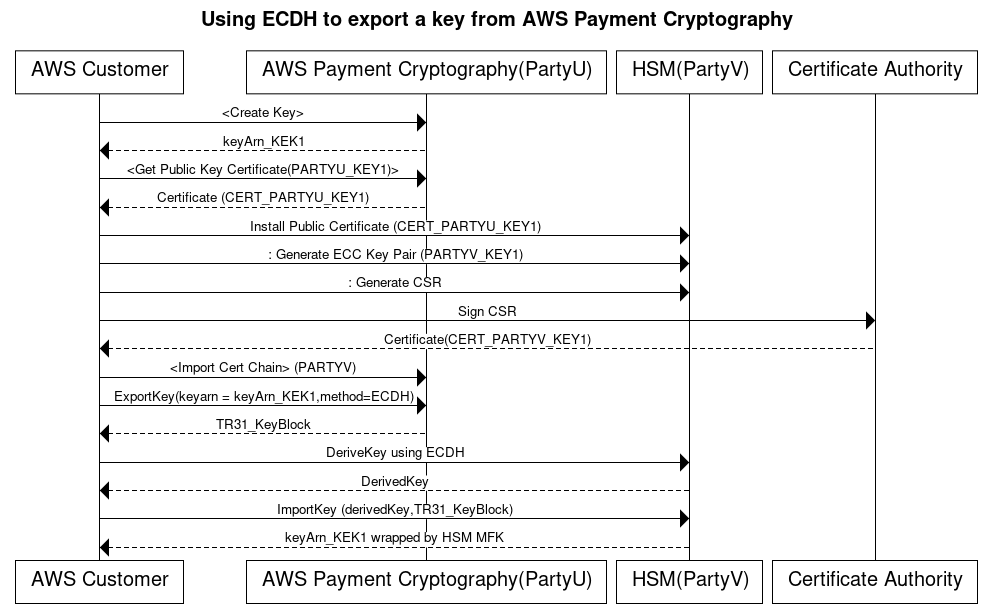

# Export keys

###### Contents

- [Export symmetric keys](keys-export.md#keys-export-symmetric "keys-export.md#keys-export-symmetric")
  - [Export keys using asymmetric techniques (TR-34)](keys-export.md#keys-export-tr34 "keys-export.md#keys-export-tr34")
  - [Export keys using asymmetric techniques (ECDH)](keys-export.md#keys-export-ecdh "keys-export.md#keys-export-ecdh")
  - [Export keys using asymmetric techniques (RSA
    Wrap)](keys-export.md#keys-export-rsawrap "keys-export.md#keys-export-rsawrap")
  - [Export symmetric keys using a pre-established key
    exchange key (TR-31)](keys-export.md#keys-export-tr31 "keys-export.md#keys-export-tr31")

- [Export DUKPT Initial Keys (IPEK/IK)](keys-export.md#keys-export-ipek "keys-export.md#keys-export-ipek")
- [Specify key block headers for export](keys-export.md#keys-export-optionalheaders "keys-export.md#keys-export-optionalheaders")
  - [Common Headers](keys-export.md#keys-export-commonheaders "keys-export.md#keys-export-commonheaders")

- [Export asymmetric (RSA) keys](keys-export.md#keys-export-publickey "keys-export.md#keys-export-publickey")

## Export symmetric keys

###### Important

Make sure you have the latest version of AWS CLI before you begin. To upgrade, see
[Installing the AWS CLI](../../../cli/latest/userguide/getting-started-install.md "../../../cli/latest/userguide/getting-started-install.md").

### Export keys using asymmetric techniques (TR-34)

TR-34 uses RSA asymmetric cryptography to encrypt and sign symmetric keys for exchange.
The encryption protects confidentiality, while the signature ensures integrity. When you
export keys, AWS Payment Cryptography acts as the key distribution host (KDH), and your target system
becomes the key receiving device (KRD).

###### Note

If your HSM supports TR-34 export but not TR-34 import, we recommend that you first
establish a shared KEK between your HSM and AWS Payment Cryptography using TR-34. You can then use TR-31
to transfer your remaining keys.

1. ###### **Initialize the export process**

Run **get-parameters-for-export** to generate a key pair for key
exports. We use this key pair to sign the TR-34 payload. In TR-34 terminology, this is
the KDH signing certificate. The certificates are short-lived and valid only for the
duration specified in `ParametersValidUntilTimestamp`.

###### Note

All certificates are in base64 encoding.

###### Example

```
`$` `aws payment-cryptography **get-parameters-for-export** \
 `--signing-key-algorithm` RSA_2048 \
 `--key-material-type` TR34_KEY_BLOCK`
```

```
`{
 "SigningKeyCertificate": "LS0tLS1CRUdJTiBDRVJUSUZJQ0FURS0tLS0tCk1JSUV2RENDQXFTZ0F3SUJ...",
 "SigningKeyCertificateChain": "LS0tLS1CRUdJTiBDRVJUSUZJQ0FURS0tLS....",
 "SigningKeyAlgorithm": "RSA_2048",
 "ExportToken": "export-token-au7pvkbsq4mbup6i",
 "ParametersValidUntilTimestamp": "2023-06-13T15:40:24.036000-07:00"
}`
```

2. ###### \*\*Import the AWS Payment Cryptography certificate to your receiving
   system\*\*

Import the certificate chain from step 1 to your receiving system. 3. ###### **Set up your receiving system's
certificates**

To protect the transmitted payload, the sending party (KDH) encrypts it. Your
receiving system (typically your HSM or your partner's HSM) needs to generate a public
key and create an X.509 public key certificate. You can use AWS Private CA to generate
certificates, but you can use any certificate authority.

After you have the certificate, import the root certificate to AWS Payment Cryptography using the
**ImportKey** command. Set `KeyMaterialType` to
`RootCertificatePublicKey` and `KeyUsageType` to
`TR31_S0_ASYMMETRIC_KEY_FOR_DIGITAL_SIGNATURE`.

We use `TR31_S0_ASYMMETRIC_KEY_FOR_DIGITAL_SIGNATURE` as the
`KeyUsageType` because this is the root key that signs the leaf
certificate. You don't need to import leaf certificates into AWS Payment Cryptography—you can pass them
inline.

###### Note

If you previously imported the root certificate, skip this step. For intermediate
certificates, use `TrustedCertificatePublicKey`. 4. ###### **Export your key**

Call the **ExportKey** API with
`KeyMaterialType` set to `TR34_KEY_BLOCK`. You
need to provide:

    * The keyARN of the root CA from step 3 as the
     `CertificateAuthorityPublicKeyIdentifier`
    * The leaf certificate from step 3 as the
     `WrappingKeyCertificate`
    * The keyARN (or alias) of the key you want to export as the
     `--export-key-identifier`
    * The export-token from step 1

###### Example

```
`$` `aws payment-cryptography **export-key** \
 `--export-key-identifier` "example-export-key" \
 `--key-material` '{"`Tr34KeyBlock`": { \
 "`CertificateAuthorityPublicKeyIdentifier`": "arn:aws:payment-cryptography:us-east-2:111122223333:key/4kd6xud22e64wcbk", \
 "`ExportToken`": "export-token-au7pvkbsq4mbup6i", \
 "`KeyBlockFormat`": "X9_TR34_2012", \
 "`WrappingKeyCertificate`": "LS0tLS1CRUdJTiBDRVJUSUZJQ0FURS0tLS0tCk1JSUV2RENDQXFXZ0F3SUJBZ0lSQ..."} \
 }'`
```

```
`{
 "WrappedKey": {
 "KeyMaterial": "308205A106092A864886F70D010702A08205923082058...",
 "WrappedKeyMaterialFormat": "TR34_KEY_BLOCK"
 }
}`
```

### Export keys using asymmetric techniques (ECDH)



Elliptic Curve Diffie-Hellman (ECDH) uses ECC asymmetric cryptography to establish a shared
key between two parties without requiring pre-exchanged keys. ECDH keys are ephemeral, so AWS Payment Cryptography
does not store them. In this process, a one-time [KBPK/KEK](terminology.md#terms.kbpk "terminology.md#terms.kbpk") is
derived using ECDH. That derived key is immediately used to wrap the key you want to transfer,
which could be another KBPK, a BDK, an IPEK key, or other key types.

When exporting, AWS Payment Cryptography is referred to as Party U (Initiator) and the receiving system is
known as Party V (Responder).

###### Note

ECDH can be used to exchange any symmetric key type, but it is the only approach that can
be used to transfer AES-256 keys if a KEK is not already established.

1. ###### **Generate ECC Key Pair**

Call `create-key` to create an ECC key pair for this process. This API
generates a key pair for key imports or exports. At creation, specify what kind of keys
can be derived using this ECC key. When using ECDH to exchange (wrap) other keys, use a
value of `TR31_K1_KEY_BLOCK_PROTECTION_KEY`.

###### Note

Although low-level ECDH generates a derived key that can be used for any purpose, AWS Payment Cryptography
limits the accidental reuse of a key for multiple purposes by allowing a key to only be used
for a single derived-key type.

```
`$` `aws payment-cryptography create-key --exportable --key-attributes KeyAlgorithm=ECC_NIST_P256,KeyUsage=TR31_K3_ASYMMETRIC_KEY_FOR_KEY_AGREEMENT,KeyClass=ASYMMETRIC_KEY_PAIR,KeyModesOfUse='{DeriveKey=true}' --derive-key-usage "TR31_K1_KEY_BLOCK_PROTECTION_KEY"`
```

```
`{
 "Key": {
 "KeyArn": "arn:aws:payment-cryptography:us-east-2:111122223333:key/wc3rjsssguhxtilv",
 "KeyAttributes": {
 "KeyUsage": "TR31_K3_ASYMMETRIC_KEY_FOR_KEY_AGREEMENT",
 "KeyClass": "ASYMMETRIC_KEY_PAIR",
 "KeyAlgorithm": "ECC_NIST_P256",
 "KeyModesOfUse": {
 "Encrypt": false,
 "Decrypt": false,
 "Wrap": false,
 "Unwrap": false,
 "Generate": false,
 "Sign": false,
 "Verify": false,
 "DeriveKey": true,
 "NoRestrictions": false
 }
 },
 "KeyCheckValue": "2432827F",
 "KeyCheckValueAlgorithm": "CMAC",
 "Enabled": true,
 "Exportable": true,
 "KeyState": "CREATE_COMPLETE",
 "KeyOrigin": "AWS_PAYMENT_CRYPTOGRAPHY",
 "CreateTimestamp": "2025-03-28T22:03:41.087000-07:00",
 "UsageStartTimestamp": "2025-03-28T22:03:41.068000-07:00"
 }
 }`
```

2. ###### **Get Public Key Certificate**

Call `get-public-key-certificate` to receive the public key as an X.509
certificate signed by your account's CA that is specific to AWS Payment Cryptography in a specific region.

###### Example

```
`$` `aws payment-cryptography **get-public-key-certificate** \
 `--key-identifier` arn:aws:payment-cryptography:us-east-2:111122223333:key/wc3rjsssguhxtilv`

```

```
`{
 "KeyCertificate": "LS0tLS1CRUdJTi...",
 "KeyCertificateChain": "LS0tLS1CRUdJT..."
 }`
```

3. ###### **Install public certificate on counterparty system (Party V)**

With many HSMs, you need to install, load, or trust the public certificate
generated in step 1 to establish keys. This could include the entire certificate
chain or just the root certificate, depending on the HSM. Consult your HSM documentation for
specific instructions. 4. ###### **Generate ECC key pair on source system and provide certificate
chain to AWS Payment Cryptography**

In ECDH, each party generates a key pair and agrees on a common key. For AWS Payment Cryptography to
derive the key, it needs the counterparty's public key in X.509 public key format.

When transferring keys from an HSM, create a key pair on that HSM. For HSMs that support
key blocks, the key header will look similar to `D0144K3EX00E0000`.
When creating the certificate, you generally generate a CSR on the HSM, and then the HSM, a third
party, or a service such as AWS Private CA can generate the certificate.

Load the root certificate to AWS Payment Cryptography using the `importKey` command with
KeyMaterialType of `RootCertificatePublicKey` and KeyUsageType of
`TR31_S0_ASYMMETRIC_KEY_FOR_DIGITAL_SIGNATURE`.

For intermediate certificates, use the `importKey` command with
KeyMaterialType of `TrustedCertificatePublicKey` and KeyUsageType of
`TR31_S0_ASYMMETRIC_KEY_FOR_DIGITAL_SIGNATURE`. Repeat this process for
multiple intermediate certificates. Use the `KeyArn` of the last imported
certificate in the chain as an input to subsequent export commands.

###### Note

Don't import the leaf certificate. Provide it directly during the export
command. 5. ###### **Derive key and export key from AWS Payment Cryptography**

When exporting, the service derives a key using ECDH and then immediately uses it
as the [KBPK](terminology.md#terms.kbpk "terminology.md#terms.kbpk") to wrap the key to export using TR-31. The key to be exported
can be any TDES or AES key subject to TR-31 valid combinations, as long as the wrapping key is
at least as strong as the key to be exported.

```
`$` `aws payment-cryptography **export-key** \
 --export-key-identifier arn:aws:payment-cryptography:us-west-2:529027455495:key/e3a65davqhbpjm4h \
 --key-material='{
 "DiffieHellmanTr31KeyBlock": {
 "CertificateAuthorityPublicKeyIdentifier": "arn:aws:payment-cryptography:us-east-2:111122223333:key/swseahwtq2oj6zi5",
 "DerivationData": {
 "SharedInformation": "ADEF567890"
 },
 "DeriveKeyAlgorithm": "AES_256",
 "KeyDerivationFunction": "NIST_SP800",
 "KeyDerivationHashAlgorithm": "SHA_256",
 "PrivateKeyIdentifier": "arn:aws:payment-cryptography:us-east-2:111122223333:key/wc3rjsssguhxtilv",
 "PublicKeyCertificate": "LS0tLS1CRUdJTiBDRVJUSUZJQ0FUR..."
 }
 }'`
```

```
`{
 "WrappedKey": {
 "WrappedKeyMaterialFormat": "TR31_KEY_BLOCK",
 "KeyMaterial": "D0112K1TB00E00007012724C0FAAF64DA50E2FF4F9A94DF50441143294E0E995DB2171554223EAA56D078C4CFCB1C112B33BBF05597EE700",
 "KeyCheckValue": "E421AD",
 "KeyCheckValueAlgorithm": "ANSI_X9_24"
 }
 }`
```

6. ###### **Derive one-time key using ECDH on Party V HSM**

Many HSMs and related systems support establishing keys using ECDH. Specify
the public key from step 1 as the public key and the key from step 3 as the
private key. For allowable options, such as derivation methods, see
the [API guide](../APIReference/API_ExportDiffieHellmanTr31KeyBlock.md "../APIReference/API_ExportDiffieHellmanTr31KeyBlock.md").

###### Note

The derivation parameters such as hash type must match exactly on both sides. Otherwise, you will
generate a different key. 7. ###### **Import key to target system**

Finally, import the key from AWS Payment Cryptography using standard
TR-31 commands. Specify the ECDH derived key as the KBPK and use the TR-31 key block that was
previously exported from AWS Payment Cryptography.

### Export keys using asymmetric techniques (RSA

Wrap)

When TR-34 isn't available, you can use RSA wrap/unwrap for key exchange. Like TR-34,
this method uses RSA asymmetric cryptography to encrypt symmetric keys. However, RSA wrap
doesn't include:

- Payload signing by the sending party
- Key blocks that maintain key metadata integrity during transport

###### Note

You can use RSA wrap to export TDES and AES-128 keys.

1. ###### \*\*Create an RSA key and certificate on your receiving
   system\*\*

Create or identify an RSA key for receiving the wrapped key. We require keys to be
in X.509 certificate format. Make sure the certificate is signed by a root certificate
that you can import into AWS Payment Cryptography. 2. ###### **Import the root public certificate to
AWS Payment Cryptography**

Use **import-key** with the `--key-material` option
to import the certificate

```
`$` `aws payment-cryptography **import-key** \
 `--key-material`='{"`RootCertificatePublicKey`": { \
 "`KeyAttributes`": { \
 "`KeyAlgorithm`": "RSA_4096", \
 "`KeyClass`": "PUBLIC_KEY", \
 "`KeyModesOfUse`": {"`Verify`": true}, \
 "`KeyUsage`": "TR31_S0_ASYMMETRIC_KEY_FOR_DIGITAL_SIGNATURE"}, \
 "`PublicKeyCertificate`": "LS0tLS1CRUdJTiBDRV..."} \
 }'`
```

```
`{
 "Key": {
 "CreateTimestamp": "2023-09-14T10:50:32.365000-07:00",
 "Enabled": true,
 "KeyArn": "arn:aws:payment-cryptography:us-east-2:111122223333:key/nsq2i3mbg6sn775f",
 "KeyAttributes": {
 "KeyAlgorithm": "RSA_4096",
 "KeyClass": "PUBLIC_KEY",
 "KeyModesOfUse": {
 "Decrypt": false,
 "DeriveKey": false,
 "Encrypt": false,
 "Generate": false,
 "NoRestrictions": false,
 "Sign": false,
 "Unwrap": false,
 "Verify": true,
 "Wrap": false
 },
 "KeyUsage": "TR31_S0_ASYMMETRIC_KEY_FOR_DIGITAL_SIGNATURE"
 },
 "KeyOrigin": "EXTERNAL",
 "KeyState": "CREATE_COMPLETE",
 "UsageStartTimestamp": "2023-09-14T10:50:32.365000-07:00"
 }
}`
```

3. ###### **Export your key**

Tell AWS Payment Cryptography to export your key using your leaf certificate. You need to
specify:

    * The ARN for the root certificate you imported in step 2
    * The leaf certificate for export
    * The symmetric key to export

The output is a hex-encoded binary wrapped (encrypted) version of your symmetric
key.

###### Example – Exporting a key

```
``$` cat export-key.json`
```

```
`{
 "ExportKeyIdentifier": "arn:aws:payment-cryptography:us-east-2:111122223333:key/tqv5yij6wtxx64pi",
 "KeyMaterial": {
 "KeyCryptogram": {
 "CertificateAuthorityPublicKeyIdentifier": "arn:aws:payment-cryptography:us-east-2:111122223333:key/zabouwe3574jysdl",
 "WrappingKeyCertificate": "LS0tLS1CRUdJTiBDEXAMPLE...",
 "WrappingSpec": "RSA_OAEP_SHA_256"
 }
 }
}`
```

```
`$` `aws payment-cryptography **export-key** \
 `--cli-input-json` file://export-key.json`
```

```
`{
 "WrappedKey": {
 "KeyMaterial": "18874746731E9E1C4562E4116D1C2477063FCB08454D757D81854AEAEE0A52B1F9D303FA29C02DC82AE7785353816EFAC8B5F4F79CC29A1DDA80C65F34364373D8C74E5EC67E4CB55DEA7F091210DCACD3C46FE4A5DAA0F0D9CAA7C959CA7144A5E7052F34AAED93EF44C004AE7ABEBD616C955BBA10993C06FB905319F87B9B4E1B7A7C7D17AF15B6154E807B9C574387A43197C31C6E565554437A252EFF8AC81613305760D11F9B53B08A1BA79EC7E7C82C48083C4E2D0B6F86C34AB83647BDD7E85240AD1AF3C0F6CA8C5BF323BB2D3896457C554F978F4C9436513F494130A6FADBC038D51898AAD72E02A89FF256C524E7B5D85B813751B718C4933D9DC6031F2C5B2E13351A54B6021B2DB72AA0C7EA54727FBCD557E67E5E7CC2E165576E39DB4DA33510BA9A3C847313103A18EF3B23A3440471864D58C79C569D5CD2A653AC16043CA9A61E6878F74C18EE15F9AB23754C37A945B68C0437C19F0079F74B573D9B59DAC25A20781DBE8075C947C9EDC76177A1B0794288CBF89567A541E8401C74E85B8E1C3E501860AF702F641CAA04327018A84EF3A82932A2BCF37047AB40FE77E0A6F68D0904C7E60983CD6F871D5E0E27EEF425C97D39E9394E8927EEF5D2EA9388DF3C5C241F99378DF5DADE8D0F0CF453C803BA38BA702B9651685FAFA6DCB4B14333F8D3C57F2D93E0852AA94EEC3AF3217CAE5873EFD9",
 "WrappedKeyMaterialFormat": "KEY_CRYPTOGRAM"
 }
}`
```

4. ###### **Import the key to your receiving system**

Many HSMs and related systems support importing keys using RSA unwrap (including
AWS Payment Cryptography). When importing, specify:

    * The public key from step 1 as the encryption certificate
    * The format as RSA
    * Padding Mode as PKCS#1 v2.2 OAEP (with SHA 256)

###### Note

We output the wrapped key in hexBinary format. You might need to convert the
format if your system requires a different binary representation, such as
base64.

### Export symmetric keys using a pre-established key

exchange key (TR-31)

When exchanging multiple keys or supporting key rotation, you typically first exchange
an initial key encryption key (KEK) using paper key components or, with AWS Payment Cryptography, using
[TR-34](#keys-export-tr34 "#keys-export-tr34"). After establishing a KEK, you can use it to
transport subsequent keys, including other KEKs. We support this key exchange using ANSI
TR-31, which is widely supported by HSM vendors.

1. ###### **Set up your Key Encryption Key (KEK)**

Make sure you have already exchanged your KEK and have the keyARN (or keyAlias)
available. 2. ###### **Create your key on AWS Payment Cryptography**

Create your key if it doesn't already exist. Alternatively, you can create the key
on your other system and use the import
command. 3. ###### **Export your key from AWS Payment Cryptography**

When exporting in TR-31 format, specify the key you want to export and the
wrapping key to use.

###### Example – Exporting a key using TR31 key block

```
`$` `aws payment-cryptography **export-key** \
 `--key-material`='{"`Tr31KeyBlock`": \
 { "`WrappingKeyIdentifier`": "arn:aws:payment-cryptography:us-east-2:111122223333:key/ov6icy4ryas4zcza" }}' \
 `--export-key-identifier` arn:aws:payment-cryptography:us-east-2:111122223333:key/5rplquuwozodpwsp`
```

```
`{
 "WrappedKey": {
 "KeyCheckValue": "73C263",
 "KeyCheckValueAlgorithm": "ANSI_X9_24",
 "KeyMaterial": "D0144K0AB00E0000A24D3ACF3005F30A6E31D533E07F2E1B17A2A003B338B1E79E5B3AD4FBF7850FACF9A3784489581A543C84816C8D3542AE888CE6D4EDDFD09C39957B131617BC",
 "WrappedKeyMaterialFormat": "TR31_KEY_BLOCK"
 }
}`
```

4. ###### **Import the key to your system**

Use your system's import key implementation to import the key.

## Export DUKPT Initial Keys (IPEK/IK)

When using [DUKPT](terminology.md#terms.dukpt "terminology.md#terms.dukpt"), you can generate a single Base
Derivation Key (BDK) for a fleet of terminals. The terminals don't have direct access to the
BDK. Instead, each terminal receives a unique initial terminal key, known as IPEK or Initial
Key (IK). Each IPEK is derived from the BDK using a unique Key Serial Number (KSN).

The KSN structure varies by encryption type:

- For TDES: The 10-byte KSN includes:
  - 24 bits for the Key Set ID
  - 19 bits for the terminal ID
  - 21 bits for the transaction counter

- For AES: The 12-byte KSN includes:
  - 32 bits for the BDK ID
  - 32 bits for the derivation identifier (ID)
  - 32 bits for the transaction counter

We provide a mechanism to generate and export these initial keys. You can export the
generated keys using TR-31, TR-34, or RSA wrap methods. Note that IPEK keys are not persisted
and can't be used for subsequent operations on AWS Payment Cryptography.

We don't enforce the split between the first two parts of the KSN. If you want to store
the derivation identifier with the BDK, you can use AWS tags.

###### Note

The counter portion of the KSN (32 bits for AES DUKPT) isn't used for IPEK/IK
derivation. For example, inputs of 12345678901234560001 and 12345678901234569999 will
generate the same IPEK.

```
`$` `aws payment-cryptography **export-key** \
 `--key-material`='{"`Tr31KeyBlock`": { \
 "`WrappingKeyIdentifier`": "arn:aws:payment-cryptography:us-east-2:111122223333:key/ov6icy4ryas4zcza"}} ' \
 `--export-key-identifier` arn:aws:payment-cryptography:us-east-2:111122223333:key/tqv5yij6wtxx64pi \
 `--export-attributes` '`ExportDukptInitialKey`={`KeySerialNumber`=12345678901234560001}'`
```

```
`{
"WrappedKey": {
 "KeyCheckValue": "73C263",
 "KeyCheckValueAlgorithm": "ANSI_X9_24",
 "KeyMaterial": "B0096B1TX00S000038A8A06588B9011F0D5EEF1CCAECFA6962647A89195B7A98BDA65DDE7C57FEA507559AF2A5D601D1",
 "WrappedKeyMaterialFormat": "TR31_KEY_BLOCK"
}
}`
```

## Specify key block headers for export

You can modify or append key block information when exporting in ASC TR-31 or TR-34
formats. The following table describes the TR-31 key block format and which elements you can
modify during export.

| Key Block Attribute | Purpose                                                                                                                                                                                                         | Can you modify during export?                                                                                                                                                                                                                                  | Notes                                                                                                                                                                         |
| ------------------- | --------------------------------------------------------------------------------------------------------------------------------------------------------------------------------------------------------------- | -------------------------------------------------------------------------------------------------------------------------------------------------------------------------------------------------------------------------------------------------------------- | ----------------------------------------------------------------------------------------------------------------------------------------------------------------------------- |
| Version ID          | Defines the method used to protect the key material. The standard<br>includes:<br>• Version A and C (key variant - deprecated)<br>• Version B (derivation using TDES)<br>• Version D (key derivation using AES) | No                                                                                                                                                                                                                                                             | We use version B for TDES wrapping keys and version D for AES wrapping<br>keys. We support versions A and C only for import operations.                                       |
| Key Block Length    | Specifies the length of the remaining message                                                                                                                                                                   | No                                                                                                                                                                                                                                                             | We calculate this value automatically. The length might appear incorrect<br>before decrypting the payload because we may add key padding as required by the<br>specification. |
| Key Usage           | Defines the permitted purposes for the key, such as:<br>• C0 (Card Verification)<br>• B0 (Base Derivation Key)                                                                                                  | No                                                                                                                                                                                                                                                             |                                                                                                                                                                               |
| Algorithm           | Specifies the algorithm of the underlying key. We support:<br>• T (TDES)<br>• H (HMAC)<br>• A (AES)                                                                                                             | No                                                                                                                                                                                                                                                             | We export this value as-is.                                                                                                                                                   |
| Key Usage           | Defines allowed operations, such as:<br>• Generate and Verify (C)<br>• Encrypt/Decrypt/Wrap/Unwrap (B)                                                                                                          | Yes\*                                                                                                                                                                                                                                                          |                                                                                                                                                                               |
| Key Version         | Indicates the version number for key replacement/rotation. Defaults to 00<br>if not specified.                                                                                                                  | Yes<br>• Can append                                                                                                                                                                                                                                            |                                                                                                                                                                               |
| Key Exportability   | Controls whether the key can be exported:<br>• N - No Exportability<br>• E - Export according to X9.24 (key blocks)<br>• S - Export under key block or non-key block formats                                    | Yes\*                                                                                                                                                                                                                                                          |                                                                                                                                                                               |
| Optional Key Blocks | Yes<br>• Can append                                                                                                                                                                                             | Optional key blocks are name/value pairs cryptographically bound to the<br>key. For example, KeySetID for DUKPT keys. We automatically calculate the number of<br>blocks, length of each block, and padding block (PB) based on your name/value pair<br>input. |                                                                                                                                                                               |

_\*When modifying values, your new value must be more restrictive
than the current value in AWS Payment Cryptography._ For example:

- If the current key mode of use is Generate=True,Verify=True, you can change it to
  Generate=True,Verify=False
- If the key is already set to not exportable, you can't change it to exportable

When you export keys, we automatically apply the current values from the key being
exported. However, you might want to modify or append those values before sending to the
receiving system. Here are some common scenarios:

- When exporting a key to a payment terminal, set its exportability to `Not
Exportable` because terminals typically only import keys and shouldn't export
  them.
- When you need to pass associated key metadata to the receiving system, use TR-31
  optional headers to cryptographically bind the metadata to the key instead of creating a
  custom payload.
- Set the Key Version using the `KeyVersion` field to track key
  rotation.

TR-31/X9.143 defines common headers, but you can use other headers as long as they meet
AWS Payment Cryptography parameters and your receiving system can accept them. For more information about key
block headers during export, see [Key Block
Headers](../DataAPIReference/API_KeyBlockHeaders.md "../DataAPIReference/API_KeyBlockHeaders.md") in the API Guide.

Here's an example of exporting a BDK key (for instance, to a KIF) with these
specifications:

- Key version: 02
- KeyExportability: NON_EXPORTABLE
- KeySetID: 00ABCDEFAB (00 indicates TDES key, ABCDEFABCD is the initial key)

Because we don't specify key modes of use, this key inherits the mode of use from
arn:aws:payment-cryptography:us-east-2:111122223333:key/5rplquuwozodpwsp (DeriveKey = true).

###### Note

Even when you set exportability to Not Exportable in this example, the [KIF](terminology.md#terms.kif "terminology.md#terms.kif") can still:

- Derive keys such as [IPEK/IK](terminology.md#terms.ipek "terminology.md#terms.ipek") used in DUKPT
- Export these derived keys to install on devices
  This is specifically allowed by the standards.

```
`$` `aws payment-cryptography **export-key** \
 `--key-material`='{"`Tr31KeyBlock`": { \
 "`WrappingKeyIdentifier`": "arn:aws:payment-cryptography:us-east-2:111122223333:key/ov6icy4ryas4zcza", \
 "`KeyBlockHeaders`": { \
 "`KeyModesOfUse`": { \
 "`Derive`": true}, \
 "`KeyExportability`": "NON_EXPORTABLE", \
 "`KeyVersion`": "02", \
 "`OptionalBlocks`": { \
 "`BI`": "00ABCDEFABCD"}}} \
 }' \
 `--export-key-identifier` arn:aws:payment-cryptography:us-east-2:111122223333:key/5rplquuwozodpwsp`
```

```
`{
"WrappedKey": {
 "WrappedKeyMaterialFormat": "TR31_KEY_BLOCK",
 "KeyMaterial": "EXAMPLE_KEY_MATERIAL_TR31",
 "KeyCheckValue": "A4C9B3",
 "KeyCheckValueAlgorithm": "ANSI_X9_24"
 }
}`
```

### Common Headers

X9.143 defines certain headers for common use cases. With the exception of the HM(HMAC Hash) header, AWS Payment Cryptography does not parse or utilize these headers.

| Header Name | Purpose                                                                        | Typical Validation                                                                                                                                                                                                                                 | Notes                                                                                                                                                                                                                                                                                                                                              |
| ----------- | ------------------------------------------------------------------------------ | -------------------------------------------------------------------------------------------------------------------------------------------------------------------------------------------------------------------------------------------------- | -------------------------------------------------------------------------------------------------------------------------------------------------------------------------------------------------------------------------------------------------------------------------------------------------------------------------------------------------- |
| BI          | Base Derivation Key Identifier for DUKPT                                       | 2 hex characters (00 for TDES, 11 for AES) then 10 hex characters for TDES KSI or 8 hex characters for BDK ID (AES DUKPT).                                                                                                                         | Contains the (BDK ID, for AES DUKPT) or the Key Set Identifier (KSI, for TDES DUKPT).<br>Can be used when exchanging the BDK ID or the KSI, but do not need to<br>exchange the other data contained in the IK and KS blocks. Typically BI is used when transmitting to a KIF whereas IK or KS are used<br>when injecting into the terminal itself. |
| HM          | Specifies the hash type for HMAC operations                                    | • 10 – SHA-1<br>• 20 – SHA-224<br>• 21 – SHA-256<br>• 22 – SHA-384<br>• 23 – SHA-512<br>• 24 – SHA-512/224<br>• 25 – SHA-512/256<br>• 30 – SHA3-224<br>• 31 – SHA3-256<br>• 32 – SHA3-384<br>• 33 – SHA3-512<br>• 40 – SHAKE128<br>• 41 – SHAKE256 | The service automatically populates this field on export and will parse it on import. Hash types not supported by the service such<br>as SHAKE128 can be imported but may not be usuable for cryptographic functions.                                                                                                                              |
| IK          | Initial Key Serial Number for AES DUKPT                                        | 16 hex characters                                                                                                                                                                                                                                  | This value is used to instantiate the use of the Initial DUKPT key on the receiving device and it identifies<br>the Initial Key derived from a BDK. This field typically contains the derivation data but no counter. Use KS for TDES DUKPT.                                                                                                       |
| KS          | Initial Key Serial Number for TDES DUKPT                                       | 20 hex characters                                                                                                                                                                                                                                  | This value is used to instantiate the use of the Initial DUKPT key on the receiving device and it identifies<br>the Initial Key derived from a BDK. This field typically contains the derivation data + a zeroized counter value. Use IK for AES DUKPT.                                                                                            |
| KP          | [KCV](terminology.md#terms.kcv "terminology.md#terms.kcv") of the wrapping key | 2 hex characters represent the KCV method (00 for X9.24 method and 01 for CMAC method). Followed by KCV value<br>which is typically 6 hex characters. For example 010FA329 represents KCV of 0FA329 calculated using 01(CMAC) method.              | This value is used to instantiate the use of the Initial DUKPT key on the receiving device and it identifies<br>the Initial Key derived from a BDK. This field typically contains the derivation data + a zeroized counter value. Use IK for AES DUKPT.                                                                                            |
| PB          | Padding block                                                                  | random printable ASCII characters                                                                                                                                                                                                                  | The service automatically populates this field on export to ensure optional headers are multiples of encryption block length                                                                                                                                                                                                                       |

## Export asymmetric (RSA) keys

To export a public key in certificate form, use the
**get-public-key-certificate** command. This command returns:

- The certificate
- The root certificate

Both certificates are in base64 encoding.

###### Note

This operation is not idempotent—subsequent calls might generate different certificates
even when using the same underlying key.

###### Example

```
`$` `aws payment-cryptography **get-public-key-certificate** \
 `--key-identifier` arn:aws:payment-cryptography:us-east-2:111122223333:key/5dza7xqd6soanjtb`

```

```
`{
"KeyCertificate": "LS0tLS1CRUdJTi...",
"KeyCertificateChain": "LS0tLS1CRUdJT..."
}`
```
