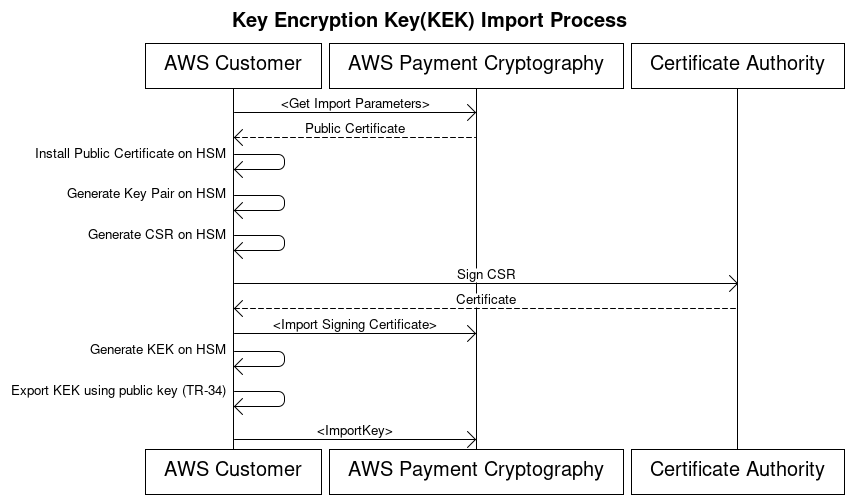
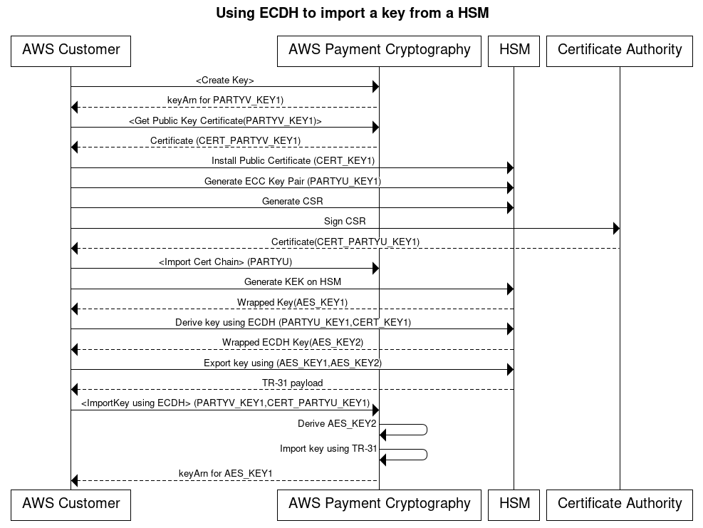
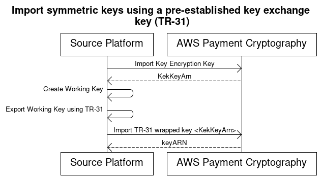

# Import keys

###### Important

Examples require the latest version of the AWS CLI V2. Before getting started, make sure
that you've upgraded to the [latest version](../../../cli/latest/userguide/getting-started-install.md "../../../cli/latest/userguide/getting-started-install.md").

###### Contents

- [Introduction to importing keys](keys-import.md#keys-import-introduction "keys-import.md#keys-import-introduction")
- [Importing symmetric keys](keys-import.md#keys-import-symmetric "keys-import.md#keys-import-symmetric")
  - [Import keys using asymmetric techniques (TR-34)](keys-import.md#keys-import-tr34 "keys-import.md#keys-import-tr34")
  - [Import keys using asymmetric techniques (ECDH)](keys-import.md#keys-import-ecdh "keys-import.md#keys-import-ecdh")
  - [Import keys using asymmetric techniques (RSA
    Unwrap)](keys-import.md#keys-import-rsaunwrap "keys-import.md#keys-import-rsaunwrap")
  - [Import symmetric keys using a pre-established key
    exchange key (TR-31)](keys-import.md#keys-import-tr31 "keys-import.md#keys-import-tr31")

- [Importing asymmetric (RSA, ECC) public keys](keys-import.md#keys-import-asymmetric "keys-import.md#keys-import-asymmetric")
  - [Importing RSA public keys](keys-import.md#keys-import-rsapublickey "keys-import.md#keys-import-rsapublickey")
  - [Importing ECC public keys](keys-import.md#keys-import-eccpublickey "keys-import.md#keys-import-eccpublickey")

## Introduction to importing keys

###### Note

When importing keys using X9.143, TR-31 or TR-34 key blocks, AWS Payment Cryptography typically retains (but does not utilize) any optional headers.
The HM(HMAC hash type) header is used during cryptographic operations. The KP header (KCV of wrapping key) is specific to the import process and is not retained.

When exchanging keys with a counterparty, it is typically to first exchange a key exchange key (KEK). This key will then be
used to protect subsequent keys. Using electronic formats, the KEK may be exchanged use asymmetric techniques such as
TR-34, ECDH or RSA wrap. Subsequent keys will be exchanged using a symmetric key exchange such as TR-31. This KEK will be long lived
and may only be updated every few years based on policy and its defined crypto period.

If only one or two keys are being exchanged, you may also chose to use asymmetric techniques to directly exchange that key such
as a BDK. AWS Payment Cryptography supports both methods of key exchange.

## Importing symmetric keys

### Import keys using asymmetric techniques (TR-34)



TR-34 uses RSA asymmetric cryptography to encrypt and sign symmetric keys for exchange.
This ensures both confidentiality (encryption) and integrity (signature) of the wrapped key.

To import your own keys, check out the AWS Payment Cryptography sample project on [GitHub](https://github.com/aws-samples/samples-for-payment-cryptography-service/tree/main/key-import-export "https://github.com/aws-samples/samples-for-payment-cryptography-service/tree/main/key-import-export"). For instructions on how to import/export keys from other platforms, sample code is available on [GitHub](https://github.com/aws-samples/samples-for-payment-cryptography-service/tree/main/key-import-export "https://github.com/aws-samples/samples-for-payment-cryptography-service/tree/main/key-import-export") or consult the user guide for those platforms.

1. ###### **Call the Initialize Import command**

Call `get-parameters-for-import` to initialize the import process. This
API generates a key pair for key imports, signs the key, and returns the certificate
and certificate root. Encrypt the key to be exported using this key. In TR-34
terminology, this is known as the KRD Cert. These certificates are base64 encoded,
short-lived, and intended only for this purpose. Save the `ImportToken`
value.

```
`$` `aws payment-cryptography **get-parameters-for-import** \
 `--key-material-type` TR34_KEY_BLOCK \
 `--wrapping-key-algorithm` RSA_2048`
```

```
`{
 "ImportToken": "import-token-bwxli6ocftypneu5",
 "ParametersValidUntilTimestamp": 1698245002.065,
 "WrappingKeyCertificateChain": "LS0tLS1CRUdJTiBDRVJUSUZJQ0FURS0....",
 "WrappingKeyCertificate": "LS0tLS1CRUdJTiBDRVJUSUZJQ0FURS0tLS0....",
 "WrappingKeyAlgorithm": "RSA_2048"
}`
```

2. ###### \*\*Install public certificate on key source
   system\*\*

With most HSMs, you need to install, load, or trust the public certificate
generated in step 1 to export keys using it. This could include the entire certificate
chain or just the root certificate from step 1, depending on the HSM. 3. ###### **Generate key pair on source system and provide certificate
chain to AWS Payment Cryptography**

To ensure integrity of the transmitted payload, the sending party (Key
Distribution Host or KDH) signs it. Generate a public key for this purpose and create
a public key certificate (X509) to provide back to AWS Payment Cryptography.

When transferring keys from an HSM, create a key pair on that HSM. The HSM, a third
party, or a service such as AWS Private CA can generate the certificate.

Load the root certificate to AWS Payment Cryptography using the `importKey` command with
KeyMaterialType of `RootCertificatePublicKey` and KeyUsageType of
`TR31_S0_ASYMMETRIC_KEY_FOR_DIGITAL_SIGNATURE`.

For intermediate certificates, use the `importKey` command with
KeyMaterialType of `TrustedCertificatePublicKey` and KeyUsageType of
`TR31_S0_ASYMMETRIC_KEY_FOR_DIGITAL_SIGNATURE`. Repeat this process for
multiple intermediate certificates. Use the `KeyArn` of the last imported
certificate in the chain as an input to subsequent import commands.

###### Note

Don't import the leaf certificate. Provide it directly during the import
command. 4. ###### **Export key from source system**

Many HSMs and related systems support exporting keys using the TR-34 norm. Specify
the public key from step 1 as the KRD (encryption) cert and the key from step 3 as the
KDH (signing) cert. To import to AWS Payment Cryptography, specify the format as TR-34.2012 non-CMS
two pass format, which may also be referred to as the TR-34 Diebold format. 5. ###### **Call Import Key**

Call the importKey API with a KeyMaterialType of `TR34_KEY_BLOCK`. Use
the keyARN of the last CA imported in step 3 for
`certificate-authority-public-key-identifier`, the wrapped key material
from step 4 for `key-material`, and the leaf certificate from step 3 for
`signing-key-certificate`. Include the import-token from step 1.

```
`$` `aws payment-cryptography **import-key** \
 `--key-material`='{"`Tr34KeyBlock`": { \
 "`CertificateAuthorityPublicKeyIdentifier`": "arn:aws:payment-cryptography:us-east-2:111122223333:key/zabouwe3574jysdl", \
 "`ImportToken`": "import-token-bwxli6ocftypneu5", \
 "`KeyBlockFormat`": "X9_TR34_2012", \
 "`SigningKeyCertificate`": "LS0tLS1CRUdJTiBDRVJUSUZJQ0FURS0tLS0tCk1JSUV2RENDQXFTZ0F3SUJ...", \
 "`WrappedKeyBlock`": "308205A106092A864886F70D010702A08205923082058E020101310D300B0609608648016503040201308203..."} \
 }'`
```

```
`{
 "Key": {
 "CreateTimestamp": "2023-06-13T16:52:52.859000-04:00",
 "Enabled": true,
 "KeyArn": "arn:aws:payment-cryptography:us-east-2:111122223333:key/ov6icy4ryas4zcza",
 "KeyAttributes": {
 "KeyAlgorithm": "TDES_3KEY",
 "KeyClass": "SYMMETRIC_KEY",
 "KeyModesOfUse": {
 "Decrypt": true,
 "DeriveKey": false,
 "Encrypt": true,
 "Generate": false,
 "NoRestrictions": false,
 "Sign": false,
 "Unwrap": true,
 "Verify": false,
 "Wrap": true
 },
 "KeyUsage": "TR31_K1_KEY_ENCRYPTION_KEY"
 },
 "KeyCheckValue": "CB94A2",
 "KeyCheckValueAlgorithm": "ANSI_X9_24",
 "KeyOrigin": "EXTERNAL",
 "KeyState": "CREATE_COMPLETE",
 "UsageStartTimestamp": "2023-06-13T16:52:52.859000-04:00"
 }
}`
```

6. ###### \*\*Use imported key for cryptographic operations or subsequent
   import\*\*

If the imported KeyUsage was TR31_K0_KEY_ENCRYPTION_KEY, you can use this key for
subsequent key imports using TR-31. For other key types (such as
TR31_D0_SYMMETRIC_DATA_ENCRYPTION_KEY), you can use the key directly for cryptographic
operations.

### Import keys using asymmetric techniques (ECDH)



Elliptic Curve Diffie-Hellman (ECDH) uses ECC asymmetric cryptography to establish a shared
key between two parties without requiring pre-exchanged keys. ECDH keys are ephemeral, so AWS Payment Cryptography
does not store them. In this process, a one-time [KBPK/KEK](terminology.md#terms.kbpk "terminology.md#terms.kbpk") is
derived using ECDH. That derived key is immediately used to wrap the actual key that you want to
transfer, which could be another KBPK, an IPEK key, or other key types.

When importing, the sending system is commonly known as Party U (Initiator) and AWS Payment Cryptography is known
as Party V (Responder).

###### Note

While ECDH can be used to exchange any symmetric key type, it is the only approach that can securely
transfer AES-256 keys.

1. ###### **Generate ECC Key Pair**

Call `create-key` to create an ECC key pair for this process. This
API generates a key pair for key imports or exports. At creation, specify
what kind of keys can be derived using this ECC key. When using ECDH to exchange (wrap)
other keys, use a value of `TR31_K1_KEY_BLOCK_PROTECTION_KEY`.

###### Note

Although low-level ECDH generates a derived key that can be used for any purpose,
AWS Payment Cryptography limits the accidental reuse of a key for multiple purposes by allowing a key to only be used
for a single derived-key type.

```
`$` `aws payment-cryptography create-key --exportable --key-attributes KeyAlgorithm=ECC_NIST_P256,KeyUsage=TR31_K3_ASYMMETRIC_KEY_FOR_KEY_AGREEMENT,KeyClass=ASYMMETRIC_KEY_PAIR,KeyModesOfUse='{DeriveKey=true}' --derive-key-usage "TR31_K1_KEY_BLOCK_PROTECTION_KEY"`
```

```
`{
 "Key": {
 "KeyArn": "arn:aws:payment-cryptography:us-east-2:111122223333:key/wc3rjsssguhxtilv",
 "KeyAttributes": {
 "KeyUsage": "TR31_K3_ASYMMETRIC_KEY_FOR_KEY_AGREEMENT",
 "KeyClass": "ASYMMETRIC_KEY_PAIR",
 "KeyAlgorithm": "ECC_NIST_P256",
 "KeyModesOfUse": {
 "Encrypt": false,
 "Decrypt": false,
 "Wrap": false,
 "Unwrap": false,
 "Generate": false,
 "Sign": false,
 "Verify": false,
 "DeriveKey": true,
 "NoRestrictions": false
 }
 },
 "KeyCheckValue": "2432827F",
 "KeyCheckValueAlgorithm": "CMAC",
 "Enabled": true,
 "Exportable": true,
 "KeyState": "CREATE_COMPLETE",
 "KeyOrigin": "AWS_PAYMENT_CRYPTOGRAPHY",
 "CreateTimestamp": "2025-03-28T22:03:41.087000-07:00",
 "UsageStartTimestamp": "2025-03-28T22:03:41.068000-07:00"
 }
 }`
```

2. ###### **Get Public Key Certificate**

Call `get-public-key-certificate` to receive the public key as an X.509 certificate
signed by your account's CA that is specific to AWS Payment Cryptography in a specific region.

```
`$` `aws payment-cryptography **get-public-key-certificate** \
 `--key-identifier` arn:aws:payment-cryptography:us-east-2:111122223333:key/wc3rjsssguhxtilv`

```

```
`{
 "KeyCertificate": "LS0tLS1CRUdJTi...",
 "KeyCertificateChain": "LS0tLS1CRUdJT..."
 }`
```

3. ###### **Install public certificate on counterparty system (Party U)**

With many HSMs, you need to install, load, or trust the public certificate
generated in step 1 to export keys using it. This could include the entire certificate
chain or just the root certificate from step 1, depending on the HSM. Consult your HSM documentation for more information. 4. ###### **Generate ECC key pair on source system and provide certificate
chain to AWS Payment Cryptography**

In ECDH, each party generates a key pair and agrees on a common key. For AWS Payment Cryptography to derive
the key, it needs the counterparty's public key in X.509 public key format.

When transferring keys from an HSM, create a key pair on that HSM. For HSMs that support
key blocks, the key header will look similar to `D0144K3EX00E0000`.
When creating the certificate, you generally generate a CSR on the HSM and then the HSM, a third
party, or a service such as AWS Private CA can generate the certificate.

Load the root certificate to AWS Payment Cryptography using the `importKey` command with
KeyMaterialType of `RootCertificatePublicKey` and KeyUsageType of
`TR31_S0_ASYMMETRIC_KEY_FOR_DIGITAL_SIGNATURE`.

For intermediate certificates, use the `importKey` command with
KeyMaterialType of `TrustedCertificatePublicKey` and KeyUsageType of
`TR31_S0_ASYMMETRIC_KEY_FOR_DIGITAL_SIGNATURE`. Repeat this process for
multiple intermediate certificates. Use the `KeyArn` of the last imported
certificate in the chain as an input to subsequent import commands.

###### Note

Don't import the leaf certificate. Provide it directly during the import
command. 5. ###### **Derive one-time key using ECDH on Party U HSM**

Many HSMs and related systems support establishing keys using ECDH. Specify
the public key from step 1 as the public key and the key from step 3 as the
private key. For allowable options, such as derivation methods, see
the [API guide](../APIReference/API_ImportDiffieHellmanTr31KeyBlock.md "../APIReference/API_ImportDiffieHellmanTr31KeyBlock.md").

###### Note

The derivation parameters such as hash type must match exactly on both sides. Otherwise, you will
generate a different key. 6. ###### **Export key from source system**

Finally, export the key you want to transport to AWS Payment Cryptography using standard
TR-31 commands. Specify the ECDH derived key as the KBPK. The key to be exported
can be any TDES or AES key subject to TR-31 valid combinations, as long as the wrapping key is
at least as strong as the key to be exported. 7. ###### **Call Import Key**

Call the `import-key` API with a KeyMaterialType of `DiffieHellmanTr31KeyBlock`. Use
the KeyARN of the last CA imported in step 3 for
`certificate-authority-public-key-identifier`, the wrapped key material
from step 4 for `key-material`, and the leaf certificate from step 3 for
`public-key-certificate`. Include the private key ARN from step 1.

```
`$` `aws payment-cryptography **import-key** \
 `--key-material`='{
 "DiffieHellmanTr31KeyBlock": {
 "CertificateAuthorityPublicKeyIdentifier": "arn:aws:payment-cryptography:us-east-2:111122223333:key/swseahwtq2oj6zi5",
 "DerivationData": {
 "SharedInformation": "1234567890"
 },
 "DeriveKeyAlgorithm": "AES_256",
 "KeyDerivationFunction": "NIST_SP800",
 "KeyDerivationHashAlgorithm": "SHA_256",
 "PrivateKeyIdentifier": "arn:aws:payment-cryptography:us-east-2:111122223333:key/wc3rjsssguhxtilv",
 "PublicKeyCertificate": "LS0tLS1CRUdJTiBDRVJUSUZJQ0FURS0tLS0tCk1JSUN....",
 "WrappedKeyBlock": "D0112K1TB00E0000D603CCA8ACB71517906600FF8F0F195A38776A7190A0EF0024F088A5342DB98E2735084A7841CB00E16D373A70857E9A"
 }
 }'`
```

```
`{
 "Key": {
 "CreateTimestamp": "2025-03-13T16:52:52.859000-04:00",
 "Enabled": true,
 "KeyArn": "arn:aws:payment-cryptography:us-east-2:111122223333:key/ov6icy4ryas4zcza",
 "KeyAttributes": {
 "KeyAlgorithm": "TDES_3KEY",
 "KeyClass": "SYMMETRIC_KEY",
 "KeyModesOfUse": {
 "Decrypt": true,
 "DeriveKey": false,
 "Encrypt": true,
 "Generate": false,
 "NoRestrictions": false,
 "Sign": false,
 "Unwrap": true,
 "Verify": false,
 "Wrap": true
 },
 "KeyUsage": "TR31_K1_KEY_ENCRYPTION_KEY"
 },
 "KeyCheckValue": "CB94A2",
 "KeyCheckValueAlgorithm": "ANSI_X9_24",
 "KeyOrigin": "EXTERNAL",
 "KeyState": "CREATE_COMPLETE",
 "UsageStartTimestamp": "2025-03-13T16:52:52.859000-04:00"
 }
 }`
```

8. ###### \*\*Use imported key for cryptographic operations or subsequent
   import\*\*

If the imported KeyUsage was TR31_K0_KEY_ENCRYPTION_KEY, you can use this key for
subsequent key imports using TR-31. For other key types (such as
TR31_D0_SYMMETRIC_DATA_ENCRYPTION_KEY), you can use the key directly for cryptographic
operations.

### Import keys using asymmetric techniques (RSA

Unwrap)

Overview: AWS Payment Cryptography supports RSA wrap/unwrap for key exchange when TR-34 isn't
feasible. Like TR-34, this technique uses RSA asymmetric cryptography to encrypt symmetric
keys for exchange. However, unlike TR-34, this method doesn't have the sending party sign
the payload. Also, this RSA wrap technique doesn't maintain the integrity of the key
metadata during transfer because it doesn't include key blocks.

###### Note

You can use RSA wrap to import or export TDES and AES-128 keys.

1. ###### **Call the Initialize Import command**

Call **get-parameters-for-import** to initialize the import process
with a `KeyMaterialType` of `KEY_CRYPTOGRAM`. Use
`RSA_2048` for the `WrappingKeyAlgorithm` when
exchanging TDES keys. Use `RSA_3072` or `RSA_4096` when
exchanging TDES or AES-128 keys. This API generates a key pair for key imports, signs
the key using a certificate root, and returns both the certificate and certificate
root. Encrypt the key to be exported using this key. These certificates are
short-lived and intended only for this purpose.

```
`$` `aws payment-cryptography **get-parameters-for-import** \
 `--key-material-type` KEY_CRYPTOGRAM \
 `--wrapping-key-algorithm` RSA_4096`
```

```
`{
 "ImportToken": "import-token-bwxli6ocftypneu5",
 "ParametersValidUntilTimestamp": 1698245002.065,
 "WrappingKeyCertificateChain": "LS0tLS1CRUdJTiBDRVJUSUZJQ0FURS0....",
 "WrappingKeyCertificate": "LS0tLS1CRUdJTiBDRVJUSUZJQ0FURS0tLS0....",
 "WrappingKeyAlgorithm": "RSA_4096"
}`
```

2. ###### \*\*Install public certificate on key source
   system\*\*

With many HSMs, you need to install, load, or trust the public certificate (and/or
its root) generated in step 1 to export keys using it. 3. ###### **Export key from source system**

Many HSMs and related systems support exporting keys using RSA wrap. Specify the
public key from step 1 as the encryption cert (`WrappingKeyCertificate`).
If you need the chain of trust, use the `WrappingKeyCertificateChain` from
step 1. When exporting the key from your HSM, specify the format as RSA, with Padding
Mode = PKCS#1 v2.2 OAEP (with SHA 256 or SHA 512). 4. ###### **Call **import-key\*\*\*\*

Call the **import-key** API with a
`KeyMaterialType` of `KeyMaterial`. You need the
`ImportToken` from step 1 and the `key-material` (wrapped key
material) from step 3. Provide the key parameters (such as Key Usage) because RSA wrap
doesn't use key blocks.

```
`$` `cat import-key-cryptogram.json`
```

```
`{
 "KeyMaterial": {
 "KeyCryptogram": {
 "Exportable": true,
 "ImportToken": "import-token-bwxli6ocftypneu5",
 "KeyAttributes": {
 "KeyAlgorithm": "AES_128",
 "KeyClass": "SYMMETRIC_KEY",
 "KeyModesOfUse": {
 "Decrypt": true,
 "DeriveKey": false,
 "Encrypt": true,
 "Generate": false,
 "NoRestrictions": false,
 "Sign": false,
 "Unwrap": true,
 "Verify": false,
 "Wrap": true
 },
 "KeyUsage": "TR31_K0_KEY_ENCRYPTION_KEY"
 },
 "WrappedKeyCryptogram": "18874746731....",
 "WrappingSpec": "RSA_OAEP_SHA_256"
 }
 }
}`
```

```
`$` `aws payment-cryptography **import-key** `--cli-input-json` file://import-key-cryptogram.json`
```

```
`{
 "Key": {
 "KeyOrigin": "EXTERNAL",
 "Exportable": true,
 "KeyCheckValue": "DA1ACF",
 "UsageStartTimestamp": 1697643478.92,
 "Enabled": true,
 "KeyArn": "arn:aws:payment-cryptography:us-east-2:111122223333:key/kwapwa6qaifllw2h",
 "CreateTimestamp": 1697643478.92,
 "KeyState": "CREATE_COMPLETE",
 "KeyAttributes": {
 "KeyAlgorithm": "AES_128",
 "KeyModesOfUse": {
 "Encrypt": true,
 "Unwrap": true,
 "Verify": false,
 "DeriveKey": false,
 "Decrypt": true,
 "NoRestrictions": false,
 "Sign": false,
 "Wrap": true,
 "Generate": false
 },
 "KeyUsage": "TR31_K0_KEY_ENCRYPTION_KEY",
 "KeyClass": "SYMMETRIC_KEY"
 },
 "KeyCheckValueAlgorithm": "CMAC"
 }
}`
```

5. ###### \*\*Use imported key for cryptographic operations or subsequent
   import\*\*

If the imported `KeyUsage` was
`TR31_K0_KEY_ENCRYPTION_KEY` or `TR31_K1_KEY_BLOCK_PROTECTION_KEY`, you can use this key for subsequent key
imports using TR-31. If the key type was any other type (such as
`TR31_D0_SYMMETRIC_DATA_ENCRYPTION_KEY`), you can use the key directly
for cryptographic operations.

### Import symmetric keys using a pre-established key

exchange key (TR-31)



When exchanging multiple keys or supporting key rotation, partners typically first
exchange an initial key encryption key (KEK). You can do this using techniques such as paper
key components or, for AWS Payment Cryptography, using [TR-34](#keys-import-tr34 "#keys-import-tr34").

After establishing a KEK, you can use it to transport subsequent keys (including other
KEKs). AWS Payment Cryptography supports this key exchange using ANSI TR-31, which is widely used and
supported by HSM vendors.

1. ###### **Import Key Encryption Key (KEK)**

Make sure you've already imported your KEK and have the keyARN (or keyAlias)
available. 2. ###### **Create key on source platform**

If the key doesn't exist, create it on the source platform. Alternatively, you can
create the key on AWS Payment Cryptography and use the **export** command. 3. ###### **Export key from source platform**

When exporting, specify the export format as TR-31. The source platform will ask
for the key to export and the key encryption key to use. 4. ###### **Import into AWS Payment Cryptography**

When calling the **import-key** command, use the keyARN (or alias)
of your key encryption key for `WrappingKeyIdentifier`. Use the
output from the source platform for `WrappedKeyBlock`.

```
`$` `aws payment-cryptography **import-key** \
 `--key-material`='{"`Tr31KeyBlock`": { \
 "`WrappingKeyIdentifier`": "arn:aws:payment-cryptography:us-east-2:111122223333:key/ov6icy4ryas4zcza", \
 "`WrappedKeyBlock`": "D0112B0AX00E00002E0A3D58252CB67564853373D1EBCC1E23B2ADE7B15E967CC27B85D5999EF58E11662991FF5EB1381E987D744334B99D"} \
 }'`
```

```
`{
 "Key": {
 "KeyArn": "arn:aws:payment-cryptography:us-east-2:111122223333:key/kwapwa6qaifllw2h",
 "KeyAttributes": {
 "KeyUsage": "TR31_D0_SYMMETRIC_DATA_ENCRYPTION_KEY",
 "KeyClass": "SYMMETRIC_KEY",
 "KeyAlgorithm": "AES_128",
 "KeyModesOfUse": {
 "Encrypt": true,
 "Decrypt": true,
 "Wrap": true,
 "Unwrap": true,
 "Generate": false,
 "Sign": false,
 "Verify": false,
 "DeriveKey": false,
 "NoRestrictions": false
 }
 },
 "KeyCheckValue": "0A3674",
 "KeyCheckValueAlgorithm": "CMAC",
 "Enabled": true,
 "Exportable": true,
 "KeyState": "CREATE_COMPLETE",
 "KeyOrigin": "EXTERNAL",
 "CreateTimestamp": "2023-06-02T07:38:14.913000-07:00",
 "UsageStartTimestamp": "2023-06-02T07:38:14.857000-07:00"
 }
}`
```

## Importing asymmetric (RSA, ECC) public keys

All certificates imported must be at least as strong as their issuing(predecessor) certificate in the chain.
This means that a
RSA_2048 CA can only be used to protect a RSA_2048 leaf certificate and an ECC certificate must be protected by
another ECC certificate of equivalent strength. An ECC P384 certificate can only be issued by a P384 or P521 CA. All
certificates must be unexpired at the time of import.

### Importing RSA public keys

AWS Payment Cryptography supports importing public RSA keys as X.509 certificates. To import a
certificate, first import its root certificate. All certificates must be unexpired at the
time of import. The certificate should be in PEM format and base64 encoded.

1. ###### **Import Root Certificate into AWS Payment Cryptography**

Use the following command to import the root certificate:

```
`$` `aws payment-cryptography **import-key** \
 `--key-material`='{"`RootCertificatePublicKey`": { \
 "`KeyAttributes`": { \
 "`KeyAlgorithm`": "RSA_2048", \
 "`KeyClass`": "PUBLIC_KEY", \
 "`KeyModesOfUse`": { \
 "`Verify`": true}, \
 "`KeyUsage`": "TR31_S0_ASYMMETRIC_KEY_FOR_DIGITAL_SIGNATURE"}, \
 "`PublicKeyCertificate`": "LS0tLS1CRUdJTiBDRVJUSUZJQ0FURS0tLS0tCk1JSURKVENDQWcyZ0F3SUJBZ0lCWkRBTkJna3Foa2lHOXcwQkFR..."} \
 }'`
```

```
`{
 "Key": {
 "CreateTimestamp": "2023-08-08T18:52:01.023000+00:00",
 "Enabled": true,
 "KeyArn": "arn:aws:payment-cryptography:us-east-2:111122223333:key/zabouwe3574jysdl",
 "KeyAttributes": {
 "KeyAlgorithm": "RSA_2048",
 "KeyClass": "PUBLIC_KEY",
 "KeyModesOfUse": {
 "Decrypt": false,
 "DeriveKey": false,
 "Encrypt": false,
 "Generate": false,
 "NoRestrictions": false,
 "Sign": false,
 "Unwrap": false,
 "Verify": true,
 "Wrap": false
 },
 "KeyUsage": "TR31_S0_ASYMMETRIC_KEY_FOR_DIGITAL_SIGNATURE"
 },
 "KeyOrigin": "EXTERNAL",
 "KeyState": "CREATE_COMPLETE",
 "UsageStartTimestamp": "2023-08-08T18:52:01.023000+00:00"
 }
}`
```

2. ###### \*\*Import Public Key Certificate into
   AWS Payment Cryptography\*\*

You can now import a public key. As TR-34 and ECDH rely on passing the leaf certificate at run-time,
this option is only used when encrypting data using a public key from another system. KeyUsage will be
set to TR31_D1_ASYMMETRIC_KEY_FOR_DATA_ENCRYPTION.

```
`$` `aws payment-cryptography **import-key** \
 `--key-material`='{"`Tr31KeyBlock`": { \
 "`WrappingKeyIdentifier`": "arn:aws:payment-cryptography:us-east-2:111122223333:key/ov6icy4ryas4zcza", \
 "`WrappedKeyBlock`": "D0112B0AX00E00002E0A3D58252CB67564853373D1EBCC1E23B2ADE7B15E967CC27B85D5999EF58E11662991FF5EB1381E987D744334B99D"} \
 }'`
```

```
`{
 "Key": {
 "CreateTimestamp": "2023-08-08T18:55:46.815000+00:00",
 "Enabled": true,
 "KeyArn": "arn:aws:payment-cryptography:us-east-2:111122223333:key/4kd6xud22e64wcbk",
 "KeyAttributes": {
 "KeyAlgorithm": "RSA_4096",
 "KeyClass": "PUBLIC_KEY",
 "KeyModesOfUse": {
 "Decrypt": false,
 "DeriveKey": false,
 "Encrypt": false,
 "Generate": false,
 "NoRestrictions": false,
 "Sign": false,
 "Unwrap": false,
 "Verify": true,
 "Wrap": false
 },
 "KeyUsage": "TR31_S0_ASYMMETRIC_KEY_FOR_DIGITAL_SIGNATURE"
 },
 "KeyOrigin": "EXTERNAL",
 "KeyState": "CREATE_COMPLETE",
 "UsageStartTimestamp": "2023-08-08T18:55:46.815000+00:00"
 }
}`
```

### Importing ECC public keys

AWS Payment Cryptography supports importing public ECC keys as X.509 certificates. To import a
certificate, first import its root CA certificate and any intermediate certificates.
All certificates must be unexpired at the time of import.
The certificate should be in PEM format and base64 encoded.

1. ###### **Import ECC Root Certificate into AWS Payment Cryptography**

Use the following command to import the root certificate:

```
`$` `aws payment-cryptography **import-key** \
 `--key-material`='{"`RootCertificatePublicKey`": { \
 "`KeyAttributes`": { \
 "`KeyAlgorithm`": "ECC_NIST_P521", \
 "`KeyClass`": "PUBLIC_KEY", \
 "`KeyModesOfUse`": { \
 "`Verify`": true}, \
 "`KeyUsage`": "TR31_S0_ASYMMETRIC_KEY_FOR_DIGITAL_SIGNATURE"}, \
 "`PublicKeyCertificate`": "LS0tLS1CRUdJTiBDRVJUSUZJQ0FURS0tLS0tCk1JSUNQekNDQWFDZ0F3SUJBZ0lDSjNVd0NnWUlLb1pJemowRUF3UXdNakVlTUJ3R0ExVUVDd3dWVTJWc1psTnAKWjI1bFpFTmxjblJwWm1sallYUmxNUkF3RGdZRFZRUUREQWRMUkVnZ1EwRXhNQjRYRFRJMU1ETXlPREF3TURBdwpNRm9YRFRJMk1ETXlPREF3TURBd01Gb3dNakVlTUJ3R0ExVUVDd3dWVTJWc1psTnBaMjVsWkVObGNuUnBabWxqCllYUmxNUkF3RGdZRFZRUUREQWRMUkVnZ1EwRXhNSUdiTUJBR0J5cUdTTTQ5QWdFR0JTdUJCQUFqQTRHR0FBUUEKRDVEUXc5RW1Tb1lJVkRnbUpmRm1wL1pzMXp1M0ZobThrdUdkYlA4NWgwNTdydkhHZ3VISW03V3N1aTlpdXNvNApFWEZnV3ZUdy85amhZcVJrMi9yY1RHb0JrS2NpV3Q2UHMxVmpSUVZhVEZmbmxPdjRNTURQUEFEUWthVU45cVNNCkF5MTF0RklKNlFGWDR0aGx3RzBaZkFwd0NMV1ZyMzFrRU45RDJhVUh6Mjg5WlM2all6QmhNQjhHQTFVZEl3UVkKTUJhQUZFMjhnay9QZnZ3NklsNm9yQzNwRmJtK280emxNQjBHQTFVZERnUVdCQlJOdklKUHozNzhPaUplcUt3dAo2Ulc1dnFPTTVUQVBCZ05WSFJNQkFmOEVCVEFEQVFIL01BNEdBMVVkRHdFQi93UUVBd0lDeERBS0JnZ3Foa2pPClBRUURCQU9CakFBd2dZZ0NRZ0ZRRit5VUVSYTZoQ0RwSDVHeVhlaVFYYU0wc25Fd3o2TmlmOHlSTlF1dzJ5MUoKdTNoKzZYa2N6Y3lVT01NSzhaRnhBVDhFOERMVUtpdjM1VmdzSkFDN09RSkNBSWMzdEVNV01tZTVCV3ZXTFVxSQpnV3h5U3UxWDdRSTJrR2dUK1FqRGlhQ2E4b091NVlJTmZscW4reUswR29yNGJzMTBZaUh4SHhpV2t0UVRSdVp4CkhIU3UKLS0tLS1FTkQgQ0VSVElGSUNBVEUtLS0tLQo="} \
 }'`
```

```
`{
 "Key": {
 "CreateTimestamp": "2023-08-08T18:52:01.023000+00:00",
 "Enabled": true,
 "KeyArn": "arn:aws:payment-cryptography:us-east-2:111122223333:key/wv4gb6h3xcqjk6sm",
 "KeyAttributes": {
 "KeyAlgorithm": "ECC_NIST_P521",
 "KeyClass": "PUBLIC_KEY",
 "KeyModesOfUse": {
 "Decrypt": false,
 "DeriveKey": false,
 "Encrypt": false,
 "Generate": false,
 "NoRestrictions": false,
 "Sign": false,
 "Unwrap": false,
 "Verify": true,
 "Wrap": false
 },
 "KeyUsage": "TR31_S0_ASYMMETRIC_KEY_FOR_DIGITAL_SIGNATURE"
 },
 "KeyOrigin": "EXTERNAL",
 "KeyState": "CREATE_COMPLETE",
 "UsageStartTimestamp": "2025-03-08T18:52:01.023000+00:00"
 }
}`
```

2. ###### **Import Intermediate Certificate into AWS Payment Cryptography**

Use the following command to import an intermediate certificate:

```
`$` `aws payment-cryptography **import-key** \
 `--key-material`='{"`TrustedCertificatePublicKey`": { \
 `--certificate-authority-public-key-identifier`='"`arn:aws:payment-cryptography:us-east-2:111122223333:key/wv4gb6h3xcqjk6sm`" \
 "`KeyAttributes`": { \
 "`KeyAlgorithm`": "ECC_NIST_P521", \
 "`KeyClass`": "PUBLIC_KEY", \
 "`KeyModesOfUse`": { \
 "`Verify`": true}, \
 "`KeyUsage`": "TR31_S0_ASYMMETRIC_KEY_FOR_DIGITAL_SIGNATURE"}, \
 "`PublicKeyCertificate`": "LS0tLS1CRUdJTiBDRVJUSUZJQ0FURS0tLS0tCk1JSUNLekNDQVkyZ0F3SUJBZ0lDVDAwd0NnWUlLb1pJemowRUF3UXdNakVlTUJ3R0ExVUVDd3dWVTJWc1psTnAKWjI1bFpFTmxjblJwWm1sallYUmxNUkF3RGdZRFZRUUREQWRMUkVnZ1EwRXhNQjRYRFRJMU1ETXlPREF3TURBdwpNRm9YRFRJMk1ETXlPREF3TURBd01Gb3dNREVlTUJ3R0ExVUVBd3dWUzBSSUlFbHVkR1Z5YldWa2FXRjBaU0JEClFTQXhNUTR3REFZRFZRUUZFd1V4TURJd01UQ0JtekFRQmdjcWhrak9QUUlCQmdVcmdRUUFJd09CaGdBRUFPOGwKZFM4c09YQlNWQlVINWxmRWZkNTZxYVVIenExZVN3VGZKdnI5eEFmb2hRNTNWZ2hLUlZoNzhNR2tJTjVCNTBJTAozbmhaU1JnUnRoS20xNkxwc084NEFGa1Z0ZEpOaEJpYUlQZlRlYXltOHh6OU44KzFWZ3RMTDZBcTBtNkwwMUFwCkUvUmxzUUJ3NWxoakM4VHVOWU1QaUpMYUNPbjJrZVh6SU5SSm01SjJtR3Q1bzFJd1VEQWZCZ05WSFNNRUdEQVcKZ0JSbklBNi9Vc3RMYUpzTzlpYjg1Zm9DWEcwRk96QWRCZ05WSFE0RUZnUVVaeUFPdjFMTFMyaWJEdlltL09YNgpBbHh0QlRzd0RnWURWUjBQQVFIL0JBUURBZ2JBTUFvR0NDcUdTTTQ5QkFNRUE0R0xBRENCaHdKQ0FmTnJjdXBkClpQd3ZqTGdVeFZiN1NtSXNhY2Z6MVZrNWZFYXZHNlVzdU95Y1lGbHlQQTlJZGgyK0lOcW5jSVg4VEo2cDFJRWkKN3RCTHpPb1l0ZWd2Q1dsL0FrRkRzWHFsWkI5bU93WnNEQy9HZEpEcm5uQ0ZkR29hM1NwZytqbGdhOGdQTmxLbAo1dE9IU0lVZnZxcFhEcWYrdXV6SEc1Z3FjdUhnQU8wOUhuMloyNUc4eVE9PQotLS0tLUVORCBDRVJUSUZJQ0FURS0tLS0tCg=="} \
 }'`
```

```
`{
 "Key": {
 "CreateTimestamp": "2025-03-20T18:52:01.023000+00:00",
 "Enabled": true,
 "KeyArn": "arn:aws:payment-cryptography:us-east-2:111122223333:key/swseahwtq2oj6zi5",
 "KeyAttributes": {
 "KeyAlgorithm": "ECC",
 "KeyClass": "PUBLIC_KEY",
 "KeyModesOfUse": {
 "Decrypt": false,
 "DeriveKey": false,
 "Encrypt": false,
 "Generate": false,
 "NoRestrictions": false,
 "Sign": false,
 "Unwrap": false,
 "Verify": true,
 "Wrap": false
 },
 "KeyUsage": "TR31_S0_ASYMMETRIC_KEY_FOR_DIGITAL_SIGNATURE"
 },
 "KeyOrigin": "EXTERNAL",
 "KeyState": "CREATE_COMPLETE",
 "UsageStartTimestamp": "2025-03-25T18:52:01.023000+00:00"
 }
}`
```

3. ###### \*\*Import Public Key Certificate(Leaf) into
   AWS Payment Cryptography\*\*

Although you can import a leaf ECC certificate, there is currently no defined functions in
AWS Payment Cryptography for it besides storage. This is because when using ECDH functions,
the leaf certificate is passed at runtime.
