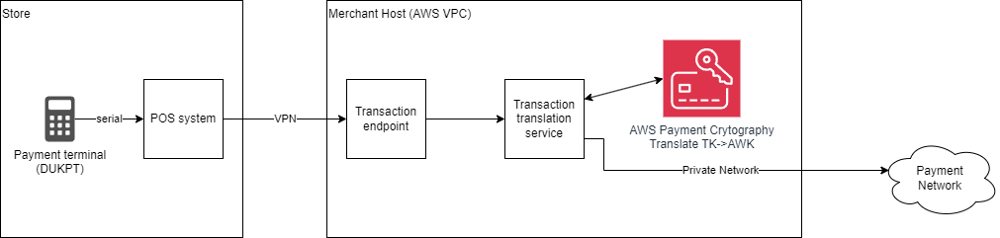

# High-Level Network Diagrams

The PCI PIN Reporting Template requires, “For entities engaged in the processing of PIN based transaction provide a network
schematic describing PIN based transaction flows with the associated key type usage. Additionally, KIFs and entities
engaged in remote key distribution using asymmetric techniques should provide keying material flows“

AWS Payment Cryptography has reported the internal service structure for our PCI PIN assessment. Your diagrams
will illustrate calling the service APIs for PIN processing.

Example high level network diagram for a PIN applications using AWS Payment Cryptography:

