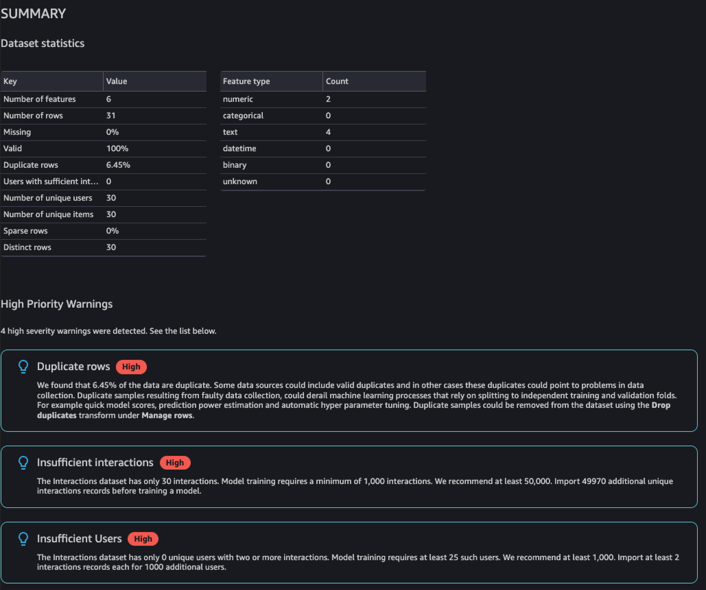
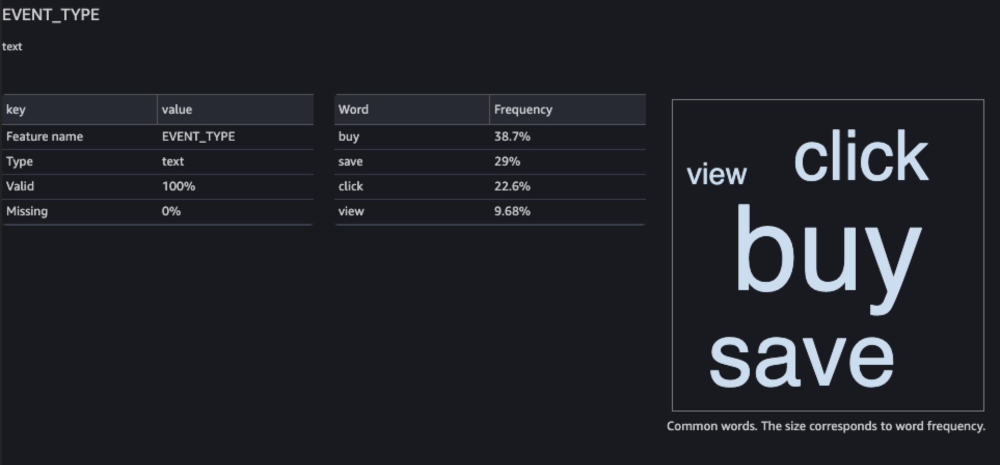

# Generating visualizations and data insights

After you import your data into Data Wrangler, you can use it to generate visualizations and data insights.

- **[Visualizations](#dw-visualizing-data "#dw-visualizing-data")**: Data Wrangler can generate
  different types of graphs, such as histograms and scatter plots. For example, you can generate a histogram to identify
  outliers in your data.
- **[Data insights](#dw-generating-insights "#dw-generating-insights")**: You can use a _Data Quality and Insights Report for Amazon Personalize_
  to learn about your data through data insights and column and row statistics. This report can let you know if you have any type issues in your data.
  And you can learn what actions you can take to improve your data.
  These actions can help you meet Amazon Personalize resource requirements, such as model training requirements, or they can lead to
  improved recommendations.

After you learn about your data through visualizations and insights, you can use this information to help you apply additional transforms to improve your data.
Or, if you are finished preparing your data, you can process it and import it into Amazon Personalize.
For information about transforming your data, see [Transforming data](dw-transform-data.md "dw-transform-data.md"). For information about processing and importing data,
see [Processing data and importing it into Amazon Personalize](dw-export-data.md "dw-export-data.md").

## Generating visualizations

You can use Data Wrangler to create different types of graphs, such as histograms and scatter plots. For example, you can generate a
histogram to identify outliers in your data. To generate a data visualization, you add an **Analysis**
step to your flow and, from **Analysis type**, choose the visualization you want to create.

For more information about creating visualizations in Data Wrangler, see [Analyze and Visualize](../../../sagemaker/latest/dg/data-wrangler-analyses.md "../../../sagemaker/latest/dg/data-wrangler-analyses.md") in the _Amazon SageMaker AI Developer Guide_.

## Generating data insights

You can use Data Wrangler to generate a **Data Quality and Insights Report for Amazon Personalize**
report specific to your dataset type. Before generating the report,
we recommend that you transform your data to meet Amazon Personalize requirements. This will
lead to more relevant insights. For more information, see [Transforming data](dw-transform-data.md "dw-transform-data.md").

###### Topics

- [Report content](#dw-report-content "#dw-report-content")
- [Generating the report](#dw-generating-insight-report "#dw-generating-insight-report")

### Report content

The **Data Quality and Insights Report for Amazon Personalize** includes the following
sections:

- **Summary:** The report summary includes dataset statistics and high priority
  warnings:
  - **Dataset statistics:** These include Amazon Personalize specific statistics, such as the
    number of unique users in your interactions data, and general statistics, such as the number of missing values
    or outliers.
  - **High priority warnings:** These are Amazon Personalize specific insights that have the most
    impact on training or recommendations. Each warning includes a recommended action that you can take to resolve the
    issue.

- **Duplicate rows and Incomplete rows:** These sections include information on which
  rows have missing values and which rows are duplicated in your data.
- **Feature summary:** This section includes the data type for each column, invalid or
  missing data information, and warning counts.
- **Feature details:** This section includes subsections with detailed information for
  each of your columns of data. Each subsection includes statistics for the column, such as categorical value count,
  and missing value information. And each subsection includes Amazon Personalize specific insights and recommended actions for
  columns of data. For example, an insight might indicate that a column has more than 30 possible categories.

#### Data type issues

The report identifies columns that are not of the correct data type and specifies the required type.
To get insights related to these features, you must convert the data type of the column and generate the report again.
To convert
the type, you can use the Data Wrangler transform [Parse Value as
Type](../../../sagemaker/latest/dg/data-wrangler-transform.md#data-wrangler-transform-cast-type "../../../sagemaker/latest/dg/data-wrangler-transform.md#data-wrangler-transform-cast-type").

#### Amazon Personalize insights

The Amazon Personalize insights include a finding and a suggested action. The action is optional. For example,
the report might include an insight and action related to the number of categories for a column of categorical data.
If you don't believe the column is a categorical, you can disregard this insight and take no action.

Except for minor wording differences, the Amazon Personalize specific insights are the same as the _single dataset_ insights you
might generate when you analyze your data with Amazon Personalize. For example, the insights report in Data Wrangler includes insights such as
"The Item interactions dataset has only X unique users with two or more interactions." But it doesn't include insights like
"X% of items in the _Items dataset_ have no interactions in the _Item interactions dataset_."

For a list of possible Amazon Personalize specific insights, see the insights that don't reference multiple datasets in [Data insights](analyzing-data.md#data-insights "analyzing-data.md#data-insights").

#### Report examples

The look and feel of the Amazon Personalize report is the same as the general insights report in Data Wrangler. For examples of the general insights report, see [Get Insights On Data and Data Quality](../../../sagemaker/latest/dg/data-wrangler-data-insights.md "../../../sagemaker/latest/dg/data-wrangler-data-insights.md") in the
_Amazon SageMaker AI Developer Guide_. The following example shows how the summary section of a report for an Item interactions dataset. It includes dataset
statistics and some possible high priority Item interactions dataset warnings.

The following example shows how the feature details section for an EVENT_TYPE column of an Item interactions dataset
might appear in a report.

### Generating the report

To generate the **Data Quality and Insights Report for Amazon Personalize**,
you choose **Get data insights** for your transform and create an analysis.

###### To generate Data Quality and Insights Report for Amazon Personalize

1. Choose the **+** option for the transform you are analyzing. If you haven't added a transform,
   choose the **+** for the **Data types** transform. Data Wrangler adds this transform automatically to your flow.
2. Choose **Get data insights**. The **Create analysis** panel displays.
3. For **Analysis type**, choose **Data Quality and Insights Report for Amazon Personalize**.
4. For **Dataset type**, choose the type of Amazon Personalize dataset you are analyzing.
5. Optionally choose **Run on full data**. By default, Data Wrangler generates insights on only a sample of your data.
6. Choose **Create**. When analysis completes, the report appears.
