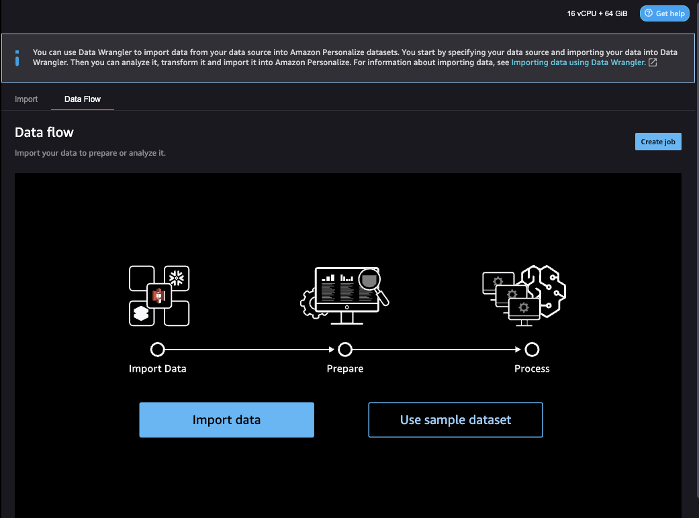

# Importing data into Data Wrangler

After you configure a SageMaker AI domain and launch Data Wrangler in a new tab, you are ready to import data from your source into Data Wrangler. When you use
Data Wrangler to prepare data for Amazon Personalize, you import one dataset at a time. We recommend starting with an Item interactions dataset. You can't use Data Wrangler to
prepare an Actions dataset or Action interactions dataset.

You start on the **Data flow** page.
The page should look similar to the following.

To start importing data, you choose **Import data** and specify your data source. Data Wrangler supports 40+ sources. These include AWS services, such as Amazon Redshift,
Amazon EMR, or Amazon Athena, and third parties, such as Snowflake or DataBricks. Different data sources have different
procedures for connecting and importing data.

For a complete list of available sources and step-by-step instructions on importing data, see [Import](../../../sagemaker/latest/dg/data-wrangler-import.md "../../../sagemaker/latest/dg/data-wrangler-import.md") in the _Amazon SageMaker AI Developer Guide_.

After you import data into Data Wrangler, you are ready to transform it. For information about transforming data,
see [Transforming data](dw-transform-data.md "dw-transform-data.md").
