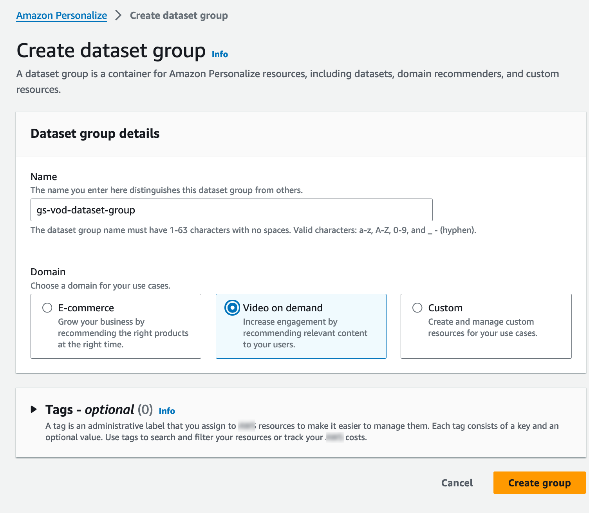
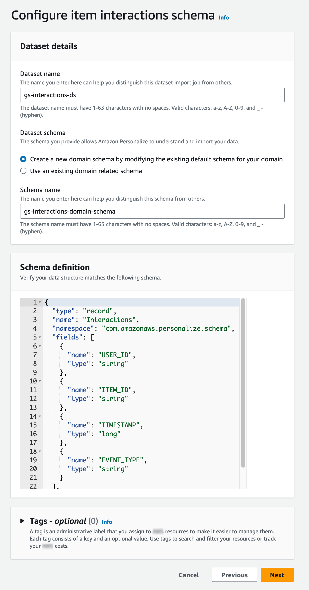
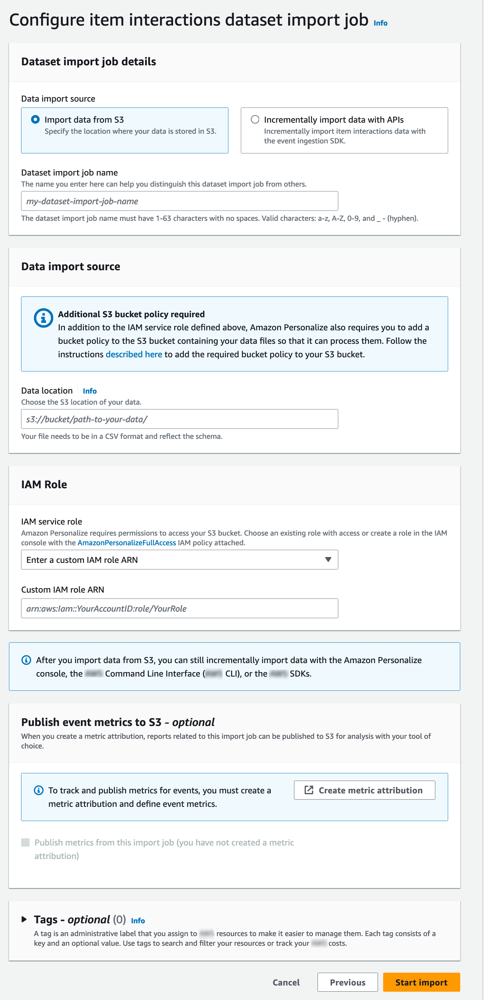
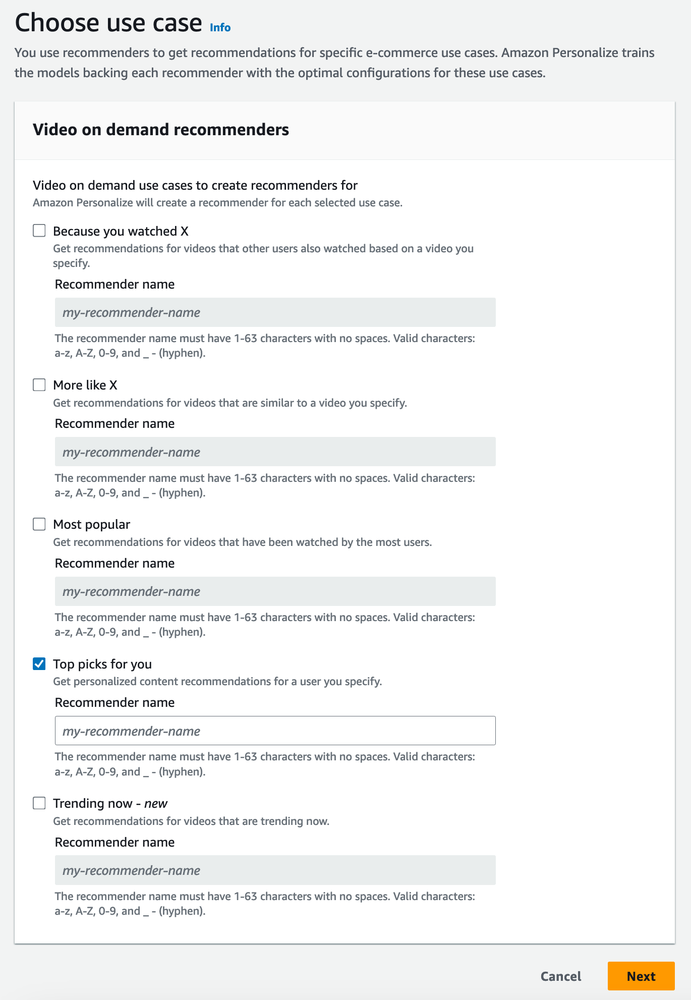
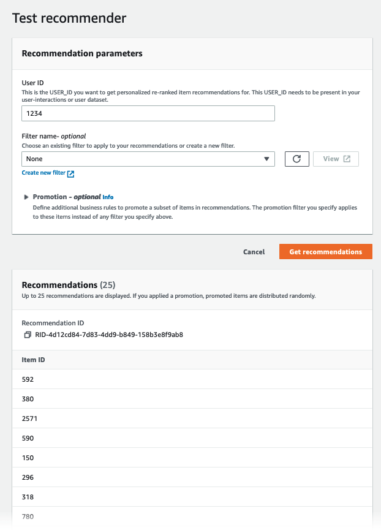

# Getting started with a Domain dataset group

(console)

In this exercise, you use the Amazon Personalize console to create a Domain dataset group and a recommender that returns movie
recommendations for a given user.

Before you start this exercise, review the [Getting started prerequisites](gs-prerequisites.md "gs-prerequisites.md").

When you finish the getting started exercise, to avoid incurring unnecessary charges,
delete the resources that you created. For more information, see
[Requirements for deleting Amazon Personalize resources](deleting-resources.md "deleting-resources.md").

In this procedure you create Domain dataset group for the VIDEO_ON_DEMAND domain,
create an Item interactions dataset with the default schema for the VIDEO_ON_DEMAND domain, and import the item interactions data you
created in [Creating the training data (Domain dataset group)](gs-prerequisites.md#gs-data-prep-domain "gs-prerequisites.md#gs-data-prep-domain").

###### To create a Domain dataset group

1. Open the Amazon Personalize console at [https://console.aws.amazon.com/personalize/home](https://console.aws.amazon.com/personalize/home "https://console.aws.amazon.com/personalize/home") and sign in to your
   account.
2. In the navigation pane, choose **Create dataset group**.
3. In **Dataset group details**, specify a name for your dataset group.
4. For **Domain**, choose **Video on demand**.
   The domain you choose determines the default schema you use when importing data. It also determines what use cases are available for recommenders. Your screen should look similar to the following.

 5. Choose **Create dataset group**. The
Overview page appears. Proceed to [Step 2: Import data](#getting-started-import-data-domain "#getting-started-import-data-domain").

In this procedure you create an Item interactions dataset with the default VIDEO_ON_DEMAND domain schema. Then you import the item interactions data you
created in [Creating the training data (Domain dataset group)](gs-prerequisites.md#gs-data-prep-domain "gs-prerequisites.md#gs-data-prep-domain").

###### To import data

1. On the Overview page, in **Step 1. Create datasets and import data**, choose **Create dataset** and choose **Item interactions dataset**.
2. Choose **Import data directly into Amazon Personalize datasets** and choose **Next**.
3. On the **Configure item interactions schema** page, for **Dataset name** provide a name for your Item interactions dataset.
4. For **Dataset schema**, choose **Create a new domain schema by modifying the existing default schema for your domain**
   and enter a name for the schema. The **Schema definition** updates to display the default schema for the VIDEO_ON_DEMAND domain. Leave the schema unchanged. Your screen should look similar to the following.

 5. Choose **Next**. The **Configure item interactions dataset import job** page appears. 6. On the **Configure item interactions dataset import job** page, leave the **Data import source** unchanged as **Import data from S3**. 7. For **Dataset import job name**, give your import job a name. 8. In **Data import source**, specify where your data is stored
in Amazon Simple Storage Service (S3). Use the following syntax:

`s3://amzn-s3-demo-bucket/<folder path>/<CSV
 filename>` 9. In **IAM role**, for **IAM service role** choose **Enter a custom IAM role ARN** and enter the Amazon Resource Name (ARN) of the role you created in
[Creating an IAM role for Amazon Personalize](set-up-required-permissions.md#set-up-create-role-with-permissions "set-up-required-permissions.md#set-up-create-role-with-permissions"). Your screen should look similar to the following.

 10. Choose **Start import** to import data. The **Overview** page for your Domain dataset group appears. Note the status of the import in the **Set up datasets**
section. When the status is `Interaction data active` proceed to [Step 3: Create a recommender](#getting-started-console-create-recommenders "#getting-started-console-create-recommenders").
In this procedure, you create a recommender for the _Top picks for you_ use case for the VIDEO_ON_DEMAND domain.

###### To create a recommender

1. On the **Overview** page for your Domain dataset group, in **Step 3** choose the **Use video on demand recommenders** tab and choose **Create recommenders**.
2. On the **Choose use case** page, choose **Top picks for you** and provide a **Recommender name**. Your screen should appear
   similar to the following.

 3. Choose **Next**. 4. Leave the fields on the **Advanced configuration** page unchanged and choose
**Next**. 5. Review the recommender details and choose **Create recommenders** to create your
recommender.

You can monitor the status of each recommender on the **Recommenders** page. When your
recommender status is **Active**, you can use it to get recommendations in [Step 4: Get
recommendations](#getting-started-console-get-recommendations-domain "#getting-started-console-get-recommendations-domain").
In this procedure you use the recommender that you created in the previous step to get
recommendations.

###### To get recommendations

1. On the Overview page for your Domain dataset group, in the navigation pane choose **Recommenders**.
2. On the **Recommenders** page, choose your recommender.
3. At the top right, choose **Test**.
4. In **Recommendation parameters**,
   enter a user ID. Leave the other fields unchanged.
5. Choose **Get recommendations**. A table
   containing the user’s top 25 recommended items appears. Your screen should look similar to the following.

