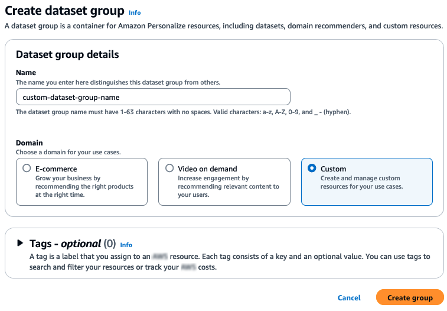
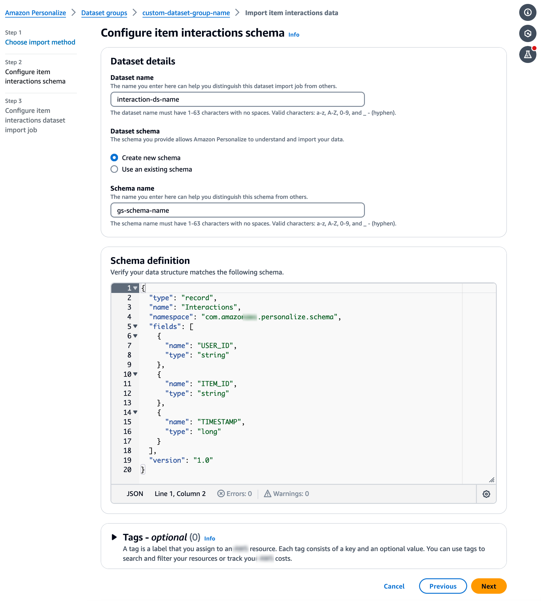
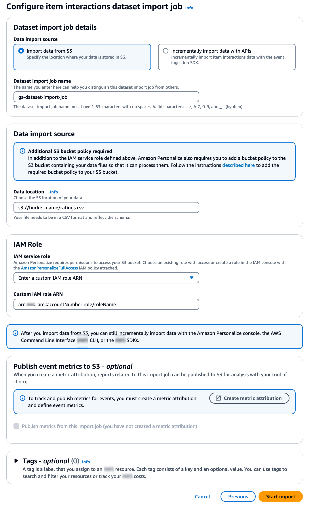
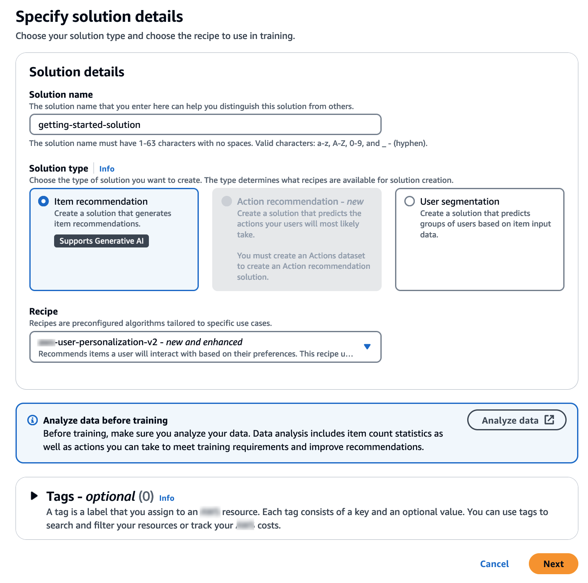
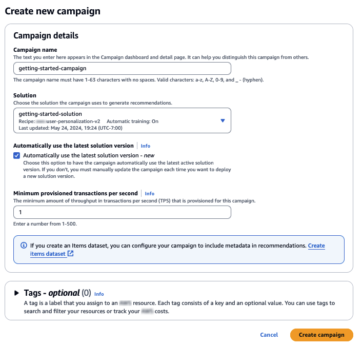
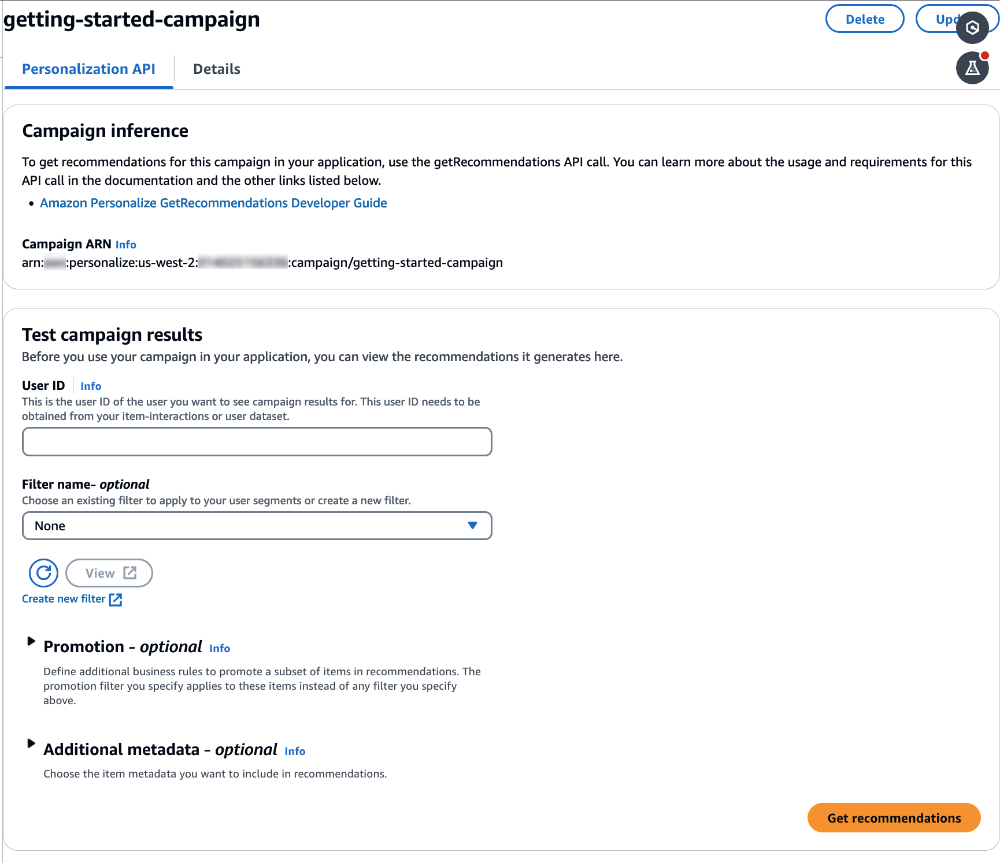
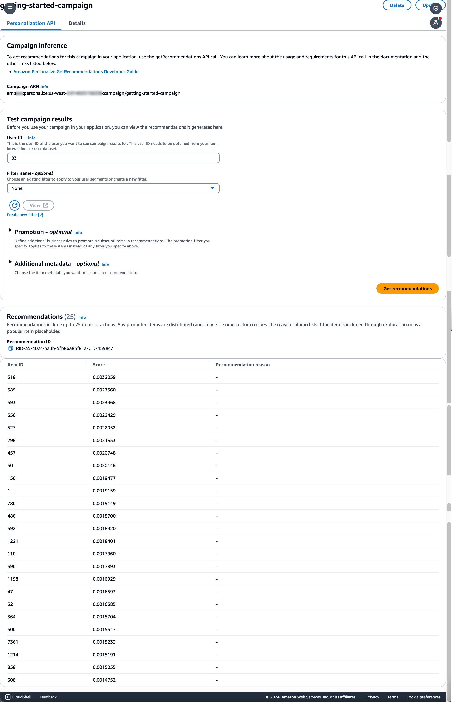

# Getting started (console)

In this exercise, you use the Amazon Personalize console to create a Custom dataset group with a solution that returns movie
recommendations for a given user. Before you start this exercise, review the [Getting started prerequisites](gs-prerequisites.md "gs-prerequisites.md").

When you finish the getting started exercise, to avoid incurring unnecessary charges,
delete the resources that you created. For more information, see
[Requirements for deleting Amazon Personalize resources](deleting-resources.md "deleting-resources.md").

In this procedure, you first create a dataset group. Next, you create an Amazon Personalize
_Item interactions dataset_ dataset in the dataset group.

###### To create a dataset group and a dataset

1. Open the Amazon Personalize console at [https://console.aws.amazon.com/personalize/home](https://console.aws.amazon.com/personalize/home "https://console.aws.amazon.com/personalize/home") and sign in to your
   account.
2. Choose **Create dataset group**.
3. In **Dataset group details**, for **Dataset group
   name**, specify a name for your dataset group.
4. For **Domain** choose **Custom**. Your screen should look
   similar to the following:

 5. Choose **Create group**. The **Overview** page appears. 6. In **Step 1. Create datasets and import data**, choose **Create dataset** and choose **Item interactions dataset**. 7. Choose **Import data directly into Amazon Personalize datasets** and choose **Next**. 8. On the **Configure item interactions dataset** page, for **Dataset name**, specify a
name for your dataset. 9. For **Dataset schema**,
choose **Create new schema**. In the **Schema definition** section, a minimal Item interactions schema is displayed.
The schema matches the
headers you previously added to the `ratings.csv` file, so you don't need to make any changes. If you haven't created the training data, see [Getting started prerequisites](gs-prerequisites.md "gs-prerequisites.md"). 10. For **Schema name**, specify a name for the new schema. Your screen should look similar to the following:

 11. Choose **Next**. The **Configure item interactions dataset import job** page appears.
Next, complete [Step 2: Import item interactions data](#getting-started-console-import-data "#getting-started-console-import-data") to import interactions data.

Now that you have created a dataset, it's time to import item interactions data into the dataset.

###### To import item interactions data

1. On the **Configure item interactions dataset import job** page, for **Data import source** choose **Import data from S3**.
2. For **Dataset import job
   name**, specify a name for your import job.
3. In the **Additional S3 bucket policy
   required** dialog box, if you haven't granted Amazon Personalize permissions, follow the
   instructions to [add the required Amazon S3 bucket policy](granting-personalize-s3-access.md "granting-personalize-s3-access.md").
4. For **Data location**, specify where your movie data file is stored
   in Amazon Simple Storage Service (S3). Use the following syntax:

`s3://amzn-s3-demo-bucket/<folder path>/filename.csv` 5. In the **IAM Role** section, for **IAM service role**, choose
**Enter a custom IAM role ARN**. 6. For **Custom IAM role ARN**, specify the role that you created in
[Creating an IAM role for Amazon Personalize](set-up-required-permissions.md#set-up-create-role-with-permissions "set-up-required-permissions.md#set-up-create-role-with-permissions").

The **Dataset import job details** and **IAM role** sections should be similar to the following:

 7. Leave the **Publish event metrics to S3** and **Tags** sections unchanged and choose **Start import**. The data import job starts and the
**Overview** page is displayed. Initially, the status is **Create pending** (followed by
**Create in progress**), and the **Create solution** button is disabled.

When the data import job has finished, the status changes to **Active** and the **Create solution** button is enabled. 8. Now that you have imported data, you are ready to create a solution in [Step 3: Create a solution](#getting-started-console-create-solution "#getting-started-console-create-solution").
In this tutorial, you use the dataset that you imported in [Step 2: Import item interactions data](#getting-started-console-import-data "#getting-started-console-import-data")
to train a
model. A trained model is referred to as a _solution version_.

###### Important

In this tutorial you create a solution that uses automatic training. With automatic training, you incur
training costs while your solution is active. To avoid unnecessary costs, make sure to delete the solution when you are finished.
For more information, see [Requirements for deleting Amazon Personalize resources](deleting-resources.md "deleting-resources.md").

###### To create a solution

1. On the **Overview** page for your dataset group, in **Step 3. Set up training and recommendation resources** choose **Create solutions**.
2. For **Solution
   name**, specify a name for your solution.
3. For **Solution type** choose **Item recommendations**.
4. For **Recipe**, choose `aws-user-personalization-v2`.

Your screen should look similar to the following:

 5. Choose **Next**. Leave the **Training configuration** fields unchanged. The solution you create
automatically trains new models every 7 days and gives more weight to the most recent item interaction data. 6. Choose **Next** and review the details for the solution. 7. Choose **Create solution** and the details page for the solution displays. After you create a solution, Amazon Personalize starts creating your first solution version within an hour.
When training starts, it appears in the **Solution versions** section on the details page and you can monitor its status.

When the **Solution version status** is _Active_,
you are ready to move to [Step 4: Create a campaign](#getting-started-console-deploy-solution "#getting-started-console-deploy-solution").
In this procedure, you create a campaign, which deploys the solution version you created
in the previous step.

###### To create a campaign

1. In
   the navigation pane, expand **Custom resources** and choose **Campaigns**.
2. Choose **Create campaign**. The **Create new campaign** page appears.
3. In **Campaign details**, for **Campaign name**,
   specify a name for your campaign.
4. For **Solution**, choose the solution you created in
   the previous step.
5. Choose **Automatically use the latest solution version**. Leave all other
   fields unchanged.

Your screen should look similar to the following:

 6. Choose **Create campaign**. Campaign creation starts and the
campaign details pages with the **Personalization
API** section displayed.

Creating a campaign can take a couple minutes. After Amazon Personalize finishes creating your campaign, the page is updated to show the **Test
campaign results** section. Your screen should look similar to the
following:

In this procedure, use the campaign that you created in the previous step to get
recommendations.

###### To get recommendations

1. In **Test campaign results**, for **User ID**,
   specify a value from the _ratings_ dataset, for example,
   `83`. Leave all other fields unchanged.
2. Choose **Get recommendations**. The **Recommendations** panel lists the item IDs and scores for the recommended items.

Your screen should look similar to the following:

