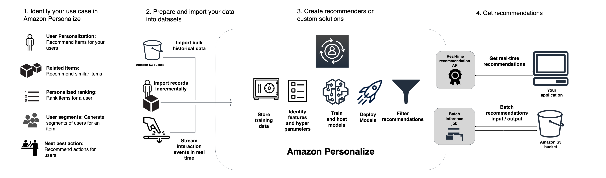

# How Amazon Personalize works

Amazon Personalize uses your data to train domain-based or customizable
recommendation models. You use a private recommendation API in your
application to request real-time recommendations. Amazon Personalize also supports batch
workflows get item recommendations and user segments.

###### Topics

- [Amazon Personalize workflow details](personalize-workflow.md "personalize-workflow.md")
- [Amazon Personalize terms](terms.md "terms.md")
- [Types of data Amazon Personalize can use](datasets.md "datasets.md")
