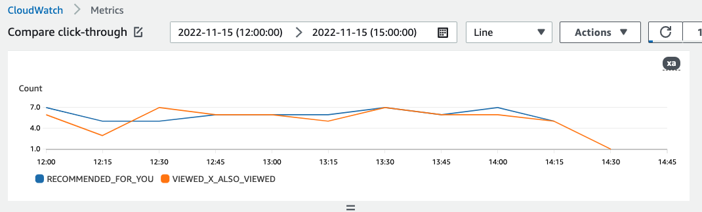

# Viewing graphs of metric data in CloudWatch

###### Important

After you create a metric attribution and record events or import incremental bulk data, you will incur some monthly CloudWatch cost per metric. For information about CloudWatch pricing, see the [Amazon CloudWatch pricing](https://aws.amazon.com/cloudwatch/pricing/ "https://aws.amazon.com/cloudwatch/pricing/") page.
To stop sending metrics to CloudWatch, [delete the metric attribution](deleting-metric-attribution.md "deleting-metric-attribution.md").

After you create a metric attribution,
Amazon Personalize automatically sends metrics from [PutEvents](API_UBS_PutEvents.md "API_UBS_PutEvents.md") and incremental bulk data to Amazon CloudWatch. You can select metrics and
create graphs of the metric data using the CloudWatch console. These graphs can help you visually inspect and compare the
performance and impact of different recommenders or campaigns.

To compare sources, each interaction event must include a `recommendationId` or
`eventAttributionSource`. For code samples that show
how to include this data in an event, see [Event metrics and attribution reports](event-metrics.md "event-metrics.md").

To view metrics in CloudWatch, complete the procedure found in [Graphing a metric](../../../AmazonCloudWatch/latest/monitoring/graph_a_metric.md "../../../AmazonCloudWatch/latest/monitoring/graph_a_metric.md"). You can view
your data at different levels of detail. The minimum **Period** you can graph is 15 minutes. You can view
Amazon Personalize data from the previous 2 weeks in CloudWatch – older data is ignored. For the search term, specify the name you gave the
metric when you created the metric attribution.

The following is an example of how a metric might appear in CloudWatch. The metric shows the click-through rate
for every 15 minutes for two different recommenders.

