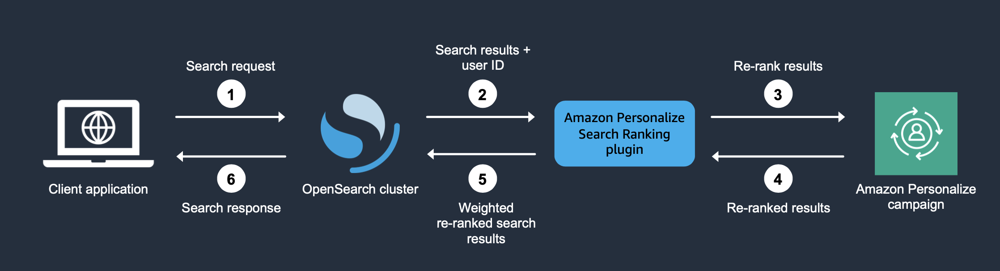

# Personalizing search results from OpenSearch

You can use Amazon Personalize to personalize results from open source OpenSearch or Amazon OpenSearch Service for your users.

[OpenSearch](https://opensearch.org/docs/latest "https://opensearch.org/docs/latest") is a self-managed, open source search service based on the
Apache 2.0 License. [Amazon OpenSearch Service](../../../opensearch-service/latest/developerguide/what-is.md "../../../opensearch-service/latest/developerguide/what-is.md")
is a managed service that helps you deploy, operate, and scale OpenSearch resources in the AWS Cloud. When you use
Amazon OpenSearch Service, OpenSearch retrieves and ranks results.

When ranking query results, OpenSearch uses a probabilistic ranking framework called [BM-25](https://en.wikipedia.org/wiki/Okapi_BM25 "https://en.wikipedia.org/wiki/Okapi_BM25") to calculate relevance scores. If a distinctive keyword appears
more frequently in a document, BM-25 assigns a higher relevance score to that document. OpenSearch ranking doesn’t take into
account user behavior like click-through data.

When you use Amazon Personalize with OpenSearch, Amazon Personalize re-ranks OpenSearch results based on a user's past behavior, any metadata
about the items, and any metadata about the user. OpenSearch then incorporates the re-ranking before returning the search
response to your application. You control how much weight OpenSearch gives the ranking from Amazon Personalize when applying it to
OpenSearch results.

With this re-ranking, results can be more engaging and relevant to a user's interests. This can lead to an increase in
the click-through rate and conversion rate for your application. For a use case example that describes how personalized search
can improve results for an ecommerce application, see [Use case example](#opensearch-use-case-example "#opensearch-use-case-example").

Before you start personalizing OpenSearch results, review the requirements listed in [Amazon Personalize Search Ranking plugin requirements](plugin-requirements.md "plugin-requirements.md").

###### Topics

- [Use case example](#opensearch-use-case-example "#opensearch-use-case-example")
- [How the Amazon Personalize Search Ranking plugin works](#opensearch-plugin-how-it-works "#opensearch-plugin-how-it-works")
- [Additional information](#open-search-plugin-additional-info "#open-search-plugin-additional-info")
- [Amazon Personalize Search Ranking plugin requirements](plugin-requirements.md "plugin-requirements.md")
- [Personalizing results from Amazon OpenSearch Service with Amazon Personalize](opensearch-service.md "opensearch-service.md")
- [Personalizing results from open source Open Search with Amazon Personalize](opensearch-open-source.md "opensearch-open-source.md")
- [Fields for the personalized_search_ranking response processor](opensearch-plugin-pipeline-fields.md "opensearch-plugin-pipeline-fields.md")
- [Pipeline metrics example](monitor-response.md "monitor-response.md")

## Use case example

When you use Amazon Personalize to re-rank OpenSearch results, the search results can be more relevant for your users. For example,
you might have an ecommerce application that sells cars. If your user enters a query for Toyota cars and you don't
personalize results, OpenSearch would return a list of cars made by Toyota based on keywords in your data. This list would
be ranked in the same order for all users.

But if you use Amazon Personalize to personalize results, OpenSearch re-ranks these cars in order of relevance for the specific user
based on their behavior—for example, their clicks. The car that the user is most likely to click is ranked first.

When you personalize OpenSearch results, you control how much weight (emphasis) OpenSearch gives the ranking from
Amazon Personalize. Continuing with this example, if a user searches for a specific type of car from a specific year (such as a 2008
Toyota Prius), you might want to put more emphasis on the original ranking from OpenSearch.

However, for more generic queries that result in a wide range of results (such as a search for all Toyota vehicles), you
might put a high emphasis on personalization. This way, the cars at the top of the list are more relevant to the particular
user.

## How the Amazon Personalize Search Ranking plugin works

The following diagram shows how the Amazon Personalize Search Ranking plugin works.

1. You submit your customer's query to your OpenSearch Service domain or your open source OpenSearch cluster.
2. OpenSearch sends the query response (list of items that are relevant to the query) and the user's ID to the
   Amazon Personalize Search Ranking plugin.
3. The plugin sends the items and user in the response to your Amazon Personalize campaign for ranking. It uses the recipe and
   campaign Amazon Resource Name (ARN) values in your search pipeline to get a personalized ranking for the user. It uses
   the GetPersonalizedRanking API operation for recommendations. In the request, it passes the userId of the user making
   the query and the items returned from the OpenSearch query in the `inputList`.
4. Amazon Personalize returns the re-ranked results to the plugin.
5. The plugin rearranges and returns the search results to your OpenSearch Service domain or open source OpenSearch cluster. It
   re-ranks the results based on the response from your Amazon Personalize campaign and the emphasis on personalization that you
   specify during setup.
6. Your open source OpenSearch cluster or OpenSearch Service domain returns the final results to your application.

## Additional information

The following resources provide additional information about using OpenSearch.

- For information about getting started with open source OpenSearch, see [Quickstart](https://opensearch.org/docs/quickstart "https://opensearch.org/docs/quickstart").
- For information about getting started with OpenSearch Service, see [Getting started with Amazon OpenSearch Service](../../../opensearch-service/latest/developerguide/gsg.md "../../../opensearch-service/latest/developerguide/gsg.md") in the
  _Amazon OpenSearch Service Developer Guide_.
- For information about the Personalized-Ranking recipes in Amazon Personalize, see [Personalized-Ranking-v2 recipe](native-recipe-personalized-ranking-v2.md "native-recipe-personalized-ranking-v2.md") or
  [Personalized-Ranking recipe](native-recipe-search.md "native-recipe-search.md").
