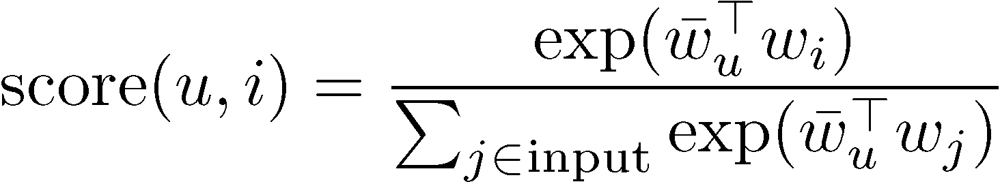

# Getting a personalized ranking (custom resources)

A personalized ranking is a list of recommended items that are re-ranked for a specific
user. To get personalized rankings, call the [GetPersonalizedRanking](API_RS_GetPersonalizedRanking.md "API_RS_GetPersonalizedRanking.md") API operation or get recommendations from a campaign
in the console.

###### Note

The solution backing the campaign must have been created using a recipe of type
PERSONALIZED_RANKING. For more information, see [Choosing a
recipe](working-with-predefined-recipes.md "working-with-predefined-recipes.md").

###### Topics

- [How personalized ranking scoring works](#how-ranking-scoring-works "#how-ranking-scoring-works")
- [Getting a personalized ranking (console)](get-ranking-recommendations-console.md "get-ranking-recommendations-console.md")
- [Getting a personalized ranking (AWS CLI)](get-personalized-rankings-cli.md "get-personalized-rankings-cli.md")
- [Getting a personalized ranking (AWS SDKs)](get-personalized-rankings-sdk.md "get-personalized-rankings-sdk.md")
- [Personalized-Ranking sample notebook](#real-time-recommendations-personalized-ranking-example "#real-time-recommendations-personalized-ranking-example")

## How personalized ranking scoring works

Like the scores returned by the `GetRecommendations` operation for solutions created with
the User-Personalization-v2 and User-Personalization recipes,
`GetPersonalizedRanking` scores sum to 1, but only the input items receive scores and
recommendation scores tend to be
higher. If an item wasn't present during the latest training, it receives a score of 0.

Mathematically, the scoring function for GetPersonalizedRanking is identical to
`GetRecommendations`, except that it only considers the input items. This means
that scores closer to 1 become more likely, as there are fewer other choices to divide up
the score:

## Personalized-Ranking sample notebook

For a sample Jupyter notebook that shows how to use the Personalized-Ranking recipe see [Personalize Ranking Example](https://github.com/aws-samples/amazon-personalize-samples/blob/master/next_steps/core_use_cases/personalized_ranking/personalize_ranking_example.ipynb "https://github.com/aws-samples/amazon-personalize-samples/blob/master/next_steps/core_use_cases/personalized_ranking/personalize_ranking_example.ipynb").
