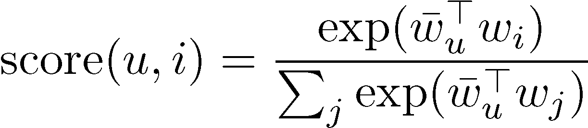

# Real-time item recommendations in Amazon Personalize

If your use case or recipe generates item recommendations, after you [create a recommender](creating-recommenders.md "creating-recommenders.md") or [create a campaign](campaigns.md "campaigns.md"),
you can get real-time personalized or related item recommendations for your users.

If your domain use case or recipe provides [real-time personalization](use-case-recipe-features.md#about-real-time-personalization "use-case-recipe-features.md#about-real-time-personalization"), such as the _Top picks for you_ use case or the _User-Personalization-v2_ recipe,
Amazon Personalize updates recommendations based on your user's most recent activity as you record their interactions with your catalog.
For more information on recording real-time events and personalization, see [Recording real-time events to influence recommendations](recording-events.md "recording-events.md").

When you get real-time item recommendations,
you can do the following:

- If you configured your campaign to return metadata for recommended items, you can specify the columns to include in
  your [GetRecommendations](API_RS_GetRecommendations.md "API_RS_GetRecommendations.md") API operation. Or you can
  specify the columns when you test the campaign with the Amazon Personalize console. For code samples, see [Getting item metadata with real-time recommendations](getting-recommendations-with-metadata.md "getting-recommendations-with-metadata.md"). For information
  about enabling metadata for a campaign, see [Item metadata in recommendations](campaigns.md#create-campaign-return-metadata "campaigns.md#create-campaign-return-metadata"). For information about enabling metadata for a recommender, see [Enabling metadata in recommendations for a domain recommender in Amazon Personalize](create-recommender-return-metadata.md "create-recommender-return-metadata.md").
- For some use cases and recipes, you can specify a promotion in your recommendation request. A
  _promotion_ defines additional business rules that apply to a configurable subset of recommended
  items. For more information, see [Promoting items in real-time recommendations](promoting-items.md "promoting-items.md").
- You can filter results based on custom criteria. For example, you might not want to recommend products that a user
  has already purchased or recommend only items for a particular age group. For more information, see [Filtering recommendations and user segments](filter.md "filter.md").

###### Note

If you used a PERSONALIZED_RANKING custom recipe, see [Getting a personalized ranking (custom resources)](rankings.md "rankings.md").

###### Topics

- [How recommendation scoring works (custom resources)](#how-recommendation-scoring-works "#how-recommendation-scoring-works")
- [Recommendation reasons with User-Personalization-v2](#recommendation-reasons "#recommendation-reasons")
- [Getting real-time item recommendations](getting-real-time-item-recommendations.md "getting-real-time-item-recommendations.md")
- [Getting item metadata with real-time recommendations](getting-recommendations-with-metadata.md "getting-recommendations-with-metadata.md")
- [Promoting items in real-time recommendations](promoting-items.md "promoting-items.md")

## How recommendation scoring works (custom resources)

With the User-Personalization-v2 and User-Personalization recipes, Amazon Personalize generates scores for items based on
on a user's interaction data and metadata. These scores represent the relative certainty that
Amazon Personalize has in whether the user will interact with the item next. Higher scores represent greater
certainty.

###### Note

Amazon Personalize doesn't show scores for domain recommenders or the Similar-Items, SIMS or Popularity-Count recipes. For information on scores for Personalized-Ranking recommendations, see [How personalized ranking scoring works](rankings.md#how-ranking-scoring-works "rankings.md#how-ranking-scoring-works").

Amazon Personalize generates scores for items relative to each other on a scale from 0 to 1 (both inclusive).
With User-Personalization-v2, Amazon Personalize generates scores for a subset of your items.
With User-Personalization, Amazon Personalize scores all of the items in your catalog.

If you use User-Personalization-v2 and apply a filter to recommendations, depending on how many recommendations the filter removes,
Amazon Personalize might add placeholder items. It does this to meet the `numResults` for your
recommendation request. These items are popular items, based on amount of interactions data, that satisfy your filter criteria.
They don't have a relevance score for the user.

For both User-Personalization-v2 and User-Personalization, the
total of all scores equals 1. For example, if you're getting movie recommendations for a
user and there are three movies appearing the Items dataset and Interactions dataset, their scores might be
`0.6`, `0.3`, and `0.1`. Similarly, if you have 10,000
movies in your inventory, the highest-scoring movies might have very small scores (the
average score would be`.001`), but, because scoring is relative, the
recommendations are still valid.

In mathematical terms, scores for each user-item pair (u,i) are computed according to
the following formula, where `exp` is the exponential function,
w̅u and wi/j are user
and item embeddings respectively, and the Greek letter sigma (Σ) represents summation over
all items with scores:

## Recommendation reasons with User-Personalization-v2

If you use User-Personalization-v2, items the model wouldn't normally recommend include a `reason` list.
These reasons explain why the item was included in recommendations. Possible reasons include the following:

- Promoted item – Indicates the item was included as part of a promotion that you applied in your recommendation request.
- Exploration – Indicates the item was included with exploration.
  With exploration, recommendations include items with less interactions data or relevance for the user.
  For more information about exploration, see
  [Exploration](use-case-recipe-features.md#about-exploration "use-case-recipe-features.md#about-exploration").
- Popular item – Indicates the item was included as a placeholder popular item.
  If you use a filter, depending on how many recommendations the filter removes,
  Amazon Personalize might add placeholder items to meet the `numResults` for your
  recommendation request. These items are popular items, based on interactions data, that satisfy your filter criteria.
  They don't have a relevance score for the user.
