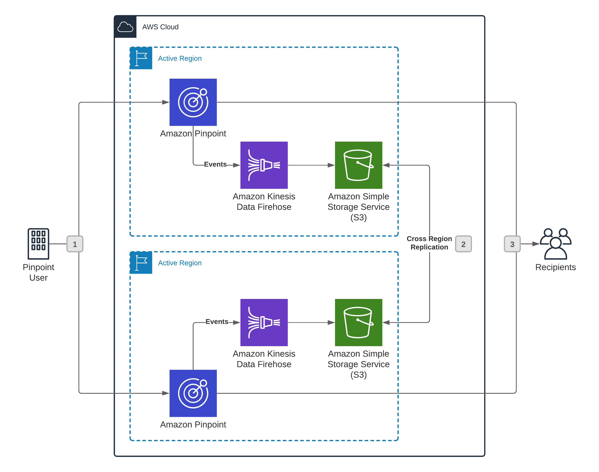

**End of support notice:** On October
30, 2026, AWS will end support for Amazon Pinpoint. After October 30, 2026, you will no
longer be able to access the Amazon Pinpoint console or Amazon Pinpoint resources (endpoints,
segments, campaigns, journeys, and analytics). For more information, see [Amazon Pinpoint end of
support](../../../console/pinpoint/migration-guide.md "../../../console/pinpoint/migration-guide.md"). **Note:** APIs related to SMS, voice,
mobile push, OTP, and phone number validate are not impacted by this change and are
supported by AWS End User Messaging.

# Amazon Pinpoint reference architectures

This chapter contains two sample architectures for resilient Amazon Pinpoint workloads: an
active-active architecture, and a warm standby architecture. Each of these architectures has
its own distinct benefits and drawbacks. The topics in this chapter provide information
about each of these architecture types.

###### Topics in this chapter:

- [Amazon Pinpoint active-active reference
  architecture](#architectures-activeactive "#architectures-activeactive")
- [Amazon Pinpoint warm standby reference
  architecture](#architectures-warmstandby "#architectures-warmstandby")

## Amazon Pinpoint active-active reference

architecture

This section describes an active-active architecture for Amazon Pinpoint. In this type of
architecture, two identical instances of Amazon Pinpoint are maintained in two separate AWS Regions.
Messages are sent through both Regions simultaneously. If an increased rate of errors occurs
in one Region, the traffic that would normally be sent through the affected Region is
instead diverted to the other Region. When the error rate in the impacted Region returns to
normal, the traffic is again divided between both Regions.

###### Topics in this section:

- [Active-active architecture
  considerations](#architectures-activeactive-considerations "#architectures-activeactive-considerations")
- [Active-active architecture
  details](#architectures-activeactive-details "#architectures-activeactive-details")
- [Benefits and drawbacks of
  an active-active architecture](#architectures-activeactive-benefitsdrawbacks "#architectures-activeactive-benefitsdrawbacks")

### Active-active architecture

considerations

Consider the following factors when implementing an active-active architecture with
Amazon Pinpoint:

- If you use Amazon Pinpoint to send email, you must configure your sending domains in
  each AWS Region. This means that you must add multiple records to the DNS
  configuration of your sending domain.
- If you use Amazon Pinpoint to send SMS messages, you must obtain origination identities
  in each AWS Region. Origination identities are the identities that are used
  for sending SMS messages. Examples of origination identities include short
  codes, long codes, toll-free numbers, and 10DLC numbers. In some countries,
  obtaining these origination identities requires a registration process. For
  example, to obtain a Sender ID for sending SMS messages to recipients in India,
  you must register your company and use case with regulatory authorities.
  Similarly, if you want to use a short code to send SMS messages to recipients in
  the United States, you must register your use case with the mobile
  carriers.

For more information about requesting various types of origination
identities, see [Requesting
support for SMS, MMS, and voice messaging](../userguide/channels-sms-awssupport.md "../userguide/channels-sms-awssupport.md") in the
_Amazon Pinpoint User Guide_. For more information about the
types of origination identities that are available in each country, see
[Supported
countries and regions](../userguide/channels-sms-countries.md "../userguide/channels-sms-countries.md") in the
_Amazon Pinpoint User Guide_.

### Active-active architecture

details

The following diagram shows an active-active architecture for Amazon Pinpoint:

An active-active architecture involves three main parts:

1. Under normal conditions, Amazon Pinpoint traffic is evenly split across two
   AWS Regions. If there are excessive errors in one Region, then all traffic is
   routed to the other Region.
2. As messages are sent, Amazon Pinpoint generates [event](../developerguide/event-streams.md "../developerguide/event-streams.md") data.
   For email messages, this data includes information about deliveries, opens,
   clicks, bounces, and complaints. For SMS messages, this data includes
   information about deliveries and failures. This data should be replicated across
   Regions so that it isn't lost. If you configured your event stream to send data
   to Amazon S3, you can use Amazon S3 object replication to replicate this data. If your
   event stream sends data to Amazon Redshift, you can use the cross-region replication
   feature in Amazon Redshift.

For more information about replicating event data, see [Synchronizing event data](customerdata-events.md "customerdata-events.md"). 3. Messages are delivered to their recipients.

### Benefits and drawbacks of

an active-active architecture

Consider the benefits and drawbacks of implementing an active-active
architecture.

A potential benefit of this architecture is availability. The Recovery Time Objective
(RTO) and Recovery Point Objective (RPO) are minimized in this architecture.

Another benefit of this architecture is that resources are always ready to use. For
example, if you have dedicated IP addresses for sending email, those IP addresses are
always warmed up because they are constantly being used (assuming that your email is
evenly split across both Regions). In a warm standby architecture, the dedicated IPs in
the standby Region wouldn't have regular volumes of email being sent from them and would
be considered "cold." In a failover scenario, a sudden increase in sending volumes from
cold IPs could result in poor deliverability rates.

A drawback of the active-active architecture is cost. Because you're splitting your
traffic evenly between two Regions in this architecture, you have to obtain identical
resources for both Regions. For example, if you want to use a short code to send SMS
messages, you must obtain two separate short codes (one for each Region).

## Amazon Pinpoint warm standby reference

architecture

This section describes a warm standby architecture for Amazon Pinpoint. In this architecture, a
fully functional environment is maintained in an AWS Region that is separate from the
primary Region in which you use Amazon Pinpoint. In traditional warm standby architectures, the warm
standby Region has reduced capabilities that are scaled up when necessary to meet demand.
However, because of the way that Amazon Pinpoint works, it might not be possible to scale up certain
resources. For example, resources such as SMS short codes take several weeks to obtain and
have a throughput limit that can't be increased on demand. For this reason, you might have
to maintain redundant resources in each of the Regions in which you use Amazon Pinpoint.

###### Topics in this section:

- [Warm standby architecture
  considerations](#architectures-warmstandby-considerations "#architectures-warmstandby-considerations")
- [Warm standby architecture
  details](#architectures-warmstandby-details "#architectures-warmstandby-details")
- [Benefits and drawbacks of
  a warm standby architecture](#architectures-warmstandby-benefitsdrawbacks "#architectures-warmstandby-benefitsdrawbacks")

### Warm standby architecture

considerations

Consider the following factors when implementing a warm standby architecture with
Amazon Pinpoint:

- If you use Amazon Pinpoint to send email, you must configure your sending domains in
  each AWS Region. This means that you must add multiple records to the DNS
  configuration of your sending domain.
- If you use Amazon Pinpoint to send SMS messages, you must obtain origination identities
  in each AWS Region. Origination identities are the identities that are used
  for sending SMS messages. Examples of origination identities include short
  codes, long codes, toll-free numbers, and 10DLC numbers. In some countries,
  obtaining these origination identities requires a registration process. For
  example, to obtain a Sender ID for sending SMS messages to recipients in India,
  you must register your company and use case with regulatory authorities.
  Similarly, if you want to use a short code to send SMS messages to recipients in
  the United States, you must register your use case with the mobile
  carriers.

For more information about requesting various types of origination identities,
see [Requesting SMS
support](../userguide/channels-sms-awssupport.md "../userguide/channels-sms-awssupport.md") in the _Amazon Pinpoint User Guide_. For more
information about the types of origination identities that are available in each
country,
see [Supported
countries and regions](../userguide/channels-sms-countries.md "../userguide/channels-sms-countries.md") in the
_Amazon Pinpoint User Guide_.

### Warm standby architecture

details

The following diagram shows a warm standby architecture for Amazon Pinpoint:

A warm standby architecture involves three main steps:

1. Under normal conditions, Amazon Pinpoint traffic is sent to the primary Region. If there
   are excessive errors in the primary Region, then all traffic is routed to the
   other Region.
2. As messages are sent, Amazon Pinpoint generates [event](../developerguide/event-streams.md "../developerguide/event-streams.md") data.
   For email messages, this data includes information about deliveries, opens,
   clicks, bounces, and complaints. For SMS messages, this data includes
   information about deliveries and failures. This data should be replicated across
   Regions so that it isn't lost. If you configured your event stream to send data
   to Amazon S3, you can use Amazon S3 object replication to replicate this data. If your
   event stream sends data to Amazon Redshift, you can use the cross-Region replication
   feature in Amazon Redshift.

For more information about replicating event data, see [Synchronizing event data](customerdata-events.md "customerdata-events.md"). 3. Messages are delivered to their recipients.

### Benefits and drawbacks of

a warm standby architecture

Like any other type of resilient architecture, you must carefully consider the
benefits and drawbacks of implementing a warm standby architecture.

A potential benefit of this architecture is cost savings. Because warm standby Regions
are only used in rare and temporary situations, it might be possible to provision fewer
resources in those Regions. For example, if you use Amazon Pinpoint to send email, you might have
dedicated IP addresses (which are available for an additional monthly charge) in your
primary Region, but use shared IP addresses (which are available at no additional
charge) in your warm standby Region.

A drawback of the warm standby architecture is that you might still need to pay for
resources that are unused a majority of the time. For example, if you have a short code
for sending SMS messages in your primary Region, and you want your warm standby Region
to have the same SMS sending capabilities, then you must provision a short code in the
warm standby Region.

Another drawback of the warm standby architecture is that the Recovery Time Objective
(RTO) and Recovery Point Objective (RPO) might be slightly higher than they would be for
an [active-active](#architectures-activeactive "#architectures-activeactive") architecture. For
mission-critical workloads, you should carefully consider both of these architecture
options.
