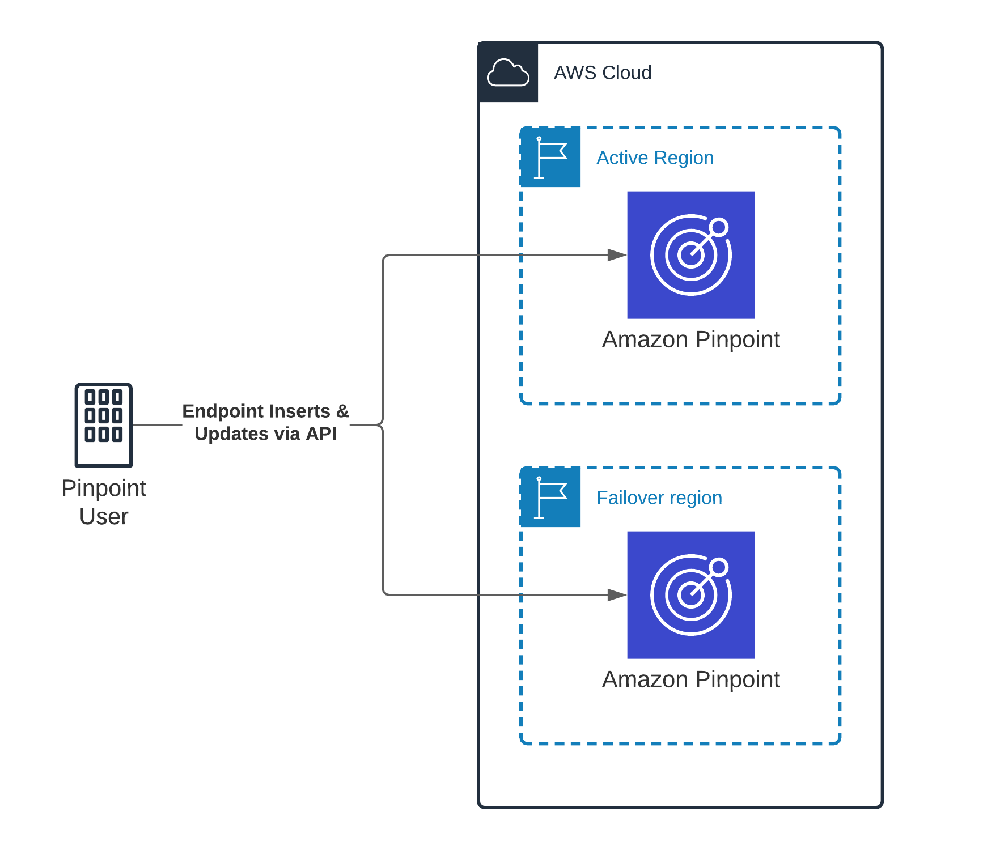
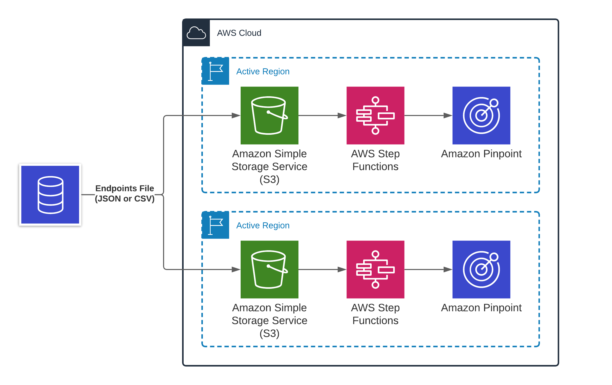
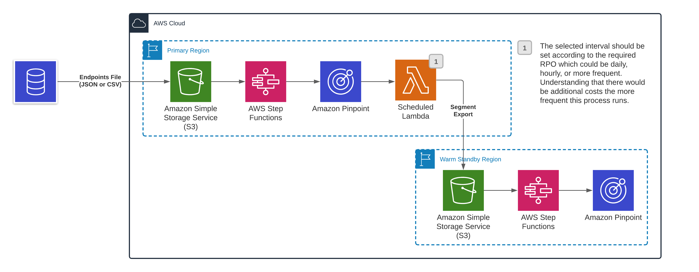

**End of support notice:** On October
30, 2026, AWS will end support for Amazon Pinpoint. After October 30, 2026, you will no
longer be able to access the Amazon Pinpoint console or Amazon Pinpoint resources (endpoints,
segments, campaigns, journeys, and analytics). For more information, see [Amazon Pinpoint end of
support](../../../console/pinpoint/migration-guide.md "../../../console/pinpoint/migration-guide.md"). **Note:** APIs related to SMS, voice,
mobile push, OTP, and phone number validate are not impacted by this change and are
supported by AWS End User Messaging.

# Synchronizing endpoint information

This section contains architecture examples related to synchronizing Amazon Pinpoint endpoint data
across multiple AWS Regions.

###### Topics in this section:

- [Create and update individual
  endpoints](#customerdata-endpoints-individual "#customerdata-endpoints-individual")
- [Create or update endpoints in bulk](#customerdata-endpoints-bulk "#customerdata-endpoints-bulk")

## Create and update individual

endpoints

If your application or service uses the [UpdateEndpoint](../apireference/apps-application-id-endpoints-endpoint-id.md#UpdateEndpoint "../apireference/apps-application-id-endpoints-endpoint-id.md#UpdateEndpoint") API to create individual endpoints in your Amazon Pinpoint account,
you can simultaneously call the API in each of your target Regions. Your call to each
Region contains exactly the same data. This solution is suitable for situations in which
you are adding new endpoints to Amazon Pinpoint as the endpoints contact information is being
captured, instead of loading endpoints from an existing database or system in bulk. This
approach works for both [active-active](architectures.md#architectures-activeactive "architectures.md#architectures-activeactive")
and [warm standby](architectures.md#architectures-warmstandby "architectures.md#architectures-warmstandby") architectures, and is
illustrated in the following image:

The benefit of this architecture is that the Recovery Point Objective (RPO) is near
zero. A disadvantage is that you have to make twice as many API calls at ingestion time,
which could increase latency when creating or updating endpoints.

## Create or update endpoints in bulk

A common way that you can manage endpoints is to export customer data from a data lake
or system of record. The exported data is then stored in an Amazon S3 bucket. An Import Job
then picks up the data from the Amazon S3 bucket and imports it into Amazon Pinpoint. If your
architecture uses Import Jobs, make sure that you import the data into all of your
AWS Regions.

You can do these imports in parallel by writing the source files to Amazon S3 buckets in
each of your target Regions. You can then use Lambda functions and Step Functions workflows to
import that data in each Region automatically. This architecture works for both [active-active](architectures.md#architectures-activeactive "architectures.md#architectures-activeactive") and [warm standby](architectures.md#architectures-warmstandby "architectures.md#architectures-warmstandby") architectures. The parallel
import architecture is illustrated in the following diagram:

The benefit of this architecture is that the RPO is near zero. A disadvantage is that
you have to make twice as many API calls at ingestion time, which could increase latency
when creating or updating endpoints.

If you use a warm standby architecture, you could alternatively use a recurring
_Export Job_. The Export Job exports segment
members into an Amazon S3 bucket in the warm standby Region. You can then use Lambda functions
and Step Functions workflows to create Import Jobs in the warm standby Region. This architecture
is illustrated in the following diagram:

A disadvantage of this architecture is that the RPO is increased. However, you can
control the RPO by changing how often Export Jobs is performed.
