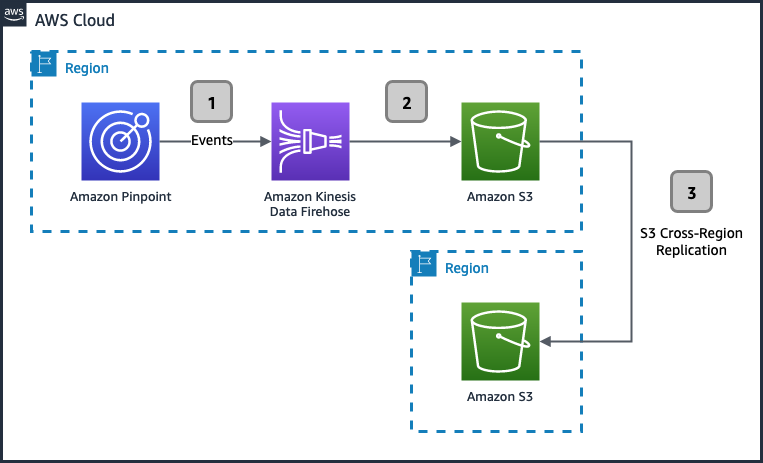

**End of support notice:** On October
30, 2026, AWS will end support for Amazon Pinpoint. After October 30, 2026, you will no
longer be able to access the Amazon Pinpoint console or Amazon Pinpoint resources (endpoints,
segments, campaigns, journeys, and analytics). For more information, see [Amazon Pinpoint end of
support](../../../console/pinpoint/migration-guide.md "../../../console/pinpoint/migration-guide.md"). **Note:** APIs related to SMS, voice,
mobile push, OTP, and phone number validate are not impacted by this change and are
supported by AWS End User Messaging.

# Synchronizing event data

When you use Amazon Pinpoint to send email or SMS messages, it generates event records. For email,
these event records can tell you whether a message was delivered, rejected, opened, clicked,
and more. For SMS messages, event records can tell you whether a message was delivered.
These records are useful for tracking the success of your messages, and for troubleshooting
issues. This section contains information about synchronizing event data across
AWS Regions.

## Replicating event data

Amazon Pinpoint can send events to a Amazon Kinesis Data Firehose stream. The Firehose stream can then
send that data to numerous destinations, including Amazon S3 buckets and Amazon Redshift clusters. Many
of these destinations support the automatic replication of data across AWS Regions.
For example, Amazon S3 includes a feature called Cross-Region Replication (CRR). The
following diagram shows an example of an Amazon Pinpoint architecture that uses Amazon S3 CRR:

For more information about CRR, see [Replicating objects
overview](../../../AmazonS3/latest/userguide/replication.md "../../../AmazonS3/latest/userguide/replication.md") in the _Amazon S3 User Guide_.

If you send your event data to an Amazon Redshift cluster instead of an Amazon S3 bucket, you can
implement a similar architecture using cross-Region data sharing. For more information,
see [Sharing data
across AWS Regions](../../../redshift/latest/dg/across-region.md "../../../redshift/latest/dg/across-region.md") in the _Amazon Redshift Database Developer Guide_.
